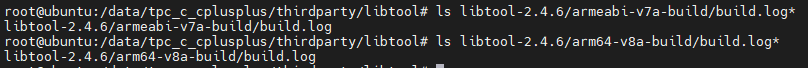
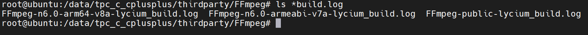
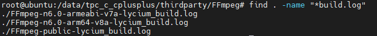

# C/C++三方库常见 FAQ

- #### Q1: 交叉编译完后在测试设备上运行测试用例失败，如测试bzip2时提示`/bin/sh: ./bzip2: No such file or directory`？

1. 确保文件已经推送到开发板
2. 确保文件的CPU架构和测试设备系统架构是一致的，可通过`file`查看文件属性，通过`getconf LONG_BIT`查看系统位数，如本错误示例中:

   ```shell
   # file bzip2                                                                           # 查看文件架构时arm64位的
   bzip2: ELF shared object, 64-bit LSB arm64, dynamic (/lib/ld-musl-aarch64.so.1)
   #
   # getconf LONG_BIT                                                                     # 查看系统位数
   32
   #
   ```

   文件属性与系统位数不匹配，故提示无法找到该文件。
   

- #### Q2: 当前`lycium`交叉编译适配的CPU架构只支持arm32位和arm64位的，如若需新增其他CPU架构该如何操作?
  
  本仓库中适配的三方库当前都是通过[lycium工具](../lycium/)适配且验证过的arm32位以及arm64位架构的三方库，如若需要添加其他CPU架构的编译适配，请参考文档[lycium上面适配OpenHarmony 不同架构的构建](./adpater_architecture.md)。
  
- #### Q3: 交叉编译时出现ld.lld error：undefined symbol xxxx 以及 error: use of undeclared identifier 'XXXX'的情况

  情况一：系统本身的接口(SDK接口不支持的情况，通常在编译过程就会失败，如果成功编译出文件则注重检查交叉编译是否链接了SDK的静态库，存在此情况则可以尝试从将此静态库路径导入工程中与三方库一同编译) ，系统接口具体资料请参考下方系统符号参考中的 "附录"部分。

  [系统符号参考](https://gitee.com/openharmony/docs/blob/master/zh-cn/application-dev/reference/native-lib/Readme-CN.md)

  情况二：三方库的依赖库接口，可能是由于依赖库文件没有和三方库文件一同导入，需要将依赖库文件一同添加到工程下。如果确认三方库及依赖库已经存在工程中，则请核对cmake等编译工具路径、库名等配置选项。

  情况三：三方库本身的接口，可能是因为三方库的相关编译宏没有打开，需要打开相关编译宏，如果该功能需要其它依赖库则需要补全依赖库。

- #### Q4：lycium编译失败的日志文件查看路径

  ##### 情况一：查找需要的日志文件，目前三方库目录下存在两种日志路径，参考以下路径和示例图
  
  ​	三方库对应ARCH的编译文件夹(通常以ARCH-build命名，在源码目录下或者三方库目录下)下会生成build.log日志文件。
  
  
  
  ​	三方库目录下会生成一个库名+版本+ARCH+build.log命令的日志文件，文件中会记录具体的编译日志。
  
  
  
  
  
  ##### 情况二：想要快速查找所有的日志文件，可以在三方库目录下使用以下命令,执行效果如图所示
  
  ```
  find . -name "*build.log"
  ```
  
  

  
  
- #### [Q5：FFmpeg三方库综合问题](./FFmpegFAQ.md)

- #### [Q6: MAC环境编译三方库综合问题](./MacFAQ.md)
  
- #### Q7：通用型错误辨识
  
  ##### ERROR during ：download XXX.tar.gz
  
  因为本仓库不承载三方库的源码部分，因此进行三方库编译时需要先从开源社区获取源码部分，此部分可能需要网络代理等方式保证对gitee、github等网站的连通，当出现此错误时代表wget等下载工具不能够正常获取代码，请检查网络配置。
  
  ##### “请先安装 xxx命令，才可以编译”
  此信息代表当前编译三方库强需求xxx工具或者命令，请先安装对应的工具以及确保安装后的环境变量能够在tpc_c_cplusplus仓库目录生效。

- #### Q8: 模拟器上如何验证C/C++三方库

请参照文档[DevEco studio工具的模拟器验证C/C++三方库](./emulator_verification.md)
