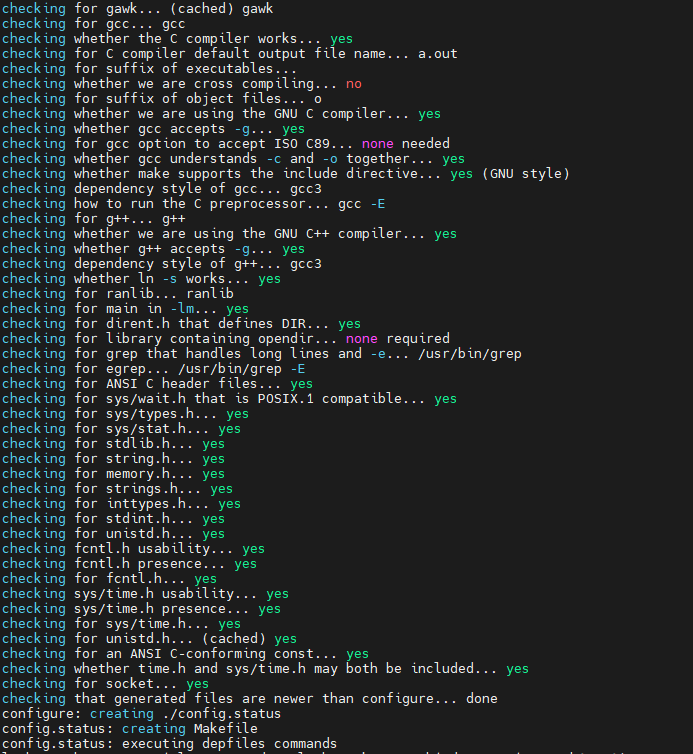
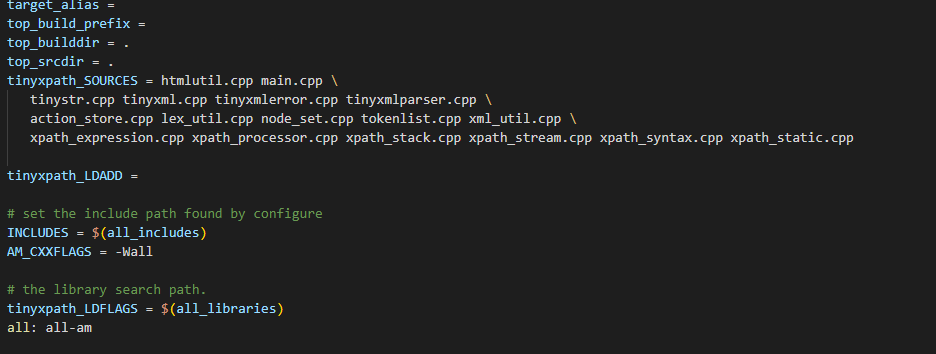
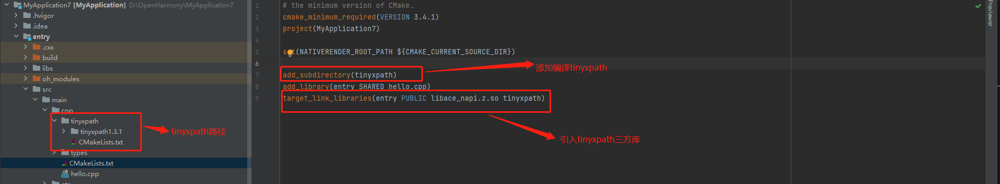

# 通过IDE集成非cmake方式构建的C/C++三方库

## 简介

DevEco Studio(简称IDE)目前只支持cmake构建方式，对于非cmake构建方式的三方库需要通过IDE工具集成的话，我们需要对原生库编写一个cmake的构建脚本。本文通过tinyxpath三方库为例介绍如何在IDE上移植一个非cmake构建方式的三方库。

## cmake构建脚本编写

在IDE上移植一个非cmake构建方式的三方库，我们需要了解基本的cmake构建脚本的编写，具体步骤参考文档:[从零开始编写一个cmake构建脚本](./cmake_compile.md)

## TinyxPath三方库移植

### 原生库的准备

#### 原生库下载

本文中是用tinyxpath 1.3.1版本，可以通过以下方式进行下载:

```shell
wget https://sourceforge.net/projects/tinyxpath/files/TinyXPath%20%28Linux%20-%20tar.gz%29/TinyXPath%201.3.1/tinyxpath_1_3_1.tgz
```

下载完后进行解压:

```shell
tar -zxvf tinyxpath_1_3_1.tgz -C tinyxpath1.3.1 # 将tinyxpath_1_3_1.tgz解压到tinyxpath1.3.1, tinyxpath1.3.1文件夹必须存在
```

#### 源码分析

- 依赖分析
  
  tinyxpath是configure构建方式，根据官网提示生成对应configure命令并执行configure：

  ```shell
  make -f Makefile.configure
  ./configure
  ```

  

  通过configure的输出日志可以分析出，tinyxpath库不依赖其他任何三方库。

- 源文件分析
  1. 生成库和测试用例的源文件分析

     我们通过分析Makefile，查找对应目标依赖的原文件如，tinyxpath库的Makefile文件中的目标源文件定义

    

    从以上内容可以看出，编译此库目标依赖的上面的所有.cpp文件。tinyxpath库比较特殊，在linux下面没有生成库文件，生成了一个可执行文件，通过[tinyxpath官网](https://tinyxpath.sourceforge.net/doc/index.html)介绍可知道，`main.cpp`和`htmlutil.cpp`是用于生成测试用例，其他文件是用来生成库文件。

    除了分析Makefile文件，我们也可以通过分析make过程的输出信息来分析，具体可参考[三方库源文件分析](https://gitee.com/openharmony-sig/knowledge/tree/master/docs/openharmony_getstarted/port_thirdparty#%E5%8E%9F%E6%96%87%E4%BB%B6%E4%BE%9D%E8%B5%96%E5%88%86%E6%9E%90).

    通过以上分析可以得出，tinyxpath库目标依赖的源文件是：

    ```shell
    action_store.cpp  lex_util.cpp  node_set.cpp  tinyxml.cpp tinyxmlparser.cpp  xml_util.cpp xpath_processor.cpp  xpath_static.cpp  xpath_syntax.cpp tinystr.cpp tinyxmlerror.cpp  tokenlist.cpp xpath_expression.cpp  xpath_stack.cpp xpath_stream.cpp
    ```

    测试用例依赖的源文件是：

    ```shell
    main.cpp htmlutil.cpp
    ```

  2. 特殊变量分析

    通过交叉编译原生库可从编译过程中获取一些我们需要的变量或者宏的设定。如若交叉编译过程中缺少变量/宏的定义会导致编译失败，我们需要在cmake构建脚本中添加对应的变量/宏。三方库的交叉编译可以参考文档:[Linux 环境下使用 OpenHarmony SDK 编译c/c++ 库](../tools/doc/ohos_use_sdk/OHOS_SDK-Usage.md).

    通过以上方法可以分析出，tinyxpath库中未涉及特殊变量或者宏定义

#### 新建cmake构建脚本

分析完tinyxpath的源码后，我们就可以根据[cmake构建脚本编写](#cmake构建脚本编写)的方法编写tinyxpath的cmake构建脚本了。

1. 基本信息的编写

   设置`tinyxpath` `cmake`构建的工具版本，工程名及工程版本以和构建语言

   ```cmake
   cmake_minimum_required (VERSION 3.12)

   project(TINYXPATH VERSION 1.3.1)
   enable_language(CXX C ASM)
   ```

2. 设置常用变量

   ```cmake
   set(BUILD_SHARED_LIBS TRUE CACHE BOOL "If TRUE, tinyxpath is built as a shared library, otherwise as a static library")

   set(TARGET_NAME tinyxpath)
   set(TARGET_SAMPLE_NAME tinyxpath_test)

   set(TARGET_INSTALL_INCLUDEDIR include)
   set(TARGET_INSTALL_BINDIR bin)
   set(TARGET_INSTALL_LIBDIR lib)

   set(TARGET_SRC_PATH ${CMAKE_CURRENT_SOURCE_DIR}/tinyxpath1.3.1)
   set(TARGET_SRC ${TARGET_SRC_PATH}/tinystr.cpp
                    ${TARGET_SRC_PATH}/tinyxml.cpp
                    ${TARGET_SRC_PATH}/tinyxmlerror.cpp
                    ${TARGET_SRC_PATH}/tinyxmlparser.cpp
                    ${TARGET_SRC_PATH}/action_store.cpp
                    ${TARGET_SRC_PATH}/lex_util.cpp
                    ${TARGET_SRC_PATH}/node_set.cpp
                    ${TARGET_SRC_PATH}/tokenlist.cpp
                    ${TARGET_SRC_PATH}/xml_util.cpp
                    ${TARGET_SRC_PATH}/xpath_expression.cpp
                    ${TARGET_SRC_PATH}/xpath_processor.cpp
                    ${TARGET_SRC_PATH}/xpath_stack.cpp
                    ${TARGET_SRC_PATH}/xpath_stream.cpp
                    ${TARGET_SRC_PATH}/xpath_syntax.cpp
                    ${TARGET_SRC_PATH}/xpath_static.cpp)
   
   set(TARGET_INCLUDE ${TARGET_SRC_PATH})
   ```

3. 设置可选项

   测试用例做为一个三方库的可选项供用户自行选择是否编译，默认情况下是不编译测试用例

   ```cmake
   option(BUILD_SAMPLE "Build sample" OFF)

   if(BUILD_SAMPLE)
      add_executable(${TARGET_SAMPLE_NAME} ${TARGET_SAMPLE_SRC})
      target_include_directories(${TARGET_SAMPLE_NAME} PRIVATE ${TARGET_INCLUDE})
      target_link_libraries(${TARGET_SAMPLE_NAME} PUBLIC ${TARGET_NAME})
   endif()
   ```

4. 配置库以及其属性

   ```cmake
   add_library(${TARGET_NAME} ${TARGET_SRC})
   target_include_directories(${TARGET_NAME} PRIVATE ${TARGET_INCLUDE})

   if(BUILD_SHARED_LIBS)
      set_target_properties(${TARGET_NAME} PROPERTIES VERSION ${PROJECT_VERSION_MAJOR}.${PROJECT_VERSION_MINOR}.${PROJECT_VERSION_PATCH} 
                                                    SOVERSION ${PROJECT_VERSION_MAJOR})
   endif()
   ```

5. 配置库的安装

   ```cmake
   install(TARGETS ${TARGET_NAME}
        EXPORT ${TARGET_NAME}
        PUBLIC_HEADER DESTINATION ${TARGET_INSTALL_INCLUDEDIR}
        PRIVATE_HEADER DESTINATION ${TARGET_INSTALL_INCLUDEDIR}
        RUNTIME DESTINATION ${TARGET_INSTALL_BINDIR}
        LIBRARY DESTINATION ${TARGET_INSTALL_LIBDIR}
        ARCHIVE DESTINATION ${TARGET_INSTALL_LIBDIR})
   
   install(FILES ${TARGET_SRC_PATH}/xpath_processor.h
            ${TARGET_SRC_PATH}/action_store.h
            ${TARGET_SRC_PATH}/byte_stream.h
            ${TARGET_SRC_PATH}/lex_token.h
            ${TARGET_SRC_PATH}/lex_util.h
            ${TARGET_SRC_PATH}/node_set.h
            ${TARGET_SRC_PATH}/tinystr.h
            ${TARGET_SRC_PATH}/tinyxml.h
            ${TARGET_SRC_PATH}/tinyxpath_conf.h
            ${TARGET_SRC_PATH}/tokenlist.h
            ${TARGET_SRC_PATH}/xml_util.h
            ${TARGET_SRC_PATH}/xpath_expression.h
            ${TARGET_SRC_PATH}/xpath_processor.h
            ${TARGET_SRC_PATH}/xpath_stack.h
            ${TARGET_SRC_PATH}/xpath_static.h
            ${TARGET_SRC_PATH}/xpath_stream.h
            ${TARGET_SRC_PATH}/xpath_syntax.h
        DESTINATION ${TARGET_INSTALL_INCLUDEDIR}/${TARGET_NAME})
   
   install(
      EXPORT ${TARGET_NAME}
      FILE ${TARGET_NAME}Targets.cmake
      DESTINATION ${TARGET_INSTALL_LIBDIR}/cmake/${TARGET_NAME}
   )

   include(CMakePackageConfigHelpers)

   write_basic_package_version_file(
      ${TARGET_NAME}ConfigVersion.cmake
      VERSION ${PROJECT_VERSION_MAJOR}.${PROJECT_VERSION_MINOR}.${PROJECT_VERSION_PATCH}
      COMPATIBILITY SameMajorVersion
   )

   configure_package_config_file(
      cmake/PackageConfig.cmake.in ${TARGET_NAME}Config.cmake
      INSTALL_DESTINATION ${TARGET_INSTALL_LIBDIR}/cmake/${TARGET_NAME}
   )

   install(FILES
            ${CMAKE_CURRENT_BINARY_DIR}/${TARGET_NAME}Config.cmake
            ${CMAKE_CURRENT_BINARY_DIR}/${TARGET_NAME}ConfigVersion.cmake
        DESTINATION
            ${TARGET_INSTALL_LIBDIR}/cmake/${TARGET_NAME}
   )
   ```

至此，tinyxpath的cmake构建脚本基本完成，具体可参照[完整脚本](../thirdparty/tinyxpath/CMakeLists.txt)

### 加入编译构建

将tinyxpath源码及新建的cmake构建脚本放置IDE工程对应的cpp目录下，并在顶层CMakeLists.txt文本中添加

```cmake
add_subdirectory(tinyxpath)
target_link_libraries(entry PUBLIC libace_napi.z.so tinyxpath)
```



## 参考文档

- [tinyxpath官网](https://tinyxpath.sourceforge.net/doc/index.html)
- [从零编写Cmake构建脚本](./cmake_compile.md)
- [如何贡献一个C/C++三方库](https://gitee.com/openharmony-sig/knowledge/blob/master/docs/openharmony_getstarted/port_thirdparty/README.md)
- [Linux 环境下使用 OpenHarmony SDK 编译c/c++ 库](../tools/doc/ohos_use_sdk/OHOS_SDK-Usage.md)
- [OpenHarmony知识体系](https://gitee.com/openharmony-sig/knowledge)
