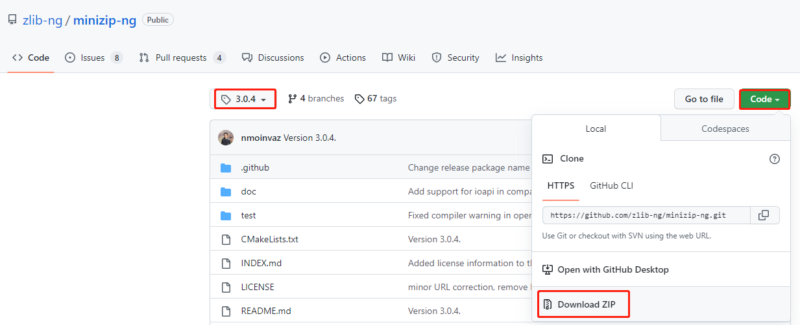
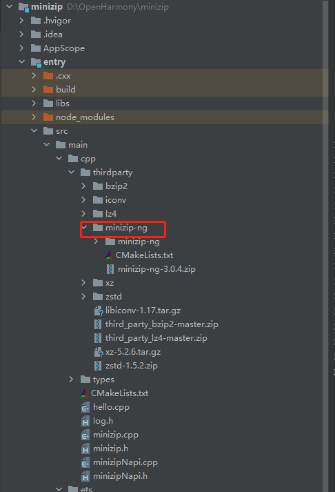
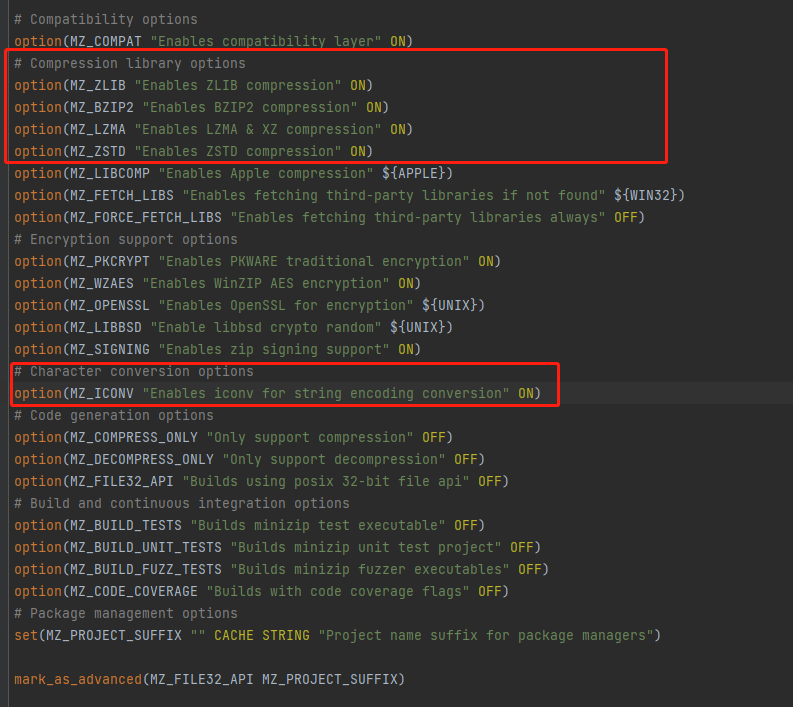
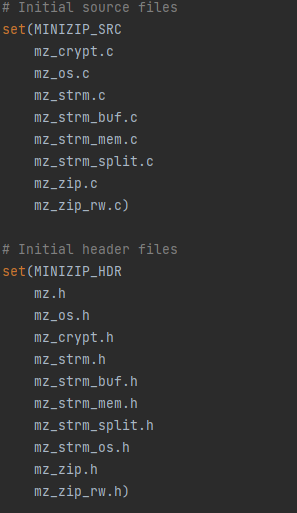
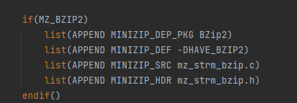
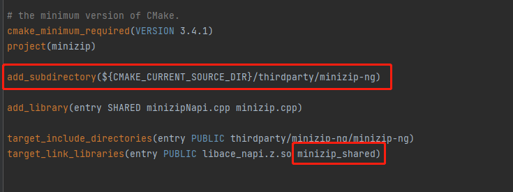

# 通过IDE集成cmak构建方式的C/C++三方库

## 简介

cmake构建方式是开源三方库的主流构建方式。DevEco Studio目前以支持cmake的构建方式，但有部分cmake语法的使用环境不是很友好，尤其是通过find_package方式寻找依赖的时候，DevEco Studio有很大的限制。针对与该问题，有时候我们需要对原生库的CMakeLists.txt文件进行重构来使三方库能通过DevEco Studio工具正常集成。本文将通过在IDE上适配minizip-ng 三方库为例讲来解如何重构原生库的CMakeLists.txt文件。

## 创建工程

在开发进行三方库适配以及napi接口开发前，我们需要创建一个三方库对应的工程，具体创建工程方法可以参照文档[通过IDE开发一个Napi工程](./hello_napi.md)。

## IDE上适配三方库

### 原生库准备

#### 下载代码

通过[minizip-ng github网址](https://github.com/zlib-ng/minizip-ng/tree/3.0.4)，通过Code>>Download ZIP选项下载最新版本的源码包，并将其解压后放在IDE工程中的CPP目录下。

- 下载minizip-ng 3.0.4版本的库： <br />
  
- 将库放在IDE工程：<br />
  &nbsp;

#### 分析编译依赖

- 分析CMakeLists.txt<br>
  对于库不是很复杂且目录结构简单的库可以通过分析CMakeLists.txt文件来获取库的依赖。在minizip-ng库中，通过分析最外层CMakeLists.txt文件中的option选项，可以得知编译minizip-ng需要依赖的其他三方库，如下图：<br />
  
  从图中可看出，minizip-ng原生库默认的编译依赖了4个压缩库(zlib,bzip2,lzma,zstd)，一个加密库(openssl)以及一个字符编码库(iconv)。
  
- 通过运行cmake分析 <br>
  我们除了分析CMakeLists.txt文件外，也可以通过在linux中通过cmake过程来分析对应的依赖。<br />
  我们在执行cmake的时候，会有对相关的依赖库的提示：

  ```shell
  -- Looking for fseeko - found
  -- Using ZLIB 1.2.11
  -- Using BZIP2 1.0.8
  -- Checking for module 'liblzma'
  --   Found liblzma, version 5.2.4
  -- Using LZMA 5.2.4
  -- Checking for module 'libzstd'
  --   Found libzstd, version 1.4.4
  -- Using ZSTD 1.4.4
  -- Found PkgConfig: /usr/bin/pkg-config (found version "0.29.1")
  -- Checking for module 'openssl'
  --   Found openssl, version 1.1.1f
  -- Using OpenSSL 1.1.1f
  -- Performing Test Iconv_IS_BUILT_IN
  -- Performing Test Iconv_IS_BUILT_IN - Failed
  -- Using Iconv
  -- The CXX compiler identification is GNU 9.4.0
  -- Check for working CXX compiler: /usr/bin/c++
  -- Check for working CXX compiler: /usr/bin/c++ -- works
  -- Detecting CXX compiler ABI info
  -- Detecting CXX compiler ABI info - done
  -- Detecting CXX compile features
  -- Detecting CXX compile features - done
  -- The following features have been enabled:

  ```

  由以上信息可以查看到，编译此库需要依赖libz(Using ZLIB 1.2.11), BZIP2(Using BZIP2 1.0.8), liblzma(Using LZMA 5.2.4), libzstd(Using ZSTD 1.4.4), openssl(Using OpenSSL 1.1.1f)以及iconv(Using Iconv)。<br />
  除了cmake中获取的依赖，我们也可以通过分析make编译过程获取更多的信息，具体方法可以参照[三方库适配依赖分析](https://gitee.com/openharmony-sig/knowledge/blob/master/docs/openharmony_getstarted/port_thirdparty/README.md#%E5%88%86%E6%9E%90%E7%BC%96%E8%AF%91%E4%BE%9D%E8%B5%96)。

通过以上分析我们可以得出minizip-ng需要依赖libz,libbzip2,liblzma,libzstd,libopenssl以及libiconv等三方库。

#### 重构CMakeLists

 对于不复杂的库且没有其他四方库依赖的三方库，我们可以使用原生库的CMakeLists.txt文件，但是对于一些复杂的，且强制依赖其他四方库的库，使用其原生CMakeLists.txt文件，无法解决四方库依赖的问题。此时，我们就需要对三方库的CMakeLists.txt文件进行重构。<br />
 重构CMakeLists文件主要需涉及以下几点：

- 动态生成配置文件
  查看原生CMakeLists.txt文件中是否有configure_file配置项，如果有需要根据原生库中的配置进行添加,minizip-ng中并无对应的config配置文件，便不做详细说明。
- 相关宏定义的设置
  通过target_compile_definitions设置三方库的相关宏定义，如下所示：

  ```cmake
  set(MINIZIP_DEFINITIONS -DHAVE_INTTYPES_H -DHAVE_STDINT_H -DLZMA_API_STATIC -DOPENSSL_ARM64_PLATFORM -D_GNU_SOURCE -DHAVE_ZLIB -DMZ_ZIP_NO_CRYPTO)

  target_compile_definitions(minizip_shared PRIVATE ${MINIZIP_DEFINITIONS})
  ```

  除了target_compile_definitions外，也可以通过add_definitions方法添加宏定义，区别在于add_definitions方法设置的宏定义的作用域是整个工程目录，而target_compile_definitions通过参数PRIVATE限制了宏的作用域为当前的三方库(minizip_shared)。
- 源码文件编译
  分析minizip-ng原生库的CMakeLists.txt，其中有设置源码以及相关头文件：
   <br>
  除此外，对应的依赖库判定中也会有对应的源文件加入，如libbzip2对应的源文件:
   <br>
  其他依赖库以相同方法添加对应的源文件。因此我们的libminizip-ng的编译源文件就可以这样写：

  ```cmake
  set(MINIZIP_SRC "${CMAKE_CURRENT_SOURCE_DIR}/minizip-ng/mz_crypt.c"
                    "${CMAKE_CURRENT_SOURCE_DIR}/minizip-ng/mz_os.c"
                    "${CMAKE_CURRENT_SOURCE_DIR}/minizip-ng/mz_strm.c"
                    "${CMAKE_CURRENT_SOURCE_DIR}/minizip-ng/mz_strm_buf.c"
                    "${CMAKE_CURRENT_SOURCE_DIR}/minizip-ng/mz_strm_mem.c"
                    "${CMAKE_CURRENT_SOURCE_DIR}/minizip-ng/mz_strm_split.c"
                    "${CMAKE_CURRENT_SOURCE_DIR}/minizip-ng/mz_zip.c"
                    "${CMAKE_CURRENT_SOURCE_DIR}/minizip-ng/mz_zip_rw.c"
                    "${CMAKE_CURRENT_SOURCE_DIR}/minizip-ng/mz_strm_zlib.c"
                    "${CMAKE_CURRENT_SOURCE_DIR}/minizip-ng/mz_os_posix.c"
                    "${CMAKE_CURRENT_SOURCE_DIR}/minizip-ng/mz_strm_os_posix.c"
                    )
  if (BUILD_BZIP)
  list(APPEND MINIZIP_SRC ${CMAKE_CURRENT_SOURCE_DIR}/minizip-ng/mz_strm_bzip.c)
  endif()
  ```

  其中由于系统已经有了libz库，因此我们默认libz是支持的。其他三方库我们将其下载后与minizip-ng放在同一目录(我们在工程的cpp目录下新建一个thirdparty目录，用于存放工程依赖的所有三方库)。固依赖可以这样写:

  ```cmake
  if (EXISTS ${CMAKE_CURRENT_SOURCE_DIR}/../bzip2)
  set(BZIP2_INCLUDE_DIR "${CMAKE_CURRENT_SOURCE_DIR}/../bzip2")
  set(BZIP2_SRC
    "${CMAKE_CURRENT_SOURCE_DIR}/../bzip2/blocksort.c"
    "${CMAKE_CURRENT_SOURCE_DIR}/../bzip2/bzlib.c"
    "${CMAKE_CURRENT_SOURCE_DIR}/../bzip2/compress.c"
    "${CMAKE_CURRENT_SOURCE_DIR}/../bzip2/crctable.c"
    "${CMAKE_CURRENT_SOURCE_DIR}/../bzip2/decompress.c"
    "${CMAKE_CURRENT_SOURCE_DIR}/../bzip2/huffman.c"
    "${CMAKE_CURRENT_SOURCE_DIR}/../bzip2/randtable.c")

  add_library(bzip2 SHARED ${BZIP2_SRC})
  target_include_directories(bzip2 PUBLIC ${BZIP2_INCLUDE_DIR})

  list(APPEND MINIZIP_DEFINITIONS -DBZ_NO_STDIO -DHAVE_BZIP2)
  list(APPEND MINIZIP_INCLUDE_DIR ${BZIP2_INCLUDE_DIR})
  list(APPEND LinkLib bzip2)
  list(APPEND MINIZIP_SRC ${CMAKE_CURRENT_SOURCE_DIR}/minizip-ng/mz_strm_bzip.c)
  endif()

  if (BUILD_BZIP)
  list(APPEND MINIZIP_SRC ${CMAKE_CURRENT_SOURCE_DIR}/minizip-ng/mz_strm_bzip.c)
  endif()
  ```

  其他非系统依赖库都可以以这种方法编写。

- 目标文件生成
  这里我们调用add_library生成一个目标文件libminizip_shared.so，其依赖上面分析的源码MINIZIP_SRC：

  ```cmake
  add_library(minizip_shared SHARED ${MINIZIP_SRC})
  ```

- 添加其他四方库依赖
  如果三方库有对其他四方库依赖的话，需要通过target_link_libraries()方法添加对应的依赖:

  ```cmake
  target_link_libraries(minizip_shared ${LinkLib})
  ```

  其中LinkLib中存放的是我们所有的依赖库

- 完整的CMakeLists.txt  <br>
  [CMakeLists.txt](../thirdparty/minizip-ng/CMakeLists.txt)

### 加入编译构建

原生库源码准备完后，我们需要将库加入到工程的编译构建中。在工程目录CPP下的CMakeLists.txt文件中，通过add_subdirectory将minizip-ng加入到编译中，并通过target_link_libraries添加对minizip-ng的链接，如下图： <br>


到此，我们的三方库适配已经完成，可以通过IDE上的`Run entry`按钮进行编译及运行了。

## 参考资料

- [如何通过DevEco Studio开发一个NAPI工程](./hello_napi.md)。
- [如何贡献一个C/C++三方库](https://gitee.com/openharmony-sig/knowledge/blob/master/docs/openharmony_getstarted/port_thirdparty/README.md)。
- [OpenHarmony 知识体系](https://gitee.com/openharmony-sig/knowledge/tree/master)。
