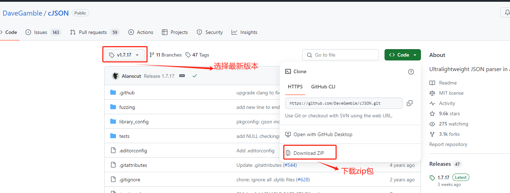
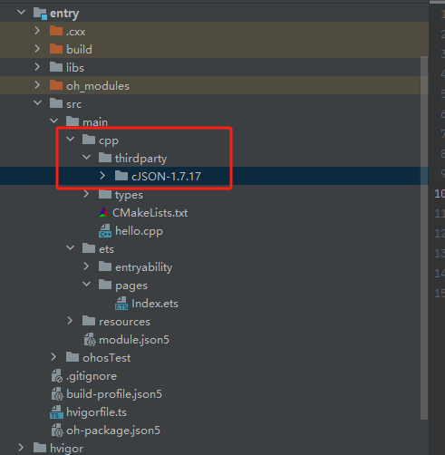
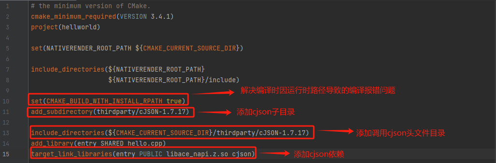

# 通过IDE集成cmak构建方式的C/C++三方库

## 简介

cmake构建方式是开源三方库的主流构建方式。DevEco Studio目前以支持cmake的构建方式。本文将通过在IDE上适配cJSON三方库为例讲来解如何在IDE上集成cmake构建方式得三方库。

## 创建工程

在开发进行三方库适配以及napi接口开发前，我们需要创建一个三方库对应的工程，具体创建工程方法可以参照文档[通过IDE开发一个Napi工程](./hello_napi.md)。

## IDE上适配三方库

### 原生库准备

#### 下载代码

通过[cJSON github网址](https://github.com/DaveGamble/cJSON/tree/v1.7.17)，通过Code>>Download ZIP选项下载最新版本的源码包，并将其解压后放在IDE工程中的CPP目录下。

- 下载cJSON v1.7.17版本的库：  
  
- 将库放在IDE工程： 
  &nbsp;

### 加入编译构建

原生库源码准备完后，我们需要将库加入到工程的编译构建中。在工程目录CPP下的CMakeLists.txt文件中，通过add_subdirectory将cJSON加入到编译中，并通过target_link_libraries添加对cjson的链接，如下图：  

到此，我们的三方库适配已经完成，可以通过IDE上的`Run entry`按钮进行编译及运行了。

## 参考资料

- [如何通过DevEco Studio开发一个NAPI工程](./hello_napi.md)。
- [如何贡献一个C/C++三方库](https://gitee.com/openharmony-sig/knowledge/blob/master/docs/openharmony_getstarted/port_thirdparty/README.md)。
- [OpenHarmony 知识体系](https://gitee.com/openharmony-sig/knowledge/tree/master)。
