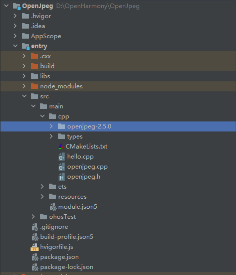
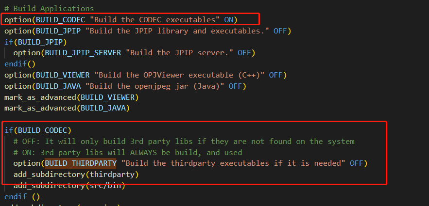
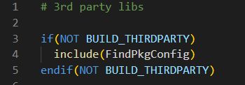
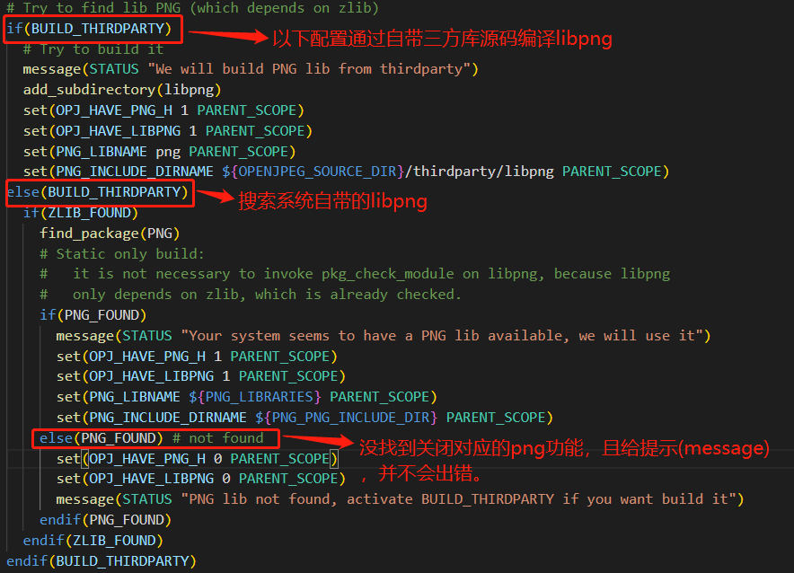
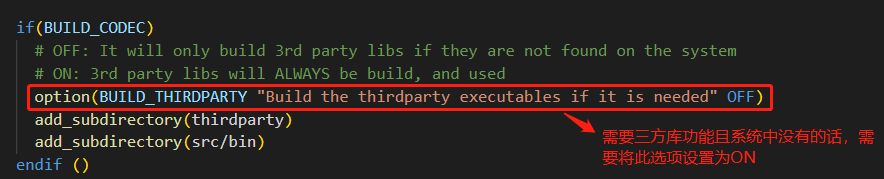
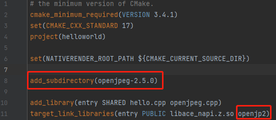
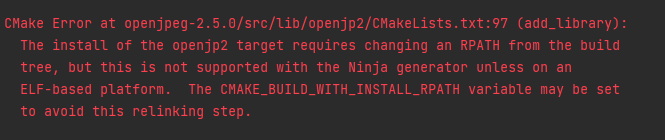
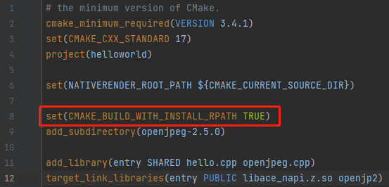

# 通过IDE集成C/C++三方库并开发napi接口

## 简介

应用在调用系统固件集成的C/C++三方库时，可能会由于系统固件集成端与IDE的NDK中libc++版本不一致导致调用失败，而且系统固件集成的C/C++三方库对于应用的调式也很不友好，需要多方编译调试，很不方便。因此本文将通过在IDE上适配openjpeg 三方库为例介绍IDE上适配一个C/C++三方库的具体流程。

## 创建工程

在开发进行三方库适配以及napi接口开发前，我们需要创建一个三方库对应的工程，具体创建工程方法可以参照文档[通过IDE开发一个Napi工程](./hello_napi.md)。

## IDE上三方库的适配

本文中我们以适配 openjpeg 为例介绍整个适配流程 。

### 原生库准备

#### 下载代码

通过[openjpeg github网址](https://github.com/uclouvain/openjpeg/tree/v2.5.0)，通过Code>>Download ZIP选项下载最新版本的源码包，并将其解压后放在IDE工程中的CPP目录下。

- 下载openjpeg 2.5.0版本的库： <br />
  
- 将库放在IDE工程：<br />
  &nbsp;

#### 分析编译依赖

- 分析CMakeLists.txt
  对于库不是很复杂且目录结构简单的库可以通过分析CMakeLists.txt文件来获取库的依赖。在openjpeg库中，
通过分析最外层CMakeLists.txt文件，可以得知编译openjpeg核心代码以及需要依赖编译库自带thirdparty，如下图：<br />
  
  而分析thirdparty/CMakeLists.txt文件，如果BUILD_THIRDPARTY开关未打开，将会通过FindPkgConfig自动搜索系统(IDE工具的SDK编译链)中的库文件，如下图：<br />
  &nbsp; <br />
  并由此文件可以分析出该库非强制依赖了libz, libpng, libtiff以及liblcms2，如对libpng依赖的分析中：<br />
  
  IDE工具的SDK编译链中只有libz库，其他三个库是没有的，所以如果需要其他三个库的功能，我们需要将BUILD_THIRDPARTY开关打开，此开关在库顶层目录的CMakeLists.txt文件中，如下图：<br />
  
  到此，本库的依赖就已经分析完了。
- 通过运行cmake分析
  我们除了分析CMakeLists.txt文件外，也可以通过在linux中通过cmake过程来分析对应的依赖。<br />
  我们在执行cmake的时候，会有对相关的依赖库的提示：

  ```shell
  -- Large File support - found
  -- Looking for include file malloc.h
  -- Looking for include file malloc.h - found
  -- Looking for _aligned_malloc
  -- Looking for _aligned_malloc - not found
  -- Looking for posix_memalign
  -- Looking for posix_memalign - found
  -- Looking for memalign
  -- Looking for memalign - found
  -- Found PkgConfig: /usr/bin/pkg-config (found version "0.29.1")
  -- Found ZLIB: /usr/lib/x86_64-linux-gnu/libz.so (found version "1.2.11")
  -- Your system seems to have a Z lib available, we will use it to generate PNG lib
  -- Found PNG: /usr/lib/x86_64-linux-gnu/libpng.so (found version "1.6.37")
  -- Your system seems to have a PNG lib available, we will use it
  -- Found TIFF: /usr/lib/x86_64-linux-gnu/libtiff.so (found version "4.1.0")
  -- Your system seems to have a TIFF lib available, we will use it
  -- Could NOT find LCMS2 (missing: LCMS2_LIBRARY LCMS2_INCLUDE_DIR)
  -- Could NOT find LCMS (missing: LCMS_LIBRARY LCMS_INCLUDE_DIR)
  -- LCMS2 or LCMS lib not found, activate BUILD_THIRDPARTY if you want build it
  -- Configuring done
  -- Generating done
  ```

  由以上信息可以查看到，编译此库需要依赖libz(found version "1.2.11")，libpng(found version "1.6.37")，libtiff(found version "4.1.0")以及liblcms2(LCMS2 or LCMS lib not found, activate BUILD_THIRDPARTY if you want build it)。从提示中可以看到，如果想要使能对应的功能且系统库中未包含该依赖的话，需要打开BUILD_THIRDPARTY 开关。<br />
  除了cmake中获取的依赖，我们也可以通过分析make编译过程获取更多的信息，具体方法可以参照[三方库适配依赖分析](https://gitee.com/openharmony-sig/knowledge/blob/master/docs/openharmony_getstarted/port_thirdparty/README.md#%E5%88%86%E6%9E%90%E7%BC%96%E8%AF%91%E4%BE%9D%E8%B5%96)。

#### 重构CMakeLists

 对于不复杂的库且没有其他四方库依赖的三方库，我们可以使用原生库的CMakeLists.txt文件，但是对于一些复杂的，且强制依赖其他四方库的库，使用其原生CMakeLists.txt文件，无法解决四方库依赖的问题。此时，我们就需要对三方库的CMakeLists.txt文件进行重构。<br />
 重构CMakeLists文件主要需涉及以下几点：

- 动态生成配置文件
  查看原生CMakeLists.txt文件中是否有configure_file配置项，如果没有可直接跳过此步骤。<br />
  在openjpeg库的原生CMakeLists.txt文件中，有2个配置文件需要动态生成：<br />

  ```cmake
  # opj_config.h generation (2/2)
  configure_file(
   ${CMAKE_CURRENT_SOURCE_DIR}/src/lib/openjp2/opj_config.h.cmake.in
   ${CMAKE_CURRENT_BINARY_DIR}/src/lib/openjp2/opj_config.h
   @ONLY
   )
  
   configure_file(
   ${CMAKE_CURRENT_SOURCE_DIR}/src/lib/openjp2/opj_config_private.h.cmake.in
   ${CMAKE_CURRENT_BINARY_DIR}/src/lib/openjp2/opj_config_private.h
   @ONLY
   )
  ```

  configure_file带了@ONLY参数，该参数限制了变量替换，让其只替换被@VAR@引用的变量。因此我们需要分析两个文件中对应的@VAR@配置规则。首先在opj_config.h.cmake.in文件定义的对应@VAR@的定义：

  ```c++
  /* create opj_config.h for CMake */
  #cmakedefine OPJ_HAVE_STDINT_H   @OPJ_HAVE_STDINT_H@
  /*--------------------------------------------------------------------------*/
  /* OpenJPEG Versioning                                                      */
  
  /* Version number. */
  #define OPJ_VERSION_MAJOR @OPENJPEG_VERSION_MAJOR@
  #define OPJ_VERSION_MINOR @OPENJPEG_VERSION_MINOR@
  #define OPJ_VERSION_BUILD @OPENJPEG_VERSION_BUILD@
  ```

  在分析@VAR@的赋值规则，在顶层CMakeLists.txt中：

  ```cmake
  # opj_config.h generation (1/2)
  
  # Check if some include files are provided by the system
  include(EnsureFileInclude)
  # These files are mandatory
  ensure_file_include("string.h"   HAVE_STRING_H YES)
  ensure_file_include("memory.h"   HAVE_MEMORY_H YES)
  ensure_file_include("stdlib.h"   HAVE_STDLIB_H YES)
  ensure_file_include("stdio.h"    HAVE_STDIO_H  YES)
  ensure_file_include("math.h"     HAVE_MATH_H   YES)
  ensure_file_include("float.h"    HAVE_FLOAT_H  YES)
  ensure_file_include("time.h"     HAVE_TIME_H   YES)
  ensure_file_include("stdarg.h"   HAVE_STDARG_H YES)
  ensure_file_include("ctype.h"    HAVE_CTYPE_H  YES)
  ensure_file_include("assert.h"   HAVE_ASSERT_H YES)
  
  # For the following files, we provide an alternative, they are not mandatory
  ensure_file_include("stdint.h"   OPJ_HAVE_STDINT_H   NO)
  ensure_file_include("inttypes.h" OPJ_HAVE_INTTYPES_H NO)
  ```

  从以上内容通过分析ensure_file_include可以知道，在执行cmake时从系统中查找stdint.h文件，如果查找到则将OPJ_HAVE_STDINT_H置起，否则不会改变。而IDE上是没有stdint.h文件的，因此我们需要在配置文件之前手动将OPJ_HAVE_STDINT_H置起，如下：

  ```cmake
  set(OPJ_HAVE_STDINT_H TRUE)
  ```

  其他变量也是通过类似的方法分析。
- 相关宏定义的设置
  通过add_definitions设置三方库的相关宏定义，如下所示：

  ```cmake
  add_definitions(-DOPJ_HAVE_PNG_H=0 -DOPJ_HAVE_TIFF_H=1 -DOPJ_HAVE_LCMS2_H=1)
  ```

- 源码文件编译
  三方库编译的源码可以通过在linux执行make的时候查看分析到：

  ```shell
  [  0%] Building C object src/lib/openjp2/CMakeFiles/openjp2_static.dir/thread.c.o
  [  1%] Building C object src/lib/openjp2/CMakeFiles/openjp2_static.dir/bio.c.o
  [  1%] Building C object src/lib/openjp2/CMakeFiles/openjp2_static.dir/cio.c.o
  [  2%] Building C object src/lib/openjp2/CMakeFiles/openjp2_static.dir/dwt.c.o
  [  3%] Building C object src/lib/openjp2/CMakeFiles/openjp2_static.dir/event.c.o
  [  3%] Building C object src/lib/openjp2/CMakeFiles/openjp2_static.dir/ht_dec.c.o
  [  4%] Building C object src/lib/openjp2/CMakeFiles/openjp2_static.dir/image.c.o
  [  5%] Building C object src/lib/openjp2/CMakeFiles/openjp2_static.dir/invert.c.o
  [  5%] Building C object src/lib/openjp2/CMakeFiles/openjp2_static.dir/j2k.c.o
  [  6%] Building C object src/lib/openjp2/CMakeFiles/openjp2_static.dir/jp2.c.o
  [  7%] Building C object src/lib/openjp2/CMakeFiles/openjp2_static.dir/mct.c.o
  [  7%] Building C object src/lib/openjp2/CMakeFiles/openjp2_static.dir/mqc.c.o
  [  8%] Building C object src/lib/openjp2/CMakeFiles/openjp2_static.dir/openjpeg.c.o
  [  9%] Building C object src/lib/openjp2/CMakeFiles/openjp2_static.dir/opj_clock.c.o
  [  9%] Building C object src/lib/openjp2/CMakeFiles/openjp2_static.dir/pi.c.o
  [ 10%] Building C object src/lib/openjp2/CMakeFiles/openjp2_static.dir/t1.c.o
  [ 10%] Building C object src/lib/openjp2/CMakeFiles/openjp2_static.dir/t2.c.o
  [ 11%] Building C object src/lib/openjp2/CMakeFiles/openjp2_static.dir/tcd.c.o
  [ 12%] Building C object src/lib/openjp2/CMakeFiles/openjp2_static.dir/tgt.c.o
  [ 12%] Building C object src/lib/openjp2/CMakeFiles/openjp2_static.dir/function_list.c.o
  [ 13%] Building C object src/lib/openjp2/CMakeFiles/openjp2_static.dir/opj_malloc.c.o
  [ 14%] Building C object src/lib/openjp2/CMakeFiles/openjp2_static.dir/sparse_array.c.o
  [ 14%] Linking C static library ../../../bin/libopenjp2.a
  [ 14%] Built target openjp2_static
  Scanning dependencies of target openjp2
  [ 14%] Building C object src/lib/openjp2/CMakeFiles/openjp2.dir/thread.c.o
  [ 15%] Building C object src/lib/openjp2/CMakeFiles/openjp2.dir/bio.c.o
  [ 16%] Building C object src/lib/openjp2/CMakeFiles/openjp2.dir/cio.c.o
  [ 16%] Building C object src/lib/openjp2/CMakeFiles/openjp2.dir/dwt.c.o
  [ 17%] Building C object src/lib/openjp2/CMakeFiles/openjp2.dir/event.c.o
  [ 18%] Building C object src/lib/openjp2/CMakeFiles/openjp2.dir/ht_dec.c.o
  [ 18%] Building C object src/lib/openjp2/CMakeFiles/openjp2.dir/image.c.o
  [ 19%] Building C object src/lib/openjp2/CMakeFiles/openjp2.dir/invert.c.o
  [ 20%] Building C object src/lib/openjp2/CMakeFiles/openjp2.dir/j2k.c.o
  [ 20%] Building C object src/lib/openjp2/CMakeFiles/openjp2.dir/jp2.c.o
  [ 21%] Building C object src/lib/openjp2/CMakeFiles/openjp2.dir/mct.c.o
  [ 22%] Building C object src/lib/openjp2/CMakeFiles/openjp2.dir/mqc.c.o
  [ 22%] Building C object src/lib/openjp2/CMakeFiles/openjp2.dir/openjpeg.c.o
  [ 23%] Building C object src/lib/openjp2/CMakeFiles/openjp2.dir/opj_clock.c.o
  [ 23%] Building C object src/lib/openjp2/CMakeFiles/openjp2.dir/pi.c.o
  [ 24%] Building C object src/lib/openjp2/CMakeFiles/openjp2.dir/t1.c.o
  [ 25%] Building C object src/lib/openjp2/CMakeFiles/openjp2.dir/t2.c.o
  [ 25%] Building C object src/lib/openjp2/CMakeFiles/openjp2.dir/tcd.c.o
  [ 26%] Building C object src/lib/openjp2/CMakeFiles/openjp2.dir/tgt.c.o
  [ 27%] Building C object src/lib/openjp2/CMakeFiles/openjp2.dir/function_list.c.o
  [ 27%] Building C object src/lib/openjp2/CMakeFiles/openjp2.dir/opj_malloc.c.o
  [ 28%] Building C object src/lib/openjp2/CMakeFiles/openjp2.dir/sparse_array.c.o
  [ 29%] Linking C shared library ../../../bin/libopenjp2.so
  [ 29%] Built target openjp2
  Scanning dependencies of target z
  [ 30%] Building C object thirdparty/libz/CMakeFiles/z.dir/adler32.c.o
  [ 31%] Building C object thirdparty/libz/CMakeFiles/z.dir/compress.c.o
  [ 31%] Building C object thirdparty/libz/CMakeFiles/z.dir/crc32.c.o
  [ 32%] Building C object thirdparty/libz/CMakeFiles/z.dir/deflate.c.o
  [ 32%] Building C object thirdparty/libz/CMakeFiles/z.dir/gzclose.c.o
  [ 33%] Building C object thirdparty/libz/CMakeFiles/z.dir/gzlib.c.o
  [ 34%] Building C object thirdparty/libz/CMakeFiles/z.dir/gzread.c.o
  [ 34%] Building C object thirdparty/libz/CMakeFiles/z.dir/gzwrite.c.o
  [ 35%] Building C object thirdparty/libz/CMakeFiles/z.dir/inflate.c.o
  [ 36%] Building C object thirdparty/libz/CMakeFiles/z.dir/infback.c.o
  [ 36%] Building C object thirdparty/libz/CMakeFiles/z.dir/inftrees.c.o
  [ 37%] Building C object thirdparty/libz/CMakeFiles/z.dir/inffast.c.o
  [ 38%] Building C object thirdparty/libz/CMakeFiles/z.dir/trees.c.o
  [ 38%] Building C object thirdparty/libz/CMakeFiles/z.dir/uncompr.c.o
  [ 39%] Building C object thirdparty/libz/CMakeFiles/z.dir/zutil.c.o
  [ 40%] Linking C static library ../lib/libz.a
  [ 40%] Built target z
  Scanning dependencies of target tiff
  [ 40%] Building C object thirdparty/libtiff/CMakeFiles/tiff.dir/tif_aux.c.o
  [ 41%] Building C object thirdparty/libtiff/CMakeFiles/tiff.dir/tif_close.c.o
  [ 42%] Building C object thirdparty/libtiff/CMakeFiles/tiff.dir/tif_codec.c.o
  [ 42%] Building C object thirdparty/libtiff/CMakeFiles/tiff.dir/tif_color.c.o
  [ 43%] Building C object thirdparty/libtiff/CMakeFiles/tiff.dir/tif_compress.c.o
  [ 43%] Building C object thirdparty/libtiff/CMakeFiles/tiff.dir/tif_dir.c.o
  [ 44%] Building C object thirdparty/libtiff/CMakeFiles/tiff.dir/tif_dirinfo.c.o
  [ 45%] Building C object thirdparty/libtiff/CMakeFiles/tiff.dir/tif_dirread.c.o
  [ 45%] Building C object thirdparty/libtiff/CMakeFiles/tiff.dir/tif_dirwrite.c.o
  [ 46%] Building C object thirdparty/libtiff/CMakeFiles/tiff.dir/tif_dumpmode.c.o
  [ 47%] Building C object thirdparty/libtiff/CMakeFiles/tiff.dir/tif_error.c.o
  [ 47%] Building C object thirdparty/libtiff/CMakeFiles/tiff.dir/tif_extension.c.o
  [ 48%] Building C object thirdparty/libtiff/CMakeFiles/tiff.dir/tif_fax3.c.o
  [ 49%] Building C object thirdparty/libtiff/CMakeFiles/tiff.dir/tif_fax3sm.c.o
  [ 49%] Building C object thirdparty/libtiff/CMakeFiles/tiff.dir/tif_flush.c.o
  [ 50%] Building C object thirdparty/libtiff/CMakeFiles/tiff.dir/tif_getimage.c.o
  [ 51%] Building C object thirdparty/libtiff/CMakeFiles/tiff.dir/tif_jbig.c.o
  [ 51%] Building C object thirdparty/libtiff/CMakeFiles/tiff.dir/tif_jpeg.c.o
  [ 52%] Building C object thirdparty/libtiff/CMakeFiles/tiff.dir/tif_luv.c.o
  [ 52%] Building C object thirdparty/libtiff/CMakeFiles/tiff.dir/tif_lzw.c.o
  [ 53%] Building C object thirdparty/libtiff/CMakeFiles/tiff.dir/tif_next.c.o
  [ 54%] Building C object thirdparty/libtiff/CMakeFiles/tiff.dir/tif_ojpeg.c.o
  [ 54%] Building C object thirdparty/libtiff/CMakeFiles/tiff.dir/tif_open.c.o
  [ 55%] Building C object thirdparty/libtiff/CMakeFiles/tiff.dir/tif_packbits.c.o
  [ 56%] Building C object thirdparty/libtiff/CMakeFiles/tiff.dir/tif_pixarlog.c.o
  [ 56%] Building C object thirdparty/libtiff/CMakeFiles/tiff.dir/tif_predict.c.o
  [ 57%] Building C object thirdparty/libtiff/CMakeFiles/tiff.dir/tif_print.c.o
  [ 58%] Building C object thirdparty/libtiff/CMakeFiles/tiff.dir/tif_read.c.o
  [ 58%] Building C object thirdparty/libtiff/CMakeFiles/tiff.dir/tif_strip.c.o
  [ 59%] Building C object thirdparty/libtiff/CMakeFiles/tiff.dir/tif_swab.c.o
  [ 59%] Building C object thirdparty/libtiff/CMakeFiles/tiff.dir/tif_thunder.c.o
  [ 60%] Building C object thirdparty/libtiff/CMakeFiles/tiff.dir/tif_tile.c.o
  [ 61%] Building C object thirdparty/libtiff/CMakeFiles/tiff.dir/tif_version.c.o
  [ 61%] Building C object thirdparty/libtiff/CMakeFiles/tiff.dir/tif_warning.c.o
  [ 62%] Building C object thirdparty/libtiff/CMakeFiles/tiff.dir/tif_write.c.o
  [ 63%] Building C object thirdparty/libtiff/CMakeFiles/tiff.dir/tif_zip.c.o
  [ 63%] Building C object thirdparty/libtiff/CMakeFiles/tiff.dir/tif_jpeg_12.c.o
  [ 64%] Building C object thirdparty/libtiff/CMakeFiles/tiff.dir/tif_lzma.c.o
  [ 65%] Building C object thirdparty/libtiff/CMakeFiles/tiff.dir/tif_unix.c.o
  [ 65%] Linking C static library ../lib/libtiff.a
  [ 65%] Built target tiff
  Scanning dependencies of target lcms2
  [ 65%] Building C object thirdparty/liblcms2/CMakeFiles/lcms2.dir/src/cmsalpha.c.o
  [ 66%] Building C object thirdparty/liblcms2/CMakeFiles/lcms2.dir/src/cmscam02.c.o
  [ 66%] Building C object thirdparty/liblcms2/CMakeFiles/lcms2.dir/src/cmscgats.c.o
  [ 67%] Building C object thirdparty/liblcms2/CMakeFiles/lcms2.dir/src/cmscnvrt.c.o
  [ 68%] Building C object thirdparty/liblcms2/CMakeFiles/lcms2.dir/src/cmserr.c.o
  [ 68%] Building C object thirdparty/liblcms2/CMakeFiles/lcms2.dir/src/cmsgamma.c.o
  [ 69%] Building C object thirdparty/liblcms2/CMakeFiles/lcms2.dir/src/cmsgmt.c.o
  [ 70%] Building C object thirdparty/liblcms2/CMakeFiles/lcms2.dir/src/cmshalf.c.o
  [ 70%] Building C object thirdparty/liblcms2/CMakeFiles/lcms2.dir/src/cmsintrp.c.o
  [ 71%] Building C object thirdparty/liblcms2/CMakeFiles/lcms2.dir/src/cmsio0.c.o
  [ 72%] Building C object thirdparty/liblcms2/CMakeFiles/lcms2.dir/src/cmsio1.c.o
  [ 72%] Building C object thirdparty/liblcms2/CMakeFiles/lcms2.dir/src/cmslut.c.o
  [ 73%] Building C object thirdparty/liblcms2/CMakeFiles/lcms2.dir/src/cmsmd5.c.o
  [ 73%] Building C object thirdparty/liblcms2/CMakeFiles/lcms2.dir/src/cmsmtrx.c.o
  [ 74%] Building C object thirdparty/liblcms2/CMakeFiles/lcms2.dir/src/cmsnamed.c.o
  [ 75%] Building C object thirdparty/liblcms2/CMakeFiles/lcms2.dir/src/cmsopt.c.o
  [ 75%] Building C object thirdparty/liblcms2/CMakeFiles/lcms2.dir/src/cmspack.c.o
  [ 76%] Building C object thirdparty/liblcms2/CMakeFiles/lcms2.dir/src/cmspcs.c.o
  [ 77%] Building C object thirdparty/liblcms2/CMakeFiles/lcms2.dir/src/cmsplugin.c.o
  [ 77%] Building C object thirdparty/liblcms2/CMakeFiles/lcms2.dir/src/cmsps2.c.o
  [ 78%] Building C object thirdparty/liblcms2/CMakeFiles/lcms2.dir/src/cmssamp.c.o
  [ 79%] Building C object thirdparty/liblcms2/CMakeFiles/lcms2.dir/src/cmssm.c.o
  [ 79%] Building C object thirdparty/liblcms2/CMakeFiles/lcms2.dir/src/cmstypes.c.o
  [ 80%] Building C object thirdparty/liblcms2/CMakeFiles/lcms2.dir/src/cmsvirt.c.o
  [ 81%] Building C object thirdparty/liblcms2/CMakeFiles/lcms2.dir/src/cmswtpnt.c.o
  [ 81%] Building C object thirdparty/liblcms2/CMakeFiles/lcms2.dir/src/cmsxform.c.o
  [ 82%] Linking C static library ../lib/liblcms2.a
  [ 82%] Built target lcms2
  Scanning dependencies of target opj_dump
  [ 82%] Building C object src/bin/jp2/CMakeFiles/opj_dump.dir/opj_dump.c.o
  [ 83%] Building C object src/bin/jp2/CMakeFiles/opj_dump.dir/convert.c.o
  [ 84%] Building C object src/bin/jp2/CMakeFiles/opj_dump.dir/convertbmp.c.o
  [ 84%] Building C object src/bin/jp2/CMakeFiles/opj_dump.dir/index.c.o
  [ 85%] Building C object src/bin/jp2/CMakeFiles/opj_dump.dir/__/common/color.c.o
  [ 86%] Building C object src/bin/jp2/CMakeFiles/opj_dump.dir/__/common/opj_getopt.c.o
  [ 86%] Building C object src/bin/jp2/CMakeFiles/opj_dump.dir/converttif.c.o
  [ 87%] Building C object src/bin/jp2/CMakeFiles/opj_dump.dir/convertpng.c.o
  [ 88%] Linking C executable ../../../bin/opj_dump
  [ 88%] Built target opj_dump
  Scanning dependencies of target opj_compress
  [ 89%] Building C object src/bin/jp2/CMakeFiles/opj_compress.dir/opj_compress.c.o
  [ 90%] Building C object src/bin/jp2/CMakeFiles/opj_compress.dir/convert.c.o
  [ 90%] Building C object src/bin/jp2/CMakeFiles/opj_compress.dir/convertbmp.c.o
  [ 91%] Building C object src/bin/jp2/CMakeFiles/opj_compress.dir/index.c.o
  [ 92%] Building C object src/bin/jp2/CMakeFiles/opj_compress.dir/__/common/color.c.o
  [ 92%] Building C object src/bin/jp2/CMakeFiles/opj_compress.dir/__/common/opj_getopt.c.o
  [ 93%] Building C object src/bin/jp2/CMakeFiles/opj_compress.dir/converttif.c.o
  [ 93%] Building C object src/bin/jp2/CMakeFiles/opj_compress.dir/convertpng.c.o
  [ 94%] Linking C executable ../../../bin/opj_compress
  [ 94%] Built target opj_compress
  Scanning dependencies of target opj_decompress
  [ 95%] Building C object src/bin/jp2/CMakeFiles/opj_decompress.dir/opj_decompress.c.o
  [ 95%] Building C object src/bin/jp2/CMakeFiles/opj_decompress.dir/convert.c.o
  [ 96%] Building C object src/bin/jp2/CMakeFiles/opj_decompress.dir/convertbmp.c.o
  [ 97%] Building C object src/bin/jp2/CMakeFiles/opj_decompress.dir/index.c.o
  [ 97%] Building C object src/bin/jp2/CMakeFiles/opj_decompress.dir/__/common/color.c.o
  [ 98%] Building C object src/bin/jp2/CMakeFiles/opj_decompress.dir/__/common/opj_getopt.c.o
  [ 99%] Building C object src/bin/jp2/CMakeFiles/opj_decompress.dir/converttif.c.o
  [ 99%] Building C object src/bin/jp2/CMakeFiles/opj_decompress.dir/convertpng.c.o
  [100%] Linking C executable ../../../bin/opj_decompress
  [100%] Built target opj_decompress
  ```

   由上面过程可看出，每个编译目标(Built target)所依赖的文件由上一个目标(如果上一个目标由的话)生成后以及该目标生成前的文件组成，如生成libopenjp2.so（Built target openjp）的文件是Built target openjp2_static之后以及Built target openjp之前的文件：

  ```shell
  [ 14%] Building C object src/lib/openjp2/CMakeFiles/openjp2.dir/thread.c.o
  [ 15%] Building C object src/lib/openjp2/CMakeFiles/openjp2.dir/bio.c.o
  [ 16%] Building C object src/lib/openjp2/CMakeFiles/openjp2.dir/cio.c.o
  [ 16%] Building C object src/lib/openjp2/CMakeFiles/openjp2.dir/dwt.c.o
  [ 17%] Building C object src/lib/openjp2/CMakeFiles/openjp2.dir/event.c.o
  [ 18%] Building C object src/lib/openjp2/CMakeFiles/openjp2.dir/ht_dec.c.o
  [ 18%] Building C object src/lib/openjp2/CMakeFiles/openjp2.dir/image.c.o
  [ 19%] Building C object src/lib/openjp2/CMakeFiles/openjp2.dir/invert.c.o
  [ 20%] Building C object src/lib/openjp2/CMakeFiles/openjp2.dir/j2k.c.o
  [ 20%] Building C object src/lib/openjp2/CMakeFiles/openjp2.dir/jp2.c.o
  [ 21%] Building C object src/lib/openjp2/CMakeFiles/openjp2.dir/mct.c.o
  [ 22%] Building C object src/lib/openjp2/CMakeFiles/openjp2.dir/mqc.c.o
  [ 22%] Building C object src/lib/openjp2/CMakeFiles/openjp2.dir/openjpeg.c.o
  [ 23%] Building C object src/lib/openjp2/CMakeFiles/openjp2.dir/opj_clock.c.o
  [ 23%] Building C object src/lib/openjp2/CMakeFiles/openjp2.dir/pi.c.o
  [ 24%] Building C object src/lib/openjp2/CMakeFiles/openjp2.dir/t1.c.o
  [ 25%] Building C object src/lib/openjp2/CMakeFiles/openjp2.dir/t2.c.o
  [ 25%] Building C object src/lib/openjp2/CMakeFiles/openjp2.dir/tcd.c.o
  [ 26%] Building C object src/lib/openjp2/CMakeFiles/openjp2.dir/tgt.c.o
  [ 27%] Building C object src/lib/openjp2/CMakeFiles/openjp2.dir/function_list.c.o
  [ 27%] Building C object src/lib/openjp2/CMakeFiles/openjp2.dir/opj_malloc.c.o
  [ 28%] Building C object src/lib/openjp2/CMakeFiles/openjp2.dir/sparse_array.c.o
  ```

  因此生成libopenjpeg.so的源文件我们就可以这样写：

  ```cmake
  set(SHARED_LIB_SRC "${CMAKE_CURRENT_SOURCE_DIR}/src/lib/openjp2/thread.c"
                    "${CMAKE_CURRENT_SOURCE_DIR}/src/lib/openjp2/bio.c"
                    "${CMAKE_CURRENT_SOURCE_DIR}/src/lib/openjp2/cio.c"
                    "${CMAKE_CURRENT_SOURCE_DIR}/src/lib/openjp2/dwt.c"
                    "${CMAKE_CURRENT_SOURCE_DIR}/src/lib/openjp2/event.c"
                    "${CMAKE_CURRENT_SOURCE_DIR}/src/lib/openjp2/ht_dec.c"
                    "${CMAKE_CURRENT_SOURCE_DIR}/src/lib/openjp2/image.c"
                    "${CMAKE_CURRENT_SOURCE_DIR}/src/lib/openjp2/invert.c"
                    "${CMAKE_CURRENT_SOURCE_DIR}/src/lib/openjp2/j2k.c"
                    "${CMAKE_CURRENT_SOURCE_DIR}/src/lib/openjp2/jp2.c"
                    "${CMAKE_CURRENT_SOURCE_DIR}/src/lib/openjp2/mct.c"
                    "${CMAKE_CURRENT_SOURCE_DIR}/src/lib/openjp2/mqc.c"
                    "${CMAKE_CURRENT_SOURCE_DIR}/src/lib/openjp2/openjpeg.c"
                    "${CMAKE_CURRENT_SOURCE_DIR}/src/lib/openjp2/opj_clock.c"
                    "${CMAKE_CURRENT_SOURCE_DIR}/src/lib/openjp2/pi.c"
                    "${CMAKE_CURRENT_SOURCE_DIR}/src/lib/openjp2/t1.c"
                    "${CMAKE_CURRENT_SOURCE_DIR}/src/lib/openjp2/t2.c"
                    "${CMAKE_CURRENT_SOURCE_DIR}/src/lib/openjp2/tcd.c"
                    "${CMAKE_CURRENT_SOURCE_DIR}/src/lib/openjp2/tgt.c"
                    "${CMAKE_CURRENT_SOURCE_DIR}/src/lib/openjp2/function_list.c"
                    "${CMAKE_CURRENT_SOURCE_DIR}/src/lib/openjp2/opj_malloc.c"
                    "${CMAKE_CURRENT_SOURCE_DIR}/src/lib/openjp2/sparse_array.c")
  ```

  其中CMAKE_CURRENT_SOURCE_DIR是代表当前CMakeLists.txt文件所在的路径。
- 目标文件生成
  这里我们调用add_library生成一个目标文件libopenjpeg_shared.so，其依赖上面分析的源码share_lib_src：

  ```cmake
  add_library(openjp2 SHARED ${SHARED_LIB_SRC})
  ```

- 添加其他四方库依赖
  如果三方库有对其他四方库依赖的话，需要通过target_link_libraries()方法添加对应的依赖。如在工程CPP目录下的CMakeLists.txt文件中的:

  ```cmake
  target_link_libraries(entry PUBLIC libace_napi.z.so openjg2)      # libace_napi.z.so-系统napi库, openjg2-依赖的openjpeg库
  ```

- 完整的CMakeLists.txt

  ```cmake
  # the minimum version of CMake.
  cmake_minimum_required(VERSION 3.4.1)
  set(CMAKE_CXX_STANDARD 17)
  project(openjpeg)
  
  set(OPJ_HAVE_STDINT_H TRUE)
  set(OPJ_HAVE_INTTYPES_H TRUE)
  set(OPENJPEG_VERSION_MAJOR 2)
  set(OPENJPEG_VERSION_MINOR 5)
  set(OPENJPEG_VERSION_BUILD 0)
  set(OPENJPEG_VERSION
    "${OPENJPEG_VERSION_MAJOR}.${OPENJPEG_VERSION_MINOR}.${OPENJPEG_VERSION_BUILD}")
  set(PACKAGE_VERSION
    "${OPENJPEG_VERSION_MAJOR}.${OPENJPEG_VERSION_MINOR}.${OPENJPEG_VERSION_BUILD}")
  
  configure_file(
   ${CMAKE_CURRENT_SOURCE_DIR}/src/lib/openjp2/opj_config.h.cmake.in
   ${CMAKE_CURRENT_SOURCE_DIR}/src/lib/openjp2/opj_config.h
   @ONLY
   )
  
   configure_file(
   ${CMAKE_CURRENT_SOURCE_DIR}/src/lib/openjp2/opj_config_private.h.cmake.in
   ${CMAKE_CURRENT_SOURCE_DIR}/src/lib/openjp2/opj_config_private.h
   @ONLY
   )
  
  add_definitions(-DOPJ_HAVE_PNG_H=0 -DOPJ_HAVE_TIFF_H=1 -DOPJ_HAVE_LCMS2_H=1)
  set(INCLUDE_DIR "${CMAKE_CURRENT_SOURCE_DIR}/src/lib/openjp2")
  set(SHARED_LIB_SRC "${CMAKE_CURRENT_SOURCE_DIR}/src/lib/openjp2/thread.c"
                    "${CMAKE_CURRENT_SOURCE_DIR}/src/lib/openjp2/bio.c"
                    "${CMAKE_CURRENT_SOURCE_DIR}/src/lib/openjp2/cio.c"
                    "${CMAKE_CURRENT_SOURCE_DIR}/src/lib/openjp2/dwt.c"
                    "${CMAKE_CURRENT_SOURCE_DIR}/src/lib/openjp2/event.c"
                    "${CMAKE_CURRENT_SOURCE_DIR}/src/lib/openjp2/ht_dec.c"
                    "${CMAKE_CURRENT_SOURCE_DIR}/src/lib/openjp2/image.c"
                    "${CMAKE_CURRENT_SOURCE_DIR}/src/lib/openjp2/invert.c"
                    "${CMAKE_CURRENT_SOURCE_DIR}/src/lib/openjp2/j2k.c"
                    "${CMAKE_CURRENT_SOURCE_DIR}/src/lib/openjp2/jp2.c"
                    "${CMAKE_CURRENT_SOURCE_DIR}/src/lib/openjp2/mct.c"
                    "${CMAKE_CURRENT_SOURCE_DIR}/src/lib/openjp2/mqc.c"
                    "${CMAKE_CURRENT_SOURCE_DIR}/src/lib/openjp2/openjpeg.c"
                    "${CMAKE_CURRENT_SOURCE_DIR}/src/lib/openjp2/opj_clock.c"
                    "${CMAKE_CURRENT_SOURCE_DIR}/src/lib/openjp2/pi.c"
                    "${CMAKE_CURRENT_SOURCE_DIR}/src/lib/openjp2/t1.c"
                    "${CMAKE_CURRENT_SOURCE_DIR}/src/lib/openjp2/t2.c"
                    "${CMAKE_CURRENT_SOURCE_DIR}/src/lib/openjp2/tcd.c"
                    "${CMAKE_CURRENT_SOURCE_DIR}/src/lib/openjp2/tgt.c"
                    "${CMAKE_CURRENT_SOURCE_DIR}/src/lib/openjp2/function_list.c"
                    "${CMAKE_CURRENT_SOURCE_DIR}/src/lib/openjp2/opj_malloc.c"
                    "${CMAKE_CURRENT_SOURCE_DIR}/src/lib/openjp2/sparse_array.c")
  
  add_library(openjp2 SHARED ${SHARED_LIB_SRC})
  target_include_directories(openjp2 PRIVATE ${INCLUDE_DIR})
  ```

### 加入编译构建

原生库源码准备完后，我们需要将库加入到工程的编译构建中。在工程目录CPP下的CMakeLists.txt文件中，通过add_subdirectory将openjpeg加入到编译中，并通过target_link_libraries添加对openjpeg的链接，如下图： <br>
    <br>
特别说明：<br />
如果使用原生库的CMakeLists文件，编译时会提示添加目标时需要重新更改目标路径：<br />
&nbsp;
此时我们就需要在顶层目录的CMakeLists.txt文件中添加

```cmake
set(CMAKE_BUILD_WITH_INSTALL_RPATH TRUE)
```


到此，我们的三方库适配已经完成并可以正常编译成功。

## 三方库napi接口开发

三方库napi的接口一般是由需求方提供的，对于无需求或需要自己定义接口的，我们可以根据三方库对外导出的API接口进行封装或是根据原生库的测试用例对外封装测试接口。本文中我们已封装2个openjpeg测试接口为例详细说明napi接口开发的具体流程。

### 定义napi接口

根据原生库的测试用例，我们封装2个测试用例接口

```c++
typedef struct {
   int comps_num;           // the number of components of the image.
    int comps_prec;         // number of bits per component per pixel
    int img_width;          // the image width
    int img_height;         // the image height
    int title_width;        // width of tile
    int title_height;       // height of title
    int irreversible;       // 1 : use the irreversible DWT 9-7
                            // 0 : use lossless compression (default)
    int cblockw_init;       // initial code block width, default to 64
    int cblockh_init;       // initial code block height, default to 64
    int numresolution;      // number of resolutions
    int offsetx;            // x component offset compared to the whole image
    int offsety;            // y component offset compared to the whole image
    int is_rand;            // Whether to generate data randomly
    char file[256];         // output filename
} J2K_Info;

int OpenjpegCompress(const char *input_file, char *output_file)   # 图片压缩成J2K格式
int openjpeg_create_j2k(J2K_Info *info)                # 创建一张J2K格式图片
```

### 注册接口

```c++
napi_property_descriptor desc[] = {
        {"openjpeg_compress", nullptr, OpenjpegCompress, nullptr, nullptr,
          nullptr, napi_default, nullptr},
        {"openjpeg_create_j2k", nullptr, OpenjpegCreateJ2K , nullptr, nullptr,
          nullptr, napi_default, nullptr}
    };
```

### 接口实现

- openjpeg_compress接口的实现

  ```c++
  static napi_value OpenjpegCompressMethod(napi_env env, napi_callback_info info)
  {
      napi_value result = nullptr;
      napi_get_undefined(env, &result);
      napi_value value;
      size_t argc = 2;
      napi_value args[2];
      size_t size;
      char input_file[256] = {0};
      char output_file[256] = {0};
      // 获取参数
      if (napi_get_cb_info(env, info, &argc, args, nullptr, nullptr) != napi_ok) {
          return result;
      }
      // js类型转换成C/C++类型
      if (napi_get_value_string_utf8(env, args[0], input_file, sizeof(input_file),
                                     &size) != napi_ok) {
          return result;
      }
      // js类型转换成C/C++类型
      if (napi_get_value_string_utf8(env, args[1], output_file, sizeof(output_file),
                                     &size) != napi_ok) {
          return result;
      }
      
      // 封装一个通过调用openjpeg接口实现编码的接口
      // 三方库实现调用的业务逻辑接口
      if (OpenjpegCompress(input_file, output_file) != 0) {
          return result;
      }
     // 创建返回的js类型参数
      if (napi_create_int64(env, 0, &result) != napi_ok) {
          std::cout << "napi_create_int64" << std::endl;
      }
      // 返回最终结果。
      return result;
  }
  ```

- openjpeg_create_j2k接口的实现

  ```c++
  static napi_value OpenjpegCreateJ2K(napi_env env, napi_callback_info info)
  {
    napi_value result = nullptr;
      napi_get_undefined(env, &result);
      napi_value value;
      size_t argc = 1;
      J2K_Info j2kInfo;
    // 获取参数
      if (napi_get_cb_info(env, info, &argc, &value, nullptr, nullptr) != napi_ok) {
          return result;
      }
      // 解析参数
      if (OpenjpegGetJ2kInfo(env, value, &j2kInfo) < 0) {
          return result;
      }
      // 封装一个通过调用openjpeg接口实现创建J2K文件的接口
      // 三方库实现调用的业务逻辑接口
      if (OpenjpegCreateJ2K(&j2kInfo) < 0) {
          return result;
      }
      
      if (napi_create_int64(env, 0, &result) != napi_ok) {
          std::cout << "napi_create_int64" << std::endl;
      }
      
      return result;
  }
  ```

  解析参数接口的实现：

  ```c++
  static int OpenjpegGetJ2kInfo(napi_env env, napi_value value, J2K_Info *info)
  {
    if (info == nullptr) {
          return -1;
      }
      if(GetObjectPropetry(env, value,"output_file", STRING, info->file) != napi_ok) {
          return -1;
      }
      if (GetObjectPropetry(env, value,"comps_prec", NUMBER, &info->comps_prec) !=
          napi_ok) {
          return -1;
      }
      if (GetObjectPropetry(env, value,"img_width", NUMBER, &info->img_width) !=
          napi_ok) {
          return -1;
      }
      if (GetObjectPropetry(env, value,"img_height", NUMBER, &info->img_height) !=
          napi_ok) {
          return -1;
      }
      if (GetObjectPropetry(env, value,"title_width", NUMBER, &info->title_width) !=
          napi_ok) {
          return -1;
      }
      if (GetObjectPropetry(env, value,"title_height", NUMBER, &info->title_height) !=
          napi_ok) {
          return -1;
      }
      if (GetObjectPropetry(env, value,"irreversible", NUMBER, &info->irreversible) !=
          napi_ok) {
          return -1;
      }
      GetObjectPropetry(env, value,"cblockw_init", NUMBER, &info->cblockw_init);
      GetObjectPropetry(env, value,"cblockh_init", NUMBER, &info->cblockh_init);
      GetObjectPropetry(env, value,"numresolution", NUMBER, &info->numresolution);
      GetObjectPropetry(env, value,"offsetx", NUMBER, &info->offsetx);
      GetObjectPropetry(env, value,"offsety", NUMBER, &info->offsety);
      GetObjectPropetry(env, value,"is_rand", BOOLEAN, &info->is_rand);
      
      return 0;
  }
  ```

  由上代码可以看出，OpenjpegGetJ2kInfo接扣调用了一个封装的接口GetObjectPropetry，该接口实现了通过调用napi的接口获取对应的数据：

  ```c++
  static int GetObjectPropetry(napi_env env, napi_value object, std::string key, int keyType, void *retValue) {
      napi_value property = nullptr;
      napi_value result = nullptr;
      bool flag = false;
      int ret = -1;
    // 通过字符串获取napi_value对象
      if (napi_create_string_utf8(env, key.c_str(), strlen(key.c_str()), &property)
          != napi_ok) {
          return ret;
      }
      // 判断该字符串是否对应由属性值
      if (napi_has_property(env, object, property, &flag) != napi_ok && flag == true) {
          return ret;
      }
      // 获取字符串对应的属性值
      if (napi_get_property(env, object, property, &result) != napi_ok) {
          return ret;
      }
      
      if (keyType == NUMBER) {
          int64_t value = 0;
          // JS数据类型转换成C/C++的int数据类型
          if (napi_get_value_int64(env, result, &value) != napi_ok) {
              return ret;
          }
          *(int *)retValue = value;
          ret = 0;
      } else if (keyType == BOOLEAN) {
          bool value = false;
          // JS数据类型转换成C/C++ 的bool数据类型
          if (napi_get_value_bool(env, result, &value) != napi_ok) {
              return ret;
          }
          *(int *)retValue = (value == true ? 1 : 0);
      }else if (keyType == STRING) {
          size_t s = 0;
          char buf[256] = {0};
          // JS数据类型转换成C/C++的string数据类型
          if (napi_get_value_string_utf8(env, result, buf, sizeof(buf), &s) !=
              napi_ok) {
              return ret;
          }
          strncpy((char *)retValue, buf, strlen(buf));
          ret = 0;
      }
  
      return 0;
  }
  ```

## 应用调用napi接口

- 应用申明接口
  在确定需要封装的接口后，我们需要将这些接口定义在index.d.ts文件中(路径entry/src/main/cpp/types/libentry/index.d.ts)

  ```js
  export const openjpeg_compress: (srcName:string, desName:string) =>number;
  interface openjpegOption{
      comps_num:number                // the number of components of the image.
      comps_prec:number               // number of bits per component per pixel
      img_width:number                // the image width
      img_height:number               // the image height
      title_width:number              // width of tile
      title_height:number             // height of title
      irreversible:number             // 1 : use the irreversible DWT 9-7, 
                      // 0 : use lossless compression (default)
      output_file:string              // output filename
      cblockw_init?:number            // initial code block width, default to 64
      cblockh_init?:number            // initial code block height, default to 64
      numresolution?:number           // number of resolutions
      offsetx?:number                 // x component offset compared to the whole image
      offsety?:number                 // y component offset compared to the whole image
      is_rand?:boolean                // Whether to generate data randomly
  }
  export const openjpeg_create_j2k: (option:openjpegOption) => number
  ```

- 应用调用接口
  在ets工程中创建2个按钮，并通过按钮调用相关的接口，具体代码如下：

  ```js
  Button(this.buttonTxt0)
  .fontSize(50)
  .margin({top:30})
  .fontWeight(FontWeight.Normal)
  .onClick(() => {
      testNapi.openjpeg_compress(this.dir + "test_pic.bmp", this.dir + "result.j2k")
  })
  Button(this.buttonTxt1)
  .fontSize(50)
  .margin({top:30})
  .fontWeight(FontWeight.Normal)
  .onClick(() => {
      testNapi.openjpeg_create_j2k({comps_num:3,comps_prec:8,
                                    img_width:2000,img_height:2000,
                                    title_width:1000,title_height:1000,
                                    irreversible:1, output_file:this.dir +
                                    "newImage.j2k"})
  })
  ```

## 参考资料

- [如何通过DevEco Studio开发一个NAPI工程](./adapter_thirdlib_with_ide.md)。
- [如何贡献一个C/C++三方库](https://gitee.com/openharmony-sig/knowledge/blob/master/docs/openharmony_getstarted/port_thirdparty/README.md)。
- [OpenHarmony 知识体系](https://gitee.com/openharmony-sig/knowledge/tree/master)。
