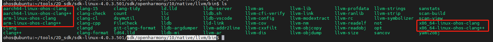
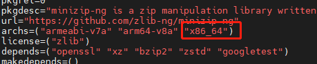
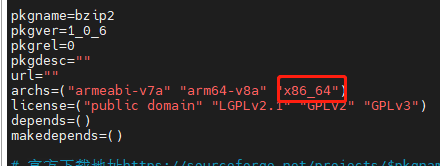
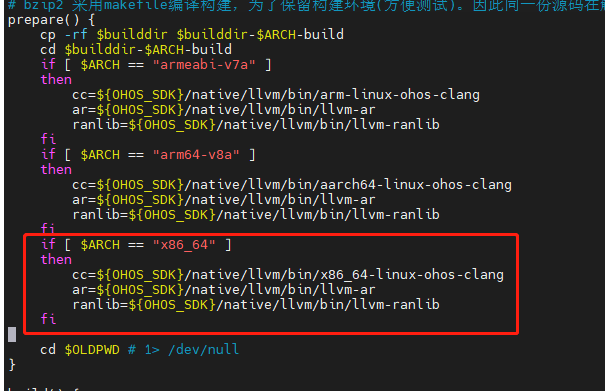
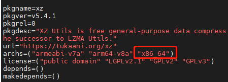
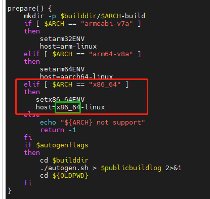
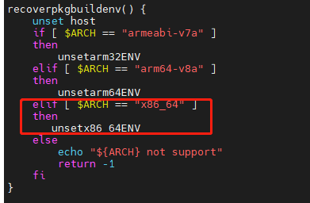

# lycium上面适配OpenHarmony 不同架构的构建

## 前言

当前lycium上面支持armv7-a和armv8-a的构建，其他架构的构建也是类似的，在HPKBUILD文件中，需要判断架构的地方加上架构相关的信息，这里以新增x86_64架构举例，cmake，makefile, configure构建方式如何修改。

## 一、构建框架层增加对x86_64的支持

1. 在SDK的工具链目录下，即编译工具链clang/clang++等可执行文件所在目录；

   例如sdk/openharmony/10/native/llvm/bin (IDE中sdk目录结构)

   或者sdk/native/llvm/bin (社区SDK目录结构)

   新增工具脚本（脚本作用为封装了clang加上--target参数，方便使用，避免每次调用clang时都加上一长串命令），如下图所示



新增脚本x86_64-linux-ohos-clang以及x86_64-linux-ohos-clang++，脚本内容类似arm和arm64的脚本文件，如下

修改完毕后注意修改脚本可执行权限，chmod 777 x86_64-linux-ohos-clang  x86_64-linux-ohos-clang++

```shell
vim x86_64-linux-ohos-clang
#文件内容如下
#!/bin/bash
bin_dir=`dirname "$0"`
if [ "$1" != "-cc1" ]; then
    "$bin_dir/clang" --target=x86_64-linux-ohos "$@"
else
    # Target is already an argument.
    "$bin_dir/clang" "$@"
fi

#------------------
vim x86_64-linux-ohos-clang++
#文件内容如下
#!/bin/bash
bin_dir=`dirname "$0"`
if [ "$1" != "-cc1" ]; then
    "$bin_dir/clang++" --target=x86_64-linux-ohos "$@"
else
    # Target is already an argument.
    "$bin_dir/clang++" "$@"
fi
```

2. 添加编译环境的支持

修改lycium/script/envset.sh文件，文件尾部新增如下内容

```shell
vim lycium/script/envset.sh

setx86_64ENV() {
    export AS=${OHOS_SDK}/native/llvm/bin/llvm-as
    export CC=${OHOS_SDK}/native/llvm/bin/x86_64-linux-ohos-clang
    export CXX=${OHOS_SDK}/native/llvm/bin/x86_64-linux-ohos-clang++
    export LD=${OHOS_SDK}/native/llvm/bin/ld.lld
    export STRIP=${OHOS_SDK}/native/llvm/bin/llvm-strip
    export RANLIB=${OHOS_SDK}/native/llvm/bin/llvm-ranlib
    export OBJDUMP=${OHOS_SDK}/native/llvm/bin/llvm-objdump
    export OBJCOPY=${OHOS_SDK}/native/llvm/bin/llvm-objcopy
    export NM=${OHOS_SDK}/native/llvm/bin/llvm-nm
    export AR=${OHOS_SDK}/native/llvm/bin/llvm-ar
    export CFLAGS="-DOHOS_NDK -fPIC -D__MUSL__=1"
    export CXXFLAGS="-DOHOS_NDK -fPIC -D__MUSL__=1"
    export LDFLAGS=""
}

unsetx86_64ENV() {
    unset AS CC CXX LD STRIP RANLIB OBJDUMP OBJCOPY NM AR CFLAGS CXXFLAGS LDFLAGS
}

```

## 二、cmake构建

在对应三方库目录，例如thirdparty/minizip-ng, 修改HPKBUILD文件，

1. 在archs变量中增加x86_64, 如下图所示

&nbsp;

## 三、makefile构建

在对应三方库目录，例如thirdparty/bzip2, 修改HPKBUILD文件

1. 在archs变量中增加x86_64, 如下图所示

&nbsp;

2.在prepare()函数中配置工具链，如下图

&nbsp;

```shell
if [ $ARCH == "x86_64" ]
    then
        cc=${OHOS_SDK}/native/llvm/bin/x86_64-linux-ohos-clang
        ar=${OHOS_SDK}/native/llvm/bin/llvm-ar
        ranlib=${OHOS_SDK}/native/llvm/bin/llvm-ranlib
fi
```

## 四、configure构建

在对应三方库目录，例如thirdparty/xz, 修改HPKBUILD文件

1.在archs变量中增加x86_64, 如下图所示

&nbsp;

2.在prepare()函数中配置构建环境，如下图

&nbsp;

```shell
if [ $ARCH == "armeabi-v7a" ]
    then
        setarm32ENV
        host=arm-linux
    elif [ $ARCH == "arm64-v8a" ]
    then
        setarm64ENV
        host=aarch64-linux
    elif [ $ARCH == "x86_64" ]
    then
       setx86_64ENV
       host=x86_64-linux
    else
        echo "${ARCH} not support"
        return -1
    fi
    if $autogenflags
    then
        cd $builddir
        ./autogen.sh > $publicbuildlog 2>&1
        cd ${OLDPWD}
    fi

```

3.在recoverpkgbuildenv()函数中进行环境清理，如下图所示

&nbsp;

```shell
recoverpkgbuildenv() {
    unset host
    if [ $ARCH == "armeabi-v7a" ]
    then
        unsetarm32ENV
    elif [ $ARCH == "arm64-v8a" ]
    then
        unsetarm64ENV
    elif [ $ARCH == "x86_64" ]
    then
       unsetx86_64ENV
    else
        echo "${ARCH} not support"
        return -1
    fi
}
```
