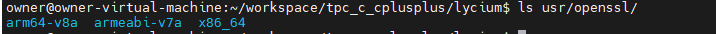

# DevEco studio工具的模拟器验证C/C++三方库

基于原生库的单元测试用例(ctest/make check)在IDE的模拟器上进行快速验证C/C++三方库（注意：模拟器的架构是是X86_64）。

## 模拟器准备

请参照[使用模拟器运行应用](https://developer.huawei.com/consumer/cn/doc/harmonyos-guides/ide-run-emulator-0000001582636200)

## 测试环境准备

C/C++三方库原生库的单元测试用例需要使用到make、ctest、cmake等工具，故在搭建测试环境时我们需要准备这些能在模拟器上运行的工具。具体请参阅[C/C++三方库测试环境准备](../lycium/CItools/README_zh.md)。

## 测试资源准备

原生库的单元测试用例一般都是ctest或者make check。以ctest为例，ctest是CMake集成的⼀个测试⼯具，在使⽤CMakeLists.txt⽂件编译⼯程的时候，CTest会⾃动configure、build、test和展现测试结果。在执行ctest时，如果目标文件不存在或者有变动，会需要重新执行编译操作。因此为了在目标环境只进行测试而不在去编译，需要将编译后的源码一起打包推送到目标机上进行测试。部分测试用例在编译时可能会指定路径，故需要保证测试机上的路径与编译机的路径是一致。

下面以OpenSSL为例说明如何进行openharmonyX86的交叉编译及测试步骤。

### 交叉编译 openssl

针对如何通过X86架构进行交叉编译C/C++三方库可以参考文档[lycium上面适配OpenHarmony 不同架构的构建](./adpater_x86.md#一构建框架层增加对x86_64的支持)。

- 准备编译环境

根据[框架层增加对x86_64的支持](./adpater_x86.md#一构建框架层增加对x86_64的支持)配置对应的编译环境。

- 修改编译脚本

当前仓库已经适配了`openssl` arm架构的[编译脚本](../thirdparty/openssl/HPKBUILD)，我们只需在其基础上添加对应`x86`架构即可。(如若需适配的三方库在本仓库中还未适配，可参照[模板脚本](../lycium/template/HPKBUILD)自行进行适配)。

1. 添加`x86`架构

```shell
archs=("armeabi-v7a" "arm64-v8a" "x86_64")
```

2. 添加构建环境的配置

```shell
prepare() {
    ....        # 其他原有配置
    elif [ $ARCH == "x86_64" ]          # 新增x86架构配置
    then
        setx86_64ENV
        host=linux-x86_64               # 配置host主机，根据实际情况配置(一般是x86_64-linux)
    else
        echo "${ARCH} not support"
        return -1
    fi

    return 0
}
```

3. 添加环境清理配置

```shell
check() {
    ...
     elif [ $ARCH == "x86_64" ]         # 新增x86架构清理环境
    then
       unsetx86_64ENV
    else
        echo "${ARCH} not support"
        return -1
    fi
    return 0
}
```

- 编译

在lycium目录下执行编译脚本

```shell
./build.sh openssl
```

编译成功后在lycium/usr/目录下会生产`openssl`目录，其中包含了三种架构的产物：



### 打包测试资源

为了保证测试时不会因路径问题导致测试失败，需将整个tpc_c_cplusplus打包推送到模拟器。

```shell
# tar -zcvf tpc_c_cplusplus.tar.gz tpc_c_cplusplus      ## 打包测试资源
```

```shell
hdc file send tpc_c_cplusplus.tar.gz /data/             ## 将测试资源推送到模拟器中
hdc shell
# cd /data
# tar -zxvf tpc_c_cplusplus.tar.gz                      ## 解压测试资源包
```

### 执行测试

进入到openssl的编译目录(编译目录在openssl源码目录的x86_64下)：

```shell
# cd tpc_c_cplusplus/thirdparty/openssl/openssl-OpenSSL_1_1_1u/x86_64
# make test
```

**注意：测试时指定使用了`/usr/bin/perl`,因此配置测试环境时需要配置对应的路径。**

## 测试方法

根据三方库原生测试用例的方式进行测试，一般的三方库原生测试用例都是通过`ctest`、`make check`、`make test`等方式进行测试。如 OpenSSL三方库，其原生测试用例是`make test`,故只需进入到其编译目录下执行 `make test`即可。
