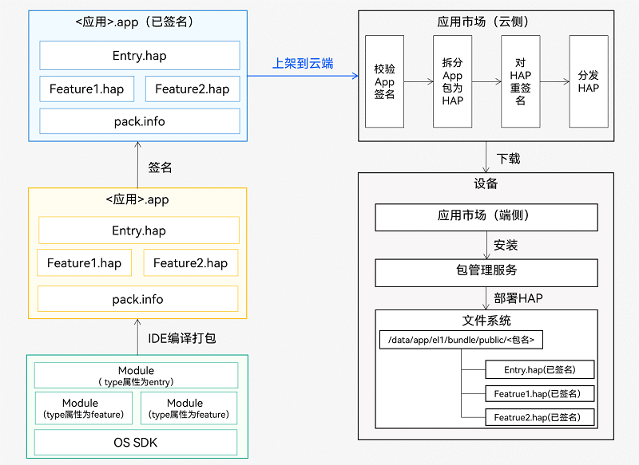

# OpeHarmony应用程序包

## 简介

用户应用程序泛指运行在设备的操作系统之上，为用户提供特定服务的程序，简称“应用”。一个应用所对应的软件包文件，称为“应用程序包”。<br>
OpenHarmony提供了应用程序包开发、安装、查询、更新、卸载的管理机制，方便开发者开发和管理OpenHarmony应用，具体如下：

- 应用软件所涉及的文件多种多样，开发者可通过OpenHarmony提供的集成开发工具将其开发的可执行代码、资源、三方库等文件整合到一起制作成OpenHarmony应用程序包，便于开发者对应用程序的部署。
- 应用软件所涉及的设备类型多种多样，开发者可通过OpenHarmony提供的应用程序包配置文件指定其应用程序包的分发设备类型，便于应用市场对应用程序包的分发管理。
- 应用软件所包含的功能多种多样，将不同的功能特性按模块来划分和管理是一种良好的设计方式。OpenHarmony提供了同一应用程序的多包管理的机制，开发者可以将不同的功能特性聚合到不同的包中，方便后续的维护与扩展。
- 应用软件涉及的芯片平台多种多样，有x86、ARM等，还有32位、64位之分，OpenHarmony为应用程序包屏蔽了芯片平台的差异，使应用程序包在不同的芯片平台都能够安装运行。
- 应用软件涉及的软件信息多种多样，有应用版本、应用名称、组件、申请权限等的信息，OpenHarmony包管理为开发者提供了这些信息的查询接口，方便开发者在程序中查询所需要的包信息。
- 应用软件涉及的资源多种多样，有媒体资源、原生资源、字符资源以及国际化的资源等，OpenHarmony包管理将不同的资源归档到不同的目录中，并集成资源索引文件，方便应用对资源的查找和使用。

## hap包的概念

HAP（Harmony Ability Package）是OpenHarmony应用安装的基本单位，包含了编译后的代码、资源、三方库及配置文件。HAP可分为Entry和Feature两种类型：

- Entry类型的HAP：是应用的主模块，在module.json5配置文件中的type标签配置为“entry”类型。在同一个应用中，同一设备类型只支持一个Entry类型的HAP，通常用于实现应用的入口界面、入口图标、主特性功能等。
- Feature类型的HAP：是应用的动态特性模块，在module.json5配置文件中的type标签配置为“feature”类型。一个应用程序包可以包含一个或多个Feature类型的HAP，也可以不包含；Feature类型的HAP通常用于实现应用的特性功能，可以配置成按需下载安装，也可以配置成随Entry类型的HAP一起下载安装（请参见module对象内部结构中的“deliveryWithInstall”）。

每个OpenHarmony应用可以包含多个.hap文件，一个应用中的.hap文件合在一起称为一个Bundle，而bundleName就是应用的唯一标识（请参见app.json5配置文件中的bundleName标签）。需要特别说明的是：在应用上架到应用市场时，需要把应用包含的所有.hap文件（即Bundle）打包为一个.app后缀的文件用于上架，这个.app文件称为App Pack（Application Package），其中同时包含了描述App Pack属性的pack.info文件；在云端分发和端侧安装时，都是以HAP为单位进行分发和安装的。

## hap包开发调试与发布部署

### 开发

开发者通过DevEco Studio工具按照业务的需要创建多个Module，在相应的Module中完成自身业务的开发。

### 调试

通过DevEco Studio编译打包，生成单个或者多个HAP。真机基于HAP进行安装、卸载调试，调试指南可参考[应用程序包调试方法](https://developer.harmonyos.com/cn/docs/documentation/doc-guides/ohos-debugging-and-running-0000001263040487#section10491183521520)，其中包括了单HAP与多HAP通过DevEco Studio工具的安装调试方法。<br>
应用程序包也可以通过[hdc_std工具](https://gitee.com/openharmony/docs/blob/master/zh-cn/device-dev/subsystems/subsys-toolchain-hdc-guide.md)(可通过OpenHarmony SDK获取，在SDK的toolchains目录下)进行安装、更新与卸载，通过hdc_std安装HAP时，HAP的路径为开发平台上的文件路径，以Windows开发平台为例，命令参考如下：

```shell
hdc_std install C:\entry.hap C:\feature.hap     ## 安装、更新，多HAP可以指定多个文件路径
install bundle successfully.                    ## 执行结果

hdc_std uninstall com.example.myapplication     ## 卸载
uninstall bundle successfully.                  ## 执行结果
```

应用程序包也可以通过[bm工具](https://gitee.com/openharmony/docs/blob/master/zh-cn/application-dev/tools/bm-tool.md)进行调试。通过bm工具进行安装、更新HAP时，传入的文件路径为真机上的文件路径，命令参考如下：

```shell
bm install -p /data/app/entry.hap /data/app/feature.hap     ## 安装、更新，多HAP可以指定多个文件路径
install bundle successfully.                                ## 执行结果

bm uninstall -n com.example.myapplication                   ## 卸载
uninstall bundle successfully.                              ## 执行结果
```

### 发布

当开发的程序包满足发布要求时，可以在工具中打包编译生成App包。将该App包上架到应用市场云端，应用市场会对上架的App包校验签名，校验签名通过后会将App包中的HAP拆分出来，同时对拆分出的HAP重新添加签名，然后对HAP进行分发。

### 部署

用户在设备上的应用市场客户端能够看到各种各样的应用，这些应用均由云端分发而来，有些是多HAP应用，有些是单HAP应用。用户选择某个应用后，应用市场将下载应用包含的全部HAP。

### 应用在终端设备上的安装

下载完成后，应用市场客户端再调用系统中包管理服务的安装接口安装下载的HAP，包管理服务以应用为单位将其中所有HAP部署到指定目录下，以完成应用的安装。<br>


## 参考文档

- [OpenHarmony应用开发](https://gitee.com/openharmony/docs/blob/master/zh-cn/application-dev/Readme-CN.md#/openharmony/docs/blob/master/zh-cn/application-dev/quick-start/multi-hap-release-deployment.md)
- [OpenHarmony知识体系](https://gitee.com/openharmony-sig/knowledge)
