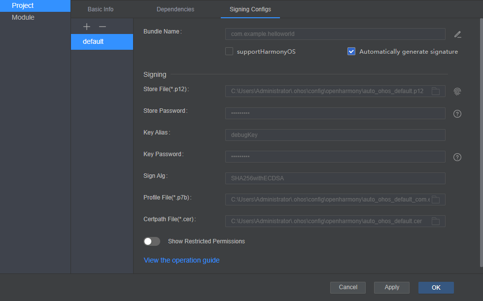

# 如何通过DevEco Studio开发一个NAPI工程

## 简介

NAPI（Native API）是OpenHarmony系统中的一套原生模块扩展开发框架，它基于Node.js N-API规范开发，为开发者提供了JavaScript与C/C++模块之间相互调用的交互能力。如下图所示：<br>
 <br>
这套机制对于鸿蒙系统开发的价值有两方面：

- OpenHarmony系统系统可以将框架层丰富的模块功能通过js接口开放给上层应用使用。
- 应用开发者也可以选择将一些对性能、底层系统调用有要求的核心功能用C/C++封装实现，再通过js接口使用，提高应用本身的执行效率。

本文将通过一个Hello world的实例来演示如何在DevEco Studio上开发一个NAPI工程的过程。

## 工程准备

### DevEco Studio下载

本实例中使用的是DevEco Studio 3.0 Release版本的IDE，我们需要在[官网](https://developer.harmonyos.com/cn/develop/deveco-studio#download)下载DevEco Studio 3.0 Release版即可，DevEco Studio的安装使用请参照[DevEco Studio使用指南](https://developer.harmonyos.com/cn/docs/documentation/doc-guides/ohos-deveco-studio-overview-0000001267924484)。

### SDK下载

下载安装完DevEco Studio工具后，我们需要下载OpenHarmony的SDK，具体步骤如下(更多详细信息请参照[DevEco Studio使用之配置开发环境](https://developer.harmonyos.com/cn/docs/documentation/doc-guides/ohos-setting-up-environment-0000001267524540))：

- 运行已安装的DevEco Studio，首次使用，请选择**Do not import settings**，单击OK。
- 进入DevEco Studio操作向导页面，修改**npm registry**，DevEco Studio已预置对应的仓（默认的npm仓，可能出现部分开发者无法访问或访问速度缓慢的情况），直接单击**Start using DevEco Studio**进入下一步。
   
- 设置Node.js信息，可以指定本地已安装的Node.js（Node.js版本要求为v14.19.1及以上，且低于v15.0.0；对应的npm版本要求为6.14.16及以上，且低于7.0.0版本）；如果本地没有合适的版本，可以选择**Download**按钮，在线下载Node.js。本示例以下载Node.js为例，选择下载源和存储路径后，单击**Next**进入下一步。
   
- 等待Node.js安装完成，然后单击**Finish**进入下一步。
   
- 在**SDK Componets Setup**界面，设置OpenHarmony SDK下载路径，如果需要开发HarmonyOS应用，请勾选上HarmonyOS SDK，单击**Next**进入下一步。
   
- 在弹出的SDK下载信息页面，单击**Next**，并在弹出的**License Agreement**窗口，阅读License协议，需同意License协议后，单击**Next**开始下载SDK。
    
- 等待OpenHarmony SDK及工具下载完成，单击**Finish**，这样SDK就安装完成。

## 创建工程

下载并配置完SDK后，我们就可以开始创建工程了。DevEco Studio已经自带了一个Native C++  hello的模板，我们只需新建该模板的一个工程即可。

- 打开DevEco Studio，点击左边Create Project，将会弹出对应新建工程界面。
- 选择OpenHarmony下的Native C++模板，单击Next。
  
- 配置工程
  选择完模板后，会弹出配置工程界面，在该界面我们需要配置工程名字，SDK版本以及Model，配置完后点击Finish，这样我们一个helloworld工程就创建完成了。
  

## 源码实现

新建完工程后，实现napi接口的hello.cpp源码在工程的entry/src/main/cpp目录下。

### 注册napi模块

先定义一个模块，对应结构体为napi_module，指定当前NAPI模块对应的模块名以及模块注册对外接口的处理函数，具体扩展的接口在该函数中声明，后面说明。 模块定义好后，调用NAPI提供的模块注册函数napi_module_register(napi_module* mod)函数注册到系统中。 

```c++
static napi_module demoModule = {
    .nm_version =1,
    .nm_flags = 0,
    .nm_filename = nullptr,
    .nm_register_func = Init,
    .nm_modname = "hello",
    .nm_priv = ((void*)0),
    .reserved = { 0 },
};
extern "C" __attribute__((constructor)) void RegisterHelloModule(void)
{
    napi_module_register(&demoModule);
}
```

### 接口定义

napi_property_descriptor结构体中声明了napi中对应的接口，如下所示，其中Add对应的使Native C++的接口，其应用端的接口对应为add，napi通过napi_define_properties接口将napi_property_descriptor结构体中的2个接口绑定在一起，并通过exports变量对外导出，使应用层可以调用add方法。

```c++
static napi_value Init(napi_env env, napi_value exports)
{
    napi_property_descriptor desc[] = {
        { "getHelloString", nullptr, getHelloString, nullptr, nullptr, nullptr,
         napi_default, nullptr }
    };
    napi_define_properties(env, exports, sizeof(desc) / sizeof(desc[0]), desc);
    return exports;
}
```

### 接口实现

以下为getHelloString接口业务实现代码：

```c++
static napi_value getHelloString(napi_env env, napi_callback_info info) {
  napi_value result;
  std::string words = "Hello Napi";
  if (napi_create_string_utf8(env, words.c_str(), words.length(), &result) != napi_ok) {
    return nullptr;
  }
  return result;
}
```

到此，我们已经对外导出了1个napi接口，应用端可以调用这个接口。

## 调用接口

首先，在调用napi前，我们需要导入napi库：

```js
import testNapi from "libentry.so"
```

导入完库后，我们就可以通过导入的变量直接调用对应的napi接口：

```c++
testNapi.getHelloString();
```

而工程创建后，在index.ets文件(在工程的entry/src/main/ets/pages目录下)中系统已经默认生成了一个hello world的文本区域，且通过点击文本区域，可以调用getHelloString的napi接口，代码如下：

```js
import testNapi from "libentry.so"
@Entry
@Component
struct Index {
  @State message: string = 'Hello World'
  build() {
    Row() {
      Column() {
        Text(this.message)
          .fontSize(50)
          .fontWeight(FontWeight.Bold)
          .onClick(() => {
            this.message = testNapi.getHelloString()
            console.log("Test NAPI get string ： " + this.message);
          })
      }
      .width('100%')
    }
    .height('100%')
  }
}
```

这时DevEco Studio工具会提示getHelloString接口未定义，我们需要在对应的index.d.ts文件(在工程的entry/src/main/cpp/types/libentry目录下)中加上该接口的定义：

```js
export const getHelloString: () => string;
```

至此，源码实现已完成，我们可以通过点击DevEco Studio工具上Build选项中的Build Hap(s)进行编译。

## 安装调试

应用通过DevEco Studio工具安装到开发板的步骤：

### 连接开发板

将开发板连接电脑，工具会自动识别到设备，如下图


### 配置签名

应用第一次安装到设备上的时候，是需要进行签名配置，否则无法进行安装。具体签名步骤：

- 点击工程配置按钮
  点击DevEco Studio工具右上角的Project Structure按钮，弹出工程配置界面
  
- 配置自动签名
  弹出工程配置界面，选择Project >>Signing Configs页面，在选中自动签名即可，此时工具会自动生成签名信息：
  
- 确定签名
  工具在自动生成签名信息后，直接点击ok按钮即可完成自动签名操作
  

### 安装运行

配置完签名后，我们就可以直接点击DevEco Studio工具上运行按钮进行安装运行应用了


### 调试

应用安装运行后，在板子上我们可以在屏幕的中央看到Hello World的显示，并且我们点击Hello World后可以在DevEco Studio工具的Log窗口查看到对应的调试信息

由于系统的调试信息也在log窗口显示，且信息量大，不方便我们查看自己的调试信息，所以我们可以在log窗口设置过滤信息，让窗口只显示我们过滤关键字的信息。

## 参考资料

- [DevEco Studio使用指南](https://developer.harmonyos.com/cn/docs/documentation/doc-guides/ohos-deveco-studio-overview-0000001263280421)。
- [深入浅出 OpenHarmony NAPI](https://gitee.com/javen678/hello-ohos-napi/blob/master/doc/README.md)。
- [知识体系](https://gitee.com/openharmony-sig/knowledge/tree/master)。
