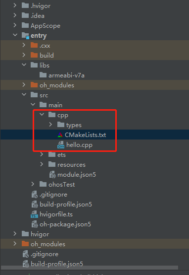
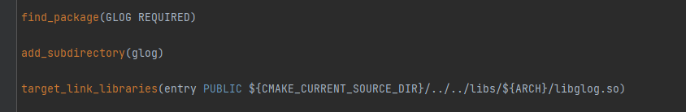
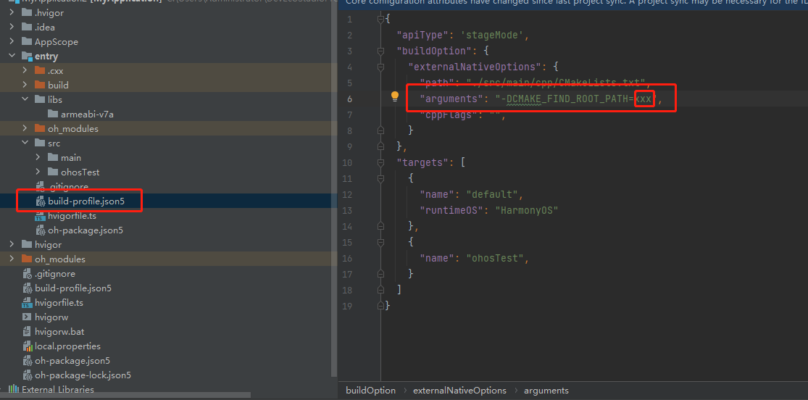

# 前言

DevEco Studio的native工程的C/C++部分当前只支持cmake脚本的编译，工程的目录结构如下图所示

&nbsp;

在工程中引用第三方库有如下三种方式，

&nbsp;

一、find_package模式

通过find_package，可以在指定目录下去搜索已安装的库（三方库构建完后执行install，会生成xxx-config.cmake之类的文件在安装目录下），如果可以找到对应的库，就可以获取头文件路径以及库的路径

二、add_subdirectory模式

可以通过顶层CMakeLists.txt调用子目录CMakeLists.txt的方式，这样就可以直接引用到第三方库的头文件路径和库

三、target_link_libraries模式

在库链接时直接链接第三方库

# 背景

DevEco Studio的native工程的C/C++部分是使用的cmake脚本来构建，开源社区上有很多C/C++三方库也是使用cmake来编译构建，这些三方库我们是否可以直接采用add_subdirectory的模式在DevEco Studio上使用？

# 分析

开源社区的三方库有些需要依赖其他三方库，有些不需要依赖其他三方库，通常依赖其他三方库都是通过使用find_package来引用。如果在DevEco Studio上面使用find_package，需要满足find_package的搜索条件，

有关于find_package的详细介绍可以参考cmake官网[find_package介绍](https://cmake.org/cmake/help/latest/command/find_package.html)

一、指定find_package的搜索路径

这里可以使用CMAKE_FIND_ROOT_PATH来指定，如下图所示

&nbsp;

图中xxx代表的就是三方库安装的路径

二、依赖库必须已存在，并且是通过install安装的

通过install安装，除了有lib和incldue文件，还有提供给find_package使用的文件，如下图所示

&nbsp;

find_package通过这些文件来获取库的版本、库的头文件、库的名称等信息，假如没有这些文件，find_package将会找不到库。

# 总结

一、部分开源三方库的脚本可以在DevEco Studio上直接使用

这部分开源三方库没有其他库的依赖，可以直接使用add_subdirectory引用

二、有依赖的三方库的脚本不能在DevEco Studio上直接使用

需要配置搜索路径和提前将依赖的库都构建并安装完毕或者在顶层CMakeLists.txt中使用execute_process来调用shell命令，先把依赖库编译并安装完成

# 三方库引用的建议

在native工程中，三方库的使用建议都采用target_link_libraries模式来引用