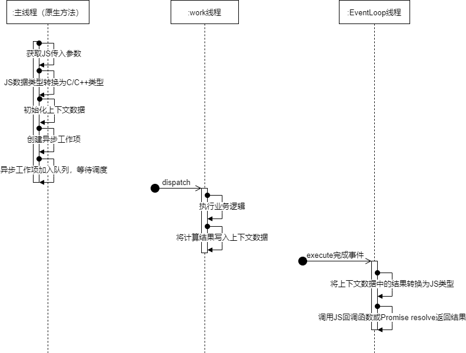

# NAPI异步调用

## 简介

OpenHarmony Napi 标准系统异步接口实现支持Callback方式和Promise方式。标准系统异步接口实现规范要求，若引擎开启Promise特性支持，则异步方法必须同时支持Callback方式和Promise方式。使用哪种方式由应用开发者决定，通过是否传递Callback函数进行区分。不传递Callback即为Promise方式，方法执行结果为Promise实例对象。

## 异步方式实现原理

- 异步方式原理
  同步方式，所有的代码处理都在原生方法（主线程）中完成。异步方式依赖NAPI框架提供的napi_create_async_work()函数创建异步工作项，原生方法被调用时，原生方法完成数据接收、转换，存入上下文数据，之后创建一个异步工作项，并加入调度队列，由异步工作线程池统一调度，原生方法返回空值（Callback方式）或返回Promise对象（Promise方式）。异步工作项中定义了2个函数，一个用于执行工作项的业务逻辑，异步工作项被调度后，该函数从上下文数据中获取输入数据，在worker线程中完成业务逻辑计算（不阻塞主线程）并将结果写入上下文数据。业务逻辑处理函数执行完成或被取消后，触发EventLoop执行另一函数，函数从上下文数据中获取结果，转换为JS类型，调用JS回调函数或通过Promise resolve()返回结果。
- 异步方式处理流程图
   
- napi_create_async_work()

  ```c++
  napi_status napi_create_async_work(napi_env env,
                                   napi_value async_resource,
                                   napi_value async_resource_name,
                                   napi_async_execute_callback execute,
                                   napi_async_complete_callback complete,
                                   void* data,
                                   napi_async_work* result);
  ```

  参数说明：
    [in] env: 传入接口调用者的环境，包含js引擎等，由框架提供，默认情况下直接传入即可。<br />
    [in] async_resource: 可选项，关联async_hooks。<br />
    [in] async_resource_name: 异步资源标识符，主要用于async_hooks API暴露断言诊断信息。<br />
    [in] execute: 执行业务逻辑计算函数，由worker线程池调度执行。在该函数中执行IO、CPU密集型任务，不阻塞主线程。<br />
    [in] complete: execute参数指定的函数执行完成或取消后，触发执行该函数。此函数在EventLoop线程中执行。<br />
    [in] data: 用户提供的上下文数据，用于传递数据。<br />
    [out] result: napi_async_work*指针，用于返回当前此处函数调用创建的异步工作项。返回值：返回napi_ok表示转换成功，其他值失败。<br />

## Callback 异步接口

下面基于napi_create_async_work将add()接口改成Callback方式接口——addCallback()，接口的eTS定义

```ts
function addAsyncCallback(numX: number, numY: number, callback:(result: number) => void): void;
```

### 初始化上下文数据

根据业务需求自定义一个上下文数据结构，用于保存和传递数据。本例自定义的上下文数据包含：异步工作项对象、回调函数、2个参数（加数、被加数）、计算结果等4个属性。

```c++
struct AddonData {
  napi_async_work asyncWork = nullptr;
  napi_ref callback = nullptr;
  double args[2] = {0};
  double result = nullptr;
};
```

在[napi数据类型](./napi_data_type.md)文中，我们已了解对于NAPI框架，所有参数，无论是ECMAScript标准中定义的Boolean、Null、Undefined、Number、BigInt、String、Symbol和Object八种数据类型，还是Function类型，都已统一封装为napi_value类型，故可如获取数据类型的参数一样获取Function类型参数，本例直接调用函数获取3个参数——加数、被加数、回调函数。 <br />
 接着我们将接收到的参数转换存入上下文数据，number类型的转换为double直接存入即可。Function类型的参数怎么处理？不转换直接存入napi_value类型？答案是不行的！这牵涉到NAPI对象生命周期管理问题。napi_value类型引用对象的生命周期在原生方法退出后结束，后面在work线程无法获取其值。NAPI提供了一种生命期限长于原生方法的对象引用类型—— napi_ref，napi_ref引用对象在原生方法退出后不自动回收，由用户管理此类型对象的生命周期。所以当前方法中，我们调用napi_create_reference()函数将接收到的napi_value类型的回调函数参数args[2]转换为napi_ref类型(生命周期具体定义及使用可参照文档[napi生命周期](./napi_life_cycle.md))。

```c++
static napi_value addAsyncCallback(napi_env env, napi_callback_info info) {
  // 获取3个参数，值的类型是js类型（napi_value）
  size_t argc = 3;
  napi_value args[3];
  napi_value thisArg = nullptr;
  napi_get_cb_info(env, info, &argc, args, &thisArg, nullptr);
  ...
  // 异步工作项上下文用户数据，传递到异步工作项的execute、complete中传递数据
  auto addonData = new AddonData{
      .asyncWork = nullptr,
  };

  // 将接收到的参数传入用户自定义上下文数据
  napi_get_value_double(env, args[0], &addonData->args[0]);
  napi_get_value_double(env, args[1], &addonData->args[1]);
  napi_create_reference(env, args[2], 1, &addonData->callback);
  ...
}
```

### 创建异步工作项

在创建异步工作项前，我们先分别声明2个函数，分别用作于napi_create_async_work()函数的execute、complete参数。异步工作项创建OK后，将其存入上下文数据的asyncWork属性，并调用napi_queue_async_work()将异步工作项加入调度队列，由异步work线程池统一调度，原生方法返回空值退出。

```c++
// 业务逻辑处理函数，由worker线程池调度执行。
static void addExecuteCB(napi_env env, void *data) {
}

// 业务逻辑处理完成回调函数，在业务逻辑处理函数执行完成或取消后触发。
static void addAsyncCompleteCB(napi_env env, napi_status status, void *data) {
}

static napi_value addAsyncCallback(napi_env env, napi_callback_info info) {
  ...
  napi_create_reference(env, args[2], 1, &addonData->callback);

  // 创建async work，创建成功后通过最后一个参数接收async work的handle
  napi_value resourceName = nullptr;
  napi_create_string_utf8(env, "addAsyncCallback", NAPI_AUTO_LENGTH, &resourceName);
  napi_create_async_work(env, nullptr, resourceName, addExecuteCB, addAsyncCompleteCB, (void *)addonData, &addonData->asyncWork);

  // 将刚创建的async work加到队列，由work thread调度执行
  napi_queue_async_work(env, addonData->asyncWork);

  // 原生方法返回空对象
  napi_value result = 0;
  napi_get_null(env, &result);
  return result;
}
```

### execute 函数

execute函数在异步工作项被调度后在work线程中执行，不阻塞主线程（不阻塞UI界面），可执行IO、CPU密集型等任务。此处仅为演示，我们的业务逻辑计算就是一个简单的加法，并把计算结果存入上下文数据的result属性。

```c++
// 业务逻辑处理函数，由worker线程池调度执行。
static void addExecuteCB(napi_env env, void *data) {
  AddonData *addonData = (AddonData *)data;

  // 执行复杂计算，不阻塞主线程。此处用一个加法简单示意。
  addonData->result = addonData->args[0] + addonData->args[1];
}
```

### complete 函数

 从接收到的上下文数据中获取结果，调用napi_call_function()方法执行JS回调函数返回数据给JS。之后释放过程中创建的napi_ref引用对象、异步工作项等对象。 NAPI框架提供了napi_call_function()函数供扩展Natvie代码（C/C++代码）调用JS函数，用于执行回调函数等场景。函数定义如下：

```c++
NAPI_EXTERN napi_status napi_call_function(napi_env env,
                                           napi_value recv,
                                           napi_value func,
                                           size_t argc,
                                           const napi_value* argv,
                                           napi_value* result);
```

参数说明：

- [in] env: 传入接口调用者的环境，包含js引擎等，由框架提供，默认情况下直接传入即可。
- [in] recv: 传给被调用的this对象。
- [in] func: 被调用的函数.
- [in] argc: 函数参数个数（对应函数数组的长度）。
- [in] argv: 函数参数数组.
- [out] result: func函数执行的返回值。 返回值：返回napi_ok表示转换成功，其他值失败。
因对象生命周期管理问题，上下文数据的callback属性的类型为napi_ref，需要调用napi_get_reference_value()函数获取其指向的napi_value对象值才调用napi_call_function()函数。napi_get_reference_value()函数介绍参照文档[napi生命周期](./napi_life_cycle.md)。

complete接口实现：

```c++
// 业务逻辑处理完成回调函数，在业务逻辑处理函数执行完成或取消后触发，由EventLoop线程中执行。
static void addAsyncCompleteCB(napi_env env, napi_status status, void *data) {
  AddonData *addonData = (AddonData *)data;
  napi_value callback = nullptr;
  napi_value undefined = nullptr;
  napi_get_undefined(env, &undefined);
  napi_get_reference_value(env, loginAddonData->callback, &callback);
  napi_call_function(env, undefined, callback, 0, nullptr, &callbackResult);

  // 删除napi_ref对象
  if (loginAddonData->callback != nullptr) {
    napi_delete_reference(env, loginAddonData->callback);
  }

  // 删除异步工作项
  napi_delete_async_work(env, loginAddonData->asyncWork);
  delete loginAddonData;
}
```

### eTS调用接口

```js
import testNapi from "libentry.so";

@Entry
@Component
struct Index {
  build() {
    Row() {
      Column() {
        Text(this.message)
          .fontSize(50)
          .fontWeight(FontWeight.Bold)
          .onClick(() => {
            let num1 = 123, num2 = 456
            testNapi.addCallback(num1, num2, (result) =>{
              console.info("message: 123 + 456  = " + result)
            })
          })
    }
    .width('100%')
  }
  .height('100%')
}
```

## Promise 接口

### 创建Promise

 通过前面异步方式实现原理我们可知Promise整体处理流程和Callback方式一样。不同的是，首先要创建一个Promise。NAPI框架中提供了napi_create_promise()函数用于创建Promise，调用该函数输出2个对象——deferred、promise。promise用于原生方法返回，deferred传入异步工作项的上下文数据。complete函数中，应用napi_resolve_deferred()函数 或 napi_reject_deferred() 函数返回数据。<br />
 函数定义如下：

```c++
napi_status napi_create_promise(napi_env env,
                                napi_deferred* deferred,
                                napi_value* promise);
```

参数说明：

- [in] env: 传入接口调用者的环境，包含js引擎等，由框架提供，默认情况下直接传入即可。
- [out] deferred: 返回接收刚创建的deferred对象，关联Promise对象，后面使用napi_resolve_deferred() 或 napi_reject_deferred() 返回数据。
- [out] promise: 关联上面deferred对象的JS Promise对象 返回值：返回napi_ok表示转换成功，其他值失败。

创建Promise接口的实现：

```c++
static napi_value addPromise(napi_env env, napi_callback_info info) {
  // 创建promise
  napi_value promise = nullptr;
  napi_deferred deferred = nullptr;
  NAPI_CALL(env, napi_create_promise(env, &deferred, &promise));

  ...

  // 返回promise
  return promise;
}
```

### 初始化上下文数据

同Callback方式定义一个上下文数据结构，用于保存和传递数据。Promise方式去掉callback属性，加上deferred属性。

```c++
// 用户提供的上下文数据，在原生方法（初始化数据）、executeCB、completeCB之间传递数据
struct AddonData {
  napi_async_work asyncWork = nullptr;
  napi_deferred deferred = nullptr;
  double args[2] = {0};
  double result = nullptr;
};

static napi_value addPromise(napi_env env, napi_callback_info info) {
  // 获取2个参数，值的类型是js类型（napi_value）
  size_t argc = 2;
  napi_value args[2];
  napi_value thisArg = nullptr;
  NAPI_CALL(env, napi_get_cb_info(env, info, &argc, args, &thisArg, nullptr));
  ...
  // 创建promise
  napi_value promise = nullptr;
  napi_deferred deferred = nullptr;
  NAPI_CALL(env, napi_create_promise(env, &deferred, &promise));

  // 异步工作项上下文用户数据，传递到异步工作项的execute、complete之间传递数据
  auto addonData = new AddonData{
      .asyncWork = nullptr,
      .deferred = deferred,
  };

  // 将接收到的参数传入
  NAPI_CALL(env, napi_get_value_double(env, args[0], &addonData->args[0]));
  NAPI_CALL(env, napi_get_value_double(env, args[1], &addonData->args[1]));
  ...
}
```

### 创建异步工作项

同Callback方式在创建异步工作项前，我们先分别声明2个函数，分别用作于napi_create_async_work()函数的execute、complete参数。异步工作项创建OK后，将其存入上下文数据的asyncWork属性，并调用napi_queue_async_work()将异步工作项加入调度队列，由异步work线程池统一调度，原生方法返回Promise对象退出。

```c++
// 用户提供的上下文数据，在原生方法（初始化数据）、executeCB、completeCB之间传递数据
struct AddonData {
  napi_async_work asyncWork = nullptr;
  napi_deferred deferred = nullptr;
  double args[2] = {0};
  double result = 0;
};

static napi_value addPromise(napi_env env, napi_callback_info info) {
  ...
  // 创建async work，创建成功后通过最后一个参数(addonData->asyncWork)返回async work的handle
  napi_value resourceName = nullptr;
  napi_create_string_utf8(env, "addAsyncCallback", NAPI_AUTO_LENGTH, &resourceName);
  napi_create_async_work(env, nullptr, resourceName, addExecuteCB, addPromiseCompleteCB, (void *)addonData,
                         &addonData->asyncWork);

  // 将刚创建的async work加到队列，由底层去调度执行
  napi_queue_async_work(env, addonData->asyncWork);

  // 原生方法返回promise
  return promise;
}
```

### execute 回调处理

此处完全同Callback方式，无需修改。

```c++
// 业务逻辑处理函数，由worker线程池调度执行。
static void addExecuteCB(napi_env env, void *data) {
  AddonData *addonData = (AddonData *)data;

  // 执行复杂计算，不阻塞主线程。此处用一个加法简单示意。
  addonData->result = addonData->args[0] + addonData->args[1];
}
```

### complete 回调处理

调用NAPI提供的napi_resolve_deferred() 或 napi_reject_deferred() 返回数据。之后释放过程中创建的napi_ref引用对象、异步工作项等对象。

```c++
static void addPromiseCompleteCB(napi_env env, napi_status status, void *data) {
  AddonData *addonData = (AddonData *)data;
  napi_value result = nullptr;
  napi_create_double(env, addonData->result, &result);
  napi_resolve_deferred(env, addonData->deferred, result);

  // 删除napi_ref对象
  if (addonData->callback != nullptr) {
    napi_delete_reference(env, addonData->callback);
  }

  // 删除异步工作项
  napi_delete_async_work(env, addonData->asyncWork);
  delete addonData;
  addonData = nullptr;
}
```

### eTS调用接口

```js
import testNapi from "libentry.so";

@Entry
@Component
struct Index {
  build() {
    Row() {
      Column() {
        Text(this.message)
          .fontSize(50)
          .fontWeight(FontWeight.Bold)
          .onClick(() => {
            let num1 = 123, num2 = 456
            testNapi.addPromise(num1, num2).then((result) =>{
              console.info("message: 123 + 456  = " + result)
            })
          })
    }
    .width('100%')
  }
  .height('100%')
}
```

## 规范异步接口

 如本文开头所说，若引擎开启Promise特性支持，则异步方法必须同时支持Callback方式和Promise方式，通过判断接收到的参数个数判断是Callback方式还是Promise方式。下面我们将addCallbak()、addPromise() 2个接口合并成一个接口——addAsync()，接口的eTS定义：

```js
function addAsync(num1: number, num2: number, callback:(result: number) => void): void;
function addAsync(num1: number, num2: number): Promise<number>;
```

首先修改用户上下文数据结构，同时包含deferred、callback属性。 

```c++
struct AddonData {
  napi_async_work asyncWork = nullptr;
  napi_deferred deferred = nullptr;
  napi_ref callback = nullptr;
  double args[2] = {0};
  double result = 0;
};
```

 修改接口原生方法实现，通过判断实际获取到的参数个数判断是Callback还是Promise，根据上面的接口定义，2个参数是Promise，3个参数是Callback。

```c++
static napi_value addAsync(napi_env env, napi_callback_info info) {
  // 获取3个参数，值的类型是js类型（napi_value）
  size_t argc = 3;
  napi_value args[3];
  napi_value thisArg = nullptr;
  napi_get_cb_info(env, info, &argc, args, &thisArg, nullptr);

  // 获取并判断js参数类型
  napi_valuetype valuetype0;
  napi_typeof(env, args[0], &valuetype0);
  napi_valuetype valuetype1;
  napi_typeof(env, args[1], &valuetype1);
  if (valuetype0 != napi_number || valuetype1 != napi_number) {
    napi_throw_type_error(env, nullptr, "Wrong arguments. 2 numbers expected.");
    return NULL;
  }

  // 异步工作项上下文用户数据，传递到异步工作项的execute、complete中传递数据
  auto addonData = new AddonData{
      .asyncWork = nullptr,
  };

  // 判断事件获取的参数个数，如是2个则按Promise处理。
  if (argc == 2) {
    // 创建promise
    napi_value promise = nullptr;
    napi_deferred deferred = nullptr;
    napi_create_promise(env, &deferred, &promise);
    addonData->deferred = deferred;

    // 将接收到的参数传入
    napi_get_value_double(env, args[0], &addonData->args[0]);
    napi_get_value_double(env, args[1], &addonData->args[1]);

    // 创建async work，创建成功后通过最后一个参数(addonData->asyncWork)返回async work的handle
    napi_value resourceName = nullptr;
    napi_create_string_utf8(env, "addPromise", NAPI_AUTO_LENGTH, &resourceName);
    napi_create_async_work(env, nullptr, resourceName, addExecuteCB, addPromiseCompleteCB, (void *)addonData,
                           &addonData->asyncWork);

    // 将刚创建的async work加到队列，由底层去调度执行
    napi_queue_async_work(env, addonData->asyncWork);

    // 返回promise
    return promise;
  } else {
    napi_valuetype valuetype2;
    napi_typeof(env, args[2], &valuetype2);
    if (valuetype2 != napi_function) {
      napi_throw_type_error(env, nullptr, "Callback function expected.");
      return nullptr;
    }

    // 将接收到的参数传入用户自定义上下文数据
    napi_get_value_double(env, args[0], &addonData->args[0]);
    napi_get_value_double(env, args[1], &addonData->args[1]);
    napi_create_reference(env, args[2], 1, &addonData->callback);

    // 创建async work，创建成功后通过最后一个参数接收async work的handle
    napi_value resourceName = nullptr;
    napi_create_string_utf8(env, "addCallback", NAPI_AUTO_LENGTH, &resourceName);
    napi_create_async_work(env, nullptr, resourceName, addExecuteCB, addCallbackCompleteCB, (void *)addonData,
                           &addonData->asyncWork);

    // 将刚创建的async work加到队列，由底层去调度执行
    napi_queue_async_work(env, addonData->asyncWork);

    // 原生方法返回空对象
    napi_value result = 0;
    napi_get_null(env, &result);
    return result;
  }
}
```

## 参考资料

- [napi数据类型转换](./hello_napi.md)。
- [深入浅出 OpenHarmony NAPI 之异步调用](https://gitee.com/javen678/hello-ohos-napi/blob/master/doc/3.Callback&Promise.md)。
- [OpenHarmony 知识体系](https://gitee.com/openharmony-sig/knowledge)。
  