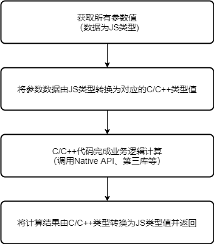

# NAPI数据类型转换与同步调用

## napi的数据类型

在[通过IDE创建工程](./hello_napi.md)的示例代码中，我们使用napi_create_string_utf8函数将C/C++ string转换成NAPI类型——napi_value 。OpenHarmony NAPI将ECMAScript标准中定义的Boolean、Null、Undefined、Number、BigInt、String、Symbol和Object八种数据类型，以及函数对应的Function类型，统一封装成napi_value类型 (也称为JS类型)。该类型用于接收应用传递过来的数据以及返回数据给应用。 本文将讲述JS类型和C/C++数据类型之间的转换 。

## napi的数据类型转换接口

OpenHarmony NAPI提供了很多接口用来napi的数据类型与C/C++数据类型之间的转换。以下列出常用的几种接口

### C/C++数据类型转napi类型

- napi_create_double(napi_env env, double value, napi_value* result);
- napi_create_int32(napi_env env, int32_t value, napi_value* result);
- napi_create_uint32(napi_env env, uint32_t value, napi_value* result);
- napi_create_int64(napi_env env, int64_t value, napi_value* result);
- napi_create_string_utf8(napi_env env, const char* str, size_t length, napi_value* result);

### napi类型转C/C++数据类型

- napi_get_value_double(napi_env env, napi_value value, double* result);
- napi_get_value_int32(napi_env env, napi_value value, int32_t* result);
- napi_get_value_uint32(napi_env env, napi_value value, uint32_t* result);
- napi_get_value_int64(napi_env env, napi_value value, int64_t* result);
- napi_get_value_string_utf8(napi_env env, napi_value value, char* buf, size_t bufsize, size_t* result);
- napi_get_value_bool(napi_env env, napi_value value, bool* result);

## 同步调用

我们在[通过IDE创建工程](./hello_napi.md)示例中添加一个简单的接口——add(num1, num2)来讲述具体细节，以及接口同步方式的实现。<br>
NAPI的同步方式调用的扩展API代码处理流程如下图。<br>
 

### 添加NAPI扩展API

- NAPI定义并注册接口

  ```c++
  static napi_value add(napi_env env, napi_callback_info info) {
      napi_value reuslt;
      return reuslt;
  }
  static napi_value registerFunc(napi_env env, napi_value exports)
  {
      static napi_property_descriptor desc[] = {
           { "add", nullptr, Add, nullptr, nullptr, nullptr, napi_default, nullptr },
      };
  }
  ```

- eTs定义接口

  ```ts
  function add(num1: number, num2: number): number;
  ```

### 获取JS参数

 NAPI定义API方法时的接收参数为(napi_env, napi_callback_info)，其中napi_callback_info为上下文的信息。通过NAPI提供了napi_get_cb_info()方法可从napi_callback_info中获取参数列表、this及其他数据。 
 napi_get_cb_info函数说明如下：

```c++
napi_status napi_get_cb_info(napi_env env,
                             napi_callback_info cbinfo,
                             size_t* argc,
                             napi_value* argv,
                             napi_value* thisArg,
                             void** data)
```

参数说明：

- [in] env: 传入接口调用者的环境，包含js引擎等，由框架提供，默认情况下直接传入即可.
- [in] value: napi_callback_info对象，上下文的信息
- [in-out] argc: argv数组的长度。若napi_callback_info中实际包含的参数的个数大于请求的数量argc，将只复制argc的值所指定数量的参数只argv中。若实际的参数个数小于请求的数量，将复制全部的参数，数组多余的空间用空值填充，并将参数实际长度写入argc。
- [out] argv: 用于接收参数列表
- [out] thisArg: 用于接收this对象
- [out] data: NAPI的上下文数据 返回值：返回napi_ok表示转换成功，其他值失败。下面的返回napi_status方法一样。

在add方法中，调用napi_get_cb_info函数：

```c++
// env、info 参数由NAPI框架传入
static napi_value add(napi_env env, napi_callback_info info) {
  size_t argc = 2;
  napi_value args[2];
  napi_get_cb_info(env, info, &argc, args , nullptr, nullptr);
  napi_value reuslt;
  return reuslt;
}
```

### JS类型值转换为C/C++类型的值

 因传入的参数是Javascript值类型，并被框架封装成统一的唯一类型——napi_value类型，为了能够进行计算，我们需要获取其对应在C/C++中的类型的值。我们可以用[napi类型转C/C++数据类型](./napi_data_type.md#napi类型转cc数据类型)中的相关接口进行转换。此示例中我们用 napi_get_value_double方式：

```c++
static napi_value add(napi_env env, napi_callback_info info) {
  // 获取2个参数，值的类型是js类型（napi_value）
  size_t argc = 2;
  napi_value args[2];
  napi_get_cb_info(env, info, &argc, args , nullptr, nullptr);
  // 将js类型（napi_value）的参数值转换成C++类型double
  double value0;
  napi_get_value_double(env, args[0], &value0);
  double value1;
  napi_get_value_double(env, args[1], &value1);
  napi_value reuslt;
  return reuslt;
}
```

### 业务逻辑计算

 使用Native代码（C/C++代码）完成业务场景逻辑计算。本示例中就简化为2个数字简单相加，代码如下：

```c++
static napi_value add(napi_env env, napi_callback_info info) {
  ...
  // 业务逻辑运算
  double sum = value0 + value1;
  ...
}
```

### 计算结果转换为JS类型并返回

 计算的结果是C/C++ double类型，不能直接返回给JS，需要转换成NAPI node_value类型 。本示例中我们用到
[C/C++数据类型转napi类型](./napi_data_type.md#cc数据类型转napi类型)中的napi_create_double接口：

```c++
static napi_value add(napi_env env, napi_callback_info info) {
  ...
  //  将结果由C++类型（double）转换成js类型（napi_value）
  napi_value reuslt;
  napi_create_double(env, sum, &reuslt)
  // 将结果返回到JS
  return result;
}
```

完整的示例代码参照[完整源码](https://gitee.com/openharmony-sig/knowledge_demo_temp/blob/master/FA/NapiStudy_HellNapi/entry/src/main/cpp/hello.cpp)。

### 应用调用

本示例程序也是在DevEco Studio开发，应用调用可参照[通过IDE创建工程](./hello_napi.md)

```ts
import testNapi from "libentry.so"
let num1 = 123
let num2 = 456
let result = testNapi.add(num1, num2)
```

## 参考资料

- [通过IDE开发一个napi工程之Hello napi](./hello_napi.md)
- [Hello napi完整源码工程](https://gitee.com/openharmony-sig/knowledge_demo_temp/blob/master/FA/NapiStudy_HellNapi)
- [深入浅出 OpenHarmony NAPI 之数据类型转换](https://gitee.com/javen678/hello-ohos-napi/blob/master/doc/2.%E6%95%B0%E6%8D%AE%E7%B1%BB%E5%9E%8B%E8%BD%AC%E6%8D%A2.md)
- [OpenHarmony 知识体系](https://gitee.com/openharmony-sig/knowledge/tree/master)。
