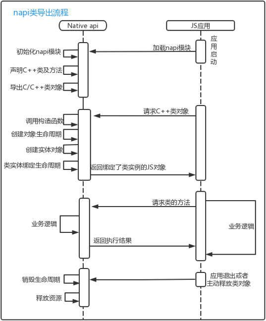

# NAPI 导出类对象

## 简介

js调用napi的数据，对于简单的数据类型，只需要napi返回对应类型的napi_value数据即可 (详情参照napi数据类型类型与同步调用)。但是对于一些复杂的数据类型(如我们常用C++的类对象)，是不能直接返回一个napi_value数据的。这时我们需要对这些数据进行一系列操作后将其导出，这样js才能使用导出后的对象。
本文以导出类对象为例来说明napi导出对象的具体过程。<br>
类对象导出的具体过程: <br>


## NAPI导出类对象具体实现

这里我们以导出NapiTest类为例说明导出一个类的实现过程

### 定义NapiTest类以及相关方法

NapiTest类主要实现了接收js设置的数据并将该数据返回到js应用中，具体定义如下(NapiTest.h)：

```c++
class NapiTest {
public:
  NapiTest() : mEnv(nullptr), mRef(nullptr) {
  }
  ~NapiTest();
  
  static napi_value Create(napi_env env, napi_callback_info info);  // 创建NapiTest类的实体，并将实体返回到应用端，该方法为js创建一个类实体，因此需要将该接口对外导出
  static napi_value Init(napi_env env, napi_value exports);         // 初始化js类并设置对应属性并将其导出。

private:
	static napi_value SetMsg(napi_env env, napi_callback_info info);            // 设置数据，此方法给到js直接调用，因此需要将该接口对外导出
    static napi_value GetMsg(napi_env env, napi_callback_info info);          // 获取数据，此方法给到js直接调用，因此需要将该接口对外导出
    static napi_value Constructor(napi_env env, napi_callback_info info);     // 定义js结构体时实际的构建函数
    static void Destructor(napi_env env, void *nativeObject, void *finalize); // 释放资源的函数(类似类的析构函数)
    
    static napi_ref sConstructor_;  // 生命周期变量
    static std::string _msg;        // 设置和获取数据的变量
    napi_env mEnv = nullptr;        // 记录环境变量
    napi_ref mRef = nullptr;        // 记录生命周期变量
};
```

### 将NapiTest定义为js类

- 在定义js类之前，需要先设置类对外导出的方法

  ```c++
  napi_property_descriptor desc[] = {
      { "getMsg", nullptr, NapiTest::GetMsg, nullptr, nullptr, nullptr,
          napi_default, nullptr },
      { "setMsg", nullptr, NapiTest::SetMsg, nullptr, nullptr, nullptr, 
        napi_default, nullptr },
  }
  ```

- 定义js类
  
  ```c++
  napi_value mConstructor = nullptr;
  if (napi_define_class(env, NAPI_CLASS_NAME, NAPI_AUTO_LENGTH, Constructor, nullptr,
      sizeof(desc) / sizeof(desc[0]), desc, &mConstructor) != napi_ok) {
      return nullptr;
  }
  ```

  使用到函数说明:
  
  ```c++
  napi_status napi_define_class(napi_env env,
                            const char* utf8name,
                            size_t length,
                            napi_callback constructor,
                            void* data,
                            size_t property_count,
                            const napi_property_descriptor* properties,
                            napi_value* result);
  ```

  功能：将C++类定义为js的类<br>
  参数说明：
  - [in] env: 调用api的环境
  - [in] utf8name: C++类的名字
  - [in] length: C++类名字的长度，默认自动长度使用NAPI_AUTO_LENGTH
  - [in] constructor: 处理构造类实例的回调函数
  - [in] data: 作为回调信息的数据属性传递给构造函数回调的可选数据
  - [in] property_count: 属性数组参数中的个数
  - [in] properties: 属性数组
  - [out] result: 通过类构造函数绑定类实例的napi_value对象

  返回：调用成功返回0，失败返回其他

- 实现js类的构造函数

  当js应用通过new方法获取类对象的时候，此时会调用 napi_define_class 中设置 constructor 回调函数，该函数实现方法如下：

  ```c++
  napi_value NapiTest::Constructor(napi_env env, napi_callback_info info)
  {
    napi_value undefineVar = nullptr, thisVar = nullptr;
      napi_get_undefined(env, &undefineVar);
      
      if (napi_get_cb_info(env, info, nullptr, nullptr, &thisVar, nullptr) ==
          napi_ok && thisVar != nullptr) {
          // 创建NapiTest 实例
          NapiTest *reference = new NapiTest(env);
          // 绑定实例类创建NapiTest到导出的对象result
          if (napi_wrap(env, thisVar, reinterpret_cast<void *>(reference),
              NapiTest::Destructor, nullptr, &(reference->mRef)) == napi_ok) {
              return thisVar;
          }
  
          return thisVar;
      }
      
      return undefineVar;
  }
  ```

  其中NapiTest::Destructo方法是用来释放创建的对象：

  ```c++
  void NapiTest::Destructor(napi_env env, void *nativeObject, void *finalize)
  {
      NapiTest *test = reinterpret_cast<NapiTest*>(nativeObject);
      test->~NapiTest();
  }
  ```

  使用到函数说明：

  ```c++
  napi_status napi_wrap(napi_env env,
                    napi_value js_object,
                    void* native_object,
                    napi_finalize finalize_cb,
                    void* finalize_hint,
                    napi_ref* result);
  ```

  功能：将C++类实例绑定到js对象，并关联对应的生命周期<br>
  参数说明：
  - [in] env: 调用api的环境
  - [in] js_object: 绑定C++类实例的js对象
  - [in] native_object: 类实例对象
  - [in] finalize_cb: 释放实例对象的回调函数
  - [in] finalize_hint: 传递给回调函数的数据
  - [out] result: 绑定js对象的引用

  返回：调用成功返回0，失败返回其他

### 导出js类

- 创建生命周期(生命周期相关可以参考文档[napi生命周期](./napi_life_cycle.md)) <br>
  在设置类导出前，需要先创建生命周期

  ```c++
  if (napi_create_reference(env, mConstructor , 1, &sConstructor_) != napi_ok) {
      return nullptr;
  }
  ```

  mConstructor 定义js类时返回的代表类的构造函数的数据 <br>
  sConstructor_  生命周期变量 <br>
- 将类导出到exports中
  将类以属性值的方式导出

  ```c++
  if (napi_set_named_property(env, exports, NAPI_CLASS_NAME, constructor) !=  napi_ok) {
      return nullptr;
  }
  ```

通过以上步骤，我们基本实现了NapiTest这个类的导出。<br>
注意：以上实现都是在类的Init方法中，我们只需要在NAPI注册的接口中调用该Init即可。完整代码可以查看[NapiTest源码](https://gitee.com/openharmony-sig/knowledge_demo_temp/blob/master/FA/NapiStudy_ObjectWrapTest/entry/src/main/cpp/NapiTest.cpp)

### 创建类的实例对象

js应用除了调用new方法获取类的实例外，我们也可以提供一些方法让js应用获取对应的类的实例，如在我们的NapiTest类中，我们定义了一个Create方法，该方法实现了NapiTest类实例的获取。具体实现如下：

```c++
napi_value NapiTest::Create(napi_env env, napi_callback_info info) {
    napi_status status;
    napi_value constructor = nullptr, result = nullptr;
    // 获取生命周期变量
    status = napi_get_reference_value(env, sConstructor_, &constructor);

    // 创建生命周期内的实例对象并将其返回
    status = napi_new_instance(env, constructor, 0, nullptr, &result);
    auto napiTest = new NapiTest();
    // 绑定实例类创建NapiTest到导出的对象result
    if (napi_wrap(env, result, reinterpret_cast<void *>(napiTest), Destructor,
    	nullptr, &(napiTest->mRef)) == napi_ok) {
        return result;
    }
    
    return nullptr;
}
```

在napi接口的注册中将该方法以接口的方式导出，应用层就可以直接调用该接口并获取到该类的实例对。<br>
特别说明：如果单独实现了一个类实例获取的方法，那么js的类构造函数可以不实现。

### 实现NAPI接口的注册

我们已helloworld为列，

- 新建一个hello.cpp，定义模块

  ```c++
  static napi_module demoModule = {
      .nm_version =1,
      .nm_flags = 0,
      .nm_filename = nullptr,
      .nm_register_func = Init,
      .nm_modname = "hello",
      .nm_priv = ((void*)0),
      .reserved = { 0 },
  };
  ```

- 实现模块的Init

  ```c++
  EXTERN_C_START
  static napi_value Init(napi_env env, napi_value exports)
  {
    napi_property_descriptor desc[] = {
        { "create", nullptr, NapiTest::Create, nullptr, nullptr, nullptr, napi_default, nullptr }   // 单独导出 create 方法，js应用可以直接调用Create方法获取类实例
    };
    
    napi_define_properties(env, exports, sizeof(desc) / sizeof(desc[0]), desc);

    return NapiTest::Init(env, exports);    // 导出类以及类的方法
  }
  EXTERN_C_END
  ```

- 模块注册

  ```c++
  // 注册 hello模块
  extern "C" __attribute__((constructor)) void RegisterHelloModule(void)
  {
      napi_module_register(&demoModule);
  }
  ```

至此，我们完成了整个napi接口注册以及napi类的导出。

## 应用调用NAPI实例

### 导出接口

在使用该NAPI的时候，我们需要在ts文件(路径在\entry\src\main\cpp\types\libentry\index.d.ts)，声明以下内容:

```js
export const create : () => NapiTest;
export class  NapiTest {
    setMsg(msg: string): void;
    getMsg(): string;
}
```

该文件申明了NAPI接口中导出的方法和类

### 应用调用

新建一个helloworld的ETS工程，该工程中包含一个按键,我们可以通过该按键进行数据的在native C++中存储和获取

- 导出napi对应的库(之前NAPI接口生成的库名为libentry.so)

  ```js
  import testNapi from "libentry.so";
  ```

- 定义变量 tt

  ```js
  struct Index {
    @State message: string = 'Hello World'
    @State flag:number = 0
    tt = testNapi.create();
  
    build() {
      Row() {
        Column() {
          Text(this.message)
            .fontSize(50)
            .fontWeight(FontWeight.Bold)
            .onClick(() => {
            })
        }
        .width('100%')
      }
      .height('100%')
    }
  ```

- 在按键中调用对应的接口并输出内容
  
  ```js
  if (this.falg == 0) {
      this.flag = 2
      this.tt.setMsg("1+1")
  } else {
      this.flag = 0
      this.tt.setMsg("1-1")
  }
  console.info("[NapiTest]:" + this.tt.getMsg() + " = " + this.flag);
  ```

  通过IDE LOG信息可以查看到，当按多次下按钮时，出现交替以下信息：

  ```js
  02200/JsApp: [NapiTest]： 1+1 = 2
  02200/JsApp: [NapiTest]： 1-1 = 0 
  ```

## 参考资料

- [NapiTest源码工程](https://gitee.com/openharmony-sig/knowledge_demo_temp/blob/master/FA/NapiStudy_ObjectWrapTest)
- [通过IDE开发一个napi工程](./hello_napi.md)
- [napi生命周期](./napi_life_cycle.md)
- [OpenHarmony 知识体系](https://gitee.com/openharmony-sig/knowledge/tree/master)
