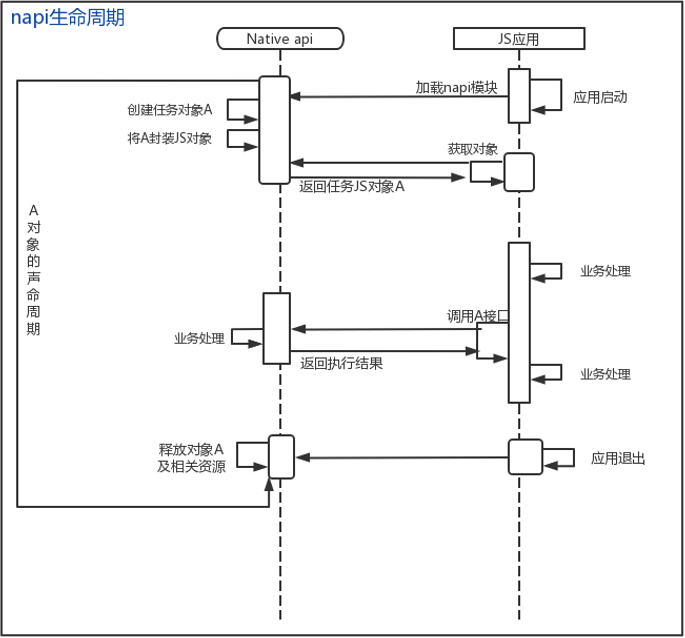

# NAPI生命周期

## 什么是NAPI的生命周期

我们都知道，程序的生命周期是指程序从启动，运行到最后的结束的整个过程。生命周期的管理自然是指控制程序的启动，调用以及结束的方法。
而NAPI中的生命周期又是怎样的呢？如下图所示：<br>
  <br>
从图上我们可以看出，在js应用启动时会加载napi模块，而在napi模块加载过程中会创建一个napi对象A提供给应用使用，在应用退出或者主动释放A对象前，A对象必须一直保持"活跃"状态。从A对象创建到释放的整个过程也代表着A对象的生命周期。

## NAPI生命周期管理的方法

js调用时，NAPI中对象的句柄可以作为napi_value返回. 这些句柄必须保持对象“活动”，直到本机代码不再需要它们，否则可以在本机代码完成使用它们之前回收对象。<br />
当返回对象句柄时，它们与“范围”相关联。默认范围的生命周期与本机方法调用的生命周期相关联。结果是，默认情况下，句柄保持有效，并且与这些句柄关联的对象将在本机方法调用的生命周期内保持活动状态。<br />
但是，在许多情况下，与本地方法相比，句柄必须在更短或更长的生命周期内保持有效。此时，NAPI提供了对应的函数来改变默认句柄的寿命(即生命周期)。

### 设置局部生命周期

因为在napi中全部js相关的值都是一个不透明的封装，默认生命周期是和全局一致的，有时候处于安全和性能的考虑，须要将一些值的生命周期限制在必定的范围之内，此时我们就需要用到NAPI相关的接口来napi_open_handle_scope和napi_close_handle_scope建立和关闭一个上下文环境。比如：

```c++
for (int i = 0; i < 1000000; i++) {
  napi_handle_scope scope;
  napi_status status = napi_open_handle_scope(env, &scope);
  if (status != napi_ok) {
    break;
  }
  napi_value result;
  status = napi_get_element(e object, i, &result);
  if (status != napi_ok) {
    break;
  }
  // do something with element
  status = napi_close_handle_scope(env, scope);
  if (status != napi_ok) {
    break;
  }
}
```

此时，因为限制了做用域，因此每一个result的生命周期都被限制在了单次循环以内。<br>
使用到的函数：

```c++
napi_status napi_open_handle_scope(napi_env env, napi_handle_scope* result)
```

功能：打开一个局部的生命周期<br>
参数说明:

- [in] env - 当前环境变量
- [out] result - 根据当前环境创建的生命周期变量

返回：napi_status，成功返回0，失败返回其他

```c++
napi_status napi_close_escapable_handle_scope(napi_env env, napi_handle_scope scope)
```

功能：关闭传入的生命周期(生命周期必须按照创建它们的相反顺序关闭)。<br>
参数说明:

- [in] env - 当前环境变量
- [out] scope - 需要关闭的生命周期变量

返回：napi_status，成功返回0，失败返回其他

### 设置全局生命周期

 在某些情况下，插件需要能够创建和引用具有比单个本地方法调用更长的生命周期的对象。例如，要创建一个构造函数并稍后在请求中使用该构造函数来创建实例，必须可以在许多不同的实例创建请求中引用该构造函数对象。如有一个napi_value变量constructor，需要将其导出到js使用：

 ```c++
 {
   napi_value constructor = nullptr;
   ...
   if (napi_create_reference(env, constructor, 1, &sConstructor_) != napi_ok) {    // 创建生命周期，初始引用计数设为1
       return nullptr;
   }
   if (napi_set_named_property(env, exports, NAPI_CLASS_NAME, constructor) != napi_ok) {   // 设置constructor对象相关属性并绑定到导出变量exports
       return nullptr;
   }
   ...
}
 ```

此时在其他线程或接口中就可以通过生命周期变量获取此constructor对象进行处理。<br>
使用到的函数：

```c++
napi_status napi_create_reference(napi_env env, napi_value value, uint32_t initial_refcount, napi_ref *result)
```

功能：通过引用对象创建新的生命周期引用对象<br>
参数：

- [in] env: 当前环境变量
- [in] value: 需要引用的对象
- [in] initial_refcount: 引用计数初始值
- [out] result: 新建的生命周期引用对象

返回：napi_status，成功返回0，失败其他

## NAPI生命周期管理实现

这里我们以TestNapi为例(关于工程创建可以参照[通过IDE开发一个Napi工程](./hello_napi.md))

- 首先新建一个 hello.cpp，实现 NAPI接口模块的注册

  ```c++
  #include "napi/native_api.h"
  #include <js_native_api_types.h>
  
  EXTERN_C_START
  static napi_value Init(napi_env env, napi_value exports)
  {
   // 暂未实现任何方法
      napi_property_descriptor desc[] = {
      };
      return exports;
  }
  EXTERN_C_END
  static napi_module demoModule = {
      .nm_version =1,
      .nm_flags = 0,
      .nm_filename = nullptr,
      .nm_register_func = Init,
      .nm_modname = "hello",
      .nm_priv = ((void*)0),
      .reserved = { 0 },
  };
  // 注册 hello模块
  extern "C" __attribute__((constructor)) void RegisterHelloModule(void)
  {
      napi_module_register(&demoModule);
  }
  ```

- 定义一个测试的类(TestNapi)

  ```c++
  class NapiTest{
  public:
      NapiTest(){}
      ~NapiTest(){}
      static napi_value SetMsg(napi_env env, napi_callback_info info) {
          napi_value result = nullptr;
          napi_get_undefined(env, &result);
          char _msg[128] = {0};
          napi_value msgvalue;
          size_t argc = 1, size = 0;
  
          if (napi_get_cb_info(env, info, &argc, &msgvalue, nullptr, nullptr) !=
              napi_ok) {
              return result;
          }
          
          if (napi_get_value_string_utf8(env, msgvalue, _msg, sizeof(_msg), &size) != 
              napi_ok) {
              return result;
          }
          
          return result;
      }

      static napi_value GetMsg(napi_env env, napi_callback_info info) {
          napi_value result;
          char *_msg = "hello NapiTest";
          if (napi_create_string_utf8(env, _msg, strlen(_msg), &result) != napi_ok) {
              napi_get_undefined(env, &result);
              return nullptr;
          }
          return result;
      }
      
      napi_value Create(napi_env env, void *data){
      }
  };
  ```

- 定义一个全局的生命周期管理的变量
  
  ```c++
  static napi_ref g_Constructor = nullptr;
  ```

- 将类的方法定义到一个napi_property_descriptor的数组 <br />
  特别申明：此步骤及以下步骤都在initi方法中完成。

  ```c++
  static napi_value Init(napi_env env, napi_value exports)
  {
    napi_property_descriptor desc[] = {
        { "SetMsg", nullptr, NapiTest::SetMsg, nullptr, nullptr, nullptr,
           napi_default, nullptr },
        { "GetMsg", nullptr, NapiTest::GetMsg, nullptr, nullptr, nullptr,
          napi_default,nullptr },
      };
  }
  ```

- 将测试类定义到js类，并创建调用测试类的构造函数

  ```c++
  napi_value constructor = nullptr;
  if (napi_define_class(env, NAPI_CLASS_NAME, NAPI_AUTO_LENGTH, Constructor, nullptr, sizeof(desc) / sizeof(desc[0]),desc, &constructor) != napi_ok) {
      return nullptr;
  }
  ```

  其中Constructor构造函数如下：

  ```c++
  static napi_value Constructor(napi_env env, napi_callback_info info) {
      napi_value thisVar = nullptr;
      napi_get_undefined(env, &thisVar);
      napi_get_cb_info(env, info, nullptr, nullptr, &thisVar, nullptr);
  
      return thisVar;
  }
  ```

  如需要快速释放构建函数中创建的对象，也可以在构造函数中绑定一个类析构函数：

  ```c++
  static napi_value Constructor(napi_env env, napi_callback_info info) {
      napi_value thisVar = nullptr;
      napi_get_undefined(env, &thisVar);
      napi_get_cb_info(env, info, nullptr, nullptr, &thisVar, nullptr);

      std::unique_ptr<NapiTest> reference = std::make_unique<NapiTest>();
      status = napi_wrap(env, thisVar, reinterpret_cast<void *>(reference),
                          Destructor, nullptr, nullptr);
      
      return thisVar;
  }
  // 类析构函数，释放有Constructor构建时新建的对象
  static void Destructor(napi_env env, void *nativeObject, void *finalize)
  {
      NapiTest *test = reinterpret_cast<NapiTest*>(nativeObject);
      test->~NapiTest();
  }
  ```

- 创建生命周期

  ```c++
  if (napi_create_reference(env, constructor, 1, &g_Constructor) != napi_ok) {
      return nullptr;
  }
  ```

- 将生命周期变量作为导出对象的传入属性。

  ```c++
  if (napi_set_named_property(env, exports, NAPI_CLASS_NAME, constructor) != napi_ok) {
      return nullptr;
  }
  ```

- 设置导出对象的属性。

  ```c++
  if (napi_define_properties(env, exports, sizeof(desc) / sizeof(desc[0]), desc) != napi_ok) {
      return nullptr;
  }
  ```

到此，我们就完成了js类的定义以及相关生命周期管理的设置，该如何创建生命周期范围内的变量呢？我们可以在NapiTest类中定义一个方法，用于创建在该生命周期范围内的变量：

```c++
napi_value Create(napi_env env, void *data){
    napi_status status;
    napi_value constructor = nullptr, result = nullptr;
    // 获取生命周期变量
    status = napi_get_reference_value(env, g_Constructor, &constructor);
    if (status != napi_ok) {
        return nullptr;
    }
    /**
        do smoethings
    */
    // 创建生命周期内的对象并将其返回
    status = napi_new_instance(env, constructor, 0, nullptr, &result);
    if (status != napi_ok) {
        return nullptr;
    }

    return result;
}
```

使用到的函数：

```c++
napi_status napi_get_reference_value(napi_env env, napi_ref ref, uint32_t* result)
```

功能：获取当前引用的napi_value数据<br>
参数说明:

- [in] env: 当前环境变量
- [in] ref: 引用计数的对象
- [out] result: 引用计数的对象绑定的napi_value数据

返回：napi_status，成功返回0，失败其他

[完整示例的代码](https://gitee.com/openharmony-sig/knowledge_demo_temp/blob/master/FA/NapiStudy_ObjectWrapTest/entry/src/main/cpp/NapiTest.cpp)

## 参考资料

- [如何通过IDE创建napi工程](./hello_napi.md)
- [TestNap完整工程](https://gitee.com/openharmony-sig/knowledge_demo_temp/blob/master/FA/NapiStudy_ObjectWrapTest)
- [OpenHarmony 知识体系](https://gitee.com/openharmony-sig/knowledge)
