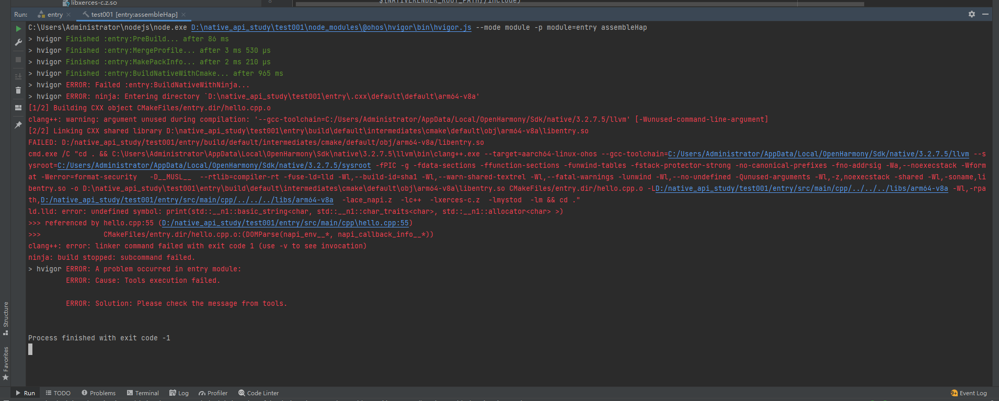
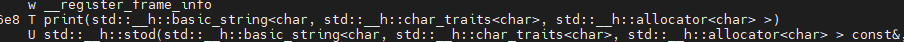
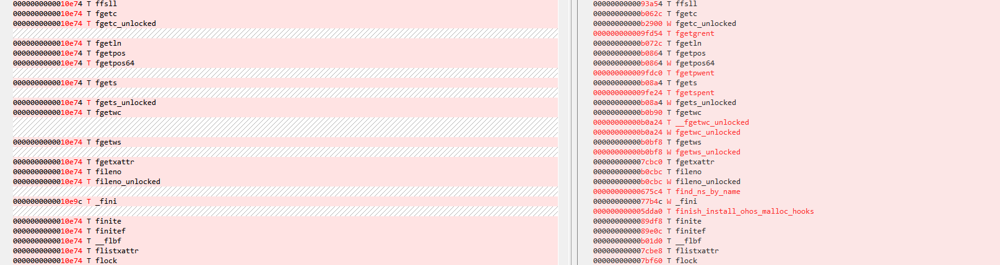

# 应用集成和固件集成中C库差异化分析

## 背景

OpenHarmony中，三方库的使用有两种方式：

### 一、固件集成

三方库经由OpenHarmony构建框架编译出的动态库或静态库，打包到rom中

### 二、应用集成

三方库经由IDE（通过IDE中的cmake）编译出的动态库或静态库，打包到hap包中

有时候我们想直接使用三方库，省略编译构建这个过程，直接将固件集成方式构建出来的二进制动态库在IDE上面使用。在使用过程中我们会发现，有时候编译工程，在工程链接三方库的阶段出现找不到符号导致编译失败的问题。

## 问题分析

### 问题现象

使用固件集成方式构建出来的动态库，直接在IDE上编译链接时，出现如下图现象

如图所示，提示ld.lld: error: undefined symbol: print(std::__n1::basic_string<char, std::__n1::char_traits<char>>, std::__n1::allocator<char> >)

### 分析动态库

由上面现象中提示链接时没有找到对应函数符号，我们分析一下动态库的符号表，查看是否存在该符号

&nbsp;

通过查看动态库的符号表，我们可以发现存在该函数符号，但是参数中的变量命名空间有所区别，IDE中是std::__n1，而固件集成方式编译出来的动态库是std::__h，从这里看出可能是基础库libc++.so或libc.so有所差异

### 分析基础库差异

我们对比一下IDE的SDK和OpenHarmony的sdk中的基础库（libc++.so/libc.so）

首先对比libc++.so的符号表（左：IDE中的libc++，右：OpenHarmony中的libc++）

从上图可以看出函数的命名空间被隔离开了，并且部分函数不一致，是新增的

对比libc.so的符号表（左：IDE中的libc，右：OpenHarmony中的libc）

从上图可以看出部分函数有新增

## 总结

通过以上分析出来的现象，和工具链相关的负责人沟通，命名空间隔离是由工具链这边自己进行隔离的，因为系统侧和ndk侧两边发布版本的节奏不一致，版本不同，如果强行统一会导致api不兼容，数据结构差异等问题。所以固件集成方式构建的库和应用集成构建的库不可以混用。