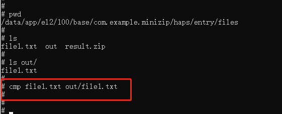

# 在OpenHarmony开发板上验证hap包中集成的C/C++三方库

## 简介

理论上C/C++三方库的测试验证一般使用原生库自带的测试用例进行验证，但OpenHarmony的北向应用调用C/C++三方库是需要通过napi接口实现的，因此对于hap包中集成的C/C++三方库的验证也需要通过开发对应的napi接口来进行验证。<br>
本文通过minizip为例介绍hap包中集成C/C++三方库的验证过程。

## napi接口定义

C/C++三方库napi接口定义一般分2种情况

- 有需求，需求方给出对应的napi接口定义。
- 无需求，根据三方库功能自定义napi接口。

对于自定义的napi接口，需要覆盖主要功能，且需要返回测试的正确结果。对于较为复杂的三方库，我们也可以将原生库的测试用例封装成napi接口，通过应用的调用实现原生库的测试验证。<br>
minizip三方库是无用户需求的，因此我们需要自己定义napi接口进行验证。首先确认该库的功能是对文件进行压缩和解压缩，其次对minizip原生库的测试用例进行分析发现，通过输入不同的参数实现不同能力的压缩和解压缩功能。因此我们可以设计出2个napi接口，一个实现压缩功能，另一个实现解压缩功能。而对于其他能力(如加解密，多文件等)通过传入参数进行实现。具体的接口如下:

```js
export class minizipNapi {
    compress(data:miniProperty):number;         // 实现压缩功能
    decompress(data:miniProperty):number;       // 实现解压缩功能
}
```

其中miniProperty为实现压缩解压缩时的参数，具体内容如下:

```js
export interface miniOptions {
    include_path?:number                // 是否包含路径
    compress_level?:number              // 压缩等级
    compress_method?:number             // 压缩方式
    overwrite?:number                   // 是否覆盖
    append?:number                      // 是否追加
    disk_size?:number                   // 文件大小
    follow_links?:number                // 遵循符号链接
    store_links?:number                 // 存储符号链接
    zip_cd?:number                      // 是否是zip压缩
    encoding?:number                    // 编码方式
    verbose?:number                     // 版本号
    aes?:number                         // 是否需要aes校验
    cert_path?:string                   // 校验文件路径
    cert_pwd?:string                    // 校验密码
}

export interface miniProperty {
    path:string                         // 解/压缩 路径
    password?:string                    // 解/压缩 密码
    operate?:string                     // 压缩/解压缩
    file_extract?:string                // 解压后文件夹名字
    option:miniOptions                  // 属性
    directory?:string                   // 解压缩文件目标路径
    files?:Array<string>                // 压缩文件
}
```

通过以上的2个接口及对应的参数，我们就可以实现类似原生库的测试验证

## 接口测试

我们可以在应用中定义多个按钮，通过点击按钮实现对文件的压缩和解压缩功能。<br>

- 实现正常的文件压缩和解压缩

  ```js
  Button(this.button0Txt)
          .fontSize(50)
          .margin({top:30})
          .fontWeight(FontWeight.Normal)
          .onClick(() => {
  
            if (this.button0 == 0) {      // 压缩功能
              this.button0 = 1;
              this.button0Txt = "decompress"
              if (this.mzip != undefined) {
                console.info("[Minizip]start compress!");
                try {
                  let result = this.mzip.compress({ path: this.dir + "result.zip", operate: "compress", option: { append: 1, compress_level: 9 }, files: [this.dir + "file1.txt"] })
                  if (result == undefined) {  // 压缩失败
                    this.button0 = 0;
                    this.button0Txt = "compress"
                  }
                  console.info("[Minizip]compress result = " + JSON.stringify(result));
                }catch(e) {
                  console.info("[Minizip] error : " + JSON.stringify(e));
                }
              }else {
                console.info("[Minizip] mzip is undefined!");
              }
            } else {              // 解压功能
              this.button0 = 0;
              this.button0Txt = "compress"
              if (this.mzip != undefined) {
                console.info("[Minizip]start decompress!");
                let result = this.mzip.decompress({path:this.dir + "result.zip", operate:"decompress", option:{overwrite:1, compress_level:9}, directory:this.dir + "out"})
                if (result == undefined) {  // 压缩失败
                    this.button0 = 0;
                    this.button0Txt = "decompress"
                  }
                console.info("[Minizip]compress result = " + JSON.stringify(result));
              } else {
                console.info("[Minizip] mzip is undefined!");
              }
            }
          })
  ```

  在这我们可以看到，普通的压缩功能我们只需要设置被压缩的文件(files1.txt)以及生成的目标文件(result.zip)，压缩方式以及压缩等级。其中被压缩文件和生成的目标文件都必须带有绝对路径，该路径的获取方式'this.dir = globalThis.abilityContext.filesDir + "/"'，对应开发板上的具体路径为'/data/app/el2/100/base/com.example.minizip/haps/entry/files'.

- 实现带密码的压缩和解压缩 <br>
  如果需要实现带密码的压缩的话，我们在普通的压缩基础上加上密码属性即可。
  
  ```js
  // 实现带密码的压缩，密码为test
  let result = this.mzip.compressWithPsd({path:this.dir + "result1.zip", password:"test", operate:"compress", option:{overwrite:1,compress_level:9}, files:[this.dir + "file1.txt"]})

  // 实现带密码的解压缩，密码为 test
  let result = this.mzip.decompressWithPsd({path:this.dir + "result1.zip", password:"test", operate:"decompress", option:{overwrite:1, compress_level:9}, directory:this.dir + "out"})
  ```

  以此类推，我们可以根据各个参数的意义进行不同能力的压缩和解压缩功能测试验证。

## 测试结果验证

测试验证的结果我们可以根据返回值显示到屏幕上，这样比较直观,如：

```js
this.button0Txt = "compress"
if (result == undefined) {  // 压缩失败
    this.button0 = 0;
    this.button0Txt = "compress"
}
```

压缩成功，我们按钮上显示为'decompress'(即压缩成功后，下一次按下按钮执行解压缩功能)，而如果失败则还是显示为'compress'。当然除了程序中通过返回结果进行判断测试结果，我们还需要将实际的压缩文件拷贝出来验证压缩的正确性。解压后的文件可以直接通过cmp命令将其与被压缩的文件进行比较来验证功能的正确性。<br>


## 参考资料

- [OpenHarmony知识体系](https://gitee.com/openharmony-sig/knowledge)
