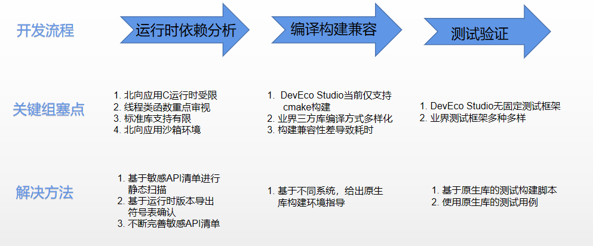

# OpenHarmony C/C++三方库移植适配指导说明

## 简介

众所周知，C/C++三方库相对与JS/ETS的三方组件来说，其运行效率高。那如何将一个C/C++三方库移植到OH系统上呢？本文将介绍如何快速高效的移植一个C/C++三方库到OpenHarmony上。

## C/C++三方库适配问题与解决方案



 由上图可以看出，三方库移植的流程以及现状。

### 三方库运行时依赖分析

针对运行时依赖的分析，我们开发了对应的[C/C++三方库风险识别工具](https://gitee.com/han_jin_fei/e2e/tree/master/thirdparty_compare)，通过该工具可以扫描出三方库是否有对NDK，OpenGL等接口的依赖，以及是否有bionic的C库接口的依赖等。该工具可以让我们快速的对一个C/C++三方库进行风险识别。

工具的使用请参照[C/C++三方库风险识别工具使用方法](https://gitee.com/han_jin_fei/e2e/tree/master/thirdparty_compare#%E4%BD%BF%E7%94%A8%E6%96%B9%E6%B3%95).

### 三方库编译构建

OpenHarmony的应用编译开发使用的是[DevEco Studio](https://developer.harmonyos.com/cn/develop/deveco-studio#download)，而该工具目前只支持cmake的编译，但开源的C/C++三方库编译方式多样化，包含cmake，configured等方式。对于原生库cmake无法在IDE上编译构建的，我们需要分析问题原因并需要针对IDE修改原生CMakeLists.txt。而非cmake编译方式的三方库，我们也需要分析该库的编译方式进行手写CMakeLists.txt文件将该库编译方式改为cmake编译构建。这些过程比较耗时，尤其对一些大型的C/C++三方库.

针对于这些问题，我们开发一套基于linux下用原生库的编译脚本进行交叉编译三方库的[工具](../lycium/README.md)。该工具协助开发者，在 linux系统上快速编译构建能在OpenHamony上运行的c/c++ 三方库。

### 三方库测试验证

业界内C/C++三方库测试框架多种多样，我们无法将其统一，因此为了保证原生库功能完整，我们基于原生库的测试用例进行测试验证。为此，我们需要集成了一套可以在OH环境上进行make test等操作的环境，具体方法可参照：
[CItools 介绍](../lycium/CItools/README_zh.md)

### 三方库的使用

将编译好的三方库以及对应的头文件拷贝到应用工程对应的`CPP`目录，或将三方库拷贝到对应的`工程/entry/libs/armxx/`目录，头文件拷贝到`工程/entry/include`目录。目前建议使用第一种方式，即将三方库以及对应的头文件拷贝到`CPP`目录。

## 快速适配三方库实例

我们可以通过[工具](../lycium/README.md)在 linux系统上快速编译构建能在OpenHamony上运行的c/c++ 三方库，该现在支持cmake以及config及make等构建方式，下面以minizip-ng三方库为例详细讲解lycium工具的使用。

### 使用约束

- OpenHarmony SDK版本: Ohos_sdk_public 3.2.11.9
- API版本:  API Version 9 Release
- DevEco Studio版本: 3.1.0.400

### 环境搭建

- 工具下载：[工具](../lycium)
- 环境搭建参照[编译环境搭建](../lycium/Buildtools/README.md)
- OpenHarmony SDK版本下载地址: [Ohos_sdk_public 3.2.11.9 (API Version 9 Release)](https://gitee.com/link?target=https%3A%2F%2Frepo.huaweicloud.com%2Fopenharmony%2Fos%2F3.2-Release%2Fohos-sdk-windows_linux-public.tar.gz)

### 编译脚本规则

工具编译脚本模板如下:

```shell
# Contributor: Your Name <youremail@domain.com>
# Maintainer: Your Name <youremail@domain.com>

pkgname=NAME # 库名(必填)
pkgver=VERSION # 库版本(必填)
pkgrel=0 # 发布号，默认为0
pkgdesc="" # 库描述
url="" # 库的官网链接
archs=("armeabi-v7a" "arm64-v8a") # cpu 架构, 默认编译2种架构
license=()  # 库的开源协议
depends=() # 依赖库的目录名 必须保证被依赖的库的archs是当前库的archs的超集,有依赖时必须填写相应的依赖
makedepends=() # 构建库时的依赖工具
source="https://downloads.sourceforge.net/$pkgname/$pkgname-$pkgver.tar.gz" # 库源码下载链接(必填)

downloadpackage=true # 是否自动下载压缩包，默认true;如果为 false 则需要用户在 prepare 函数中自行下载(如代码只能通过git clone下载(项目中依赖 submoudle)等特殊情况)
autounpack=true # 是否自动解压，默认 true, 如果为 false 则需要用户在 prepare 函数中自行解压
buildtools= # 编译方法, 暂时支持cmake, configure, make等, 根据原生库的编译构建方式填写.(必填)

builddir= # 源码压缩包解压后目录名(必填)
packagename=$builddir.tar.gz # 压缩包名,保持该默认值

# 编译前准备工作，如设置环境变量，创建编译目录等
prepare() {
  mkdir -p $builddir/$ARCH-build
}

# 执行编译构建的命令
build() {
}

# 安装打包
package() {
    cd $builddir/$ARCH-build
    make install
    cd $OLDPWD
}

# 测试，需要在 ohos 设备上进行
check() {
    echo "The test must be on an OpenHarmony device!"
}

# 清理环境
cleanbuild() {
  rm -rf ${PWD}/$builddir #${PWD}/$packagename
}
```

每个编译脚本都需要按照该规则定义相应的变量以及对应的5个函数，其中变量标明必填是每个库根据库信息必须填写正确，否则导致编译失败，其他变量无初始值的建议根据库信息也填写，方便后期维护。</br>
函数说明：

- prepare 函数

  编译前准备工作，主要包含:

  1. 创建编译目录(推荐根据不同架构创建不同编译目录，即使用模板默认方式即可)
  2. 设置环境变量(根据不同的编译构建方式进行设置)
  3. 下载源码(downloadpackage=false，推荐使用框架下载）
  4. 解压源码包(下载的是源码包且autounpack=fasle，推荐使用框架解压)
  5. 对于编译时需要做特殊修改(如编译时需要对编译脚本进行打patch操作等)

- build 函数

  三方库的编译构建函数，makefile生成以及执行make指令。该函数需要根据原生库的构建方式进行配置，不同编译构建基本模板如下：

  1. cmake

     ```shell
     build() {
         cd $builddir  ## 进入到编译目录
         ${OHOS_SDK}/native/build-tools/cmake/bin/cmake $* -DOHOS_ARCH=$ARCH -B$ARCH-build -S./ -L  ## 执行cmake，配置相应的变量并生成Makefile文件
         make -j4 -C $ARCH-build  ## 执行make指令，生成对应的库文件以及可执行用例
         ret=$?    ## 记录make执行的返回值
         cd $OLDPWD  ## 返回进入编译目录前的路径
         return $ret    ## 返回make的返回值
     }
     ```

     变量说明：</br>
     1) 其中 OHOS_SDK是 ohos sdk的安装路径，在执行编译前需要设置。  </br>
     2) `$*`代表的参数：`-DCMAKE_FIND_ROOT_PATH="..." -DCMAKE_TOOLCHAIN_FILE="..." -DCMAKE_INSTALL_PREFIX="..." 依赖库的搜索路径,toolchain file 路径,安装路径`  </br>
     3) -DOHOS_ARCH 代表当前的编译架构  </br>
     4) -B 代表编译路径 </br>
     5) -S 代表源码路径 </br>
     6) 其他特殊设置需要根据库自身情况在cmake后面进行添加。 </br>
  2. configure

     ```shell
     build() {
       cd $builddir/$ARCH-build
       ../configure $*>> `pwd`/build.log 2>&1   ## 执行configure，配置相应的变量并生成Makefile文件
       make -j4 >> `pwd`/build.log 2>&1
       ret=$?
       cd $OLDPWD
       return $ret
     }
     ```

     变量说明：</br>
     1) `$*`代表的参数：`库的安装路径`  </br>
     2) 其他特殊设置需要根据库自身情况在configure后面进行添加。

  3. make

     ```shell
     make CC=${cc} AR=${ar} RANLIB=${ranlib} -j4 >> `pwd`/build.log 2>&1
     ```

     变量说明：</br>
     1) 其中CC，AR，RANLIB等变量根据原生库Makefile文件中变量来设定，其值可在prepare函数中设定。

- package 函数

  三方库安装打包函数，该函数只需在编译目录直接执行`make install`即可。对于不支持`make install`的三方库，需要在该函数中手动安装三方库文件以及头文件等(将对应文件通过cp命令拷贝到对应的安装路径下面)

- check 函数

  该函数实现了测试准备以及测试说明。对于在目标机器上测试需要生成的测试用例或对于测试需要做修改的，可以在该接口中实现，并需要在该函数中说明在目标机器上运行测试的方法 。真正的测试需要在目标机器上进行。

- cleanbuild 函数

  该函数主要清理当前库的编译环境。

编译脚本模板更多信息可以参照[HPKBUILD](../lycium/template/HPKBUILD)。

### minizip快速适配

通过对minizip-ng三方库的分析，我们可以知道，该库依赖了openssl，lzma，bzip2，libz，zstd以及googletest等诸多其他的三方库，我们可以选择需要依赖的三方库，关闭不依赖的三方库，此例中我们选择lzma，openssl以及bzip2为依赖进行说明，而这3个依赖库的编译方式分别是cmake，configure以及make。

- 在thirdparty目录下创建minizip-ng三方库目录，以及对应的xz(该库编译完后会生成liblzma.a以及对应的liblzma.so)，openssl和bzip2.
  
  ``` shell
  cd thirdparty
  mkdir minizip-ng
  mkdir xz
  mkdir openssl
  mkdir bzip2
  ```

- 参照编译脚本规则编写对应库的HPKBUILD脚本

- xz三方库的HPKBUILD脚本  </br>
  xz库的编译构建方式是cmake编译构建，所以我们需要设置的基本变量信息：

  ```shell
  pkgname=xz  ## 库名
  pkgver=5.4.1 ## 库的版本号
  source="https://tukaani.org/$pkgname/$pkgname-$pkgver.tar.gz" ## 库的源码包路径
  buildtools="cmake"  ## xz库编译构建方式为cmake

  builddir=$pkgname-${pkgver} ## xz源码包解压后的文件夹名
  ```
  
  其他变量保持默认配置即可。cmake编译方式交叉编译环境变量是通过toolchain文件进行配置，因此在prepare时无需设置环境变量，只需要创建一个对应架构的编译路径即可：

   ```shell
  prepare() {
    mkdir -p $builddir/$ARCH-build
  }
  ```

  xz库编译时需要配置编译类型以及设置编译动态库，因此在cmake后面添加了对应的配置：-DCMAKE_BUILD_TYPE=Release -DBUILD_SHARED_LIBS=ON，因此build函数需要如下修改:
  
  ```shell
  build() {
    cd $builddir
    ${OHOS_SDK}/native/build-tools/cmake/bin/cmake $* -DCMAKE_BUILD_TYPE=Release -DBUILD_SHARED_LIBS=ON -DOHOS_ARCH=$ARCH -B$ARCH-build -S./ -L > `pwd`/$ARCH-build/build.log 2>&1
    make -j4 -C $ARCH-build >> `pwd`/$ARCH-build/build.log 2>&1
    ret=$?
    cd $OLDPWD
    return $ret
  }
  ```

  xz原生库测试是通过make test进行测试，对于在目标机上测试无需做其他修改，因此在check函数中只需说明测试方法即可“

  ```shell
  check() {
    echo "The test must be on an OpenHarmony device!"
    # real test CMD
    # 将编译目录加到 LD_LIBRARY_PATH 环境变量或者进入到编译目录
    # make test
  }
  ```

​  其他函数可使用模板默认即可。xz完整编译脚本:[xz HPKBUILD](../thirdparty/xz/HPKBUILD)

- openssl编译构建脚本HPKBUILD编写    </br>

  openssl库的编译构建方式是configure编译构建，因为 configure交叉编译是需要配置host类型的，且需要配置对应的环境变量，框架中基成了环境变量设置的接口，封装在`envset.sh` 中，因此我们除了基本信息外，还需要定义一个host变量以及导入`envset.sh`文件，基本变量信息修改如下：

  ```shell
  pkgname=openssl  ## 库名
  pkgver=OpenSSL_1_1_1t ## 库的版本号
  source="https://github.com/openssl/$pkgname/archive/refs/tags/$pkgver.zip" ## 库的源码包路径
  buildtools="configure"  ## 编译方式为configure
  
  builddir=$pkgname-${pkgver} ## openssl 源码包解压后的文件夹名

  source envset.sh      ## 导入envset.sh
  host=
  ```
  
  相比cmake编译方式，configure方式中的prepare()函数除了创建编译目录外，还需要配置对应架构的环境变量
  
  ```shell
  prepare() {
    mkdir -p $builddir/$ARCH-build
    if [ $ARCH == ${archs[0]} ]
    then
      setarm32ENV
      host=linux-generic32
    fi
    if [ $ARCH == ${archs[1]} ]
    then
      setarm64ENV
      host=linux-aarch64
    fi
  }
  ```
  
  build()函数使用configure命令生成Makefile并执行make指令：
  
  ```shell
  build() {
    cd $builddir/$ARCH-build
    ../Configure $* $host > `pwd`/build.log 2>&1
    make -j4 >> `pwd`/build.log 2>&1
    ret=$?
    cd $OLDPWD
    return $ret
  }
  ```
  
  openssl测试时需要单独通过编译目标depend生成测试用例，因此我们还需要修改对应的check()函数，在check函数中执行 make depend，并在执行完后清理对应的环境变量，而且在该函数后面通过注释说明该库在目标机上的测试方法。
  
  ```shell
  check() {
      cd $builddir/$ARCH-build
      make depend >> `pwd`/build.log 2>&1
      cd $OLDPWD
      if [ $ARCH == ${archs[0]} ]
      then
          unsetarm32ENV
      fi
      if [ $ARCH == ${archs[1]} ]
      then
          unsetarm64ENV
      fi
      unset host
      echo "Test must be on an OpenHarmony device!"
      # real test CMD
      # 将编译目录加到 LD_LIBRARY_PATH 环境变量
      # make test
    }
  ```
  
  其他函数可使用模板默认的即可。openssl完整编译脚本[openssl  HPKBUILD](../thirdparty/openssl/HPKBUILD).

- bzip2三方库的HPKBUILD脚本
  
  bzip2原生库提供了Makefile，其编译构建方式就是make，对此我们需要分析原生库的Makefile，了解该库交叉编译需要设置哪些变量。对于bzip2库我们分析其交叉编译时只需要设置CC，AR和RANDLIB三方变量即可，因此我们在配置基本信息时需要额外定这三个变量：

  ```shell
  pkgname=bzip2  ## 库名
  pkgver=1.0.6 ## 库的版本号
  source="https://sourceforge.net/projects/$pkgname/files/$pkgname-$pkgver.tar.gz" ## 库的源码包路径
  buildtools="make"  ## 编译方式为make
  
  builddir=$pkgname-${pkgver} ## openssl 源码包解压后的文件夹名

  cc=
  ar=
  ranlib=
  ```

  三个变量需要根据编译架构进行赋值，我们在prepare函数中执行即可:

  ```shell
  prepare() {
    cp -rf $builddir $builddir-$ARCH-build  ## 为了保留构建环境(方便测试)。因此同一份源码在解压后分为两份,各自编译互不干扰
    cd $builddir-$ARCH-build
    if [ $ARCH == ${archs[0]} ]
    then
      cc=${OHOS_SDK}/native/llvm/bin/arm-linux-ohos-clang
      ar=${OHOS_SDK}/native/llvm/bin/llvm-ar
      ranlib=${OHOS_SDK}/native/llvm/bin/llvm-ranlib
    fi
    if [ $ARCH == ${archs[1]} ]
    then
      cc=${OHOS_SDK}/native/llvm/bin/aarch64-linux-ohos-clang
      ar=${OHOS_SDK}/native/llvm/bin/llvm-ar
      ranlib=${OHOS_SDK}/native/llvm/bin/llvm-ranlib
    fi
    cd $OLDPWD # 1> /dev/null
  }
  ```

  编译时，我们需要将Makefile中需要的三个变量做为参数传入即可，而通过分析Makefile时知道，在执行make all时会执行make test测试导致make失败，因此我们也需要在make时指定需要编译的目标：

  ```shell
  build() {
    cd $builddir-$ARCH-build
    make CC=${cc} AR=${ar} RANLIB=${ranlib} -j4 libbz2.a bzip2 bzip2recover > `pwd`/build.log 2>&1
    ret=$?
    cd $OLDPWD
    return $ret
  }
  ```

  因为check函数无需做任何编译相关的动作，因此我们在package安装打包后需要清空对应的变量，而check函数只需要注释测试说明：

  ```shell
  package() {
    cd $builddir-$ARCH-build  # 进入到编译目录
    make install PREFIX=$LYCIUM_ROOT/usr/$pkgname-$ARCH-install >> `pwd`/build.log 2>&1 # 执行安装动作，此时需要配置对应的安装路径
    cd $OLDPWD
    unset cc ar ranlib      # 清空变量
  }
  check() {
      echo "Test must be on an OpenHarmony device!"
      # real test CMD
      # 将编译目录加到 LD_LIBRARY_PATH 环境变量或进入到编译目录：
      # make test
  }
  ```
  
  该库清理环境和之前库不一样，因为在prepare时是拷贝了对应的目录，因此清理时需要把拷贝的目录也删除：
  
  ```shell
  cleanbuild(){
    rm -rf ${PWD}/$builddir $builddir-armeabi-v7a-build  $builddir-arm64-v8a-build #${PWD}/$packagename
  }
  ```

  bzip完整的编译脚本可以参照:[bzip2 HPKBUILD](../thirdparty/bzip2/HPKBUILD)

- minizip-ng三方库的HPKBUILD脚本
  
  minizip-ng三方库的编译方式是通过cmake，而且该库依赖了多个库，此时除了基本信息外，我们还需要填写其依赖库：

  ```shell
  pkgname=minizip-ng  # 库名
  pkgver=3.0.4        # 库版本
  depends=("xz" "openssl" "bzip2")  # minizip依赖的库
  source="https://github.com/zlib-ng/${pkgname}/archive/refs/tags/${pkgver}.tar.gz" # 库源码包链接
  buildtools="cmake"  # cmake编译方式

  builddir=$pkgname-${pkgver} # 源码包解压后名字
  ```
  
  函数设计中，build函数需要设置多个参数，其中包含

  1) 设置openssl依赖路径，因为openssl是通过configure编译的，其依赖路径必须通过PKG_CONFIG_PATH设置。
  2) 关闭一些未准备好的依赖库

  ```shell
  build() {
    cd $builddir
    ## 此处将依赖库iconv以及zstd屏蔽，如有强制需求可以将此2库定义为true并在depends中加上这2个库的依赖
    PKG_CONFIG_PATH=${LYCIUM_ROOT}/usr/openssl-${ARCH}-install/lib/pkgconfig ${OHOS_SDK}/native/build-tools/cmake/bin/cmake $* -DMZ_ZSTD=false -DMZ_ICONV=false -DOHOS_ARCH=$ARCH -B$ARCH-build -S./ -L > `pwd`/$ARCH-build/build.log 2>&1
    make -j4 -C $ARCH-build >> `pwd`/$ARCH-build/build.log 2>&1
    ret=$?
    cd $OLDPWD
    return $ret
  }
  ```

  minizip 原生库未提供测试框架，因此无需在check中说明，其他函数使用模板默认即可。minizip-ng完整的编译脚本参照：[Minizip-ng HPKBUILD](../thirdparty/minizip-ng/HPKBUILD)

### minizip编译构建

编写完HPKBUILD文件后，我们就可以进行三方库的编译了。在`lycium`目录执行如下指令进行编译：

```shell
./build.sh minizip-ng xz bzip2 openssl googletest
```

其中minizip-ng是我们需要编译的三方库，而xz，bzip2,openssl以及googletest是minizip-ng三方库的依赖库。进行编译完后，会在`lycium/usr`下生成对应架构的三方库的的库文件和头文件等。

```shell
minizip-ng/arm64-v8a minizip-ng/armeabi-v7a 
  # 依赖库
openssl/arm64-v8a openssl/armeabi-v7a xz/arm64-v8a xz/armeabi-v7a zstd/arm64-v8a zstd/armeabi-v7a bzip2/arm64-v8a bzip2/armeabi-v7a
```

注意：

- 有依赖库的必须将依赖库一起编译，否则框架无法进行编译。
- 安装目录下对应的三方库有2份，其中armeabi-v7a对应的32位的库，arm64-v8a对应的是64位的库。

### minizip在应用中的使用

minizip在应用中使用请参考文档[minizip 集成到应用hap](../thirdparty/minizip-ng/docs/hap_integrate.md)
