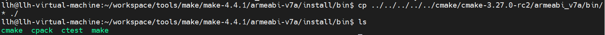
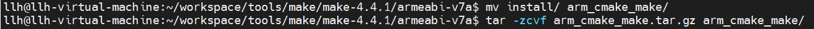
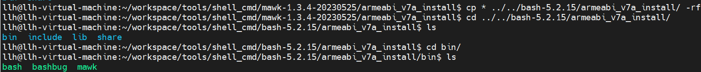
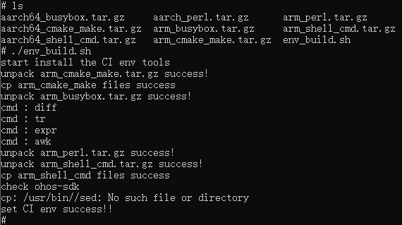
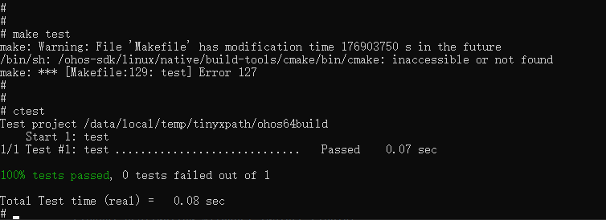
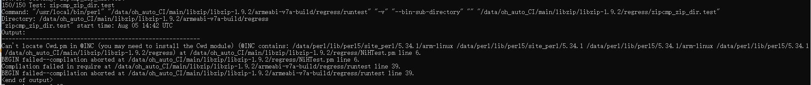
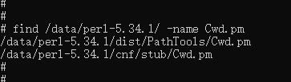

# CI环境搭建

## 搭建步骤

CI环境搭建首先我们要明确需要的工具，然后再下载工具源码，编译安装完成后，配置到ohos设置中。下面先来介绍工具源码编译部分

### 工具源码编译

三方库测试主要是make test，ctest等测试命令，因此需要集成make、cmake等工具，如下列表即是工具源码编译指导文档，按照文档操作可以成功编译出二进制文件，当然我们也提供了已经编译好的二进制文件，请点击[下载链接](https://gitee.com/han_jin_fei/lycium-citools) 。有了二进制文件后，我们来进行环境搭建

| 工具名称  | 32位编译指导文档路径                                         | 64位编译指导文档路径                                         | X86编译指导文档路径                                              |
| :-------- | ------------------------------------------------------------ | ------------------------------------------------------------ | ------------------------------------------------------------ |
| cmake     | [cmake_armeabi_v7a](./cmake/cmake_armeabi_v7a_compilation_instructions.md) | [cmake_arm64_v8a](./cmake/cmake_arm64_v8a_compilation_instructions.md) | [cmake_x86_64](./cmake/cmake_x86_64_compilation_instructions.md) |
| make      | [make_armeabi_v7a](./make/make_armeabi-v7a_Compilation_instructions.md) | [make_arm64_v8a](./make/make_arm64_v8a_Compilation_instructions.md) | [make_x86_64](./make/make_x86_64_compilation_instructions.md) |
| busybox   | [busybox_armeabi_v7a](./busybox/busybox_armeabi-v7a_Compilation_instructions.md) | [busybox_arm64_v8a](./busybox/busybox_arm64_v8a_Compilation_instructions.md) | [busybox_x86_64](./busybox/busybox_x86_64_compilation_instructions.md) |
| perl      | [perl_armeabi_v7a](./perl/perl_armeabi-v7a_Compilation_instructions.md) | [perl_arm64_v8a](./perl/perl_arm64_v8a_Compilation_instructions.md) | [perl_x86_64](./perl/perl_x86_64_compilation_instructions.md) |
| shell_cmd | [shell_cmd_armeabi_v7a](./shell_cmd/shell_cmd_armeabi_v7a_Compilation_instructions.md) | [shell_cmd_arm64_v8a](./shell_cmd/shell_cmd_arm64_v8a_Compilation_instructions.md) | [shell_cmd_x86_64](./shell_cmd/shell_cmd_x86_64_compilation_instructions.md) |

### 手动搭建环境

工具编译完成后，将生成的二进制文件拷贝到ohos 设备，配置测试环境。以 arm32位系统为例

- 工具编译安装完成后，打包拷贝出编译安装目录，修改安装目录文件名，以 armeabi_v7a为例可统一修改为：

  arm_cmake_make.tar.gz 、arm_busybox.tar.gz、arm_perl.tar.gz、arm_shell_cmd.tar.gz 

  如：按照指导文档编译安装完cmake后，安装目录是armeabi_v7a，make编译安装目录是install，通过如下命令统一打包为arm_cmake_make.tar.gz

  ```shell
  #将cmake和make工具合并,拷贝cmake安装目录下的bin文件夹中的文件，到make安装目录
  cp armeabi_v7a/bin/* ./install/bin
  #修改安装目录文件名
  mv install arm_cmake
  #压缩安装目录
  tar -zcvf arm_cmake.tar.gz  arm_cmake
  ```

​	   其他的工具也需要修改一下安装目录文件名，然后进行打包压缩

- 将工具包上传进 ohos 设备 /data 目录

  ```shell
  #发送到OHOS系统开发板上
  hdc file send xxx\arm_cmake_make.tar.gz /data 
  hdc file send xxx\arm_busybox.tar.gz /data 
  hdc file send xxx\arm_perl.tar.gz /data 
  hdc file send xxx\arm_shell_cmd.tar.gz /data 
  ```

- 进入 ohos 设备，手动配置环境

  ```shell
  #根目录挂载 读写权限
  mount -o remount,rw /
  #创建 /usr 目录
  mkdir /usr
  #进入 /data 目录
  cd /data
  #解压所有工具压缩包
  tar -zxvf *.tar.gz
  #拷贝 cmake make perl shell 工具二进制到 /usr 目录
  cp -rf arm_cmake_make/* /usr
  cp -rf arm_perl/* /usr
  cp -rf arm_shell_cmd/* /usr
  #验证
  cmake -version 
  make -v 
  perl -v
  #拷贝 busybox 工具到 /bin
  cp -rf arm_busybox/bin/busybox /bin
  #将 toybox 替换为 busybox
  cd /bin
  mv toybox toybox_bak
  #toybox 被改为 toybox_bak 后, 导致原来的命令无法直接使. 需要采用 "toybox_bak xxxcmd" 的模式使用, 如下
  toybox_bak mv busybox toybox
  #验证
  diff -v 
  #toybox 原本是不支持 diff 命令,这里可以直接使用diff是因为, toybox已经创建了diff的软连接, 但是toybox并没有真正实现. 因此替换为我们编译的busybox
  #基本的环境搭建完成
  ```

### 自动搭建环境

将编译完成二进制文件压缩打包后，运行./env_build.sh脚本进行自动安装

- arm32位打包为：arm_cmake_make.tar.gz 、arm_busybox.tar.gz、arm_perl.tar.gz、arm_shell_cmd.tar.gz 

- arm64位打包为：aarch64_cmake_make.tar.gz 、aarch64_busybox.tar.gz、aarch64_perl.tar.gz、aarch64_shell_cmd.tar.gz 

- cmake_make需要把cmake和make编译安装目录统一

  &nbsp;

  &nbsp;

- shell_cmd也需要把bash和mawk这两个命令的编译安装目录统一

  &nbsp;

- 最后通过hdc工具将所有二进制文件和自动安装脚本发送到ohos设置，执行./env_build.sh安装脚本，有如下打印后表示安装成功

  &nbsp;

## FAQ

### cmake FAQ

- cmake构建项目测试时可能出现的问题以及解决方案：

  cmake 及相关工具我们默认安装在 /usr/bin 路径下, 因为编译时使用的 cmake 是 ohos sdk 内的 cmake, 而运行 make test 是在测试机上，测试机不存在ohos sdk, 因此在运行 make test 时会出现, cmake 路径找不到的情况。

- 解决方案1: 对于 cmake 编译的项目直接执行 ctest 测试, 不使用 "make test" 执行测试

  &nbsp;

- 解决方案2: "cp -rf aarch64_cmake_make/* xxxdir" xxxdir 为报错日志要找的 cmake 路径

### perl FAQ

- perl 执行程序可能出现的问题以及解决方案

  部分库在测试时, 会调用 perl 脚本. perl 工具我们在前面已经安装, 但是 perl 在运行时会依赖一些 perl 源码中的脚本, 这些脚本没有被很好的安装. 因此 perl 在运行时, 有可能会出现加载失败的问题.

- 问题现象:

  perl 无法加载 xxx.pm (这里pm文件是源码提供的 perl 脚本文件). 需要找到 xxx.pm 并拷贝到指定的目录(图片中 @INC contains: 指定的目录随便挑一个, 假如使用第一个, 就要找到 xxx.pm 然后拷贝到 /data/perl/lib/perl5/site_perl/5.34.1/arm-linux **注意我这里的截屏是在arm 32位oh设备的**)

  &nbsp;

- 解决方案1：

  使用 find 命令在, perl-5.34.1 源码中. 搜索 xxx.pm. 如果找到多个, 优先 dist 目录的.将找到的 pm 文件拷贝到 /data/perl/lib/perl5/site_perl/5.34.1/arm-linux 目录. **注意有些pm文件可能带有目录. 则需要先判断 /data/perl/lib/perl5/site_perl/5.34.1/arm-linux 是否存在目录, 如果没有则需要创建目录后再拷贝. 同样在 find 时也优先使用前缀目录一样的 pm 文件**

  &nbsp;

- 解决方案2

  使用[下载链接](https://gitee.com/han_jin_fei/lycium-citools)提供的 perl5 库目录替换

  ```shell
  # 使用中如果报 perl 找不到 pm 文件错误，请执行以下两行，替换 perl5 目录
  # 进入 /data 目录
  rm -rf perl/lib/perl5
  mv perl5 perl/lib
  ```
