# busybox 工具armeabi-v7a交叉编译说明

## 简介
BusyBox:嵌入式Linux的瑞士军刀。

本文档主要介绍其arm32位交叉编译步骤

## 编译步骤

### 编译工具链下载

- 32位编译工具：gcc-linaro-7.5.0-2019.12-x86_64_arm-linux-gnueabi.tar.xz [下载链接](https://releases.linaro.org/components/toolchain/binaries/7.5-2019.12/arm-linux-gnueabi/gcc-linaro-7.5.0-2019.12-x86_64_arm-linux-gnueabi.tar.xz)

### 解压编译工具链

- 解压32位tar xvJf gcc-linaro-7.5.0-2019.12-x86_64_arm-linux-gnueabi.tar.xz


- 进入解压后的文件夹，查看bin目录下就有我们编译用到的工具链

### 下载解压make源码

- 下载最新版本busybox源码 https://busybox.net/downloads/busybox-1.36.1.tar.bz2 (以1.36.1为例)
- 通过tar命令解压源码 tar xvf busybox-1.36.1.tar.bz2

- 进入源码解压后目录  cd busybox-1.36.1

### 设置交叉编译环境

- 通过make menuconfig 设置32位交叉编译环境
- 首先要安装 sudo apt-get install libncurses5-dev，确保可以看到配置界面
- make menuconfig 执行后展示界面如下, 选择Setting进入

&nbsp;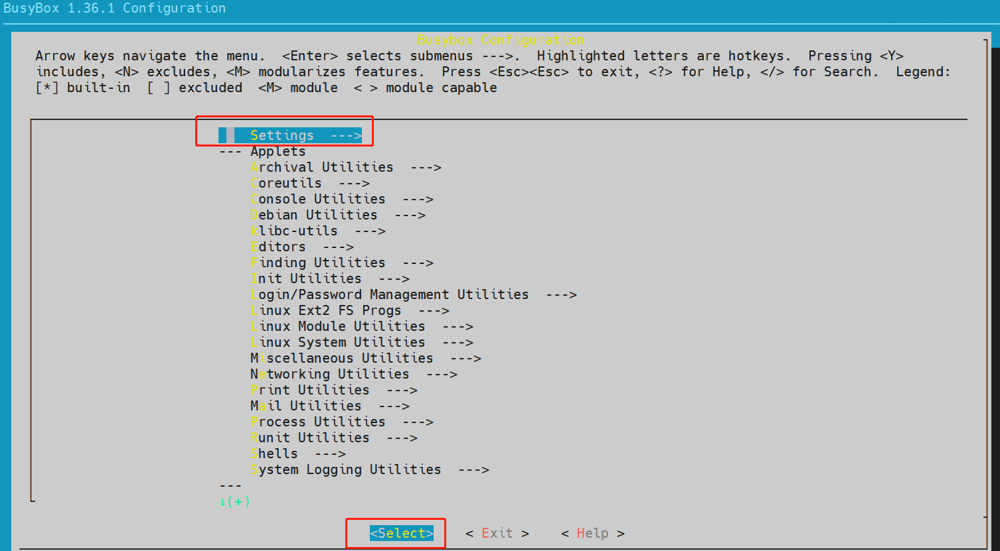

- 通过下方向键，选择---Build Options 里面的Build static binary选项

&nbsp;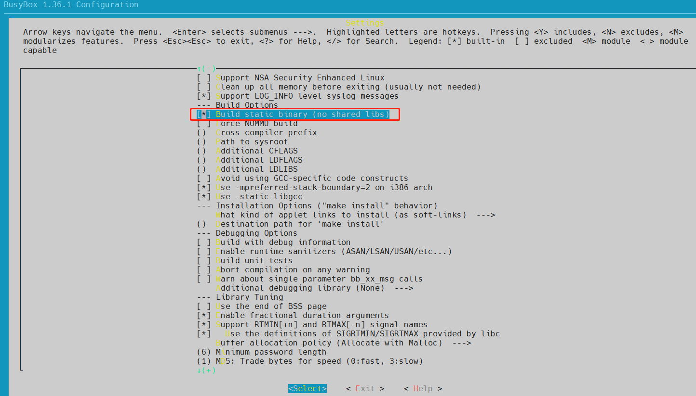

- 通过下方向键，选择---Build Options 里面的Cross compiler prefix选项

&nbsp;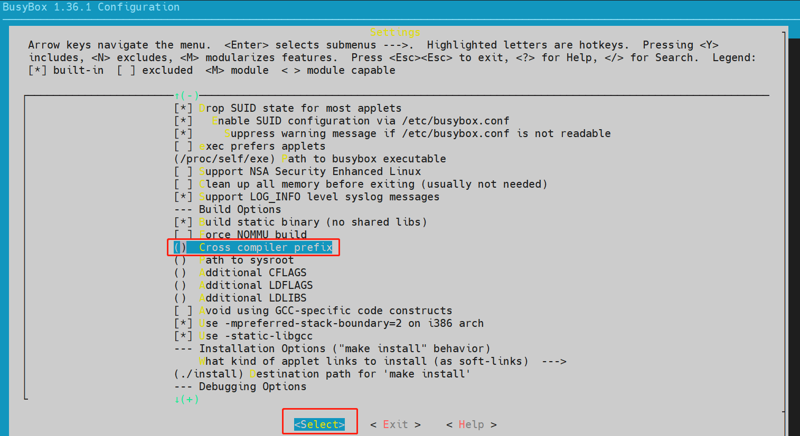

- 进入后输入 /xxx/gcc-linaro-7.5.0-2019.12-x86_64_arm-linux-gnueabi/bin/arm-linux-gnueabi- ，xxx 是表示工具链存放的目录路径

&nbsp;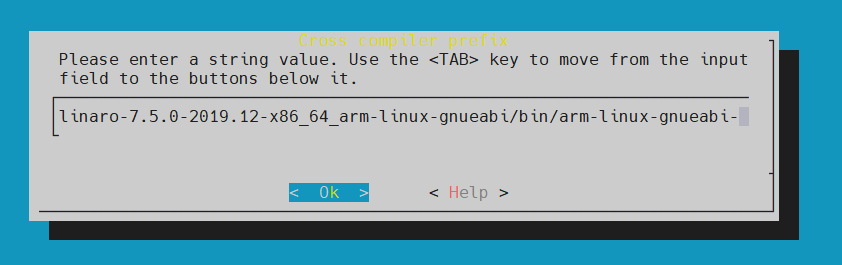

- 选择OK后，界面如下图所示

&nbsp;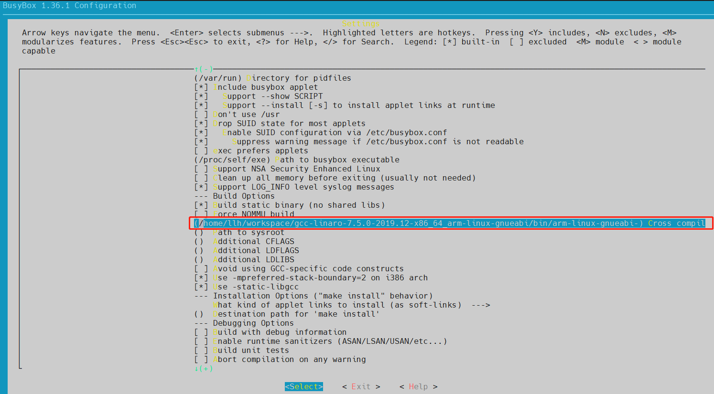

- 通过下方向键，选择---Installation Options 里面的Destination path for 'make install'选项，通过Shift+Backspace删除原来的路径，设置为armeabi_v7a_install

&nbsp;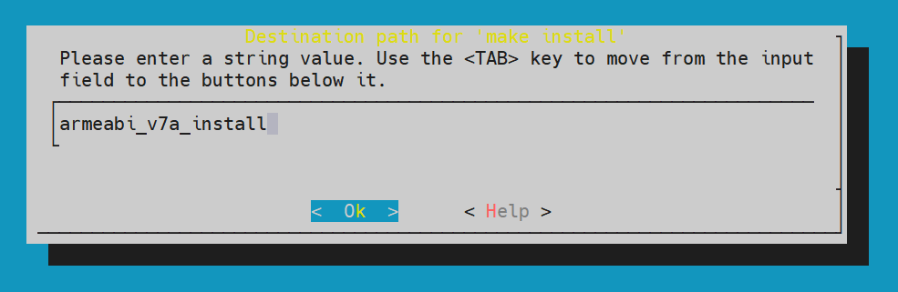

- 选择OK后，界面如下图所示

&nbsp;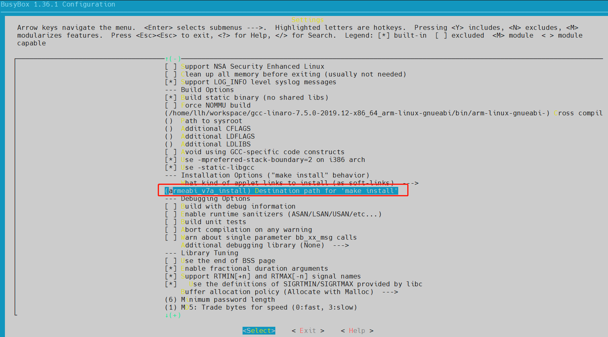

- 通过右方向键，选择Exit 退出设置，回到如下界面

&nbsp;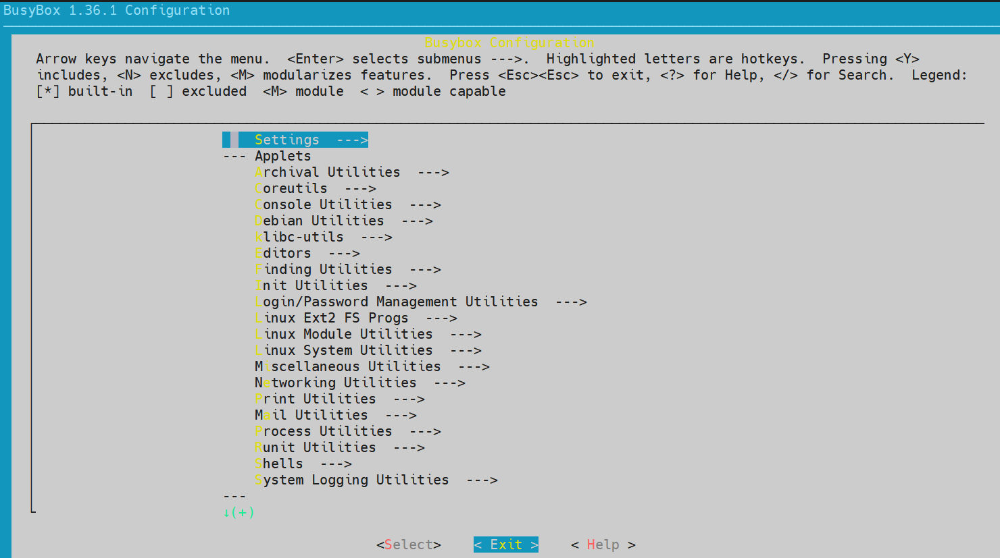

- 再通过右方向键，选择Exit 退出设置，展示如下页面，选择Yes保存配置

&nbsp;


### 编译busybox源码

在解压后的目录执行make VERBOSE=1 命令编译busybox源码，执行结果截图如下

&nbsp;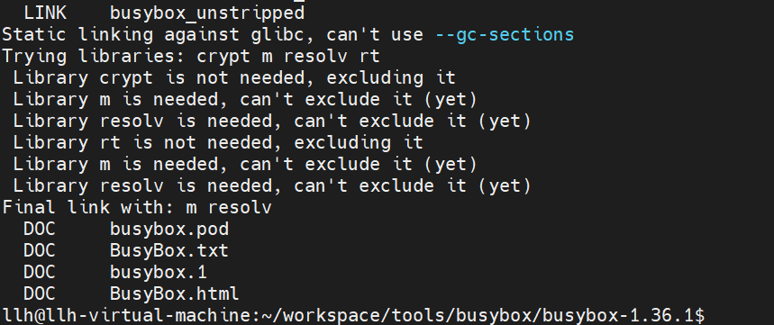

### 安装busybox

执行 make install，执行结果截图如下：

&nbsp;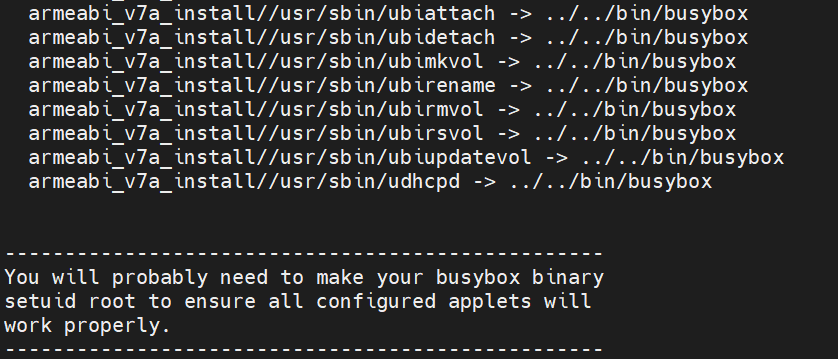

### 编译安装完成

查看编译目录下的armeabi_v7a_install文件夹，并可通过file bin/busybox看到文件属性

&nbsp;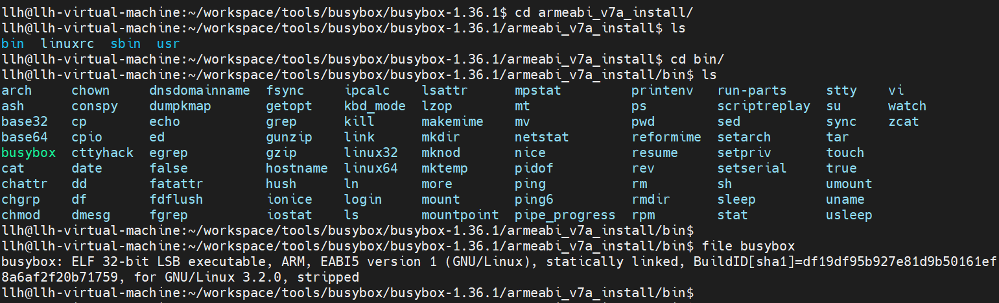

### 运行结果

将安装目录armeabi_v7a_install文件夹压缩打包，发送到OHOS开发板中

```shell
#打包对应编译目录下的install文件夹
tar -zcvf armeabi_v7a_install.tar.gz armeabi_v7a_install/
#发送到OHOS系统开发板上
hdc file send xxx\armeabi_v7a_install.tar.gz /data   
#进入开发板/data，解压armeabi_v7a_install.tar.gz
hdc shell
cd /data
tar -zxvf armeabi_v7a_install.tar.gz
```

进入armeabi_v7a_install/bin目录，执行./busybox --help 效果如下截图 

&nbsp;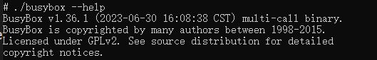

###  busybox 支持的命令

busybox 支持的命令, 如果程序运行时报 cmd 找不到或者不识别. 优先在下表中查找看看 busybox 是否支持

&nbsp;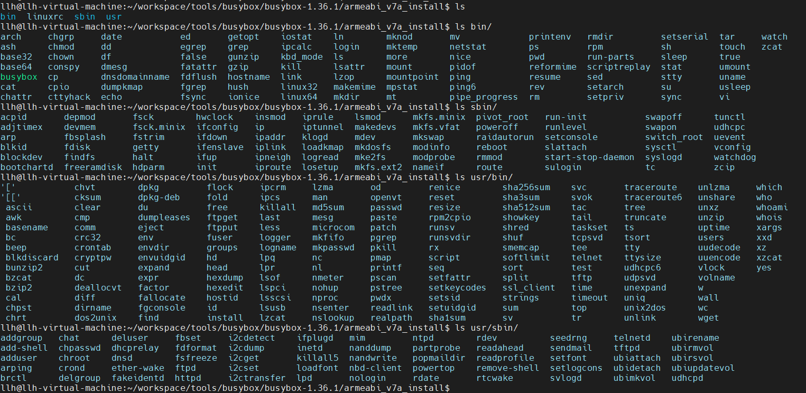

 如果已经支持, 则可在 /bin 目录创建对应 cmd 的软连接，示例：

```shell
# 假设 sed 命令报错
# busybox 支持 sed
cd /bin
ln -fs busybox sed
# 验证
sed --version
```

&nbsp;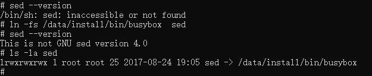
