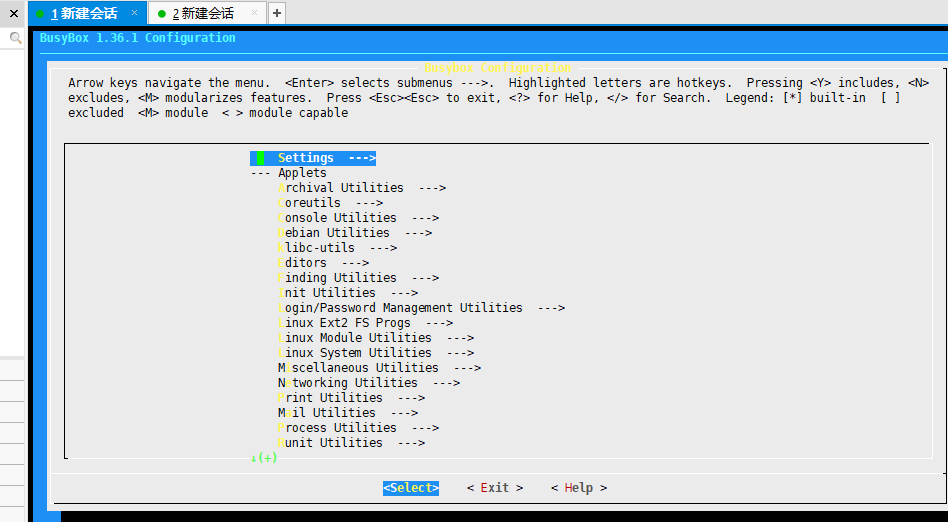
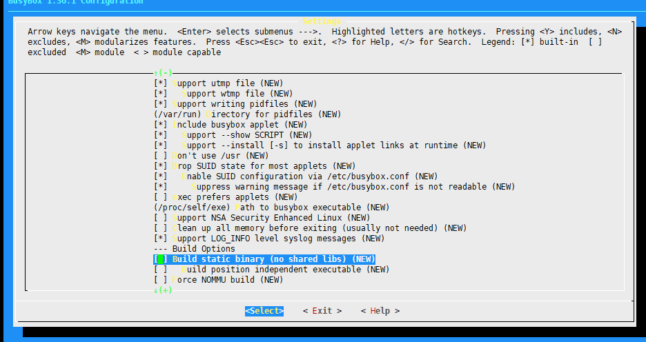
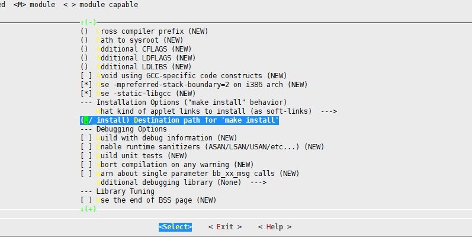
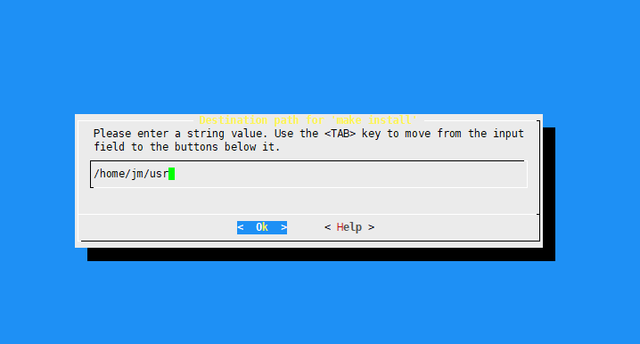
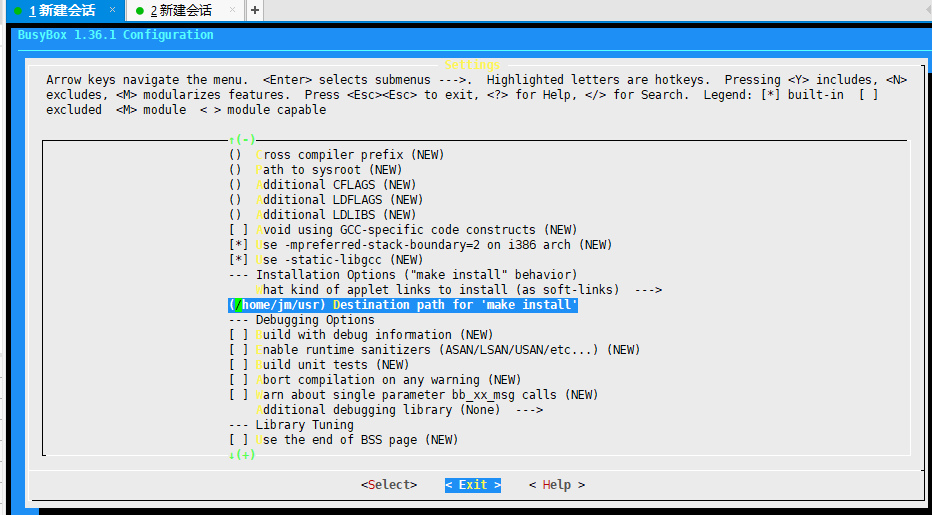
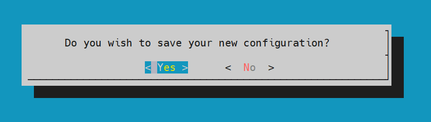
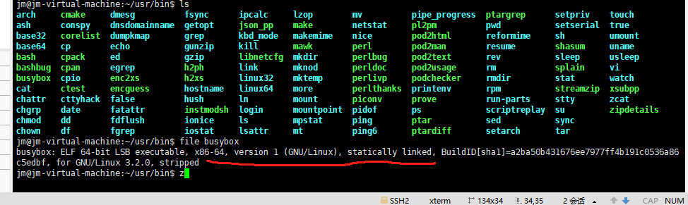

# busybox 工具X86_64编译说明

## 简介

BusyBox:嵌入式Linux的瑞士军刀。

## 编译步骤

### 下载解压busybox源码

- 下载最新版本busybox源码 [https://busybox.net/downloads/busybox-1.36.1.tar.bz2](https://gitee.com/link?target=https%3A%2F%2Fbusybox.net%2Fdownloads%2Fbusybox-1.36.1.tar.bz2) (以1.36.1为例)
- 通过tar命令解压源码 
- ```
  tar xvf busybox-1.36.1.tar.bz2
  ```
- 进入源码解压后目录 
- ```
  - cd busybox-1.36.1
  ```

### 安装编译工具

- 首先要安装 sudo apt-get install libncurses5-dev，确保可以看到配置界面
- make menuconfig 执行后展示界面如下, 选择Setting按回车键进入
- &nbsp;

- 通过下方向键，选择---Build Options 里面的Build static binary选项按回车确定
- &nbsp;

- 通过下方向键，选择---Build Options 里面的Destination path for 'make install'选项选项回车进入

- &nbsp;

进入后cntrol + Backspace删除默认路径并填写指定自己想要安装的目录

- &nbsp;

- 通过右方向键，选择Exit 退出设置,回到如下界面

- &nbsp;

- 再通过右方向键，选择Exit 退出设置，展示如下页面，选择Yes保存配置
- &nbsp;

### 编译busybox源码

在源码目录执行make VERBOSE=1 命令编译busybox源码

安装busybox

执行 make install后，去对应自己指定的目录下查看是否安装成功，如下图所示即安装完毕：

- &nbsp;