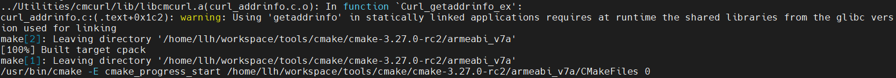
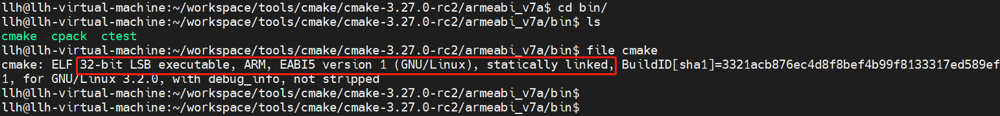

# cmake工具armeabi_v7a 交叉编译说明

## 简介
CMake是一个跨平台的编译安装工具。

本文档主要介绍其arm32位交叉编译步骤

## 编译步骤

### 编译工具链下载

- 32位编译工具：gcc-linaro-7.5.0-2019.12-x86_64_arm-linux-gnueabi.tar.xz [下载链接](https://releases.linaro.org/components/toolchain/binaries/7.5-2019.12/arm-linux-gnueabi/gcc-linaro-7.5.0-2019.12-x86_64_arm-linux-gnueabi.tar.xz)

### 解压编译工具链

- 解压32位工具链 tar xvJf gcc-linaro-7.5.0-2019.12-x86_64_arm-linux-gnueabi.tar.xz


- 进入解压后的文件夹，查看bin目录下就有我们编译用到的工具链

### 下载解压cmake源码

- 下载最新版本的cmake源码,[下载链接](https://cmake.org/files/v3.27/cmake-3.27.0-rc2.tar.gz) (以3.27-rc2为例)
- 通过tar命令解压源码 tar -xzvf cmake-3.27.0-rc2.tar.gz

### 创建编译目录

- 进入源码解压后目录 cd cmake-3.27.0-rc2
- 创建32位编译目录 mkdir armeabi_v7a 

### 设置交叉编译环境

- 设置32位交叉编译环境, xxx 是表示工具链存放的目录路径

```shell
export TOOLS=/xxx/gcc-linaro-7.5.0-2019.12-x86_64_arm-linux-gnueabi/bin
export AS=${TOOLS}/arm-linux-gnueabi-as
export CC=${TOOLS}/arm-linux-gnueabi-gcc
export CXX=${TOOLS}/arm-linux-gnueabi-g++
export LD=${TOOLS}/arm-linux-gnueabi-ld
export STRIP=${TOOLS}/arm-linux-gnueabi-strip
export RANLIB=${TOOLS}/arm-linux-gnueabi-ranlib
export OBJDUMP=${TOOLS}/arm-linux-gnueabi-objdump
export OBJCOPY=${TOOLS}/arm-linux-gnueabi-objcopy
export NM=${TOOLS}/arm-linux-gnueabi-gcc-nm
export AR=${TOOLS}/arm-linux-gnueabi-ar
export LDFLAGS="-static"
```

### 生成makefile

-  进入32位为 cd armeabi_v7a 
- 执行如下命令生成makefile

```shell
cmake ../ -L -DCMAKE_USE_OPENSSL=OFF -DBUILD_TESTING=OFF
```

### 编译cmake源码

在对应的编译目录执行 make  VERBOSE=1,编译成功截图如下

&nbsp;

### 编译完成

查看编译生成的文件ls bin/, 编译出来cmake ctest 就可以，并可通过file cmake 看到文件属性，必须是静态链接

&nbsp;

### 安装cmake

由于交叉编译不能make install安装cmake，故make install X86系统的cmake

- 重新开一个窗口，进入cmake源码目录 

- 创建一个host目录

```shell
mkdir host
```

- 进入host目录，执行 cmake生成makefile，命令如下

```shell
cmake ../ -L -DCMAKE_USE_OPENSSL=OFF -DCMAKE_INSTALL_PREFIX="${PWD}/install" 
```

- 执行make install  进行编译安装，完成后可以看到Modules目录下的文件


- 将./install/share/cmake-3.27/Modules/ 拷贝到交叉编译目录下

```shell
#重新进入交叉编译目录，新建share/cmake-3.27/目录
cd ../armeabi_v7a
mkdir -p share/cmake-3.27/
cp ../host/install/share/cmake-3.27/Modules/ ./share/cmake-3.27/ -rf
```

### OHOS系统上运行

将编译目录文件压缩打包，发送到OHOS开发板中

```shell
#打包编译目录
tar -zcvf armeabi_v7a.tar.gz armeabi_v7a/
#发送到OHOS系统开发板上
hdc file send xxx\armeabi_v7a.tar.gz /data   
#进入开发板/data，解压arm64_build.tar.gz
hdc shell
cd /data
tar -zxvf armeabi_v7a.tar.gz
```

进入arm64_build/bin目录，执行./cmake -version 和 ./ctest -version 效果如下截图

&nbsp;


