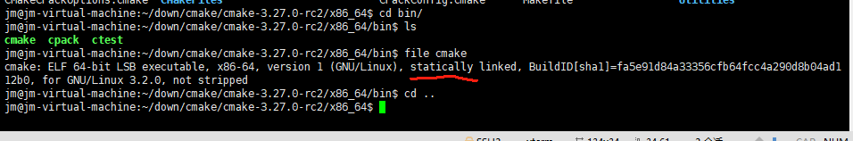
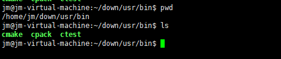

# cmake 工具在x86_64的linux系统上编译说明

##  简介

CMake是一个跨平台的编译安装工具。

本文档主要介绍其x86_64编译步骤

##  编译步骤

### 下载解压cmake源码

- 下载需要版本cmake源码，[下载链接](https://cmake.org/files/v3.27/cmake-3.27.0-rc2.tar.gz)（以3.27-rc2为例）
- 通过tar命令解压源码 

  ```
  tar -xzvf cmake-3.27.0-rc2.tar.gz
  ```

###  创建编译目录

- 进入解压后的源码目录

- 创建编译目录 mkdir x86_64

- cd x86_64目录设置环境变量 export LDFLAGS="-static"

  ```
  cmake ../ -L -DCMAKE_USE_OPENSSL=OFF -DBUILD_TESTING=OFF -DCMAKE_INSTALL_PREFIX="/home/jm/down/usr" 
  ```
- 参数DCMAKE_INSTALL_PREFIX后面指定自己需要安装的路径
- 在x86_64下执行 make VERBOSE=1,编译成功截图如下，file 查看文件属性得到的是静态链接。

&nbsp;

### 安装cmake

- ```
  make install
  ```

-  去指定目录下查看是否安装成功，如下图所示：

&nbsp;