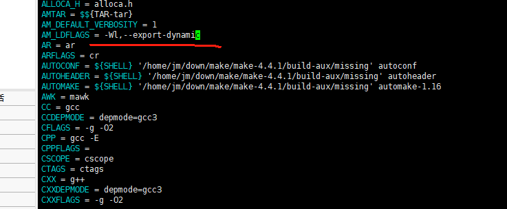
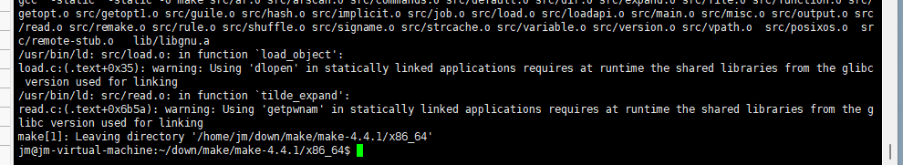
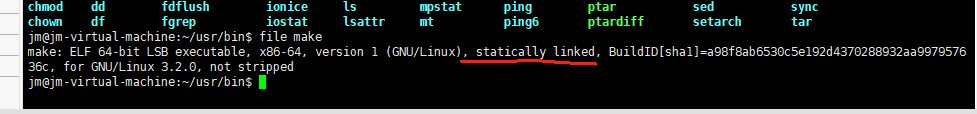

# make 工具在x86_64的Linux系统上的编译说明

## 简介

GNUMake是一种工具，用于控制从程序的源文件生成程序的可执行文件和其他非源文件。

本文档主要介绍其arm64位交叉编译步骤

##  编译步骤

###  下载解压make源码

- 下载最新版本的make源码 [https://ftp.gnu.org/gnu/make/make-4.4.1.tar.gz](https://gitee.com/link?target=https%3A%2F%2Fftp.gnu.org%2Fgnu%2Fmake%2Fmake-4.4.1.tar.gz) (以4.4.1为例)

- 通过tar命令解压源码 

  ```
  tar -xzvf make-4.4.1.tar.gz
  ```

###  创建编译目录

- 进入源码解压后目录 cd make-4.4.1
- 创建编译目录 mkdir x86_64

###  生成makefile

-  cd x86_64
- 执行如下命令生成Makefile,prefix参数后面指定自己需要安装的路径

```
../configure --prefix="/home/jm/usr" 
```

- 修改Makefile，将AM_LDFLAGS = -Wl,--export-dynamic 改成AM_LDFLAGS = 即删除后面的-Wl,--export-dynamic

&nbsp;


###  编译make源码

在对应的编译目录执行make CFLAGS="-static" LDFLAGS="-static" VERBOSE=1，执行结果截图如下

&nbsp;


###  安装make

执行 make install，去对应的目录下查看安装结果如下：

&nbsp;