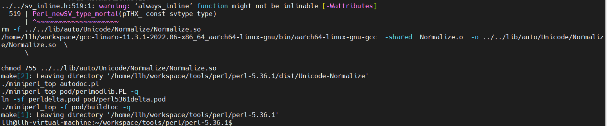
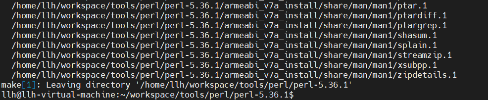
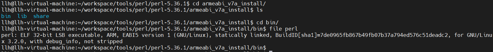
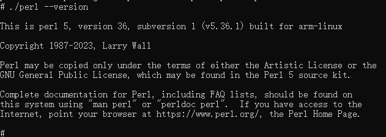

# perl 工具armeabi-v7a交叉编译说明

## 简介
Perl：一种功能丰富的计算机程序语言，运行在超过100种计算机平台上，适用广泛，从大型机到便携设备，从快速原型创建到大规模可扩展开发。

## 编译步骤

### 编译工具链下载

- 32位编译工具：gcc-linaro-7.5.0-2019.12-x86_64_arm-linux-gnueabi.tar.xz [下载链接](https://releases.linaro.org/components/toolchain/binaries/7.5-2019.12/arm-linux-gnueabi/gcc-linaro-7.5.0-2019.12-x86_64_arm-linux-gnueabi.tar.xz)

### 解压编译工具链

- 解压32位 tar xvJf gcc-linaro-7.5.0-2019.12-x86_64_arm-linux-gnueabi.tar.xz


- 进入解压后的文件夹，查看bin目录下就有我们编译用到的工具链

### 下载解压perl源码

- 下载perl源码，[下载链接]( https://www.cpan.org/src/5.0/perl-5.36.1.tar.gz) (以5.36.1为例)
- 通过tar命令解压源码 tar -zxf perl-5.36.1.tar.gz

### 下载perl交叉编译包源码

- 下载perl交叉编译包源码，[下载链接]( https://github.com/arsv/perl-cross/releases/download/1.4.1/perl-cross-1.4.1.tar.gz)（5.36.1版本对应的perl-cross就是1.4.1版本）
- 进入perl源码解压后目录  cd perl-5.36.1
- 在perl上解压perl交叉编译包，覆盖Makefile，命令如下

```shell
tar --strip-components=1 -zxf ../perl-cross-1.4.1.tar.gz
```

### 设置交叉编译环境

- 设置32位交叉编译环境, xxx 是表示工具链存放的目录路径

```shell
export TOOLS=/xxx/gcc-linaro-7.5.0-2019.12-x86_64_arm-linux-gnueabi/bin
export AS=${TOOLS}/arm-linux-gnueabi-as
export CC=${TOOLS}/arm-linux-gnueabi-gcc
export CXX=${TOOLS}/arm-linux-gnueabi-g++
export LD=${TOOLS}/arm-linux-gnueabi-ld
export STRIP=${TOOLS}/arm-linux-gnueabi-strip
export RANLIB=${TOOLS}/arm-linux-gnueabi-ranlib
export OBJDUMP=${TOOLS}/arm-linux-gnueabi-objdump
export OBJCOPY=${TOOLS}/arm-linux-gnueabi-objcopy
export NM=${TOOLS}/arm-linux-gnueabi-gcc-nm
export AR=${TOOLS}/arm-linux-gnueabi-ar
export READELF="${TOOLS}/arm-linux-gnueabi-readelf"
```

###  生成makefile

- 执行如下命令生成makefile

```shell
./configure --target=arm-linux-gnueabi --prefix="${PWD}/armeabi_v7a_install"
```

### 编译perl源码

执行 make CFLAGES="-static" LDFLAGS="-static" VERBOSE=1 命令编译perl源码，执行结果截图如下

&nbsp;

### 安装perl

执行 make install，执行结果截图如下

&nbsp;

### 编译安装完成

进入安装目录下的armeabi_v7a_install/bin文件夹，并可通过file perl看到文件属性

&nbsp;

### 运行结果

将安装目录armeabi_v7a_install文件夹压缩打包，发送到OHOS开发板中

```shell
#打包对应编译目录下的install文件夹
tar -zcvf armeabi_v7a_install.tar.gz armeabi_v7a_install/
#发送到OHOS系统开发板上
hdc file send xxx\armeabi_v7a_install.tar.gz /data   
#进入开发板/data，解压armeabi_v7a_install.tar.gz
hdc shell
cd /data
tar -zxvf armeabi_v7a_install.tar.gz
```

进入armeabi_v7a_install/bin目录，执行./perl --version 效果如下截图 

&nbsp;
