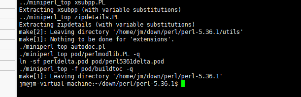
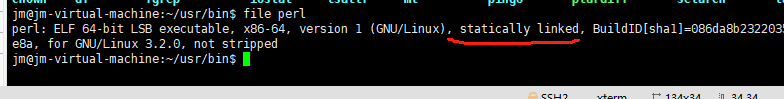

#  perl 工具在x86_64的Linux系统上编译说明

## 简介

Perl：一种功能丰富的计算机程序语言，运行在超过100种计算机平台上，适用广泛，从大型机到便携设备，从快速原型创建到大规模可扩展开发。

## 编译步骤

###  下载解压perl源码

- 下载perl源码，[下载链接](https://gitee.com/link?target=https%3A%2F%2Fwww.cpan.org%2Fsrc%2F5.0%2Fperl-5.36.1.tar.gz) (以5.36.1为例)

- 通过tar命令解压源码 

  ```
  tar -zxf perl-5.36.1.tar.gz
  ```

### 下载perl交叉编译包源码

- 下载perl交叉编译包源码，[下载链接](https://gitee.com/link?target=https%3A%2F%2Fgithub.com%2Farsv%2Fperl-cross%2Freleases%2Fdownload%2F1.4.1%2Fperl-cross-1.4.1.tar.gz)（5.36.1版本对应的perl-cross就是1.4.1版本）,主要是为了获取包里的congfig文件,方便生成Makefile。
- 进入perl源码解压后目录 cd perl-5.36.1
- 在perl上解压perl交叉编译包，覆盖Makefile，命令如下

```
tar --strip-components=1 -zxf ../perl-cross-1.4.1.tar.gz
```

###  生成makefile

- 执行如下命令生成makefile，prefix后面跟的是自己需要安装的路径

```
./configure --all-static --prefix="/home/jm/usr"
```

###  编译perl源码

执行 make CFLAGES="-static" LDFLAGS="-static" VERBOSE=1 命令编译perl源码，执行结果截图如下

&nbsp;

###  安装perl

执行 make install，并去安装目录下查看安装结果截图如下：
&nbsp;