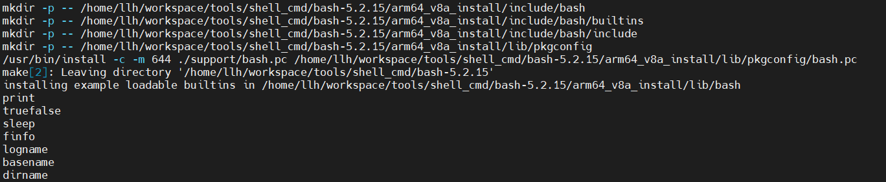

# shell_cmd 工具arm64-v8a交叉编译说明

## 简介
命令是用户向系统内核发出控制请求，与之交互的文本流。
shell是一个命令行解释器，将用户命令解析为操作系统所能理解的指令，实现用户与操作系统的交互。

本文主要介绍bash和mawk这两个命令的编译方法，这两个工具的编译步骤都是一样的，其他shell命令，可以参考该编译方法进行编译。

## 编译步骤

### 编译工具链下载

- 64位编译工具：gcc-linaro-7.5.0-2019.12-x86_64_aarch64-linux-gnu.tar.xz  [下载链接](https://releases.linaro.org/components/toolchain/binaries/7.5-2019.12/aarch64-linux-gnu/gcc-linaro-7.5.0-2019.12-x86_64_aarch64-linux-gnu.tar.xz)

### 解压编译工具链

- 解压64位 tar xvJf gcc-linaro-7.5.0-2019.12-x86_64_aarch64-linux-gnu.tar.xz


- 进入解压后的文件夹，查看bin目录下就有我们编译用到的工具链

### 设置交叉编译环境

- 设置64位交叉编译环境, xxx 是表示工具链存放的目录路径

```shell
export TOOLS=/xxx/gcc-linaro-7.5.0-2019.12-x86_64_aarch64-linux-gnu/bin
export AS=${TOOLS}/aarch64-linux-gnu-as
export CC=${TOOLS}/aarch64-linux-gnu-gcc
export CXX=${TOOLS}/aarch64-linux-gnu-g++
export LD=${TOOLS}/aarch64-linux-gnu-ld
export STRIP=${TOOLS}/aarch64-linux-gnu-strip
export RANLIB=${TOOLS}/aarch64-linux-gnu-ranlib
export OBJDUMP=${TOOLS}/aarch64-linux-gnu-objdump
export OBJCOPY=${TOOLS}/aarch64-linux-gnu-objcopy
export NM=${TOOLS}/aarch64-linux-gnu-gcc-nm
export AR=${TOOLS}/aarch64-linux-gnu-ar
export READELF="${TOOLS}/aarch64-linux-gnu-readelf"
```

### 下载解压源码

- 下载bash源码，[下载链接](https://ftp.gnu.org/gnu/bash/bash-5.2.15.tar.gz) (以5.2.15为例)
- 通过tar命令解压源码 tar -zxf bash-5.2.15.tar.gz
- 下载mawk源码，[下载链接](https://invisible-island.net/archives/mawk/mawk-1.3.4-20230525.tgz) (以1.3.4-20230525为例)
- 通过tar命令解压源码 tar -zxf mawk-1.3.4-20230525.tgz

###  生成makefile

- 编译bash，请进入bash源码目录执行如下命令生成makefile
- 编译mawk，请进入mawk源码目录执行如下命令生成makefile

```shell
./configure --host=aarch64-linux --prefix="${PWD}/arm64_v8a_install"
```

### 编译源码

- 进入bash源码目录执行 make LDFLAGS="-static" VERBOSE=1 命令编译bash源码，执行结果截图如下


&nbsp;

- 进入mawk源码目录执行 make LDFLAGS="-static" VERBOSE=1 命令编译mawk源码，执行结果截图如下

&nbsp;

### 安装

- 进入bash源码目录执行 执行 make install，执行结果截图如下


&nbsp;

- 进入mawk源码目录执行 执行 make install，执行结果截图如下

&nbsp;

### 编译安装完成

- 进入bash安装目录下的arm64_v8a_install/bin文件夹，并可通过file bash看到文件属性


&nbsp;

- 进入mawk安装目录下的arm64_v8a_install/bin文件夹，并可通过file mawk看到文件属性

&nbsp;

### 运行结果

- 将bash和mawk的安装目录arm64_v8a_install文件夹合并，然后压缩打包，发送到OHOS开发板中

```shell
#合并安装目录，进入bash源码目录，将mawk安装目录下拷贝到当前
cp ../mawk-1.3.4-20230525/arm64_v8a_install/ ./ -rf
#打包的arm64_v8a_install文件夹
tar -zcvf arm64_v8a_install.tar.gz armeabi_v7a_install/
#发送到OHOS系统开发板上
hdc file send xxx\arm64_v8a_install.tar.gz /data   
#进入开发板/data，解压arm64_v8a_install.tar.gz
hdc shell
cd /data
tar -zxvf arm64_v8a_install.tar.gz
```

- 进入arm64_v8a_install/bin目录，执行./bash --version 效果如下截图 


&nbsp;

- 进入arm64_v8a_install/bin目录，执行./mawk --version 效果如下截图 

&nbsp;
