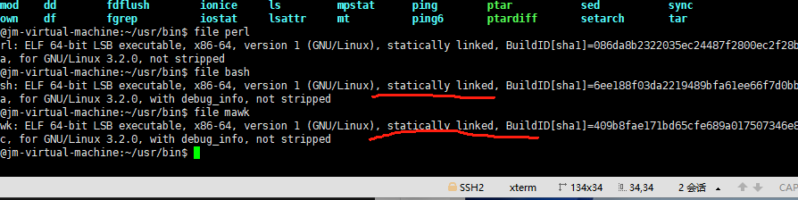

# shell_cmd 工具在x86_64的Linux系统上的编译说明

## 简介

命令是用户向系统内核发出控制请求，与之交互的文本流。 shell是一个命令行解释器，将用户命令解析为操作系统所能理解的指令，实现用户与操作系统的交互。

本文主要介绍bash和mawk这两个命令的编译方法，这两个工具的编译步骤都是一样的，其他shell命令，可以参考该编译方法进行编译。

## 编译步骤

###  下载解压源码

- 下载bash源码，[下载链接](https://gitee.com/link?target=https%3A%2F%2Fftp.gnu.org%2Fgnu%2Fbash%2Fbash-5.2.15.tar.gz) (以5.2.15为例)

- 通过tar命令解压源码 

  ```
  tar -zxf bash-5.2.15.tar.gz
  ```

- 下载mawk源码，[下载链接](https://gitee.com/link?target=https%3A%2F%2Finvisible-island.net%2Farchives%2Fmawk%2Fmawk-1.3.4-20230525.tgz) (以1.3.4-20230525为例)

- 通过tar命令解压源码 

  ```
  tar -zxf mawk-1.3.4-20230525.tgz
  ```

### 生成makefile

- 编译bash，请进入bash源码目录执行如下命令生成makefile

  ```
  ./configure --enable-static-link --prefix="/home/jm/usr"
  ```

  

- 编译mawk，请进入mawk源码目录执行如下命令生成makefile

```
./configure --prefix="/home/jm/usr"
```

###  编译源码

- bash和mawk编译命令是一致的，在源码目录执行 make LDFLAGS="-static" VERBOSE=1 


### 安装

bash和mawk安装命令是一致的，都是在源码目录执行 

```
make install
```

编译安装后去安装目录查看是否安装成功，截图如下：
&nbsp;