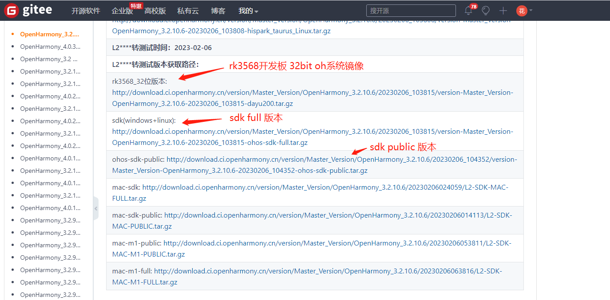

Ubuntu 20.04(推荐) 环境下 使用 OpenHarmony SDK 编译，OpenHarmony standard 系统北向应用 c/c++ 库

## OpenHarmony Linux 环境 SDK 使用说明

### 下载SDK

​		从 openHarmony SDK [官方发布渠道](https://gitee.com/openharmony-sig/oh-inner-release-management/blob/master/Release-Testing-Version.md)下载SDK



​        可以同时下载对应的系统镜像（这里提供的是 32bit OHOS 镜像下载），后面依次为 Windows/Linux 环境下的 SDK，SDK 分为两个版本 full 版本和 public 版本。这两个版本的 SDK 中关于 c/c++ 编译的部分是相同的，因此我们下载那个都一样（ full 版本的 SDK 在 ets 层提供了更多的 API ）。再后面是 mac 环境的OHOS SDK 。根据自己环境自行下载对应版本的 SDK 。

### 解压SDK

```shell
 tar -zxvf version-Master_Version-OpenHarmony_3.2.10.3-20230105_163913-ohos-sdk-full.tar.gz
```

进入解压得到 ohos_sdk 目录，可以看到 Linux 和 windows 两个平台的 SDK 目录，我们进入 linux。

```
ohos@ubuntu20:~/tools/OH_SDK$ cd ohos-sdk
ohos@ubuntu20:~/tools/OH_SDK/ohos-sdk$ ls
linux  windows
ohos@ubuntu20:~/tools/OH_SDK/ohos-sdk$ cd linux/
ohos@ubuntu20:~/tools/OH_SDK/ohos-sdk/linux$ ls
ets-linux-x64-4.0.1.2-Canary1.zip  native-linux-x64-4.0.1.2-Canary1.zip     toolchains-linux-x64-4.0.1.2-Canary1.zip
js-linux-x64-4.0.1.2-Canary1.zip   previewer-linux-x64-4.0.1.2-Canary1.zip
```

解压 Linux 环境下的 OHOS SDK 工具包，得到对应的工具目录。由于我们是 c/c++ 库的编译，我们只关注 native 目录。

```shell
ohos@ubuntu20:~/tools/OH_SDK/ohos-sdk/linux$ for i in *.zip;do unzip ${i};done
ohos@ubuntu20:~/tools/OH_SDK/ohos-sdk/linux$ ls
ets                                native                                   toolchains
ets-linux-x64-4.0.1.2-Canary1.zip  native-linux-x64-4.0.1.2-Canary1.zip     toolchains-linux-x64-4.0.1.2-Canary1.zip
js                                 previewer
js-linux-x64-4.0.1.2-Canary1.zip   previewer-linux-x64-4.0.1.2-Canary1.zip
```

### native 目录介绍

```sh
ohos@ubuntu20:~/tools/OH_SDK/ohos-sdk/linux$ cd native/
ohos@ubuntu20:~/tools/OH_SDK/ohos-sdk/linux/native$ ls
build        docs  nativeapi_syscap_config.json  NOTICE.txt           sysroot
build-tools  llvm  ndk_system_capability.json    oh-uni-package.json
```

build 目录存放的是 构建时 cmake 依赖的配置文件

build-tools 目录存放的是 构建工具包含 cmake 和 ninja，我们后面采用 make 进行构建。

docs 目录存放 使用说明

llvm 目录存放 clang 编译器

sysroot 目录为编译器的 sysroot 目录，存放 SDK 内部的已经包含的库和对应的头文件

oh-uni-package.json 为 SDK 信息描述，如版本

NOTICE.txt 为注意事项，内容多为 SDK 的详细描述

ndk_system_capability.json 记录 SDK 提供的能力

nativeapi_syscap_config.json 记录 SDK 提供的能力对应的头文件

**build和build-tools目录提供构建时的 cmake，ninja，以及 toolchain 依赖。llvm 提供编译工具链。sysroot 提供 usr 系统资源**

## OHOS SDK 使用
本片介绍基本用法, 涉及到库有依赖的情况请[移步](./OHOS_SDK-Usage-depend-libs.md).
### 编译cmake构建的库

​		SDK 采用 cmake 作为默认的编译脚本工具和 deveco 开发工具是一致的。并且 cmake 也是现如今 c/c++ 开发最流行的编译构建脚本。以下我使用 cjson 作为实例演示一下 OHOS SDK 构建 cmake 项目的步骤。

​		首先下载/clone cJSON 源码，我这里下载的 v1.7.15 版本

```shell
ohos@ubuntu20:~/openHarmony$ git clone https://github.com/DaveGamble/cJSON.git -b v1.7.15
Cloning into 'cJSON'...
remote: Enumerating objects: 4545, done.
remote: Total 4545 (delta 0), reused 0 (delta 0), pack-reused 4545
Receiving objects: 100% (4545/4545), 2.45 MiB | 1.65 MiB/s, done.
Resolving deltas: 100% (3026/3026), done.
Note: switching to 'd348621ca93571343a56862df7de4ff3bc9b5667'.

You are in 'detached HEAD' state. You can look around, make experimental
changes and commit them, and you can discard any commits you make in this
state without impacting any branches by switching back to a branch.

If you want to create a new branch to retain commits you create, you may
do so (now or later) by using -c with the switch command. Example:

  git switch -c <new-branch-name>

Or undo this operation with:

  git switch -

Turn off this advice by setting config variable advice.detachedHead to false

ohos@ubuntu20:~/openHarmony$
```

​		进入 cJson 目录，创建 ohos64build 目录（存放构建文件）。执行 cmake，生成 makefile

```
ohos@ubuntu20:~/openHarmony/cJSON/ohos64build$ /home/ohos/tools/OH_SDK/ohos-sdk/linux/native/build-tools/cmake/bin/cmake -DCMAKE_TOOLCHAIN_FILE=/home/ohos/tools/OH_SDK/ohos-sdk/linux/native/build/cmake/ohos.toolchain.cmake  .. -L 
	# 如果需要编译静态库则需要设置 cmake 变量 -DBUILD_SHARED_LIBS=OFF
	# 可以通过-DCMAKE_INSTALL_PREFIX=xxx 设置库的安装目录
	# 编译 arm32 -DOHOS_ARCH=armeabi-v7a
-- The C compiler identification is Clang 12.0.1
-- Check for working C compiler: /home/ohos/tools/OH_SDK/ohos-sdk/linux/native/llvm/bin/clang # 采用sdk内的编译器
-- Check for working C compiler: /home/ohos/tools/OH_SDK/ohos-sdk/linux/native/llvm/bin/clang -- works
# 删除大量 cmake 日志
ENABLE_PUBLIC_SYMBOLS:BOOL=ON
ENABLE_SAFE_STACK:BOOL=OFF
ENABLE_SANITIZERS:BOOL=OFF
ENABLE_TARGET_EXPORT:BOOL=ON
ENABLE_VALGRIND:BOOL=OFF
ohos@ubuntu20:~/openHarmony/cJSON/ohos64build$
```

​		注意这里执行的 cmake 是 SDK 内的 cmake ，不是你自己系统上原有的 cmake 。包括 toolchain file 也是 SDK 内的。执行 make 即可编译出 cjson 库

```
ohos@ubuntu20:~/openHarmony/cJSON/ohos64build$ make
Scanning dependencies of target cjson
[  2%] Building C object CMakeFiles/cjson.dir/cJSON.c.o
clang: warning: argument unused during compilation: '--gcc-toolchain=/home/ohos/tools/OH_SDK/ohos-sdk/linux/native/llvm' [-Wunused-command-line-argument]
# 删除大量 make 日志
[100%] Linking C executable fuzz_main
[100%] Built target fuzz_main
ohos@ubuntu20:~/openHarmony/cJSON/ohos64build$
```

​		使用 file 命令，查看编译出的 elf 文件的属性。可以看到动态库和可执行程序都是 ARM aarch64 架构的。ohos cmake toolchainfile 在不设置 cpu 架构时默认为 aarch64 . 如果你需要编译 arm32 的需要在cmake时加上参数 -DOHOS_ARCH=armeabi-v7a

```sh
ohos@ubuntu20:~/openHarmony/cJSON/ohos64build$ ls
cJSONConfig.cmake         cJSON_test      CMakeFiles           CTestTestfile.cmake  libcjson.pc  libcjson.so.1       Makefile
cJSONConfigVersion.cmake  CMakeCache.txt  cmake_install.cmake  fuzzing              libcjson.so  libcjson.so.1.7.15  tests
ohos@ubuntu20:~/openHarmony/cJSON/ohos64build$ file libcjson.so.1.7.15 cJSON_test
libcjson.so.1.7.15: ELF 64-bit LSB shared object, ARM aarch64, version 1 (SYSV), dynamically linked, BuildID[sha1]=98d32cd8235a77985fec1419150fe2c97c8c8c38, with debug_info, not stripped
cJSON_test:         ELF 64-bit LSB shared object, ARM aarch64, version 1 (SYSV), dynamically linked, interpreter /lib/ld-musl-aarch64.so.1, BuildID[sha1]=20770aaad711d8286819f193e8d10034cdb3cedc, with debug_info, not stripped
ohos@ubuntu20:~/openHarmony/cJSON/ohos64build$
```

### 编译非 cmake 构建的库

​		开源社区存在着大量的非 cmake 构建的库，如何使用 OpenHarmony 的 SDK 编译它们呢？

#### 方法1：我们可以使用 cmake 构建脚本重写开源库的构建过程

​		这种方法需要分析源库的构建脚本或者分析源库的编译构建日志，我这里推荐简单点的分析构建日志（可以不必去学习 configure 的语法）。很多库为了性能一般会对代码进行处理器级的优化（SIMD: SSE,AVX; NEON），因此编译构建日志最好采用交叉编译工具链的日志，不要盲目的根据 x86_64 的构建日志进行翻译（cmake）。如果使用此方法请参考 oh 三方库 [cmake 编写指导](https://gitee.com/huangminzhong/cmake_study)及[编写规范](./cmake_specification.md)。

#### 方法2：使用项目原生的构建工具例如 configure、makefile

​		如何使用原生的构建工具？首先我们需要知道构建脚本并不是直接调用 gcc 或者 clang 编译工具链的。而是优先调用 CC 环境变量以达到调用 c 编译器的目的，对应的 CXX 环境变量对应 c++ 编译器...。等等一系列的编译工具都有自己对应的环境变量。通过设置这些环境变量，让构建工具使用 ohos SDK 的编译工具链。

​		设置 ohos 64bit 库编译工具链环境变量

```
#aarch64-linux-ohos
export OHOS_SDK=/home/ohos/tools/OH_SDK/ohos-sdk/linux # 此处是我的ohos_sdk解压目录，请替换为你自己的解压目录
export AS=${OHOS_SDK}/native/llvm/bin/llvm-as
export CC="${OHOS_SDK}/native/llvm/bin/clang --target=aarch64-linux-ohos"
export CXX="${OHOS_SDK}/native/llvm/bin/clang++ --target=aarch64-linux-ohos"
export LD=${OHOS_SDK}/native/llvm/bin/ld.lld
export STRIP=${OHOS_SDK}/native/llvm/bin/llvm-strip
export RANLIB=${OHOS_SDK}/native/llvm/bin/llvm-ranlib
export OBJDUMP=${OHOS_SDK}/native/llvm/bin/llvm-objdump
export OBJCOPY=${OHOS_SDK}/native/llvm/bin/llvm-objcopy
export NM=${OHOS_SDK}/native/llvm/bin/llvm-nm
export AR=${OHOS_SDK}/native/llvm/bin/llvm-ar
export CFLAGS="-fPIC -D__MUSL__=1"
export CXXFLAGS="-fPIC -D__MUSL__=1"
```

​		设置 ohos 32bit 库编译工具链环境变量

```
linux-arm
export OHOS_SDK=/home/ohos/tools/OH_SDK/ohos-sdk/linux # 此处是我的ohos_sdk解压目录，请替换为你自己的解压目录
export AS=${OHOS_SDK}/native/llvm/bin/llvm-as
export CC="${OHOS_SDK}/native/llvm/bin/clang --target=arm-linux-ohos"
export CXX="${OHOS_SDK}/native/llvm/bin/clang++ --target=arm-linux-ohos"
export LD=${OHOS_SDK}/native/llvm/bin/ld.lld
export STRIP=${OHOS_SDK}/native/llvm/bin/llvm-strip
export RANLIB=${OHOS_SDK}/native/llvm/bin/llvm-ranlib
export OBJDUMP=${OHOS_SDK}/native/llvm/bin/llvm-objdump
export OBJCOPY=${OHOS_SDK}/native/llvm/bin/llvm-objcopy
export NM=${OHOS_SDK}/native/llvm/bin/llvm-nm
export AR=${OHOS_SDK}/native/llvm/bin/llvm-ar
export CFLAGS="-fPIC -march=armv7a -D__MUSL__=1"
export CXXFLAGS="-fPIC -march=armv7a -D__MUSL__=1"
```

    使用unset 命令可以撤销环境变量

```
  unset OHOS_SDK AS CC CXX LD STRIP RANLIB OBJDUMP OBJCOPY NM AR CFLAGS CXXFLAGS
```

    设置好编译工具链之后，只要按照标准的 configure 用法即可.

### 实例操作

​		下面以 openssl 为例，使用 ohos 的 SDK 编译 openharmony 系统下的 openssl 库（ openssl 官方仓使用 configure 编译）。

​		首先下载/clone openssl 官方源码，我是用的版本为 OpenSSL_1_1_1t

```
ohos@ubuntu20:~/openHarmony$ git clone https://github.com/openssl/openssl.git -b OpenSSL_1_1_1t
Cloning into 'openssl'...
remote: Enumerating objects: 446051, done.
remote: Counting objects: 100% (342/342), done.
remote: Compressing objects: 100% (183/183), done.
remote: Total 446051 (delta 207), reused 259 (delta 159), pack-reused 445709
Receiving objects: 100% (446051/446051), 272.13 MiB | 1.53 MiB/s, done.
Resolving deltas: 100% (316557/316557), done.
Note: switching to '830bf8e1e4749ad65c51b6a1d0d769ae689404ba'.

You are in 'detached HEAD' state. You can look around, make experimental
changes and commit them, and you can discard any commits you make in this
state without impacting any branches by switching back to a branch.

If you want to create a new branch to retain commits you create, you may
do so (now or later) by using -c with the switch command. Example:

  git switch -c <new-branch-name>

Or undo this operation with:

  git switch -

Turn off this advice by setting config variable advice.detachedHead to false
```

​		设置需要的编译工具链环境变量，这里设置的时 ohos64bit 库的编译工具链，如果需要编译 ohos32bit 库请设置为 32bit 编译工具链

```
ohos@ubuntu20:~/openHarmony/openssl$ export OHOS_SDK=/home/ohos/tools/OH_SDK/ohos-sdk/linux #这里根据自己的SDK解压目录设置
ohos@ubuntu20:~/openHarmony/openssl$ export AS=${OHOS_SDK}/native/llvm/bin/llvm-as
ohos@ubuntu20:~/openHarmony/openssl$ export CC="${OHOS_SDK}/native/llvm/bin/clang  --target=aarch64-linux-ohos"
ohos@ubuntu20:~/openHarmony/openssl$ export CXX="${OHOS_SDK}/native/llvm/bin/clang++  --target=aarch64-linux-ohos"
ohos@ubuntu20:~/openHarmony/openssl$ export LD=${OHOS_SDK}/native/llvm/bin/ld.lld
ohos@ubuntu20:~/openHarmony/openssl$ export STRIP=${OHOS_SDK}/native/llvm/bin/llvm-strip
ohos@ubuntu20:~/openHarmony/openssl$ export RANLIB=${OHOS_SDK}/native/llvm/bin/llvm-ranlib
ohos@ubuntu20:~/openHarmony/openssl$ export OBJDUMP=${OHOS_SDK}/native/llvm/bin/llvm-objdump
ohos@ubuntu20:~/openHarmony/openssl$ export OBJCOPY=${OHOS_SDK}/native/llvm/bin/llvm-objcopy
ohos@ubuntu20:~/openHarmony/openssl$ export NM=${OHOS_SDK}/native/llvm/bin/llvm-nm
ohos@ubuntu20:~/openHarmony/openssl$ export AR=${OHOS_SDK}/native/llvm/bin/llvm-ar
ohos@ubuntu20:~/openHarmony/openssl$ export CFLAGS="-fPIC -D__MUSL__=1"
ohos@ubuntu20:~/openHarmony/openssl$ export CXXFLAGS="-fPIC -D__MUSL__=1"
```

​		执行 Configure 构建脚本

```
ohos@ubuntu20:~/openHarmony/openssl$ ./Configure linux-aarch64 --prefix=/home/ohos/openHarmony/openssl_instrall
		# 在需要选择系统的时候由于configure不识别ohos，因此我们需要使用Linux aarch64等价系统和cpu架构 为了方便打包，需要指定安装目录
Configuring OpenSSL version 1.1.1t (0x1010114fL) for linux-aarch64
Using os-specific seed configuration
Creating configdata.pm
Creating Makefile

**********************************************************************
***                                                                ***
***   OpenSSL has been successfully configured                     ***
***                                                                ***
***   If you encounter a problem while building, please open an    ***
***   issue on GitHub <https://github.com/openssl/openssl/issues>  ***
***   and include the output from the following command:           ***
***                                                                ***
***       perl configdata.pm --dump                                ***
***                                                                ***
***   (If you are new to OpenSSL, you might want to consult the    ***
***   'Troubleshooting' section in the INSTALL file first)         ***
***                                                                ***
**********************************************************************
ohos@ubuntu20:~/openHarmony/openssl$ make
/usr/bin/perl "-I." -Mconfigdata "util/dofile.pl" \
    "-oMakefile" include/crypto/bn_conf.h.in > include/crypto/bn_conf.h
/usr/bin/perl "-I." -Mconfigdata "util/dofile.pl" \
    "-oMakefile" include/crypto/dso_conf.h.in > include/crypto/dso_conf.h
/usr/bin/perl "-I." -Mconfigdata "util/dofile.pl" \
    "-oMakefile" include/openssl/opensslconf.h.in > include/openssl/opensslconf.h
make depend && make _all
make[1]: Entering directory '/home/ohos/openHarmony/openssl'
make[1]: Leaving directory '/home/ohos/openHarmony/openssl'
make[1]: Entering directory '/home/ohos/openHarmony/openssl'
/home/ohos/tools/OH_SDK/ohos-sdk/linux/native/llvm/bin/clang  -I. -Iinclude -fPIC -pthread -Wa,--noexecstack -Qunused-arguments -fPIC --target=aarch64-linux-ohos -D__MUSL__=1 -DOPENSSL_USE_NODELETE -DOPENSSL_PIC -DOPENSSL_CPUID_OBJ -DOPENSSL_BN_ASM_MONT -DSHA1_ASM -DSHA256_ASM -DSHA512_ASM -DKECCAK1600_ASM -DVPAES_ASM -DECP_NISTZ256_ASM -DPOLY1305_ASM -DOPENSSLDIR="\"/home/ohos/openHarmony/openssl_install/ssl\"" -DENGINESDIR="\"/home/ohos/openHarmony/openssl_install/lib/engines-1.1\"" -DNDEBUG  -MMD -MF apps/app_rand.d.tmp -MT apps/app_rand.o -c -o apps/app_rand.o apps/app_rand.c
# 删除大量 make 日志
${LDCMD:-/home/ohos/tools/OH_SDK/ohos-sdk/linux/native/llvm/bin/clang} -pthread -Wa,--noexecstack -Qunused-arguments -fPIC --target=aarch64-linux-ohos -D__MUSL__=1 -L.   \
        -o test/x509aux test/x509aux.o \
         test/libtestutil.a -lcrypto -ldl -pthread
/usr/bin/perl "-I." -Mconfigdata "util/dofile.pl" \
    "-oMakefile" apps/CA.pl.in > "apps/CA.pl"
chmod a+x apps/CA.pl
/usr/bin/perl "-I." -Mconfigdata "util/dofile.pl" \
    "-oMakefile" apps/tsget.in > "apps/tsget.pl"
chmod a+x apps/tsget.pl
/usr/bin/perl "-I." -Mconfigdata "util/dofile.pl" \
    "-oMakefile" tools/c_rehash.in > "tools/c_rehash"
chmod a+x tools/c_rehash
/usr/bin/perl "-I." -Mconfigdata "util/dofile.pl" \
    "-oMakefile" util/shlib_wrap.sh.in > "util/shlib_wrap.sh"
chmod a+x util/shlib_wrap.sh
make[1]: Leaving directory '/home/ohos/openHarmony/openssl'
ohos@ubuntu20:~/openHarmony/openssl$ make install
make depend && make _build_libs
make[1]: Entering directory '/home/ohos/openHarmony/openssl'
make[1]: Leaving directory '/home/ohos/openHarmony/openssl'
make[1]: Entering directory '/home/ohos/openHarmony/openssl'
make[1]: Nothing to be done for '_build_libs'.
make[1]: Leaving directory '/home/ohos/openHarmony/openssl'
created directory `/home/ohos/openHarmony/openssl_install/lib'
*** Installing runtime libraries
install libcrypto.so.1.1 -> /home/ohos/openHarmony/openssl_install/lib/libcrypto.so.1.1
install libssl.so.1.1 -> /home/ohos/openHarmony/openssl_install/lib/libssl.so.1.1
*** Installing development files
created directory `/home/ohos/openHarmony/openssl_install/include'
created directory `/home/ohos/openHarmony/openssl_install/include/openssl'
install ./include/openssl/aes.h -> /home/ohos/openHarmony/openssl_install/include/openssl/aes.h
install ./include/openssl/asn1.h -> /home/ohos/openHarmony/openssl_install/include/openssl/asn1.h
install ./include/openssl/asn1_mac.h -> /home/ohos/openHarmony/openssl_install/include/openssl/asn1_mac.h
# 删除大量 install 日志
/home/ohos/openHarmony/openssl_install/share/doc/openssl/html/man7/X25519.html
/home/ohos/openHarmony/openssl_install/share/doc/openssl/html/man7/X448.html -> /home/ohos/openHarmony/openssl_install/share/doc/openssl/html/man7/X25519.html
/home/ohos/openHarmony/openssl_install/share/doc/openssl/html/man7/x509.html
ohos@ubuntu20:~/openHarmony/openssl$
```

​		安装完成后查看安装目录，可以看到可执行程序，动态库，静态库，头文件均已安装到指定目录

```
ohos@ubuntu20:~/openHarmony/openssl$ cd ../openssl_install/
ohos@ubuntu20:~/openHarmony/openssl_install$ ls
bin  include  lib  share  ssl
ohos@ubuntu20:~/openHarmony/openssl_install$ ls bin/
c_rehash  openssl
ohos@ubuntu20:~/openHarmony/openssl_install$ ls lib/
engines-1.1  libcrypto.a  libcrypto.so  libcrypto.so.1.1  libssl.a  libssl.so  libssl.so.1.1  pkgconfig
ohos@ubuntu20:~/openHarmony/openssl_install$ ls include/
openssl
ohos@ubuntu20:~/openHarmony/openssl_install$ ls include/openssl/
aes.h       bnerr.h      comp.h       dh.h         engine.h  md2.h         opensslconf.h  rand_drbg.h  seed.h      store.h     x509.h
asn1err.h   bn.h         conf_api.h   dsaerr.h     e_os2.h   md4.h         opensslv.h     randerr.h    sha.h       symhacks.h  x509v3err.h
asn1.h      buffererr.h  conferr.h    dsa.h        err.h     md5.h         ossl_typ.h     rand.h       srp.h       tls1.h      x509v3.h
asn1_mac.h  buffer.h     conf.h       dtls1.h      evperr.h  mdc2.h        pem2.h         rc2.h        srtp.h      tserr.h     x509_vfy.h
asn1t.h     camellia.h   cryptoerr.h  ebcdic.h     evp.h     modes.h       pemerr.h       rc4.h        ssl2.h      ts.h
asyncerr.h  cast.h       crypto.h     ecdh.h       hmac.h    objectserr.h  pem.h          rc5.h        ssl3.h      txt_db.h
async.h     cmac.h       cterr.h      ecdsa.h      idea.h    objects.h     pkcs12err.h    ripemd.h     sslerr.h    uierr.h
bioerr.h    cmserr.h     ct.h         ecerr.h      kdferr.h  obj_mac.h     pkcs12.h       rsaerr.h     ssl.h       ui.h
bio.h       cms.h        des.h        ec.h         kdf.h     ocsperr.h     pkcs7err.h     rsa.h        stack.h     whrlpool.h
blowfish.h  comperr.h    dherr.h      engineerr.h  lhash.h   ocsp.h        pkcs7.h        safestack.h  storeerr.h  x509err.h
ohos@ubuntu20:~/openHarmony/openssl_install$ file lib/*
lib/engines-1.1:      directory
lib/libcrypto.a:      current ar archive
lib/libcrypto.so:     symbolic link to libcrypto.so.1.1
lib/libcrypto.so.1.1: ELF 64-bit LSB shared object, ARM aarch64, version 1 (SYSV), dynamically linked, with debug_info, not stripped
lib/libssl.a:         current ar archive
lib/libssl.so:        symbolic link to libssl.so.1.1
lib/libssl.so.1.1:    ELF 64-bit LSB shared object, ARM aarch64, version 1 (SYSV), dynamically linked, with debug_info, not stripped
lib/pkgconfig:        directory

```
