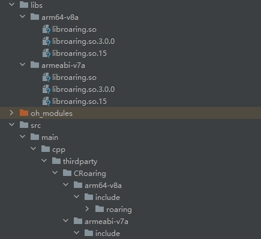

# CRoaring 集成到应用hap

本库是在RK3568开发板上基于OpenHarmony3.2 Release版本的镜像验证的，如果是从未使用过RK3568，可以先查看[润和RK3568开发板标准系统快速上手](https://gitee.com/openharmony-sig/knowledge_demo_temp/tree/master/docs/rk3568_helloworld)。

## 开发环境

- [开发环境准备](../../../docs/hap_integrate_environment.md)

## 编译三方库

- 下载本仓库

  ```shell
  git clone https://gitee.com/openharmony-sig/tpc_c_cplusplus.git --depth=1
  ```

- 三方库目录结构

  ```shell
  tpc_c_cplusplus/thirdparty/CRoaring   #三方库CRoaring的目录结构如下
  ├── CRoaring_oh_pkg.patch             #修复三方库编译失败补丁
  ├── docs                              #三方库相关文档的文件夹
  ├── HPKBUILD                          #构建脚本
  ├── HPKCHECK                          #测试脚本
  ├── SHA512SUM                         #三方库校验文件
  ├── OAT.xml                           #OAT开源审查文本文件
  ├── README.OpenSource                 #说明三方库源码的下载地址，版本，license等信息
  ├── README_zh.md                      #三方库简介
  ```

- 在lycium目录下编译三方库

  编译环境的搭建参考[准备三方库构建环境](../../../lycium/README.md#1编译环境准备)

  ```shell
  cd lycium
  ./build.sh CRoaring
  ```

- 三方库头文件及生成的库

  在lycium目录下会生成usr目录，该目录下存在已编译完成的32位和64位三方库

  ```shell
  CRoaring/arm64-v8a   CRoaring/armeabi-v7a
  ```

- [测试三方库](#测试三方库)

## 应用中使用三方库

- 在IDE的cpp目录下新增thirdparty目录，将编译生成的头文件拷贝到该目录下，将编译生成的三方库拷贝到工程的libs目录，如下图所示：
  &nbsp;

  &nbsp;

- 在最外层（cpp目录下）CMakeLists.txt中添加如下语句

  ```shell
  #将三方库加入工程中
  target_link_libraries(entry  PRIVATE ${CMAKE_CURRENT_SOURCE_DIR}/../../../libs/${OHOS_ARCH}/libroaring.so)
  #将三方库的头文件加入工程中
  target_include_directories(entry PRIVATE ${CMAKE_CURRENT_SOURCE_DIR}/thirdparty/CRoaring/${OHOS_ARCH}/include)
  ```

## 测试三方库

三方库的测试使用原库自带的测试用例来做测试

进入到构建目录执行（arm64-v8a-build为构建64位的目录，armeabi-v7a-build为构建32位的目录）
```shell
   ctest       #执行测试用例
```
&nbsp;

## 参考资料

- [润和RK3568开发板标准系统快速上手](https://gitee.com/openharmony-sig/knowledge_demo_temp/tree/master/docs/rk3568_helloworld)
- [OpenHarmony三方库地址](https://gitee.com/openharmony-tpc)
- [OpenHarmony知识体系](https://gitee.com/openharmony-sig/knowledge)
- [通过DevEco Studio开发一个NAPI工程](https://gitee.com/openharmony-sig/knowledge_demo_temp/blob/master/docs/napi_study/docs/hello_napi.md)