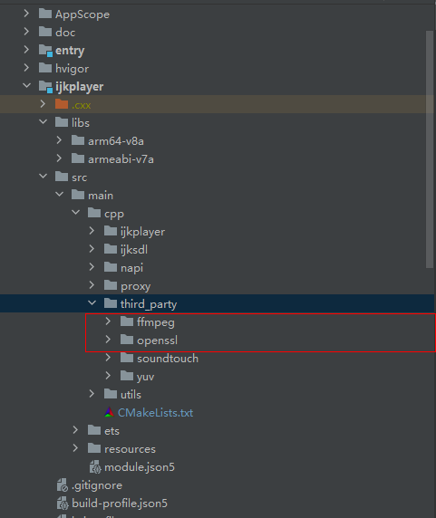

# FFmpeg-ff4.0三方库说明

## 前言

​	FFmpeg-ff4.0是为适配[ohos_ijkplayer](https://gitee.com/openharmony-sig/ohos_ijkplayer)的指定版本，tags：ff4.0--ijk0.8.8--20210426--001。


## 构建准备

[准备三方库构建环境](../../lycium/README.md#1编译环境准备)


## 构建方式

```
#编译库
cd tpc_c_cplusplus/lycium
./build.sh FFmpeg-ff4.0

#库所在目录
tpc_c_cplusplus/lycium/usr/FFmpeg-ff4.0
```


## 如何在[ohos_ijkplayer](https://gitee.com/openharmony-sig/ohos_ijkplayer) 中使用

1.在库目录中取出openssl以及FFmpeg的文件夹，存放到工程的ijkplayer/src/main/cpp/thirdparty下，如图所示



2.修改ijkplayer/src/main/cpp/下的CMakeLists.txt文件以及ijkplayer、ijksdl中的CMakeLists.txt文件，总共三个CMakeLists.txt文件，请注意

```
#CMakeLists.txt都屏蔽以下内容
#target_link_libraries(ijkplayer ijkffmpeg)

#add_library(ijkffmpeg SHARED IMPORTED)
#set_target_properties(ijkffmpeg PROPERTIES IMPORTED_LOCATION ${CMAKE_CURRENT_SOURCE_DIR}/../../../../libs/${OHOS_ARCH}/libijkffmpeg.z.so)
```

```
#ijkplayer/src/main/cpp/ijkplayer中的CMakeLists.txt添加如下内容
include_directories(${CMAKE_CURRENT_SOURCE_DIR}/../third_party/ffmpeg/${OHOS_ARCH}/include)
include_directories(${CMAKE_CURRENT_SOURCE_DIR}/../third_party/openssl/${OHOS_ARCH}/include)

target_link_libraries(ijkplayer PUBLIC z)
target_link_libraries(ijkplayer PUBLIC avcodec)
target_link_libraries(ijkplayer PUBLIC avfilter)
target_link_libraries(ijkplayer PUBLIC avformat)
target_link_libraries(ijkplayer PUBLIC avutil)
target_link_libraries(ijkplayer PUBLIC swresample)
target_link_libraries(ijkplayer PUBLIC swscale)
target_link_libraries(ijkplayer PUBLIC avdevice)
target_link_libraries(ijkplayer PUBLIC crypto)
target_link_libraries(ijkplayer PUBLIC ssl)
target_link_directories(ijkplayer PUBLIC ${CMAKE_CURRENT_SOURCE_DIR}/../third_party/ffmpeg/${OHOS_ARCH}/lib ${CMAKE_CURRENT_SOURCE_DIR}/../third_party/openssl/${OHOS_ARCH}/lib)
```

```
#ijkplayer/src/main/cpp/ijksdl中的CMakeLists.txt添加如下内容
include_directories(${CMAKE_CURRENT_SOURCE_DIR}/../third_party/ffmpeg/${OHOS_ARCH}/include)
include_directories(${CMAKE_CURRENT_SOURCE_DIR}/../third_party/openssl/${OHOS_ARCH}/include)

target_link_libraries(ijksdl PUBLIC z)
target_link_libraries(ijksdl PUBLIC avcodec)
target_link_libraries(ijksdl PUBLIC avfilter)
target_link_libraries(ijksdl PUBLIC avformat)
target_link_libraries(ijksdl PUBLIC avutil)
target_link_libraries(ijksdl PUBLIC swresample)
target_link_libraries(ijksdl PUBLIC swscale)
target_link_libraries(ijksdl PUBLIC avdevice)
target_link_libraries(ijksdl PUBLIC crypto)
target_link_libraries(ijksdl PUBLIC ssl)
target_link_directories(ijksdl PUBLIC ${CMAKE_CURRENT_SOURCE_DIR}/../third_party/ffmpeg/${OHOS_ARCH}/lib ${CMAKE_CURRENT_SOURCE_DIR}/../third_party/openssl/${OHOS_ARCH}/lib)
```

```
#ijkplayer/src/main/cpp/中的CMakeLists.txt添加如下内容
include_directories(${CMAKE_CURRENT_SOURCE_DIR}/third_party/ffmpeg/${OHOS_ARCH}/include)
include_directories(${CMAKE_CURRENT_SOURCE_DIR}/third_party/openssl/${OHOS_ARCH}/include)

修改
set(CMAKE_C_FLAGS "${CMAKE_C_FLAGS} -Wno-int-conversion")
替换成
set(CMAKE_C_FLAGS "${CMAKE_C_FLAGS} -Wno-int-conversion -Wl,-Bsymbolic")
set(CMAKE_CXX_FLAGS "${CMAKE_CXX_FLAGS} -Wno-int-conversion -Wl,-Bsymbolic")
```

