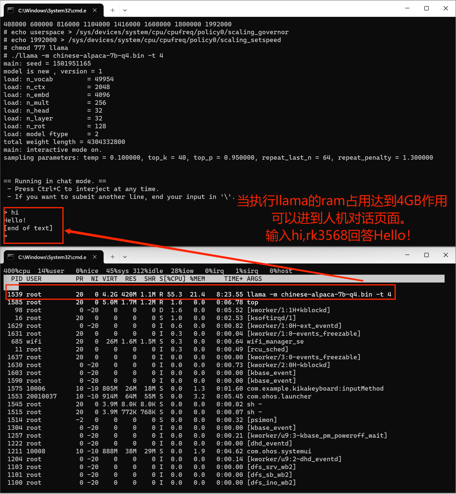

# InferLLM在OpenHarHarmony上运行

本库是在RK3568开发板上基于OpenHarmony3.2 Release版本的镜像验证的，如果是从未使用过RK3568，可以先查看[润和RK3568开发板标准系统快速上手](https://gitee.com/openharmony-sig/knowledge_demo_temp/tree/master/docs/rk3568_helloworld)。

## 开发环境

- [开发环境准备](../../../docs/hap_integrate_environment.md)

## 编译三方库

- 下载本仓库

  ```
  git clone https://gitee.com/openharmony-sig/tpc_c_cplusplus.git --depth=1
  ```

- 三方库目录结构

  ```shell
  tpc_c_cplusplus/thirdparty/InferLLM    #三方库InferLLM的目录结构如下
  ├── docs                               #三方库相关文档的文件夹
  ├── HPKBUILD                           #构建脚本
  ├── README_zh.md		                   #InferLLM说明文档
  ├── SHA512SUM                          #三方库校验文件
  ├── OAT.xml                            #OAT开源审查文本
  ```

- 在lycium目录下编译三方库
  编译环境的搭建参考[准备三方库构建环境](../../../lycium/README.md#1编译环境准备)

  ```
  cd lycium
  ./build.sh InferLLM
  ```


- 三方库头文件及生成的库
  在tpc_c_cplusplus/thirdparty/InferLLM/目录下会生成InferLLM-405d866e4c11b884a8072b4b30659c63555be41d目录，该目录下存在已编译完成的32位和64位三方库。（相关编译结果不会被打包进入lycium目录下的usr目录）

  ```
  InferLLM-405d866e4c11b884a8072b4b30659c63555be41d/arm64-v8a-build  
  InferLLM-405d866e4c11b884a8072b4b30659c63555be41d/armeabi-v7a-build
  ```

- [测试三方库](#测试三方库)

## 测试三方库

`特别说明：InferLLM相关编译产物不能被集成进hap（没有头文件库和api引出）`

对InferLLM三方库的测试通过执行它的编译产物llama可执行文件来进行，在OpenHarmony设备 rk3568开发板（2GB版本）上部署大语言模型。

- 测试准备
  - 1.下载模型文件：[chinese-alpaca-7b-q4.bin](https://huggingface.co/kewin4933/InferLLM-Model/tree/main)
  - 2.将编译InferLLM生成的`llama可执行文件`、OpenHarmony sdk中的`libc++_shared.so`、下载好的模型文件`chinese-alpaca-7b-q4.bin` 打包成文件夹 llama_file

```
# 将llama_file文件夹发送到开发板data目录
hdc file send llama_file /data
```

```
# hdc shell 进入开发板执行
cd data/llama_file

# 在2GB的dayu200上加swap交换空间
# 新建一个空的ram_ohos文件
touch ram_ohos
# 创建一个用于交换空间的文件（8GB大小的交换文件）
fallocate -l 8G /data/ram_ohos
# 设置文件权限，以确保所有用户可以读写该文件：
chmod 777 /data/ram_ohos
# 将文件设置为交换空间：
mkswap /data/ram_ohos
# 启用交换空间：
swapon /data/ram_ohos

# 设置库搜索路径
export LD_LIBRARY_PATH=/data/llama_file:$LD_LIBRARY_PATH

# 提升rk3568cpu频率
# 查看 CPU 频率
cat /sys/devices/system/cpu/cpu*/cpufreq/cpuinfo_cur_freq

# 查看 CPU 可用频率（不同平台显示的可用频率会有所不同）
cat /sys/devices/system/cpu/cpufreq/policy0/scaling_available_frequencies

# 将 CPU 调频模式切换为用户空间模式，这意味着用户程序可以手动控制 CPU 的工作频率，而不是由系统自动管理。这样可以提供更大的灵活性和定制性，但需要注意合理调整频率以保持系统稳定性和性能。
echo userspace > /sys/devices/system/cpu/cpufreq/policy0/scaling_governor

# 设置rk3568 CPU 频率为1.9GHz
echo 1992000 > /sys/devices/system/cpu/cpufreq/policy0/scaling_setspeed

# 执行大语言模型
chmod 777 llama
./llama -m chinese-alpaca-7b-q4.bin -t 4
```

移植InferLLM三方库在OpenHarmmony设备rk3568上部署大语言模型实现人机对话。最后运行效果有些慢，跳出人机对话框也有些慢，请耐心等待。




## 参考资料

- [润和RK3568开发板标准系统快速上手](https://gitee.com/openharmony-sig/knowledge_demo_temp/tree/master/docs/rk3568_helloworld)
- [OpenHarmony三方库地址](https://gitee.com/openharmony-tpc)
- [OpenHarmony知识体系](https://gitee.com/openharmony-sig/knowledge)
- [通过DevEco Studio开发一个NAPI工程](https://gitee.com/openharmony-sig/knowledge_demo_temp/blob/master/docs/napi_study/docs/hello_napi.md)
