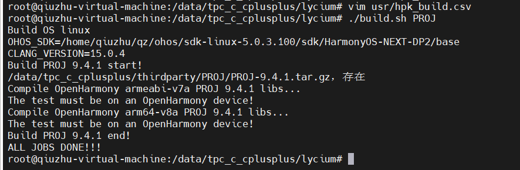
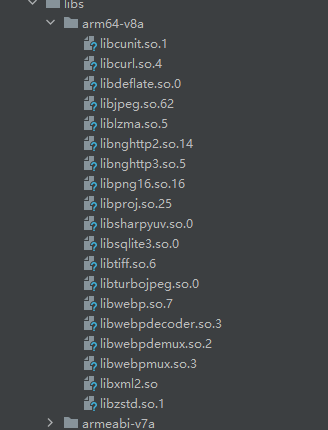
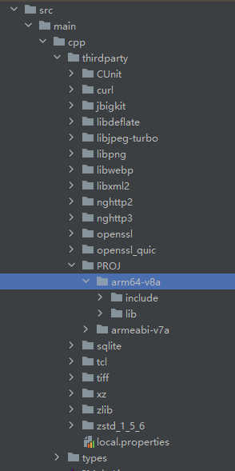
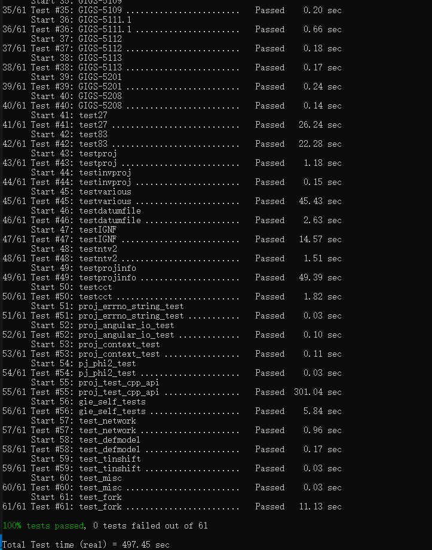

# PROJ集成到应用hap

本库是在RK3568开发板上基于OpenHarmony3.2 Release版本的镜像验证的，如果是从未使用过RK3568，可以先查看[润和RK3568开发板标准系统快速上手](https://gitee.com/openharmony-sig/knowledge_demo_temp/tree/master/docs/rk3568_helloworld)。

## 开发环境

- [开发环境准备](../../../docs/hap_integrate_environment.md)

## 编译三方库

- 下载本仓库

  ```shell
  git clone https://gitee.com/openharmony-sig/tpc_c_cplusplus.git --depth=1
  ```

- 三方库目录结构

  ```shell
  tpc_c_cplusplus/thirdparty/PROJ       #三方库PROJ的目录结构如下
  ├── docs                             	#三方库相关文档的文件夹
  ├── HPKBUILD                         	#构建脚本
  ├── HPKCHECK                         	#测试脚本
  ├── SHA512SUM                        	#三方库校验文件
  ├── README.OpenSource                	#说明三方库源码的下载地址，版本、license等信息
  ├── README_zh.md   
  ```
  
- 在lycium目录下编译三方库

  编译环境的搭建参考[准备三方库构建环境](../../../lycium/README.md#1编译环境准备)

  ```shell
  cd lycium
  ./build.sh PROJ
  ```
- 

- 三方库头文件及生成的库

  在lycium目录下会生成usr目录，该目录下存在已编译完成的32位和64位三方库

  ```shell
  PROJ/arm64-v8a   PROJ/armeabi-v7a
  ```
  
- [测试三方库](#测试三方库)

## 应用中使用三方库

- 需要将PROJ生成的so动态库文件以及依赖的库文件拷贝到entry/libs目录下

- 

- 在IDE的cpp目录下新增thirdparty目录，将生成的头文件拷贝到该目录下，如下图所示
  
- 

- 在最外层（cpp目录下）CMakeLists.txt中添加如下语句

#将三方库的头文件和库文件加入工程中
```
#将三方库加入工程中
target_link_libraries(entry PRIVATE ${CMAKE_CURRENT_SOURCE_DIR}/thirdparty/sqlite/${OHOS_ARCH}/lib/libsqlite3.so.0
    ${CMAKE_CURRENT_SOURCE_DIR}/thirdparty/libjpeg-turbo/${OHOS_ARCH}/lib/libjpeg.so.62
    ${CMAKE_CURRENT_SOURCE_DIR}/thirdparty/libjpeg-turbo/${OHOS_ARCH}/lib/libturbojpeg.so.0
    ${CMAKE_CURRENT_SOURCE_DIR}/thirdparty/xz/${OHOS_ARCH}/lib/liblzma.so.5
    ${CMAKE_CURRENT_SOURCE_DIR}/thirdparty/libdeflate/${OHOS_ARCH}/lib/libdeflate.so.0
    ${CMAKE_CURRENT_SOURCE_DIR}/thirdparty/jbigkit/${OHOS_ARCH}/lib/libjbig.a
    ${CMAKE_CURRENT_SOURCE_DIR}/thirdparty/jbigkit/${OHOS_ARCH}/lib/libjbig85.a
    ${CMAKE_CURRENT_SOURCE_DIR}/thirdparty/openssl/${OHOS_ARCH}/lib/libssl.a
    ${CMAKE_CURRENT_SOURCE_DIR}/thirdparty/openssl/${OHOS_ARCH}/lib/libcrypto.a
    ${CMAKE_CURRENT_SOURCE_DIR}/thirdparty/libpng/${OHOS_ARCH}/lib/libpng16.so.16
    ${CMAKE_CURRENT_SOURCE_DIR}/thirdparty/libwebp/${OHOS_ARCH}/lib/libwebp.so.7
    ${CMAKE_CURRENT_SOURCE_DIR}/thirdparty/libwebp/${OHOS_ARCH}/lib/libsharpyuv.so.0
    ${CMAKE_CURRENT_SOURCE_DIR}/thirdparty/libwebp/${OHOS_ARCH}/lib/libwebpdecoder.so.3
    ${CMAKE_CURRENT_SOURCE_DIR}/thirdparty/libwebp/${OHOS_ARCH}/lib/libwebpdemux.so.2
    ${CMAKE_CURRENT_SOURCE_DIR}/thirdparty/libwebp/${OHOS_ARCH}/lib/libwebpmux.so.3
    ${CMAKE_CURRENT_SOURCE_DIR}/thirdparty/zstd_1_5_6/${OHOS_ARCH}/lib/libzstd.so.1
    ${CMAKE_CURRENT_SOURCE_DIR}/thirdparty/tiff/${OHOS_ARCH}/lib/libtiff.so.6
    ${CMAKE_CURRENT_SOURCE_DIR}/thirdparty/openssl_quic/${OHOS_ARCH}/lib/libcrypto.a
    ${CMAKE_CURRENT_SOURCE_DIR}/thirdparty/CUnit/${OHOS_ARCH}/lib/libcunit.so.1
    ${CMAKE_CURRENT_SOURCE_DIR}/thirdparty/nghttp3/${OHOS_ARCH}/lib/libnghttp3.so.5
    ${CMAKE_CURRENT_SOURCE_DIR}/thirdparty/libxml2/${OHOS_ARCH}/lib/libxml2.so
    ${CMAKE_CURRENT_SOURCE_DIR}/thirdparty/nghttp2/${OHOS_ARCH}/lib/libnghttp2.so.14
    ${CMAKE_CURRENT_SOURCE_DIR}/thirdparty/curl/${OHOS_ARCH}/lib/libcurl.so.4
    ${CMAKE_CURRENT_SOURCE_DIR}/thirdparty/PROJ/${OHOS_ARCH}/lib/libproj.so.25)

#将三方库的头文件加入工程中
target_include_directories(entry PRIVATE ${CMAKE_CURRENT_SOURCE_DIR}/thirdparty/sqlite/${OHOS_ARCH}/include
    ${CMAKE_CURRENT_SOURCE_DIR}/thirdparty/libjpeg-turbo/${OHOS_ARCH}/include
    ${CMAKE_CURRENT_SOURCE_DIR}/thirdparty/xz/${OHOS_ARCH}/include
    ${CMAKE_CURRENT_SOURCE_DIR}/thirdparty/libdeflate/${OHOS_ARCH}/include
    ${CMAKE_CURRENT_SOURCE_DIR}/thirdparty/jbigkit/${OHOS_ARCH}/include
    ${CMAKE_CURRENT_SOURCE_DIR}/thirdparty/openssl/${OHOS_ARCH}/include
    ${CMAKE_CURRENT_SOURCE_DIR}/thirdparty/libpng/${OHOS_ARCH}/include
    ${CMAKE_CURRENT_SOURCE_DIR}/thirdparty/libwebp/${OHOS_ARCH}/include
    ${CMAKE_CURRENT_SOURCE_DIR}/thirdparty/zstd_1_5_6/${OHOS_ARCH}/include
    ${CMAKE_CURRENT_SOURCE_DIR}/thirdparty/tiff/${OHOS_ARCH}/include
    ${CMAKE_CURRENT_SOURCE_DIR}/thirdparty/openssl_quic/${OHOS_ARCH}/include
    ${CMAKE_CURRENT_SOURCE_DIR}/thirdparty/CUnit/${OHOS_ARCH}/include
    ${CMAKE_CURRENT_SOURCE_DIR}/thirdparty/nghttp3/${OHOS_ARCH}/include
    ${CMAKE_CURRENT_SOURCE_DIR}/thirdparty/libxml2/${OHOS_ARCH}/include
    ${CMAKE_CURRENT_SOURCE_DIR}/thirdparty/nghttp2/${OHOS_ARCH}/include
    ${CMAKE_CURRENT_SOURCE_DIR}/thirdparty/curl/${OHOS_ARCH}/include
    ${CMAKE_CURRENT_SOURCE_DIR}/thirdparty/PROJ/${OHOS_ARCH}/include)
```

## 测试三方库

三方库的测试使用原库自带的测试用例来做测试，[准备三方库测试环境](../../../lycium/README.md#3ci环境准备)

进入到构建目录运行测试用例（注意arm64-v8a为构建64位的目录，armeabi-v7a为构建32位的目录），执行ctest前，需要导入环境变量
```shell
  export LD_LIBRARY_PATH=${LD_LIBRARY_PATH}:/data/tpc_c_cplusplus/thirdparty/PROJ/PROJ-9.4.1/armeabi-v7a-build/lib/:/data/tpc_c_cplusplus/lycium/usr/sqlite/armeabi-v7a/lib/:/data/tpc_c_cplusplus/lycium/usr/tiff/armeabi-v7a/lib/:/data/tpc_c_cplusplus/lycium/usr/curl/armeabi-v7a/lib/:/data/lycium-citools/armeabi-v7a-gdb/lib/:/data/tpc_c_cplusplus/lycium/usr/libdeflate/armeabi-v7a/lib/:/data/tpc_c_cplusplus/lycium/usr/libjpeg-turbo/armeabi-v7a/lib/:/data/tpc_c_cplusplus/lycium/usr/xz/armeabi-v7a/lib/:/data/tpc_c_cplusplus/lycium/usr/zstd_1_5_6/armeabi-v7a/lib/:/data/tpc_c_cplusplus/lycium/usr/libwebp/armeabi-v7a/lib/:/data/tpc_c_cplusplus/lycium/usr/nghttp2/armeabi-v7a/lib/
  (或者export LD_LIBRARY_PATH=${LD_LIBRARY_PATH}:/data/tpc_c_cplusplus/thirdparty/PROJ/PROJ-9.4.1/arm64-v8a-build/lib/:/data/tpc_c_cplusplus/lycium/usr/sqlite/arm64-v8a/lib/:/data/tpc_c_cplusplus/lycium/usr/tiff/arm64-v8a/lib/:/data/tpc_c_cplusplus/lycium/usr/curl/arm64-v8a/lib/:/data/lycium-citools/arm64-v8a-gdb/lib/:/data/tpc_c_cplusplus/lycium/usr/libdeflate/arm64-v8a/lib/:/data/tpc_c_cplusplus/lycium/usr/libjpeg-turbo/arm64-v8a/lib/:/data/tpc_c_cplusplus/lycium/usr/xz/arm64-v8a/lib/:/data/tpc_c_cplusplus/lycium/usr/zstd_1_5_6/arm64-v8a/lib/:/data/tpc_c_cplusplus/lycium/usr/libwebp/arm64-v8a/lib/:/data/tpc_c_cplusplus/lycium/usr/nghttp2/arm64-v8a/lib/)

  export PATH=${PATH}:/data/tpc_c_cplusplus/lycium/usr/sqlite/armeabi-v7a/bin/
  (或者export PATH=${PATH}:/data/tpc_c_cplusplus/lycium/usr/sqlite/arm64-v8a/bin/)
```
执行ctest及结果如图所示
```shell
  cd /data/tpc_c_cplusplus/thirdparty/PROJ/PROJ-4.9.2/armeabi-v7a-build(或者cd /data/tpc_c_cplusplus/thirdparty/PROJ/PROJ-4.9.2/arm64-v8a-build)
  ctest
```

- 测试结果如图所示：
- 

## 参考资料

- [OpenHarmony三方库地址](https://gitee.com/openharmony-tpc)
- [OpenHarmony知识体系](https://gitee.com/openharmony-sig/knowledge)
- [PROJ三方库地址](https://github.com/OSGeo/PROJ)
