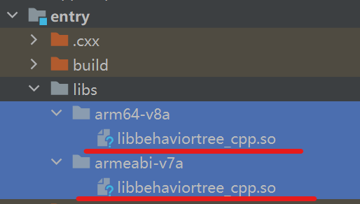
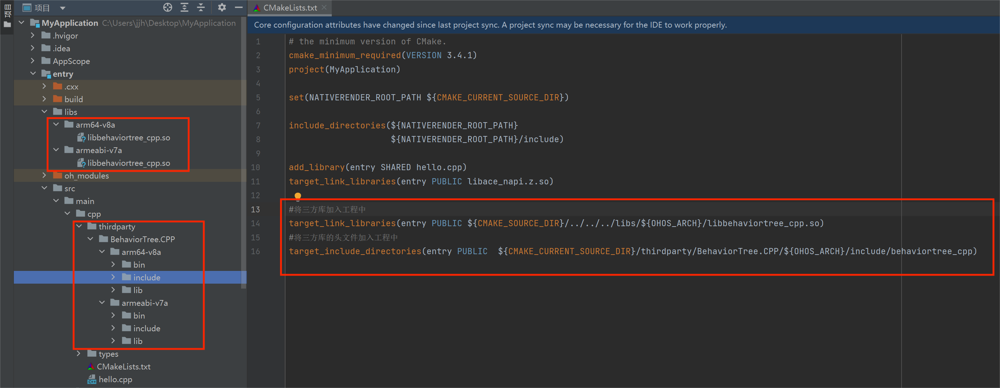
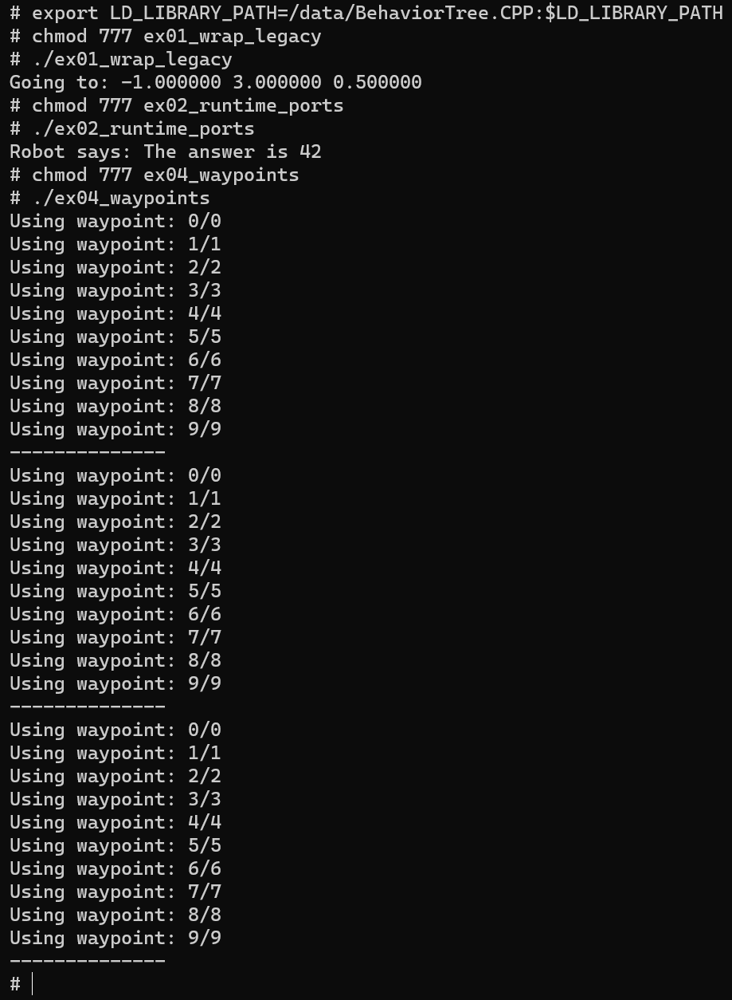

# BehaviorTree.CPP集成到应用hap

本库是在RK3568开发板上基于OpenHarmony3.2 Release版本的镜像验证的，如果是从未使用过RK3568，可以先查看[润和RK3568开发板标准系统快速上手](https://gitee.com/openharmony-sig/knowledge_demo_temp/tree/master/docs/rk3568_helloworld)。

## 开发环境

- [开发环境准备](../../../docs/hap_integrate_environment.md)

## 编译三方库

- 下载本仓库

  ```shell
  git clone https://gitee.com/openharmony-sig/tpc_c_cplusplus.git --depth=1
  ```

- 三方库目录结构

  ```shell
  tpc_c_cplusplus/thirdparty/behaviortree    #三方库behaviortree的目录结构如下
  ├── docs                              #三方库相关文档的文件夹
  ├── HPKBUILD                          #构建脚本
  ├── HPKCHECK                          #测试脚本
  ├── SHA512SUM                         #三方库校验文件
  ├── README.OpenSource                 #说明三方库源码的下载地址，版本，license等信息
  ├── README_zh.md   
  ├── behaviortree_oh_pkg.patch
  ```

- 在lycium目录下编译三方库

  编译环境的搭建参考[准备三方库构建环境](../../../lycium/README.md#1编译环境准备)

  ```shell
  cd lycium
  ./build.sh behaviortree
  ```

- 三方库头文件及生成的库

  在lycium目录下会生成usr目录，该目录下存在已编译完成的32位和64位三方库

  ```shell
  BehaviorTree.CPP/arm64-v8a   BehaviorTree.CPP/armeabi-v7a
  ```
  
- [测试三方库](#测试三方库)

## 应用中使用三方库

- 需要将libbehaviortree_cpp.so相关目录拷贝到entry/libs目录下


- 在IDE的cpp目录下新增thirdparty目录，将编译生成的头文件拷贝到该目录下，本库是一个头文件库，如下图所示：

  
- 在最外层（cpp目录下）CMakeLists.txt中添加如下语句

  ```cmake
  #将三方库加入工程中
  target_link_libraries(entry PUBLIC ${CMAKE_SOURCE_DIR}/../../../libs/${OHOS_ARCH}/libbehaviortree_cpp.so)

  #将三方库的头文件加入工程中
  target_include_directories(entry PUBLIC  ${CMAKE_CURRENT_SOURCE_DIR}/thirdparty/BehaviorTree.CPP/${OHOS_ARCH}/include/behaviortree_cpp)
  ```
  

## 测试三方库

三方库的测试使用原库自带的测试用例来做测试

- 将原生库测试编译出来的ex01_wrap_legacy.cpp、ex02_runtime_ports.cpp、ex03_ncurses_manual_selector.cpp
ex04_waypoints.cpp、t01_build_your_first_tree.cpp、t02_basic_ports.cpp、t03_generic_ports.cpp、t04_reactive_sequence.cpp、t05_crossdoor.cpp、t06_subtree_port_remapping.cpp、t07_load_multiple_xml.cpp、t08_additional_node_args.cpp、t09_scripting.cpp、t10_observer.cpp、t11_replace_rules.cpp和libc++_shared.so、libbehaviortree_cpp.so打包为BehaviorTree.CPP文件

- 将BehaviorTree.CPP推送至开发板

```
hdc shell mount -o remount,rw /     #修改系统权限为可读写
hdc file send BehaviorTree.CPP /data         #将文件包推入开发
```

- 运行测试程序 测试用例非常多，这里演示其中几个用例，如下图
```
cd BehaviorTree.CPP
export LD_LIBRARY_PATH=/data/BehaviorTree.CPP:$LD_LIBRARY_PATH
```
 

## 参考资料

- [润和RK3568开发板标准系统快速上手](https://gitee.com/openharmony-sig/knowledge_demo_temp/tree/master/docs/rk3568_helloworld)
- [OpenHarmony三方库地址](https://gitee.com/openharmony-tpc)
- [OpenHarmony知识体系](https://gitee.com/openharmony-sig/knowledge)
- [通过DevEco Studio开发一个NAPI工程](https://gitee.com/openharmony-sig/knowledge_demo_temp/blob/master/docs/napi_study/docs/hello_napi.md)
