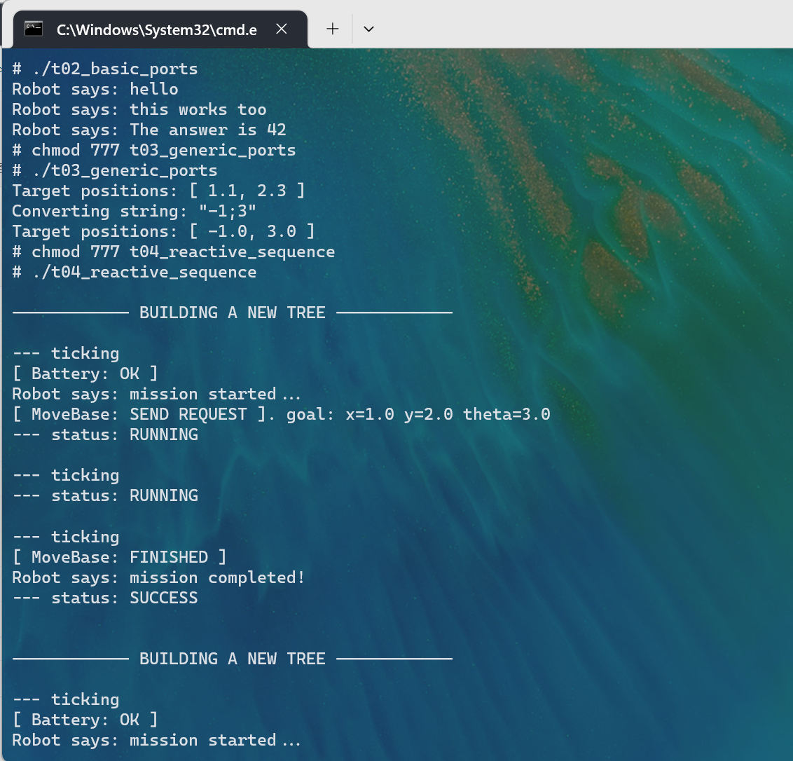

# behaviortree如何集成到系统Rom

## 准备源码工程

本库是基于OpenHarmony-v3.2-Release版本，在润和RK3568开发板上验证的。如果是从未使用过RK3568，可以先查看[润和RK3568开发板标准系统快速上手](https://gitee.com/openharmony-sig/knowledge_demo_temp/tree/master/docs/rk3568_helloworld)。

### 准备系统Rom源码

系统源码获取方法请参照：[OpenHarmony源码下载](https://gitee.com/openharmony/docs/blob/OpenHarmony-3.2-Release/zh-cn/release-notes/OpenHarmony-v3.2-release.md)

### 增加构建脚本及配置文件

- 下载本仓库代码

  ```sh
  cd ~/
  git clone git@gitee.com:openharmony-sig/tpc_c_cplusplus.git --depth=1
  ```

- 仓库代码目录结构说明
  
  ``` sh
  cd  ~/tpc_c_cplusplus/thirdparty/behaviortree/    # 进入到仓库代码库目录
  ```
  
  ``` sh
   behaviortree
      |-- docs                      ## BehaviorTree集成说明文档目录
           |-- pic                    ## 存放文档中的图片资源
      |-- BUILD.gn                  ## Rom版编译构建脚本
      |-- bundle.json               ## 组件定义文件
      |-- README.OpenSource          ## BehaviorTree 开源信息说明文档
      |-- README_zh.md              ## BehaviorTree 说明文档
  ```

- 将本仓库behaviortree文件夹拷贝到OpenHarmony的third_party下

  ``` sh
  cp -arf ~/tpc_c_cplusplus/thirdparty/behaviortree ~/OpenHarmony/third_party
  ```

### 准备三方库源码

- 三方库源码下载

   将behaviortree-4.1.1源码下载到behaviortree目录。

  ```shell
  cd ~/OpenHarmony/third_party/behaviortree
  git clone https://github.com/BehaviorTree/BehaviorTree.CPP.git -b 4.1.1
  ```

## 系统Rom中引入三方库

- 准备完三方库代码后，我们需要将三方库加入到编译构建体系中。标准系统编译构建可以参考文档[标准系统编译构建指导](https://gitee.com/openharmony/docs/blob/OpenHarmony-3.2-Beta1/zh-cn/device-dev/subsystems/subsys-build-standard-large.md)。
这里我们三方库默认添加到thirdparty子系统中(详细信息参照文档[如何添加一个三方库到OpenHarmony系统中](https://gitee.com/openharmony-sig/knowledge/blob/master/docs/openharmony_getstarted/port_thirdparty/README.md#%E5%8A%A0%E5%85%A5%E7%BC%96%E8%AF%91%E6%9E%84%E5%BB%BA%E4%BD%93%E7%B3%BB))。相关配置已在bundle.json中完成，我们只需要在产品定义中添加BehaviorTree组件即可。

- 在产品配置文件中添加BehaviorTree的组件
  打开//vendor/hihope/rk3568/config.json文件，找到thirdparty子系统并添加BehaviorTree的组件,如果文件中未指定thirdparty子系统，需要手动将子系统信息加上：

  ```json
  {
    "subsystem": "thirdparty",
    "components": [
        {
          "component": "musl",
          "features": []
        },
        {
            "component": "behaviortree",
            "features": []
        }
    ]
  }
  ```


## 系统Rom中引入三方库测试程序

如果需要编译测试用例，在OpenHarmony源码的vendor/hihope/rk3568/config.json文件,对应组件的features中打开编译选项，如下
  ```json
  {
    "subsystem": "thirdparty",
    "components": [
        {
          "component": "musl",
          "features": []
        },
        {
            "component": "behaviortree",
            "features": ["enable_behaviortree_test=true"]
        }
    ]
  }
  ```

## 编译工程

- 在此选择build.sh脚本编译方式
  ```
  ./build.sh --product-name rk3568 --ccache --build-target=behaviortree --target-cpu arm
  ```

  ```
  参数释义
  --product-name rk3568 编译rk3568产品
  --target-cpu arm 编译32位系统(未配置默认编译32位)
  --target-cpu arm64 编译64位系统
  ```

- 正常编译完后会在out/rk3568/thirdparty/behaviortree下生成ex01_wrap_legacy、ex02_runtime_ports、ex04_waypoints、t01_build_your_first_tree、t02_basic_ports、t03_generic_ports、t04_reactive_sequence、t05_crossdoor、t06_subtree_port_remapping、t07_load_multiple_xml、t08_additional_node_args、t09_scripting、t10_observer、t11_replace_rules等14个测试用例。

- 在out/rk3568/thirdparty/behaviortree下生成libbehaviortree_cpp.z.so

## 安装应用程序
将编译生成的库和测试文件放到板子上运行，为避免每次将文件推入设备都烧录整个镜像，使用hdc工具将文件推到开发板上 。

- 通过源码编译生成hdc工具
```
# 安装依赖
./build/build_scripts/env_setup.sh

# 执行完上述命令后记得执行source ~/.bashrc或者重启终端
source ~/.bashrc

# 安装编译SDK需要的依赖包
sudo apt-get install libxcursor-dev libxrandr-dev libxinerama-dev

# 选择产品ohos-sdk
./build.sh --product-name ohos-sdk --ccache --build-target ohos_ndk
```

- 将工具拷贝到Windows，可以为工具目录配置环境变量，也可以在工具所在目录打开windows命令

- 将原生库测试需要的所有文件打包成behaviortree.tar,并拷贝到windows下

```
hdc shell mount -oremount,rw /     #修改系统权限为可读写
hdc file send behaviortree.tar /         #将文件包推入开发板
hdc shell                          #进入开发板
tar xvf behaviortree.tar                     #解压
                                       #注意需要将库拷贝到/system/lib 或者/system/lib64目录下
```

- 运行测试程序 测试用例非常多，这里演示其中几个用例，如下图
 

## 参考资料
- [润和RK3568开发板标准系统快速上手](https://gitee.com/openharmony-sig/knowledge_demo_temp/tree/master/docs/rk3568_helloworld)
- [OpenHarmony三方库地址](https://gitee.com/openharmony-tpc)
- [OpenHarmony知识体系](https://gitee.com/openharmony-sig/knowledge)
- [如何为三方库组件中添加一个三方库](https://gitee.com/openharmony-sig/knowledge/blob/master/docs/openharmony_getstarted/port_thirdparty/README.md)
- [标准系统编译构建指导](https://gitee.com/openharmony/docs/blob/OpenHarmony-3.2-Beta1/zh-cn/device-dev/subsystems/subsys-build-standard-large.md)