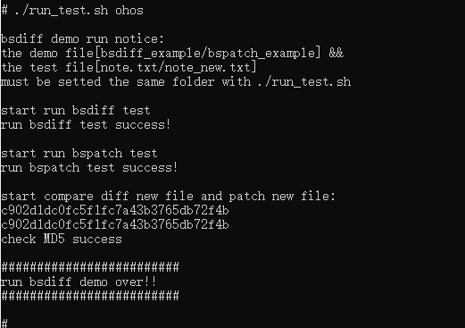

# bsdiff 如何集成到系统Rom

## 准备源码工程

本库是基于OpenHarmony 3.2 beta3版本适配，并在润和RK3568开发板上验证的。
RK3568开发板如何使用可以参照[润和RK3568开发板标准系统快速上手](https://gitee.com/openharmony-sig/knowledge_demo_temp/blob/master/docs/rk3568_helloworld/README.md)。

### 准备系统Rom源码

源码获取方法请参照：[OpenHarmony3.2beta3源码下载](https://gitee.com/openharmony/docs/blob/OpenHarmony-3.2-Beta5/zh-cn/release-notes/OpenHarmony-v3.2-beta3.md#%E6%BA%90%E7%A0%81%E8%8E%B7%E5%8F%96)

### 增加构建脚本及配置文件

- 下载本仓库代码

  ```sh
  cd ~/
  git clone git@gitee.com:openharmony-sig/tpc_c_cplusplus.git --depth=1
  ```

- 仓库代码目录结构说明

  ```shell
  cd  ~/tpc_c_cplusplus/thirdparty/bsdiff/    ## 进入到仓库代码库目录
  ```

  ```sh
  bsdiff
      |-- BUILD.gn            ## Rom版编译构建脚本
      |-- export_api.txt      ## bsdiff库对外导出的api接口
      |-- tested_api.txt      ## 测试用例已测试的api接口
      |-- bundle.json         ## 组件定义文件
      |-- README_zh.md        ## bsdiff 说明文档
      |-- README.OpenSource   ## bsdiff 开源信息说明文档
      |-- docs                ## 存放nsdiff相关文档
      |-- media               ## 存放图片的文件夹
      |-- testdata            ## 存放测试数据
          |-- run_test.sh     ## 测试用例运行脚本，注意：在运行该测试用例时，需要将做拆分与合并的2个测试应用程序放到当前路径下。
          |-- note.txt        ## 测试用例文件
          |-- note_new.txt    ## 测试用例新文件，与之前文件存在差异，通过测试用例做拆分与合并，最终生成一个新的文件与该文件一致。
  ```

- 将本仓库bsdiff文件夹拷贝到OpenHarmony的third_party下

  ```shell
  cp -arf ~/tpc_c_cplusplus/thirdparty/bsdiff ~/OpenHarmony/third_party
  ```

### 准备三方库源码

- 将源码下载到bsdiff目录并将其解压出来。

  ```shell
  cd ~/OpenHarmony/third_party/bsdiff                               ## 进入到bsdiff目录
  git clone https://github.com/mendsley/bsdiff.git                  ## 下载三方库
  ```

## 系统Rom中引入三方库

准备完三方库代码后，我们需要将三方库加入到编译构建体系中。标准系统编译构建可以参考文档[标准系统编译构建指导](https://gitee.com/openharmony/docs/blob/OpenHarmony-3.2-Beta1/zh-cn/device-dev/subsystems/subsys-build-standard-large.md)。
这里我们三方库默认添加到thirdparty子系统中(详细信息参照文档[如何添加一个三方库到OpenHarmony系统中](https://gitee.com/openharmony-sig/knowledge/blob/master/docs/openharmony_getstarted/port_thirdparty/README.md#%E5%8A%A0%E5%85%A5%E7%BC%96%E8%AF%91%E6%9E%84%E5%BB%BA%E4%BD%93%E7%B3%BB))。相关配置已在bundle.json中完成，我们只需要在产品定义中添加iconv组件即可。

- 在产品配置文件中添加bsdiff的组件

  打开//vendor/hihope/rk3568/config.json文件，找到thirdparty子系统并添加bsdiff的组件,如果文件中未指定thirdparty子系统，需要手动将子系统信息加上：
  
  ```json
  {
      "subsystem": "thirdparty",
      "components": [
       {
          "component": "bsdiff",
          "features": []
       }
      ]
  }
  ```

## 系统Rom中引入三方库测试程序

bsdiff原生库提供了测试用例，如需要引入测试程序，在OpenHarmony源码的vendor/hihope/rk3568/config.json文件,对应组件的features中打开编译选项：

```json
{
    "subsystem": "thirdparty",
    "components": [
     {
        "component": "bsdiff",
        "features": [ "enable_bsdiff_test=true" ]
     }
    ]
}
```

## 编译工程

- 选择产品

  ``` shell
  hb set      ## 运行hb set后会出现产品列表，在此我们选择 rk3568
  ```

- 运行编译

  ``` shell
  hb build --target-cpu arm -f ## --target-cpu arm 编译32位系统(未配置默认编译32位)，如果需要编译64位的需要改为--target-cpu arm64; -f 全量编译，不加-f则为增量编译。每次设置完产品后建议进行全量编译。
  ```

- 正常编译完后会在out/rk3568/packages/phone/system/bin下生成bsdiff_example和bspatch_example2个测试用例以及在out/rk3568/packages/phone/system/lib下生成libbsdiff_bspatch.z.so。
  
## 安装应用程序

将编译生成的库和测试文件放到板子上运行，为避免每次将文件推入设备都烧录整个镜像，我们使用hdc_std工具将文件推到开发板上。

- 通过源码编译生成hdc_std工具

  ```shell
  hb set                # 源码根目录下使用hb set 选择产品ohos-sdk
  hb build            # 最后工具编译出来在out/sdk/ohos-sdk/windows/toolchains/hdc_std.exe
  ```

- 将工具拷贝到Windows，可以为工具目录配置环境变量，也可以在工具所在目录打开windows命令
- 将原生库测试需要的所有文件打包成bsdiff.tar,并拷贝到windows下
- 将文件推送到开发板 ,具体步骤如下：

  ```shell
  hdc_std.exe file send bsdiff.tar /data/    ## 推送文件到开发板系统的data目录
  hdc_std.exe shell
  cd /data/
  tar -xvf bsdiff.tar                        ## 解压文件包
  cd bsdiff
  cp libbsdiff_bspatch.z.so    /lib/         ## 将库文件拷贝到系统lib目录
  ```

## 运行效果

运行测试脚本`./run_test.sh ohos`,测试结果如下图所示:



## 参考资料

- [润和RK3568开发板标准系统快速上手](https://gitee.com/openharmony-sig/knowledge_demo_temp/blob/master/docs/rk3568_helloworld/README.md)。
- [如何为三方库组件中添加一个三方库](https://gitee.com/openharmony-sig/knowledge/blob/master/docs/openharmony_getstarted/port_thirdparty/README.md)。
- [OpenHarmony3.2beta3介绍](https://gitee.com/openharmony/docs/blob/OpenHarmony-3.2-Beta5/zh-cn/release-notes/OpenHarmony-v3.2-beta3.md)。
- [OpenHarmony三方库组织地址](https://gitee.com/openharmony-tpc)。
- [知识体系](https://gitee.com/openharmony-sig/knowledge)。
