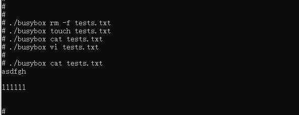

# busybox 如何集成到系统rom

## 准备工程

本库是基于OpenHarmony 3.2 beta3版本适配，并在润和RK3568开发板上验证的。
RK3568开发板如何使用可以参照[润和RK3568开发板标准系统快速上手](https://gitee.com/openharmony-sig/knowledge_demo_temp/blob/master/docs/rk3568_helloworld/README.md)。

### 准备系统Rom源码

源码获取方法请参照：[OpenHarmony3.2beta3源码下载](https://gitee.com/openharmony/docs/blob/OpenHarmony-3.2-Beta3/zh-cn/release-notes/OpenHarmony-v3.2-beta3.md#%E6%BA%90%E7%A0%81%E8%8E%B7%E5%8F%96)

### 增加构建脚本及配置文件

- 下载本仓库代码

  ```sh
  cd ~/
  git clone git@gitee.com:openharmony-sig/tpc_c_cplusplus.git --depth=1
  ```

- 仓库代码目录结构说明
  
  ``` sh
  cd  ~/tpc_c_cplusplus/thirdparty/busybox/    # 进入到仓库代码库目录
  ```
  
  ``` sh
  busybox
      |-- docs                      ## busybox集成说明文档目录
      |-- media                     ## 存放文档中的图片资源
      |-- adapted
          |-- busybox.config        ## busybox 配置文件
      |-- BUILD.gn                  ## Rom版编译构建脚本
      |-- bundle.json               ## 组件定义文件
      |-- build_busybox.sh          ## 调用busybox原生库进行编译的脚本文件
      |-- EADME.OpenSource          ## busybox 开源信息说明文档
      |-- README_zh.md              ## busybox 说明文档
  ```

- 将本仓库busybox文件夹拷贝到OpenHarmony的third_party下

  ``` sh
  cp -arf ~/tpc_c_cplusplus/thirdparty/busybox ~/OpenHarmony/third_party
  ```

### 准备三方库源码

`build_busybox.sh`脚本中设置了下载对应版本的busybox源码，无需手动下载该库的源码。

## 系统Rom中引入三方库

准备完三方库代码后，我们需要将三方库加入到编译构建体系中。标准系统编译构建可以参考文档[标准系统编译构建指导](https://gitee.com/openharmony/docs/blob/OpenHarmony-3.2-Beta1/zh-cn/device-dev/subsystems/subsys-build-standard-large.md)。
这里我们三方库默认添加到thirdparty子系统中(详细信息参照文档[如何添加一个三方库到OpenHarmony系统中](https://gitee.com/openharmony-sig/knowledge/blob/master/docs/openharmony_getstarted/port_thirdparty/README.md#%E5%8A%A0%E5%85%A5%E7%BC%96%E8%AF%91%E6%9E%84%E5%BB%BA%E4%BD%93%E7%B3%BB))。相关配置已在bundle.json中完成，我们只需要在产品定义中添加busybox组件即可。

- 在产品配置文件中添加busybox的组件
  打开//vendor/hihope/rk3568/config.json文件，找到thirdparty子系统并添加busybox的组件,如果文件中未指定thirdparty子系统，需要手动将子系统信息加上：

  ```json
  {
    "subsystem": "thirdparty",
    "components": [
        {
            "component": "busybox",
            "features": []
        }
    ]
  }
  ```

## 系统Rom中引入三方库测试程序

busybox最终生成的是busybox可执行文件，无需引入测试编译，引用原生库的测试逻辑即可。

## 编译工程

- 选择产品
  
  ``` sh
  hb set    ## 运行hb set后会出现产品列表，在此我们选择 rk3568
  ```

- 运行编译
  
  ``` sh
  hb build --target-cpu arm -f  ## --target-cpu arm 编译32位系统(未配置默认编译32位)，如果需要编译64位的需要改为--target-cpu arm64; -f 全量编译，不加-f则为增量编译。每次设置完产品后建议进行全量编译。
  ```

- 正常编译完后会在out/rk3568/packages/phone/system/bin下生成busybox文件

## 安装应用程序

将编译生成的库和测试文件放到板子上运行，为避免每次将文件推入设备都烧录整个镜像，我们使用hdc_std工具将文件推到开发板上。

- 通过源码编译生成hdc_std工具
  
  ``` sh
  hb set    ## 源码根目录下使用hb set 选择产品ohos-sdk
  hb build  ## 编译SDK，最后工具编译出来在out/sdk/ohos-sdk/windows/toolchains/hdc_std.exe
  ```

- 将工具拷贝到Windows，可以为工具目录配置环境变量，也可以在工具所在目录打开windows命令  
- 将busybox推送到开发板 ,具体步骤如下：

  ```sh
  hdc_std.exe file send busybox /data/              ## 将测试资源推送到板子
  hdc_std.exe shell                                 ## 进入设备系统
  cd /data                                          
  chmod a+x busybox                                 ## 设置busybox可执行权限
  ```

## 测试方法与运行结果

将busybox推送开发板后，可以直接运行busybox相关指令并可看到其执行结果，如下图所示:



## 参考资料

- [润和RK3568开发板标准系统快速上手](https://gitee.com/openharmony-sig/knowledge_demo_temp/blob/master/docs/rk3568_helloworld/README.md)
- [如何添加一个三方库到OpenHarmony的thirdparty子系统中](https://gitee.com/openharmony-sig/knowledge/blob/master/docs/openharmony_getstarted/port_thirdparty/README.md)
- [OpenHarmony3.2beta3介绍](https://gitee.com/openharmony/docs/blob/OpenHarmony-3.2-Beta3/zh-cn/release-notes/OpenHarmony-v3.2-beta3.md)
- [OpenHarmony三方库地址](https://gitee.com/openharmony-tpc)
- [OpenHarmony知识体系](https://gitee.com/openharmony-sig/knowledge)
