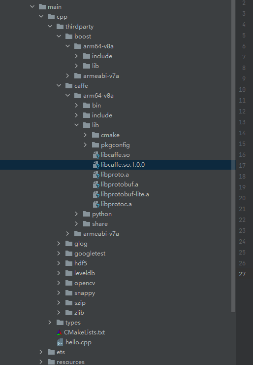
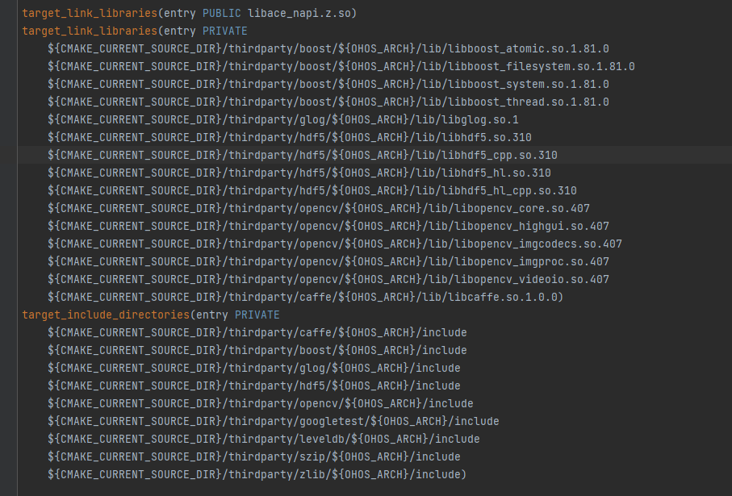
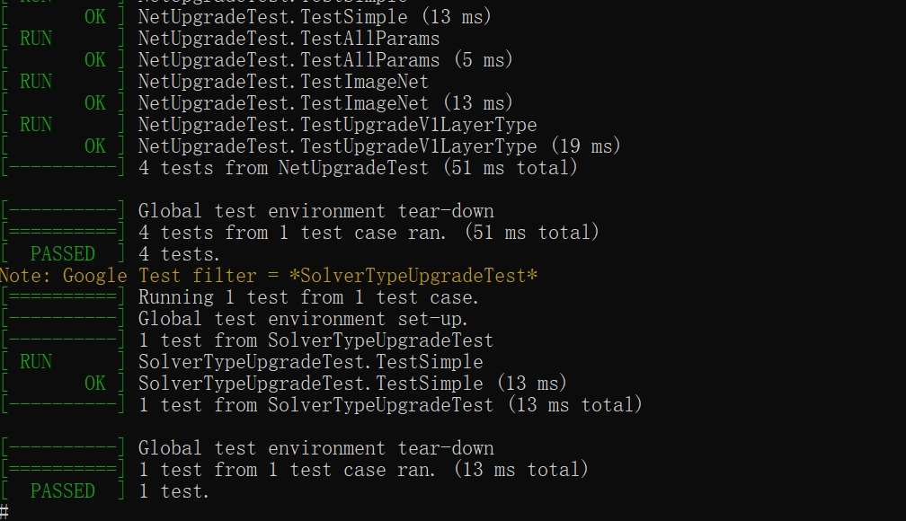

# caffe集成到应用hap
本库是在RK3568开发板上基于OpenHarmony3.2 Release版本的镜像验证的，如果是从未使用过RK3568，可以先查看[润和RK3568开发板标准系统快速上手](https://gitee.com/openharmony-sig/knowledge_demo_temp/tree/master/docs/rk3568_helloworld)。
## 开发环境
- ubuntu20.04
- [OpenHarmony3.2Release镜像](https://gitee.com/link?target=https%3A%2F%2Frepo.huaweicloud.com%2Fopenharmony%2Fos%2F3.2-Release%2Fdayu200_standard_arm32.tar.gz)
- [ohos_sdk_public 4.0.8.1 (API Version 10 Release)](http://download.ci.openharmony.cn/version/Master_Version/OpenHarmony_4.0.8.1/20230608_091016/version-Master_Version-OpenHarmony_4.0.8.1-20230608_091016-ohos-sdk-full.tar.gz)
- [DevEco Studio 3.1 Release](https://contentcenter-vali-drcn.dbankcdn.cn/pvt_2/DeveloperAlliance_package_901_9/81/v3/tgRUB84wR72nTfE8Ir_xMw/devecostudio-windows-3.1.0.501.zip?HW-CC-KV=V1&HW-CC-Date=20230621T074329Z&HW-CC-Expire=315360000&HW-CC-Sign=22F6787DF6093ECB4D4E08F9379B114280E1F65DA710599E48EA38CB24F3DBF2)
- [准备三方库构建环境](../../../lycium/README.md#1编译环境准备)
- [准备三方库测试环境](../../../lycium/README.md#3ci环境准备)
## 编译三方库
- 下载本仓库
  ```
  git clone https://gitee.com/openharmony-sig/tpc_c_cplusplus.git --depth=1
  ```
- 三方库目录结构
  ```
  tpc_c_cplusplus/thirdparty/caffe  #三方库caffe的目录结构如下
  ├── docs                          #三方库相关文档的文件夹
  ├── HPKBUILD                      #构建脚本
  ├── SHA512SUM                     #三方库校验文件
  ├── caffe_oh_pkg.patch            #补丁
  ├── README.OpenSource             #说明三方库源码的下载地址，版本，license等信息
  ├── Makefile.ohos                 #编译caffe所需依赖库cblas的makefile  
  ├── caffe_test.sh                 #三方库自测脚本  
  ├── README_zh.md   
  ```
  
- 在lycium目录下编译三方库
  编译环境的搭建参考[准备三方库构建环境](../../../lycium/README.md#1编译环境准备)
  
  ```shell
  cd lycium
  ./build.sh caffe
  ```
- 三方库头文件及生成的库
  在lycium目录下会生成usr目录，该目录下存在已编译完成的32位和64位三方库
  
  ```
  caffe/arm64-v8a   caffe/armeabi-v7a
  liboost/arm64-v8a  boost/armeabi-v7a  
  iboostb/arm64-v8a  boost/armeabi-v7a
  gflags/arm64-v8a  gflags/armeabi-v7a
  glog/arm64-v8a  glog/armeabi-v7a
  googletest/arm64-v8a  googletest/armeabi-v7a
  hdf5/arm64-v8a  hdf5/armeabi-v7a
  leveldb/arm64-v8a  leveldb/armeabi-v7a
  opencv/arm64-v8a  opencv/armeabi-v7a
  snappy/arm64-v8a  snappy/armeabi-v7a
  szip/arm64-v8a  szip/armeabi-v7a
  zlib/arm64-v8a  zlib/armeabi-v7a
  ```
  
- [测试三方库](#测试三方库)

## 应用中使用三方库

- 在IDE的cpp目录下新增thirdparty目录，将编译生成的库拷贝到该目录下，如下图所示
&nbsp;
- 在最外层（cpp目录下）CMakeLists.txt中添加如下语句
```shell
#将三方库加入工程中
target_link_libraries(entry PUBLIC libace_napi.z.so)
target_link_libraries(entry PRIVATE
	${CMAKE_CURRENT_SOURCE_DIR}/thirdparty/boost/${OHOS_ARCH}/lib/libboost_atomic.so.1.81.0
	${CMAKE_CURRENT_SOURCE_DIR}/thirdparty/boost/${OHOS_ARCH}/lib/libboost_filesystem.so.1.81.0
	${CMAKE_CURRENT_SOURCE_DIR}/thirdparty/boost/${OHOS_ARCH}/lib/libboost_system.so.1.81.0
	${CMAKE_CURRENT_SOURCE_DIR}/thirdparty/boost/${OHOS_ARCH}/lib/libboost_thread.so.1.81.0
	${CMAKE_CURRENT_SOURCE_DIR}/thirdparty/glog/${OHOS_ARCH}/lib/libglog.so.1
	${CMAKE_CURRENT_SOURCE_DIR}/thirdparty/hdf5/${OHOS_ARCH}/lib/libhdf5.so.310
	${CMAKE_CURRENT_SOURCE_DIR}/thirdparty/hdf5/${OHOS_ARCH}/lib/libhdf5_cpp.so.310
	${CMAKE_CURRENT_SOURCE_DIR}/thirdparty/hdf5/${OHOS_ARCH}/lib/libhdf5_hl.so.310
	${CMAKE_CURRENT_SOURCE_DIR}/thirdparty/hdf5/${OHOS_ARCH}/lib/libhdf5_hl_cpp.so.310
	${CMAKE_CURRENT_SOURCE_DIR}/thirdparty/opencv/${OHOS_ARCH}/lib/libopencv_core.so.407
	${CMAKE_CURRENT_SOURCE_DIR}/thirdparty/opencv/${OHOS_ARCH}/lib/libopencv_highgui.so.407
	${CMAKE_CURRENT_SOURCE_DIR}/thirdparty/opencv/${OHOS_ARCH}/lib/libopencv_imgcodecs.so.407
	${CMAKE_CURRENT_SOURCE_DIR}/thirdparty/opencv/${OHOS_ARCH}/lib/libopencv_imgproc.so.407
	${CMAKE_CURRENT_SOURCE_DIR}/thirdparty/opencv/${OHOS_ARCH}/lib/libopencv_videoio.so.407
	${CMAKE_CURRENT_SOURCE_DIR}/thirdparty/caffe/${OHOS_ARCH}/lib/libcaffe.so.1.0.0)
```

```shell
#将三方库的头文件加入工程中
target_include_directories(entry PRIVATE
	${CMAKE_CURRENT_SOURCE_DIR}/thirdparty/caffe/${OHOS_ARCH}/include
	${CMAKE_CURRENT_SOURCE_DIR}/thirdparty/boost/${OHOS_ARCH}/include
	${CMAKE_CURRENT_SOURCE_DIR}/thirdparty/glog/${OHOS_ARCH}/include
	${CMAKE_CURRENT_SOURCE_DIR}/thirdparty/hdf5/${OHOS_ARCH}/include
	${CMAKE_CURRENT_SOURCE_DIR}/thirdparty/opencv/${OHOS_ARCH}/include
	${CMAKE_CURRENT_SOURCE_DIR}/thirdparty/googletest/${OHOS_ARCH}/include
	${CMAKE_CURRENT_SOURCE_DIR}/thirdparty/leveldb/${OHOS_ARCH}/include
	${CMAKE_CURRENT_SOURCE_DIR}/thirdparty/szip/${OHOS_ARCH}/include
	${CMAKE_CURRENT_SOURCE_DIR}/thirdparty/zlib/${OHOS_ARCH}/include)
```

  
## 测试三方库
三方库的测试使用原库自带的测试用例来做测试，[准备三方库测试环境](../../../lycium/README.md#3ci环境准备)

- 将lycium/caffe/caffe_test.sh 文件拷贝到 lycium/caffe/caffe-1.0目录
- 将编译生成的lycium/caffe目录 压缩成caffe.tar.gz文件
- 将编译生成的lycium/usr目录   压缩成usr.tar.gz文件

- 将准备好的文件推送到开发板，在windows命令行进行如下操作

```shell
  hdc_std shell mount -o remount,rw /         #修改系统权限为可读写

  hdc_std file send libc++_shared.so /system/lib64 

  hdc_std file send caffe.tar.gz /data/local/tmp

  hdc_std file send usr.tar.gz /data/local/tmp

  hdc_std shell                          #进入开发板
  
  cd /data/local/tmp目录 
  tar -zxf caffe.tar.gz       #解压
  tar -zxf usr.tar.gz         #解压

  cd /data/local/tmp/caffe/caffe-1.0   
  
  LD_LIBRARY_PATH=/data/local/tmp/usr/boost/arm64-v8a/lib:/data/local/tmp/usr/caffe/arm64-v8a/lib:/data/local/tmp/usr/gflags/arm64-v8a/lib:/data/local/tmp/usr/glog/arm64-v8a/lib:/data/local/tmp/usr/googletest/arm64-v8a/lib:/data/local/tmp/usr/hdf5/arm64-v8a/lib:/data/local/tmp/usr/leveldb/arm64-v8a/lib:/data/local/tmp/usr/opencv/arm64-v8a/lib:/data/local/tmp/usr/snappy/arm64-v8a/lib:/data/local/tmp/usr/szip/arm64-v8a/lib:/data/local/tmp/usr/zlib/arm64-v8a/lib /bin/sh ./caffe_test.sh arm64-v8a    #64位系统 执行命令      

  LD_LIBRARY_PATH=/data/local/tmp/usr/boost/armeabi-v7a/lib:/data/local/tmp/usr/caffe/armeabi-v7a/lib:/data/local/tmp/usr/gflags/armeabi-v7a/lib:/data/local/tmp/usr/glog/armeabi-v7a/lib:/data/local/tmp/usr/googletest/armeabi-v7a/lib:/data/local/tmp/usr/hdf5/armeabi-v7a/lib:/data/local/tmp/usr/leveldb/armeabi-v7a/lib:/data/local/tmp/usr/opencv/armeabi-v7a/lib:/data/local/tmp/usr/snappy/armeabi-v7a/lib:/data/local/tmp/usr/szip/armeabi-v7a/lib:/data/local/tmp/usr/zlib/armeabi-v7a/lib /bin/sh ./caffe_test.sh armeabi-v7a                      #32位系统 执行命令

```

&nbsp;

## 参考资料
- [润和RK3568开发板标准系统快速上手](https://gitee.com/openharmony-sig/knowledge_demo_temp/tree/master/docs/rk3568_helloworld)
- [OpenHarmony三方库地址](https://gitee.com/openharmony-tpc)
- [OpenHarmony知识体系](https://gitee.com/openharmony-sig/knowledge)
- [通过DevEco Studio开发一个NAPI工程](https://gitee.com/openharmony-sig/knowledge_demo_temp/blob/master/docs/napi_study/docs/hello_napi.md)
