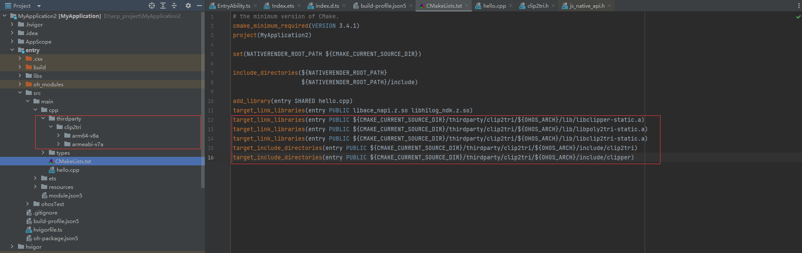
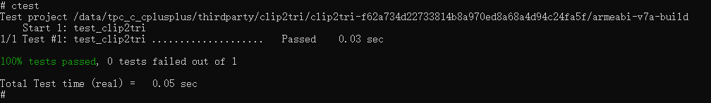

# clip2tri集成到应用hap

本库是在RK3568开发板上基于OpenHarmony3.2 Release版本的镜像验证的，如果是从未使用过RK3568，可以先查看[润和RK3568开发板标准系统快速上手](https://gitee.com/openharmony-sig/knowledge_demo_temp/tree/master/docs/rk3568_helloworld)。

## 开发环境

- [开发环境准备](../../../docs/hap_integrate_environment.md)

## 编译三方库

- 下载本仓库

  ```shell
  git clone https://gitee.com/openharmony-sig/tpc_c_cplusplus.git --depth=1
  ```

- 三方库目录结构

  ```shell
  tpc_c_cplusplus/thirdparty/clip2tri    #三方库clip2tri的目录结构如下
  ├── docs                              #三方库相关文档的文件夹
  ├── HPKBUILD                          #构建脚本
  ├── HPKCHECK                          #测试脚本
  ├── SHA512SUM                         #三方库校验文件
  ├── README.OpenSource                 #说明三方库源码的下载地址，版本，license等信息
  ├── README_zh.md   
  ├── clip2tri_ohos_test.patch
  ```

- 在lycium目录下编译三方库

  编译环境的搭建参考[准备三方库构建环境](../../../lycium/README.md#1编译环境准备)

  ```shell
  cd lycium
  ./build.sh clip2tri
  ```

- 三方库头文件及生成的库

  在lycium目录下会生成usr目录，该目录下存在已编译完成的32位和64位三方库

  ```shell
  clip2tri/arm64-v8a   clip2tri/armeabi-v7a
  ```
  
- [测试三方库](#测试三方库)

## 应用中使用三方库

- 在IDE的cpp目录下新增thirdparty目录，将编译生成的库拷贝到该目录下，如下图所示
  
  
  
- 在最外层（cpp目录下）CMakeLists.txt中添加如下语句

  ```cmake
  #将三方库加入工程中
  target_link_libraries(entry PUBLIC ${CMAKE_CURRENT_SOURCE_DIR}/thirdparty/clip2tri/${OHOS_ARCH}/lib/libclipper-static.a)
  target_link_libraries(entry PUBLIC ${CMAKE_CURRENT_SOURCE_DIR}/thirdparty/clip2tri/${OHOS_ARCH}/lib/libpoly2tri-static.a)
  target_link_libraries(entry PUBLIC ${CMAKE_CURRENT_SOURCE_DIR}/thirdparty/clip2tri/${OHOS_ARCH}/lib/libclip2tri-static.a)
  #将三方库的头文件加入工程中
  target_include_directories(entry PUBLIC ${CMAKE_CURRENT_SOURCE_DIR}/thirdparty/clip2tri/${OHOS_ARCH}/include/clip2tri)
  target_include_directories(entry PUBLIC ${CMAKE_CURRENT_SOURCE_DIR}/thirdparty/clip2tri/${OHOS_ARCH}/include/clipper)
  ```
  

## 测试三方库

三方库的测试使用原库自带的测试用例来做测试，[准备三方库测试环境](../../../lycium/README.md#3ci环境准备)

进入到测试构建目录tests,执行如下命令ctest


&nbsp;

## 参考资料

- [润和RK3568开发板标准系统快速上手](https://gitee.com/openharmony-sig/knowledge_demo_temp/tree/master/docs/rk3568_helloworld)
- [OpenHarmony三方库地址](https://gitee.com/openharmony-tpc)
- [OpenHarmony知识体系](https://gitee.com/openharmony-sig/knowledge)
- [通过DevEco Studio开发一个NAPI工程](https://gitee.com/openharmony-sig/knowledge_demo_temp/blob/master/docs/napi_study/docs/hello_napi.md)