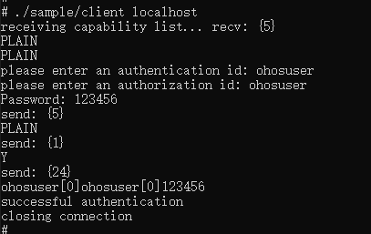

# cyrus-sasl集成到应用hap

本库是在RK3568开发板上基于OpenHarmony3.2 Release版本的镜像验证的，如果是从未使用过RK3568，可以先查看[润和RK3568开发板标准系统快速上手](https://gitee.com/openharmony-sig/knowledge_demo_temp/tree/master/docs/rk3568_helloworld)。

## 开发环境

- ubuntu20.04
- [OpenHarmony3.2Release镜像](https://gitee.com/link?target=https%3A%2F%2Frepo.huaweicloud.com%2Fopenharmony%2Fos%2F3.2-Release%2Fdayu200_standard_arm32.tar.gz)
- [ohos_sdk_public 4.0.8.1 (API Version 10 Release)](https://gitee.com/link?target=http%3A%2F%2Fdownload.ci.openharmony.cn%2Fversion%2FMaster_Version%2FOpenHarmony_4.0.8.1%2F20230608_091058%2Fversion-Master_Version-OpenHarmony_4.0.8.1-20230608_091058-ohos-sdk-public.tar.gz)
- [DevEco Studio 3.1 Release](https://gitee.com/link?target=https%3A%2F%2Fcontentcenter-vali-drcn.dbankcdn.cn%2Fpvt_2%2FDeveloperAlliance_package_901_9%2F81%2Fv3%2FtgRUB84wR72nTfE8Ir_xMw%2Fdevecostudio-windows-3.1.0.501.zip%3FHW-CC-KV%3DV1%26HW-CC-Date%3D20230621T074329Z%26HW-CC-Expire%3D315360000%26HW-CC-Sign%3D22F6787DF6093ECB4D4E08F9379B114280E1F65DA710599E48EA38CB24F3DBF2)
- [准备三方库构建环境](../../../lycium/README.md#1编译环境准备)
- [准备三方库测试环境](../../../lycium/README.md#3ci环境准备)

## 编译三方库

- 下载本仓库

  ```shell
  git clone https://gitee.com/openharmony-sig/tpc_c_cplusplus.git --depth=1
  ```

- 三方库目录结构

  ```shell
  tpc_c_cplusplus/thirdparty/cyrus-sasl  #三方库cyrus-sasl的目录结构如下
  ├── cyrus-sasl_oh_pkg.patch            #构建patch文件
  ├── docs                               #三方库相关文档的文件夹
  ├── HPKBUILD                           #构建脚本
  ├── HPKCHECK                           #自动化测试脚本
  ├── SHA512SUM                          #三方库校验文件
  ├── README.OpenSource                  #说明三方库源码的下载地址，版本，license等信息
  ├── README_zh.md                       #三方库说明文档
  ├── OAT.xml                            #开源扫描相关文件
  ```

- 在tpc_c_cplusplus/lycium目录下编译三方库

  编译环境的搭建参考[准备三方库构建环境](../../../lycium/README.md#1编译环境准备)

  ```shell
  cd tpc_c_cplusplus/lycium
  ./build.sh cyrus-sasl
  ```

- 三方库头文件及生成的库

  在lycium目录下会生成usr目录，该目录下存在已编译完成的32位和64位三方库和头文件

  ```shell
  cyrus-sasl/arm64-v8a   cyrus-sasl/armeabi-v7a
  gdbm/arm64-v8a         gdbm/armeabi-v7a
  sqlite/arm64-v8a       sqlite/armeabi-v7a
  ```
- [测试三方库](#测试三方库)

## 应用中使用三方库

- 拷贝动态库到`\\entry\libs\${OHOS_ARCH}\`目录：
  动态库需要在`\\entry\libs\${OHOS_ARCH}\`目录，才能集成到hap包中，所以需要将对应的so文件拷贝到对应CPU架构的目录
- 在IDE的cpp目录下新增thirdparty目录，将编译生成的库拷贝到该目录下，如下图所示

  &nbsp;

  &nbsp;

  &nbsp;

- 在最外层（cpp目录下）CMakeLists.txt中添加如下语句
  ```shell
  #将三方库加入工程中
  target_link_libraries(entry PRIVATE
      ${CMAKE_CURRENT_SOURCE_DIR}/../../../libs/${OHOS_ARCH}/libsasl2.a
      ${CMAKE_CURRENT_SOURCE_DIR}/../../../libs/${OHOS_ARCH}/libanonymous.a
      ${CMAKE_CURRENT_SOURCE_DIR}/../../../libs/${OHOS_ARCH}/libcrammd5.a
      ${CMAKE_CURRENT_SOURCE_DIR}/../../../libs/${OHOS_ARCH}/libdigestmd5.a
      ${CMAKE_CURRENT_SOURCE_DIR}/../../../libs/${OHOS_ARCH}/libplain.a
      ${CMAKE_CURRENT_SOURCE_DIR}/../../../libs/${OHOS_ARCH}/libsasldb.a
      ${CMAKE_CURRENT_SOURCE_DIR}/../../../libs/${OHOS_ARCH}/libgdbm.a
      )
  #将三方库的头文件加入工程中
  target_include_directories(entry PRIVATE
      ${CMAKE_CURRENT_SOURCE_DIR}/thirdparty/include/cyrus-sasl/${OHOS_ARCH}
      ${CMAKE_CURRENT_SOURCE_DIR}/thirdparty/include/gdbm/${OHOS_ARCH}
      )
  ```

## 测试三方库

三方库的测试使用原库自带的测试用例来做测试，[准备三方库测试环境](../../../lycium/README.md#3ci环境准备)

  进入到安装目录tpc_c_cplusplus/lycium/usr/cyrus-sasl/${OHOS_ARCH}/bin，执行如下操作步骤：

- 配置环境变量
  执行如下命令：

  ```shell
  export LD_LIBRARY_PATH=${LYCIUM_ROOT}/usr/cyrus-sasl/${ARCH}/lib:${LYCIUM_ROOT}/usr/cyrus-sasl/${ARCH}/lib/sasl2:${LYCIUM_ROOT}/usr/gdbm/${ARCH}/lib:$LD_LIBRARY_PATH
  ```
  > 注意：LYCIUM_ROOT代表lycium所在目录的绝对路径；ARCH代表构建架构，64位为arm64-v8a，32位为armeabi-v7a。

- 创建sed软连接：

  ```shell
  mount -o remount,rw /
  ln -s /bin/sed /usr/bin/sed
  ```

- 添加/etc/hosts文件，内容如下：

  ```shell
  127.0.0.1	localhost
  ```

- 测试localhost通畅

  ```shell
  ping localhost
  ```
  &nbsp;

- 添加配置文件\$\{LYCIUM_ROOT\}/usr/cyrus-sasl/\$\{ARCH\}/sample.conf，内容如下：

  ```shell
  pwcheck_method:auxprop
  auxprop_plugin:sasldb
  mech_list:plain login
  ```

- 运行saslauthd服务程序

  ```shell
  ./saslauthd/saslauthd -a sasldb
  ```

- 查看saslauthd服务程序运行状态

  ```shell
  ps -ef | grep saslauthd | grep -v grep
  ```
  > 可以查看到有5个saslauthd进程在运行

- 注册用户（以用户名ohosuser为例）

  ```shell
  ./utils/saslpasswd2 -c ohosuser
  ```
  &nbsp;

- 查询已注册用户

  ```shell
  ./utils/sasldblistusers2
  ```
  &nbsp;

- 运行服务端程序

  ```shell
  ./sample/server
  ```
  &nbsp;

- 运行客户端程序

  ```shell
  ./sample/client localhost
  ```
  &nbsp;

## 参考资料

- [润和RK3568开发板标准系统快速上手](https://gitee.com/openharmony-sig/knowledge_demo_temp/tree/master/docs/rk3568_helloworld)
- [OpenHarmony三方库地址](https://gitee.com/openharmony-tpc)
- [OpenHarmony知识体系](https://gitee.com/openharmony-sig/knowledge)
- [通过DevEco Studio开发一个NAPI工程](https://gitee.com/openharmony-sig/knowledge_demo_temp/blob/master/docs/napi_study/docs/hello_napi.md)
