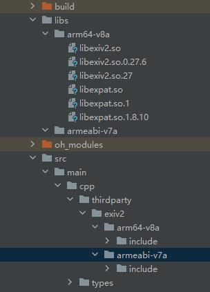
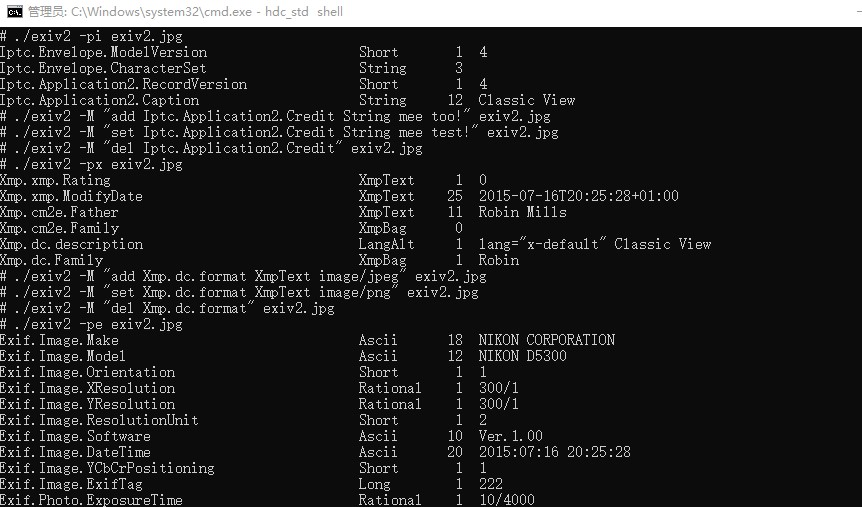
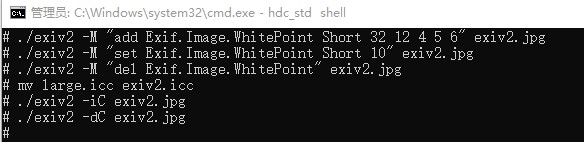

# exiv2集成到应用hap
本库是在RK3568开发板上基于OpenHarmony3.2 Release版本的镜像验证的，如果是从未使用过RK3568，可以先查看[润和RK3568开发板标准系统快速上手](https://gitee.com/openharmony-sig/knowledge_demo_temp/tree/master/docs/rk3568_helloworld)。
## 开发环境
- ubuntu20.04
- [OpenHarmony3.2Release镜像](https://gitee.com/link?target=https%3A%2F%2Frepo.huaweicloud.com%2Fopenharmony%2Fos%2F3.2-Release%2Fdayu200_standard_arm32.tar.gz)
- [ohos_sdk_public 4.0.8.1 (API Version 10 Release)](http://download.ci.openharmony.cn/version/Master_Version/OpenHarmony_4.0.8.1/20230608_091016/version-Master_Version-OpenHarmony_4.0.8.1-20230608_091016-ohos-sdk-full.tar.gz)
- [DevEco Studio 3.1 Release](https://contentcenter-vali-drcn.dbankcdn.cn/pvt_2/DeveloperAlliance_package_901_9/81/v3/tgRUB84wR72nTfE8Ir_xMw/devecostudio-windows-3.1.0.501.zip?HW-CC-KV=V1&HW-CC-Date=20230621T074329Z&HW-CC-Expire=315360000&HW-CC-Sign=22F6787DF6093ECB4D4E08F9379B114280E1F65DA710599E48EA38CB24F3DBF2)
- [准备三方库构建环境](../../../lycium/README.md#1编译环境准备)
- [准备三方库测试环境](../../../lycium/README.md#3ci环境准备)
## 编译三方库
- 下载本仓库
  ```
  git clone https://gitee.com/openharmony-sig/tpc_c_cplusplus.git --depth=1
  ```
  
- 三方库目录结构
  ```
  tpc_c_cplusplus/thirdparty/exiv2  #三方库exiv2的目录结构如下
  ├── docs                              #三方库相关文档的文件夹
  ├── HPKBUILD                          #构建脚本
  ├── SHA512SUM                         #三方库校验文件
  ├── README.OpenSource                 #说明三方库源码的下载地址，版本，license等信息
  ├── README_zh.md   
  ```
  
- 在lycium目录下编译三方库
  编译环境的搭建参考[准备三方库构建环境](../../../lycium/README.md#1编译环境准备)
  
  ```
  cd lycium
  ./build.sh libexpat exiv2
  ```
  
- 三方库头文件及生成的库
  在lycium目录下会生成usr目录，该目录下存在已编译完成的32位和64位三方库
  ```
  exiv2/arm64-v8a   exiv2/armeabi-v7a
  libexpat/arm64-v8a  libexpat/armeabi-v7a
  ```

- [测试三方库](#测试三方库)

## 应用中使用三方库

- 拷贝动态库到`\\entry\libs\${OHOS_ARCH}\`目录：
  动态库需要在`\\entry\libs\${OHOS_ARCH}\`目录，才能集成到hap包中，所以需要将对应的so文件拷贝到对应CPU架构的目录
- 在IDE的cpp目录下新增thirdparty目录，将编译生成的库拷贝到该目录下，如下图所示

  &nbsp;
- 在最外层（cpp目录下）CMakeLists.txt中添加如下语句
  ```
  #将三方库加入工程中
  target_link_libraries(entry PRIVATE ${CMAKE_SOURCE_DIR}/../../../libs/${OHOS_ARCH}/libexiv2.so)
  #将三方库的头文件加入工程中
  target_include_directories(entry PRIVATE ${CMAKE_CURRENT_SOURCE_DIR}/thirdparty/exiv2/${OHOS_ARCH}/include)
  ```
## 测试三方库
三方库的测试使用原库自带的测试用例来做测试，[准备三方库测试环境](../../../lycium/README.md#3ci环境准备)

- 将编译生成的exiv2可执行文件及测试文件exiv2.jpg、large.icc准备好，备注：jpg图片在原库下的README-SAMPLES.md文件中搜索文件名"Stonehenge.jpg"找到下载链接、large.icc：在原库的test/data/目录下

- 将准备好的文件推送到开发板，在windows命令行进行如下操作

  ```
  hdc_std shell mount -o remount,rw /     #修改系统权限为可读写
  hdc_std file send exiv2 /data         #将可执行文件推入开发板data目录
  hdc_std file send libc++_shared.so /system/lib64 #将动态库推入开发板
  hdc_std file send libexiv2.so.27 /system/lib64
  hdc_std file send libexiv2.so /system/lib64
  hdc_std file send libexpat.so.1 /system/lib64
  hdc_std file send libexpat.so /system/lib64
  hdc_std file send exiv2.jpg /data  #将测试文件推入开发板data目录
  hdc_std file send large.icc /data
  hdc_std shell                      #进入开发板
  chmod 777 exiv2                    #添加权限
  # 读取iptc                         #执行测试用例
  # ./exiv2 -pi exiv2.jpg
  # 添加iptc
  # ./exiv2 -M "add Iptc.Application2.Credit String mee too!" exiv2.jpg
  # 修改iptc
  # ./exiv2 -M "set Iptc.Application2.Credit String mee test!" exiv2.jpg
  # 删除iptc
  # ./exiv2 -M "del Iptc.Application2.Credit" exiv2.jpg
  # 读取xmp
  # ./exiv2 -px exiv2.jpg
  # 添加xmp
  # ./exiv2 -M "add Xmp.dc.format XmpText image/jpeg" exiv2.jpg
  # 修改xmp
  # ./exiv2 -M "set Xmp.dc.format XmpText image/png" exiv2.jpg
  # 删除xmp
  # ./exiv2 -M "del Xmp.dc.format" exiv2.jpg   
  # 读取exif
  # ./exiv2 -pe exiv2.jpg
  # 添加exif
  # ./exiv2 -M "add Exif.Image.WhitePoint Short 32 12 4 5 6" exiv2.jpg
  # 修改exif
  # ./exiv2 -M "set Exif.Image.WhitePoint Short 10" exiv2.jpg
  # 删除exif
  # ./exiv2 -M "del Exif.Image.WhitePoint"  exiv2.jpg
  # 读取icc
  # ./exiv2 -b -pC exiv2.jpg
  # 添加或修改icc(添加或修改icc文件时，注意icc文件名要和当前的图片的名字保持一致,.icc文件放在和图片文件同目录下)
  # ./exiv2 -iC exiv2.jpg
  # 删除icc
  # ./exiv2 -dC exiv2.jpg  
  ```

&nbsp;&nbsp;

## 参考资料
- [润和RK3568开发板标准系统快速上手](https://gitee.com/openharmony-sig/knowledge_demo_temp/tree/master/docs/rk3568_helloworld)
- [OpenHarmony三方库地址](https://gitee.com/openharmony-tpc)
- [OpenHarmony知识体系](https://gitee.com/openharmony-sig/knowledge)
- [通过DevEco Studio开发一个NAPI工程](https://gitee.com/openharmony-sig/knowledge_demo_temp/blob/master/docs/napi_study/docs/hello_napi.md)
