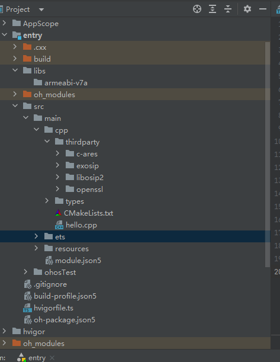
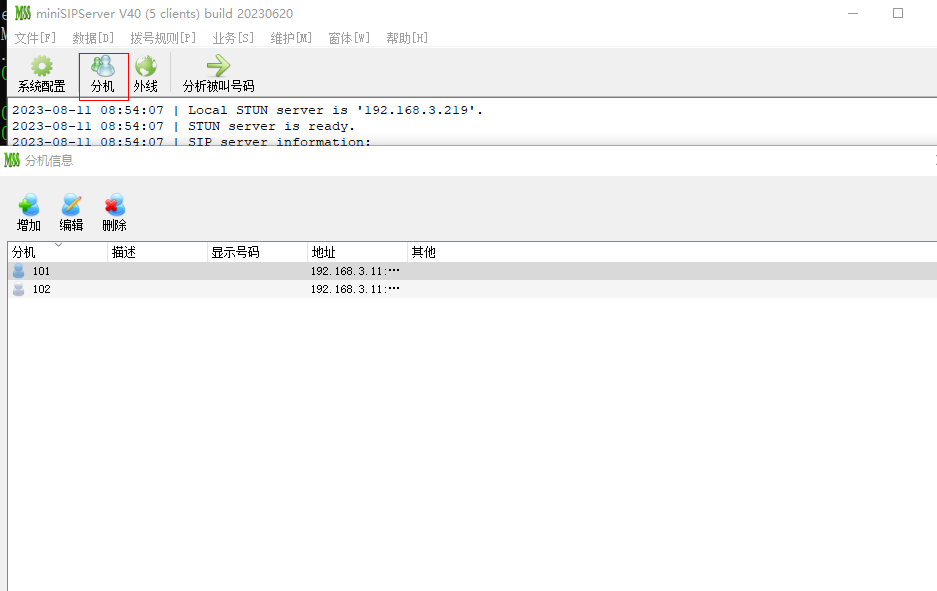
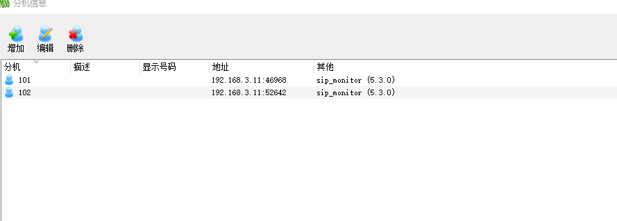

# exosip集成到应用hap
本库是在RK3568开发板上基于OpenHarmony3.2 Release版本的镜像验证的，如果是从未使用过RK3568，可以先查看[润和RK3568开发板标准系统快速上手](https://gitee.com/openharmony-sig/knowledge_demo_temp/tree/master/docs/rk3568_helloworld)。
## 开发环境
- ubuntu20.04
- [OpenHarmony3.2Release镜像](https://gitee.com/link?target=https%3A%2F%2Frepo.huaweicloud.com%2Fopenharmony%2Fos%2F3.2-Release%2Fdayu200_standard_arm32.tar.gz)
- [ohos_sdk_public 4.0.8.1 (API Version 10 Release)](https://gitee.com/link?target=http%3A%2F%2Fdownload.ci.openharmony.cn%2Fversion%2FMaster_Version%2FOpenHarmony_4.0.8.1%2F20230608_091058%2Fversion-Master_Version-OpenHarmony_4.0.8.1-20230608_091058-ohos-sdk-public.tar.gz)
- [DevEco Studio 3.1 Release](https://gitee.com/link?target=https%3A%2F%2Fcontentcenter-vali-drcn.dbankcdn.cn%2Fpvt_2%2FDeveloperAlliance_package_901_9%2F81%2Fv3%2FtgRUB84wR72nTfE8Ir_xMw%2Fdevecostudio-windows-3.1.0.501.zip%3FHW-CC-KV%3DV1%26HW-CC-Date%3D20230621T074329Z%26HW-CC-Expire%3D315360000%26HW-CC-Sign%3D22F6787DF6093ECB4D4E08F9379B114280E1F65DA710599E48EA38CB24F3DBF2)
- [准备三方库构建环境](../../../lycium/README.md#1编译环境准备)
- [准备三方库测试环境](../../../lycium/README.md#3ci环境准备)

## 编译三方库
- 下载本仓库
  ```
  git clone https://gitee.com/openharmony-sig/tpc_c_cplusplus.git --depth=1
  ```
- 三方库目录结构
  ```
  tpc_c_cplusplus/thirdparty/exosip     #三方库exosip的目录结构如下
  ├── docs                              #三方库相关文档的文件夹
  ├── HPKBUILD                          #构建脚本
  ├── SHA512SUM                         #三方库校验文件
  ├── README.OpenSource                 #说明三方库源码的下载地址，版本，license等信息
  ├── HPKCHECK                          #自动化测试脚本
  ├── OAT.xml                           #版权检验文件  
  ├── README_zh.md      
  ```


- 在lycium目录下编译三方库
  编译环境的搭建参考[准备三方库构建环境](../../../lycium/README.md#1编译环境准备)
  
  ```
  
  cd lycium
  ./build.sh exosip
  ```
- 三方库头文件及生成的库
  在lycium目录下会生成usr目录，该目录下存在已编译完成的32位和64位三方库
  
  ```
  exosip/arm64-v8a   exosip/armeabi-v7a  c-ares/arm64-v8a   c-ares/armeabi-v7a 
  libosip2/arm64-v8a   libosip2/armeabi-v7a  openssl/arm64-v8a   openssl/armeabi-v7a         
  ```
  
- [测试三方库](#测试三方库)

## 应用中使用三方库
- 在IDE的cpp目录下新增thirdparty目录，将编译生成的库拷贝到该目录下.如下图所示
&nbsp;
- 在最外层（cpp目录下）CMakeLists.txt中添加如下语句
  ```
  
  #将三方库加入工程中
  target_link_libraries(entry PRIVATE
   ${CMAKE_CURRENT_SOURCE_DIR}/thirdparty/libosip2/${OHOS_ARCH}/lib/libosip2.a
   ${CMAKE_CURRENT_SOURCE_DIR}/thirdparty/libosip2/${OHOS_ARCH}/lib/libosipparser2.a
   ${CMAKE_CURRENT_SOURCE_DIR}/thirdparty/exosip/${OHOS_ARCH}/lib/libeXosip2.a
   ${CMAKE_CURRENT_SOURCE_DIR}/thirdparty/openssl/${OHOS_ARCH}/lib/libcrypto.a
   ${CMAKE_CURRENT_SOURCE_DIR}/thirdparty/openssl/${OHOS_ARCH}/lib/libssl.a)

  #将三方库的头文件加入工程中
  target_include_directories(entry PRIVATE
    ${CMAKE_CURRENT_SOURCE_DIR}/thirdparty/libosip2/${OHOS_ARCH}/include
    ${CMAKE_CURRENT_SOURCE_DIR}/thirdparty/exosip/${OHOS_ARCH}/include
    ${CMAKE_CURRENT_SOURCE_DIR}/thirdparty/openssl/${OHOS_ARCH}/include
    ${CMAKE_CURRENT_SOURCE_DIR}/thirdparty/c-ares/${OHOS_ARCH}/include)
  ```
## 测试三方库
三方库的测试使用原库自带的测试用例来做测试，[准备三方库测试环境](../../../lycium/README.md#3ci环境准备)


- 将测试资源导入到开发板
mount -o remount,rw /  #重新挂载系统

- 设置依赖服务程序路径
```
32位系统
export LD_LIBRARY_PATH=/data/local/tmp/tpc_c_cplusplus/lycium/usr/c-ares/armeabi-v7a/lib:/data/local/tmp/tpc_c_cplusplus/lycium/usr/exosip/armeabi-v7a/lib:/data/local/tmp/tpc_c_cplusplus/lycium/usr/libosip2/armeabi-v7a/lib:/data/local/tmp/tpc_c_cplusplus/lycium/usr/openssl/armeabi-v7a/lib

##64位系统
export LD_LIBRARY_PATH=/data/local/tmp/tpc_c_cplusplus/lycium/usr/c-ares/arm64-v8a/lib:/data/local/tmp/tpc_c_cplusplus/lycium/usr/exosip/arm64-v8a/lib:/data/local/tmp/tpc_c_cplusplus/lycium/usr/libosip2/arm64-v8a/lib:/data/local/tmp/tpc_c_cplusplus/lycium/usr/openssl/arm64-v8a/lib
```  
- 下载SIP服务器应用程序并运行 下载地址
```
https://www.myvoipapp.com/download/index.html
```
在局域网中需要一个服务器主机运行服务器程序如下图

选中分机，该软件有默认两个分机号，可以增加，删除，修改，分机的密码可以自定义，默认密码和分机号一致。

- 进入到目录/data/local/tmp/tpc_c_cplusplus/lycium/usr/exosip/$ARCH/bin下执行
```
./sip_monitor  -r sip:192.168.3.100 -u sip:101@192.168.3.11 -U 101 -P 101 -t TCP -s -e 180 -m --outbound "<sip:192.168.3.100;lr>"
./sip_monitor  -r sip:192.168.3.100 -u sip:102@192.168.3.11 -U 102 -P 102 -t TCP -s -e 180 -m --outbound "<sip:192.168.3.100;lr>"

-r sip:192.168.3.100     # 服务器地址
-u sip:101@192.168.3.11  # 101 是分机号码 后面的192.168.3.11是单板IP地址
-U 101                   # 分机号码
-P 101                   # 分机密码
```
输入后查看服务器应用的分机查看是否注册成功，如下图



## 参考资料
- [润和RK3568开发板标准系统快速上手](https://gitee.com/openharmony-sig/knowledge_demo_temp/tree/master/docs/rk3568_helloworld)
- [OpenHarmony三方库地址](https://gitee.com/openharmony-tpc)
- [OpenHarmony知识体系](https://gitee.com/openharmony-sig/knowledge)
- [通过DevEco Studio开发一个NAPI工程](https://gitee.com/openharmony-sig/knowledge_demo_temp/blob/master/docs/napi_study/docs/hello_napi.md)
