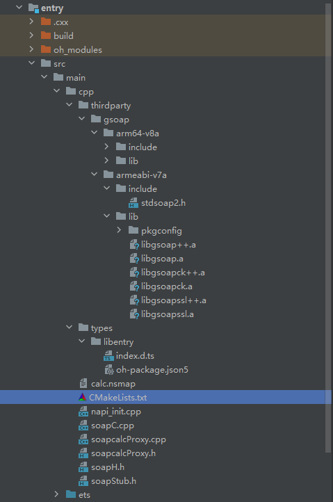
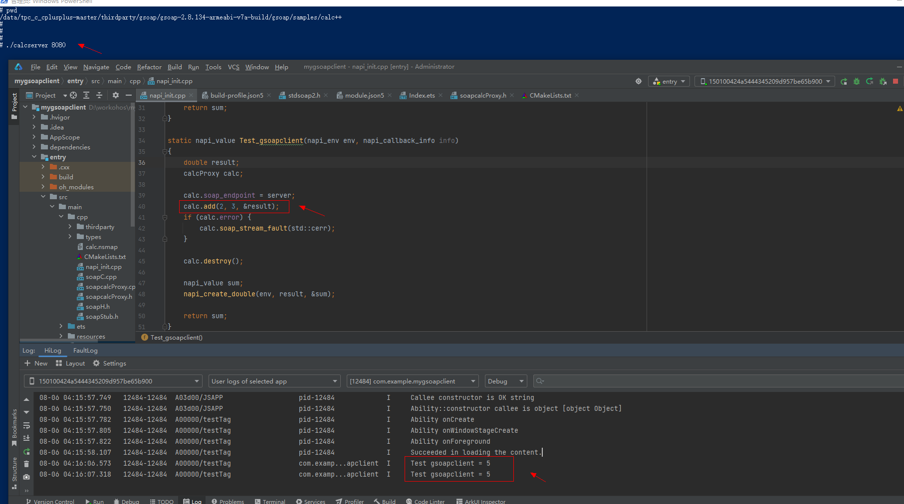
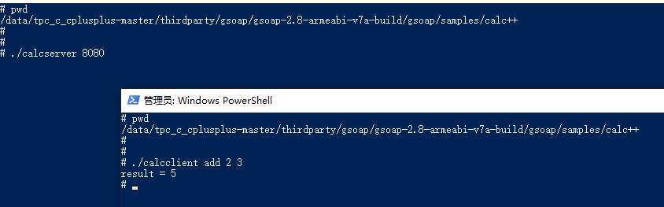

# gSOAP Toolkit集成到应用hap

本库是在RK3568开发板上基于OpenHarmony3.2 Release版本的镜像验证的，如果是从未使用过RK3568，可以先查看[润和RK3568开发板标准系统快速上手](https://gitee.com/openharmony-sig/knowledge_demo_temp/tree/master/docs/rk3568_helloworld)。

## 开发环境

- [开发环境准备](../../../docs/hap_integrate_environment.md)

## 编译三方库

- 下载本仓库

  ```shell
  git clone https://gitee.com/openharmony-sig/tpc_c_cplusplus.git --depth=1
  ```

- 三方库目录结构

  ```shell
  tpc_c_cplusplus/thirdparty/gsoap      #三方库gsoap的目录结构如下
  ├── docs                              #三方库相关文档的文件夹
  ├── HPKBUILD                          #构建脚本
  ├── HPKCHECK                          #测试脚本
  ├── OAT.xml                           #扫描结果文件
  ├── SHA512SUM                         #三方库校验文件
  ├── README.OpenSource                 #说明三方库源码的下载地址，版本，license等信息
  ├── README_zh.md                      #三方库简介
  ├── gsoap_ohos_pkg.patch              #用于gsoap库编译的补丁
  ```

- 在lycium目录下编译三方库

  编译环境的搭建参考[准备三方库构建环境](../../../lycium/README.md#1编译环境准备)

  ```shell
  cd lycium
  ./build.sh gsoap
  ```

- 三方库头文件及生成的库

  在lycium目录下会生成usr目录，该目录下存在已编译完成的32位和64位三方库

  ```shell
  gsoap/arm64-v8a   gsoap/armeabi-v7a
  ```
  
- [测试三方库](#测试三方库)

## 应用中使用三方库

- gsoap toolkit 的交叉编译产物如下，使用 libgsoap 静态库依赖 soapcpp2 自动生成的框架代码
  
  ```shell
  #bin目录（生成soap通信的序列化和反序列化的框架代码）
  wsdl2h：该工具可以根据输入的WSDL或XSD或URL，产生相应的C/C++形式的.h头文件，供soapcpp2使用。
  soapcpp2：根据头文件生成特定的框架代码。
  
  #lib目录（包含soap通信所需的各种函数和数据结构）
  libgsoap.a         （C库，支持http）
  libgsoap++.a       （C++库，支持http）
  libgsoapck.a       （C库，支持cookie，ssl，zlib）
  libgsoapck++.a     （C++库，支持cookie，ssl，zlib）
  libgsoapssl.a      （C库，支持ssl，zlib）
  libgsoapssl++.a    （C++库，支持ssl，zlib）
  ```
  
- gsoap toolkit 是跨平台的，执行各平台上编译的 soapcpp2 自动生成的框架代码一致；这里使用linux系统下编译的 wsdl2h 和 soapcpp2 二进制文件去自动生成服务端和客户端的框架代码
  
  ```shell
  # 手动定义 calc.h 接口文件（参考源库sample目录下calc++测试用例）
  calc.h
  
  #执行 soapcpp2 从 calc.h 文件中自动生成服务端和客户端的框架代码，-i 选项指定了生成C++代码
  soapcpp2 -i calc.h
  
  #自动生成的服务端和客户端的的框架代码文件
  #calc.nsmap           （XML 命名空间绑定表）
  #calc.wsdl            （calc.h 接口文件对应的接口文档）
  #soapC.cpp            （实现 XML 序列化）
  #soapcalcProxy.cpp    （实现客户端 XML 服务 API 类）
  #soapcalcProxy.h      （定义客户端 XML 服务 API 类）
  #soapcalcService.cpp  （实现服务端 XML 服务 API 类）
  #soapcalcService.h    （定义服务端 XML 服务 API 类）
  #soapH.h              （声明 XML 序列化）
  #soapStub.h           （纯 C/C++ 头文件语法的规范副本）
  
  #开发服务端需要向外提供 calc.wsdl 接口文档
  #开发客户端需要获取服务的 calc.wsdl 接口文档
  ```
  
- 使用服务端提供的 calc.wsdl 接口文档开发客户端

  ```shell
  #执行 wsdl2h 从本地文件读取 calc.wsdl 并自动生成一个默认名称的 calc.h 输出文件
  wsdl2h calc.wsdl
  #或者执行 wsdl2h 从远程 URL 读取 calc.wsdl 并自动生成一个具有指定名称的 calc.h 输出文件
  wsdl2h -o calc.h http://www.genivia.com/calc.wsdl
  
  #执行 soapcpp2 从 calc.h 文件中自动生成服务端和客户端的框架代码，-i 选项指定了生成C++代码，-C 选项指定了生成客户端代码
  soapcpp2 -i -C calc.h
  
  #自动生成的客户端所需的框架代码文件
  #calc.nsmap           （XML 命名空间绑定表）
  #soapC.cpp            （实现 XML 序列化）
  #soapcalcProxy.cpp    （实现客户端 XML 服务 API 类）
  #soapcalcProxy.h      （定义客户端 XML 服务 API 类）
  #soapH.h              （声明 XML 序列化）
  #soapStub.h           （纯 C/C++ 头文件语法的规范副本）
  ```

- 在IDE的cpp目录下新增thirdparty目录，将编译生成的头文件和库文件拷贝到该目录下；在IDE的cpp目录下将自动生成的客户端所需的框架代码文件拷贝到该目录下。如下图所示：

&nbsp;

- 在最外层（cpp目录下）CMakeLists.txt中添加如下语句

  ```cmake
  #将执行 soapcpp2 自动生成的 soapC.cpp 和 soapcalcProxy.cpp 依赖文件加入工程中
  add_library(entry SHARED soapC.cpp soapcalcProxy.cpp napi_init.cpp)
  
  #将三方库加入工程中
  target_link_libraries(entry PRIVATE ${CMAKE_CURRENT_SOURCE_DIR}/thirdparty/gsoap/${OHOS_ARCH}/lib/libgsoap++.a)
  #将三方库的头文件加入工程中
  target_include_directories(entry PRIVATE ${CMAKE_CURRENT_SOURCE_DIR}/thirdparty/gsoap/${OHOS_ARCH}/include)
  ```

  在最外层（main目录下）module.json5中添加允许使用Internet网络权限

  ```json
  //添加模块所需的相关权限
  "requestPermissions": [
    {
      "name": "ohos.permission.INTERNET",
      "usedScene": {
        "abilities": [
          "EntryAbility"
        ],
        "when": "inuse"
      }
    }
  ],
  ```

  调用三方库须知

  ```c++
  //调用需注意
  //添加soapcpp2自动生成客户端的源代码头文件
  #include "soapcalcProxy.h"
  #include "calc.nsmap"
  ```

- 在RK3568上启动服务端程序，在IDE中启动客户端，打印日志正常如下：



## 测试三方库

三方库的测试使用原库自带的测试用例来做测试，[准备三方库测试环境](../../../lycium/README.md#3ci环境准备)

进入到构建目录下的sample文件夹中运行测试用例，涉及客户端和服务端程序需要开两个终端窗口测试。

（gsoap-2.8.134-arm64-v8a-build/gsoap/samples为构建64位的目录，gsoap-2.8.134-armeabi-v7a-build/gsoap/samples为构建32位的目录）

&nbsp;

## 参考资料

- [OpenHarmony三方库地址](https://gitee.com/openharmony-tpc)
- [OpenHarmony知识体系](https://gitee.com/openharmony-sig/knowledge)
- [gsoap toolkit三方库地址](https://sourceforge.net/projects/gsoap2/files/)
