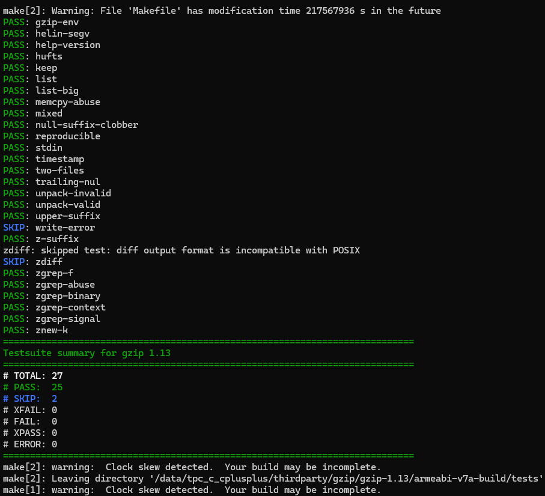

# gzip集成到应用hap
本库是在RK3568开发板上基于OpenHarmony3.2 Release版本的镜像验证的，如果是从未使用过RK3568，可以先查看[润和RK3568开发板标准系统快速上手](https://gitee.com/openharmony-sig/knowledge_demo_temp/tree/master/docs/rk3568_helloworld)。
## 开发环境
- [开发环境准备](../../../docs/hap_integrate_environment.md)
## 编译三方库
- 下载本仓库
  ```shell
  git clone https://gitee.com/openharmony-sig/tpc_c_cplusplus.git --depth=1
  ```
- 三方库目录结构
  ```shell
  tpc_c_cplusplus/thirdparty/gzip       #三方库gzip的目录结构如下
  ├── docs                              #三方库相关文档的文件夹
  ├── HPKBUILD                          #构建脚本
  ├── HPKCHECK                          #测试脚本
  ├── OAT.xml                           #扫描结果文件
  ├── SHA512SUM                         #三方库校验文件
  ├── README.OpenSource                 #说明三方库源码的下载地址，版本，license等信息
  ├── README_zh.md                      #三方库简介
  ```
- 在lycium目录下编译三方库 
  编译环境的搭建参考[准备三方库构建环境](../../../lycium/README.md#1编译环境准备)
  
  ```shell
  cd lycium
  ./build.sh gzip
  ```
- 三方库头文件及生成的库
  在lycium目录下会生成usr目录，该目录下存在已编译完成的32位和64位三方库
  
  ```shell
  gzip/arm64-v8a   gzip/armeabi-v7a
  ```
- [测试三方库](#测试三方库)
## 应用中使用三方库
- gzip最终生成的是gzip可执行文件，无需引入测试编译，引用原生库的测试逻辑即可。
## 测试三方库
- 编译出可执行的文件进行测试，[准备三方库测试环境](../../../lycium/README.md#3ci环境准备)
- 进入到构建目录执行测试用例(注意arm64-v8a-build为构建64位的目录，armeabi-v7a-build为构建32位的目录)
  ```
  cd data/tpc_c_cplusplus/thirdparty/gzip/gzip-1.13/armeabi-v7a-build/tests
  执行命令make check
  ```
- 测试结果如图所示：

  &nbsp;

## 参考资料
*   [OpenHarmony三方库地址](https://gitee.com/openharmony-tpc)
*   [OpenHarmony知识体系](https://gitee.com/openharmony-sig/knowledge)
*   [gzip三方库地址](https://www.gnu.org/software/gzip/)