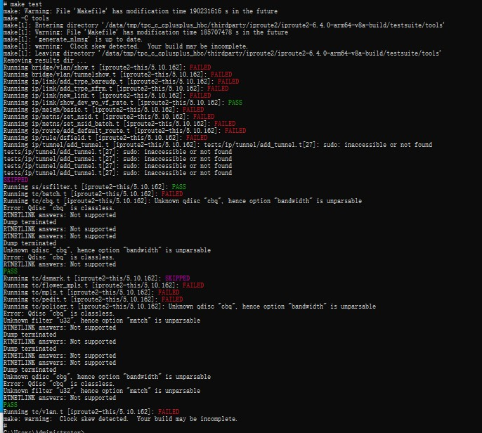
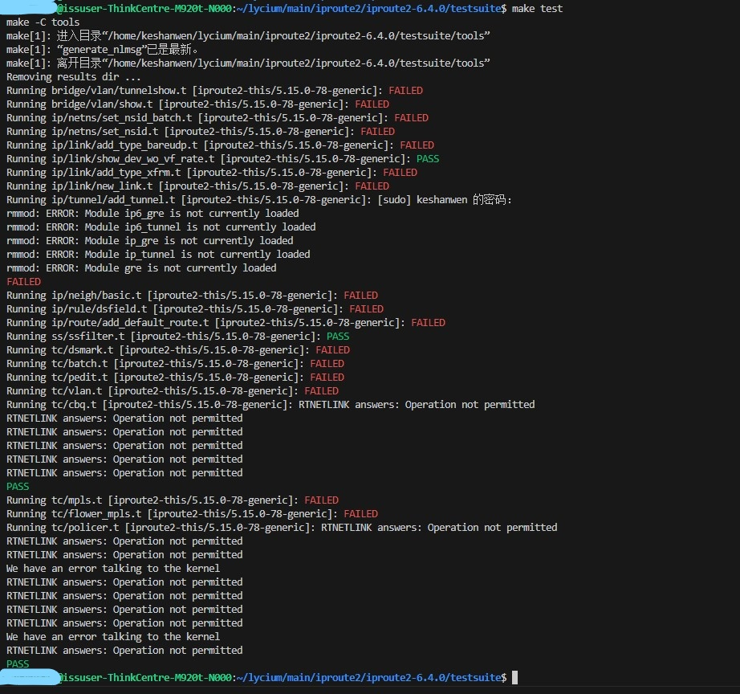

# iproute2集成到应用hap
本库是在RK3568开发板上基于OpenHarmony3.2 Release版本的镜像验证的，如果是从未使用过RK3568，可以先查看[润和RK3568开发板标准系统快速上手](https://gitee.com/openharmony-sig/knowledge_demo_temp/tree/master/docs/rk3568_helloworld)。
## 开发环境
- ubuntu20.04
- [OpenHarmony3.2Release镜像](https://gitee.com/link?target=https%3A%2F%2Frepo.huaweicloud.com%2Fopenharmony%2Fos%2F3.2-Release%2Fdayu200_standard_arm32.tar.gz)
- [ohos_sdk_public 4.0.8.1 (API Version 10 Release)](http://download.ci.openharmony.cn/version/Master_Version/OpenHarmony_4.0.8.1/20230608_091016/version-Master_Version-OpenHarmony_4.0.8.1-20230608_091016-ohos-sdk-full.tar.gz)
- [DevEco Studio 3.1 Release](https://contentcenter-vali-drcn.dbankcdn.cn/pvt_2/DeveloperAlliance_package_901_9/81/v3/tgRUB84wR72nTfE8Ir_xMw/devecostudio-windows-3.1.0.501.zip?HW-CC-KV=V1&HW-CC-Date=20230621T074329Z&HW-CC-Expire=315360000&HW-CC-Sign=22F6787DF6093ECB4D4E08F9379B114280E1F65DA710599E48EA38CB24F3DBF2)
- [准备三方库构建环境](../../../lycium/README.md#1编译环境准备)
- [准备三方库测试环境](../../../lycium/README.md#3ci环境准备)
## 编译三方库
- 下载本仓库
  ```
  git clone https://gitee.com/openharmony-sig/tpc_c_cplusplus.git --depth=1
  ```
- 三方库目录结构
  ```
  tpc_c_cplusplus/thirdparty/iproute2      #三方库iproute2的目录结构如下
  ├── docs                              #三方库相关文档的文件夹
  ├── HPKBUILD                          #构建脚本
  ├── HPKCHECK                          #自动化测试脚本
  ├── OAT.xml                           #OAT开源审查文本
  ├── README.OpenSource                 #说明三方库源码的下载地址，版本，license等信息
  ├── README_zh.md                      #三方库说明文档
  ├── SHA512SUM                         #文档校验值
  └── iproute2_oh_pkg.patch              #patch文档
  ```
  
- 进入lycium目录下
  ```
  cd tpc_c_cplusplus/lycium
  ```
- 在lycium目录下编译三方库 
  iproute2库依赖libmnl和libelf库(libelf库依赖zstd)，在build时会自动编译依赖库，所以只需要编译iproute2库
  编译环境的搭建参考[准备三方库构建环境](../../../lycium/README.md#1编译环境准备)
  ```
  ./build.sh iproute2
  ```
- 三方库头文件及生成的库
  在lycium目录下会生成usr目录，该目录下存在已编译完成的32位和64位三方库
  ```
  iproute2/arm64-v8a   iproute2/armeabi-v7a
  libmnl/arm64-v8a     libmnl/armeabi-v7a
  libelf/arm64-v8a     libelf/armeabi-v7a
  zstd/arm64-v8a       zstd/armeabi-v7a
  ```

- [测试三方库](#测试三方库)

## 应用中使用三方库

- 该库是一个工具集，按照该库的官方编译指导编译出来的就是可执行程序，没有动态库和静态库可供应用直接使用。

## 测试三方库
三方库的测试使用原库自带的测试用例来做测试，[准备三方库测试环境](../../../lycium/README.md#3ci环境准备)

- 将编译生成的可执行文件及生成的动态库准备好

- 将准备好的文件推送到开发板，进入到构建的目录thirdparty/iproute2/iproute2-6.4.0-arm64-v8a-build/testsuite(64位)下执行make test

iproute2_ohos_test

&nbsp;

iproute2_linux_test

&nbsp;
由于OHOS上没有sudo权限导致部分测试用例直接failed。Linux同OHOS修改去掉脚本中的sudo权限后，不使用sudo执行测试结果相同
## 参考资料
- [润和RK3568开发板标准系统快速上手](https://gitee.com/openharmony-sig/knowledge_demo_temp/tree/master/docs/rk3568_helloworld)
- [OpenHarmony三方库地址](https://gitee.com/openharmony-tpc)
- [OpenHarmony知识体系](https://gitee.com/openharmony-sig/knowledge)
- [通过DevEco Studio开发一个NAPI工程](https://gitee.com/openharmony-sig/knowledge_demo_temp/blob/master/docs/napi_study/docs/hello_napi.md)
