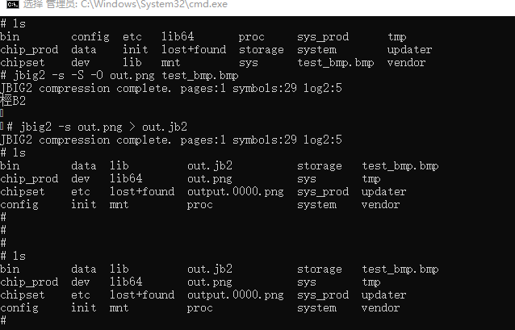

# jbig2enc如何集成到系统Rom
## 准备源码工程
本库是基于OpenHarmony-v3.2-Beta1版本，在RK3568开发板上验证的，如果是从未使用过RK3568，可以先查看[润和RK3568开发板标准系统快速上手](https://gitee.com/openharmony-sig/knowledge_demo_temp/tree/master/docs/rk3568_helloworld)。
### 准备系统Rom源码
系统源码获取请参考：[OpenHarmony源码下载](https://gitee.com/openharmony/docs/blob/OpenHarmony-v3.2-Beta2/zh-cn/release-notes/OpenHarmony-v3.2-beta1.md)
### 增加构建脚本及配置文件
- 下载本仓库代码
  ```
  cd ~
  git clone git@gitee.com:openharmony-sig/tpc_c_cplusplus.git --depth=1
  ```
- 三方库目录结构
  ```
  tpc_c_cplusplus/thirdparty/jbig2enc  #三方库jbig2enc的目录结构如下
  ├── adapted               #存放三方库适配需要的代码文件
  ├── docs                  #存放三方库相关文档的文件夹
  ├── BUILD.gn              #构建脚本，支持rom包集成
  ├── bundle.json           #三方库组件定义文件
  ├── README.OpenSource     #说明三方库源码的下载地址，版本，license等信息
  ├── README_zh.md        
  ```
- 将三方库拷贝到OpenHarmony源码的third_party目录下
  ```
  cp ~/tpc_c_cplusplus/thirdparty/jbig2enc ~/openharmony/third_party -rf
  ```
### 准备三方库源码

- 下载三方库jbig2enc

```
cd ~/openharmony/third_party/jbig2enc    #进入三方库目录
git clone https://github.com/agl/jbig2enc.git -b 0.29 --depth=1    #下载三方库源码
```
- 下载依赖库leptonica

  依赖库下载及适配参考:[leptonica的Rom集成](https://gitee.com/openharmony-sig/tpc_c_cplusplus/leptonica)

## 系统Rom中引入三方库

准备完三方库代码后，我们需要将三方库加入到编译构建体系中。标准系统编译构建可以参考文档[标准系统编译构建指导](https://gitee.com/openharmony/docs/blob/OpenHarmony-3.2-Beta1/zh-cn/device-dev/subsystems/subsys-build-standard-large.md)
我们默认三方库是属于OpenHarmony的thirdparty子系统，如果需要自己定义子系统参考文档[如何为三方库组件中添加一个三方库](https://gitee.com/openharmony-sig/knowledge/blob/master/docs/openharmony_getstarted/port_thirdparty/README.md)
新增需要编译的组件,在OpenHarmony源码的vendor/hihope/rk3568/config.json文件中，新增需要编译的组件，如下代码段所示，在thirdparty子系统下面新增jbig2enc组件

```
    {
      "subsystem": "thirdparty",
      "components": [
        {
          "component": "musl",
          "features": []
        },
        {
          "component": "jbig2enc",
          "features": []
        }
      ]
    }

```
## 系统Rom中引入三方库测试程序
如果需要编译测试用例，在OpenHarmony源码的vendor/hihope/rk3568/config.json文件,对应组件的features中打开编译选项，如下
```
    {
      "subsystem": "thirdparty",
      "components": [
        {
          "component": "musl",
          "features": []
        },
        {
          "component": "jbig2enc",
          "features": ["enable_test=true"]
        }
      ]
    }
```
## 编译工程
在OpenHarmony源码根目录下
```
cd ~/openharmony
```
- 选择平台
  ```
  hb set    #hb set 命令会列出所有可选平台，这里我们选择rk3568
  ```
- 执行编译
  ```
  hb build --target-cpu arm      #编译32位系统
  hb build --target-cpu arm64    #编译64位系统
  ```
- 生成文件的路径，可执行文件和库文件都在out/rk3568/thirdparty/jbig2enc目录下，同时也打包到了镜像中
## 运行效果
将编译生成的库和测试文件放到板子上运行，为避免每次将文件推入设备都烧录整个镜像，我们使用hdc_std工具将文件推到开发板上
- 首先将hdc_std工具编译出来
  工具编译出来所在路径out/sdk/ohos-sdk/windows/toolchains/hdc_std.exe
  
  ```
  hb set     #源码根目录下使用hb set 选择产品ohos-sdk
  hb build   #然后编译
  ```
  
- 将工具拷贝到Windows，可以为工具目录配置环境变量，也可以在工具所在目录打开windows命令行

- 将原生库测试需要的所有文件打包成jbig2enc.tar,并拷贝到windows下

- 将文件推送到开发板，在windows命令行进行如下操作
  ```
  hdc_std shell mount -oremount,rw /     #修改系统权限为可读写
  hdc_std file send jbig2enc.tar /         #将文件包推入开发板
  hdc_std shell                          #进入开发板
  tar xvf jbig2enc.tar                     #解压
                                         #注意需要将库拷贝到/system/lib 或者/system/lib64目录下
  ```
  
- 运行测试程序<br />
  测试用例非常多，这里演示其中几个用例，如下图
  
## 参考资料
- [润和RK3568开发板标准系统快速上手](https://gitee.com/openharmony-sig/knowledge_demo_temp/tree/master/docs/rk3568_helloworld)
- [OpenHarmony三方库地址](https://gitee.com/openharmony-tpc)
- [OpenHarmony知识体系](https://gitee.com/openharmony-sig/knowledge)
- [如何为三方库组件中添加一个三方库](https://gitee.com/openharmony-sig/knowledge/blob/master/docs/openharmony_getstarted/port_thirdparty/README.md)
- [标准系统编译构建指导](https://gitee.com/openharmony/docs/blob/OpenHarmony-3.2-Beta1/zh-cn/device-dev/subsystems/subsys-build-standard-large.md)