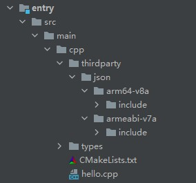
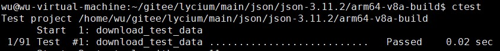
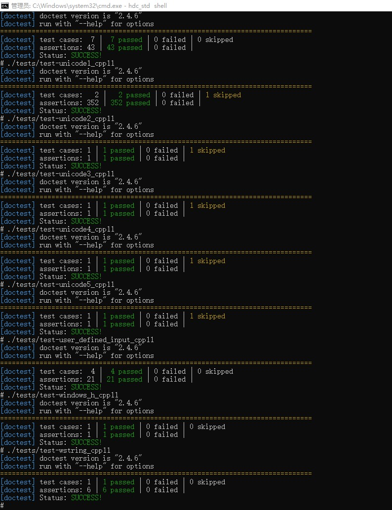

# json集成到应用hap
本库是在RK3568开发板上基于OpenHarmony3.2 Release版本的镜像验证的，如果是从未使用过RK3568，可以先查看[润和RK3568开发板标准系统快速上手](https://gitee.com/openharmony-sig/knowledge_demo_temp/tree/master/docs/rk3568_helloworld)。
## 开发环境
- ubuntu20.04
- [OpenHarmony3.2Release镜像](https://gitee.com/link?target=https%3A%2F%2Frepo.huaweicloud.com%2Fopenharmony%2Fos%2F3.2-Release%2Fdayu200_standard_arm32.tar.gz)
- [ohos_sdk_public 4.0.8.1 (API Version 10 Release)](http://download.ci.openharmony.cn/version/Master_Version/OpenHarmony_4.0.8.1/20230608_091016/version-Master_Version-OpenHarmony_4.0.8.1-20230608_091016-ohos-sdk-full.tar.gz)
- [DevEco Studio 3.1 Release](https://contentcenter-vali-drcn.dbankcdn.cn/pvt_2/DeveloperAlliance_package_901_9/81/v3/tgRUB84wR72nTfE8Ir_xMw/devecostudio-windows-3.1.0.501.zip?HW-CC-KV=V1&HW-CC-Date=20230621T074329Z&HW-CC-Expire=315360000&HW-CC-Sign=22F6787DF6093ECB4D4E08F9379B114280E1F65DA710599E48EA38CB24F3DBF2)
- [准备三方库构建环境](../../../lycium/README.md#1编译环境准备)
- [准备三方库测试环境](../../../lycium/README.md#3ci环境准备)
## 编译三方库
- 下载本仓库
  ```
  git clone https://gitee.com/openharmony-sig/tpc_c_cplusplus.git --depth=1
  ```
  
- 三方库目录结构
  ```
  tpc_c_cplusplus/thirdparty/json  #三方库json的目录结构如下
  ├── docs                              #三方库相关文档的文件夹
  ├── HPKBUILD                          #构建脚本
  ├── SHA512SUM                         #三方库校验文件
  ├── README.OpenSource                 #说明三方库源码的下载地址，版本，license等信息
  ├── README_zh.md   
  ```
  
- 在lycium目录下编译三方库
  编译环境的搭建参考[准备三方库构建环境](../../../lycium/README.md#1编译环境准备)
  
  ```
  cd lycium
  ./build.sh json
  ```
  
- 三方库头文件及生成的库
  在lycium目录下会生成usr目录，该目录下存在已编译完成的32位和64位三方库
  ```
  json/arm64-v8a   json/armeabi-v7a
  ```

- [测试三方库](#测试三方库)

## 应用中使用三方库

- 在IDE的cpp目录下新增thirdparty目录，将编译生成的库拷贝到该目录下，如下图所示
&nbsp;
- 在最外层（cpp目录下）CMakeLists.txt中添加如下语句
  ```
  #将三方库的头文件加入工程中(由于改库没有静态库或动态库，直接引入源文件使用)
  target_include_directories(entry PRIVATE ${CMAKE_CURRENT_SOURCE_DIR}/thirdparty/json/${OHOS_ARCH}/include)
  ```
## 测试三方库
三方库的测试使用原库自带的测试用例来做测试，[准备三方库测试环境](../../../lycium/README.md#3ci环境准备)
先在linux系统进入构建目录执行ctest执行测试用例：download_test_data
&nbsp;
然后进入板子到构建目录执行以下可执行文件运行测试用例（arm64-v8a-build为构建64位的目录，armeabi-v7a-build为构建32位的目录）
 ```
 ./tests/test-algorithms_cpp11                  
 ./tests/test-allocator_cpp11                   
 ./tests/test-alt-string_cpp11                  
 ./tests/test-assert_macro_cpp11                
 ./tests/test-binary_formats_cpp11              
 ./tests/test-bjdata_cpp11                      
 ./tests/test-bson_cpp11                        
 ./tests/test-byte_container_with_subtype_cpp11 
 ./tests/test-capacity_cpp11                    
 ./tests/test-cbor_cpp11                        
 ./tests/test-class_const_iterator_cpp11        
 ./tests/test-class_iterator_cpp11              
 ./tests/test-class_lexer_cpp11                 
 ./tests/test-class_parser_cpp11                
 ./tests/test-comparison_cpp11                  
 ./tests/test-comparison_cpp20                  
 ./tests/test-comparison_legacy_cpp11           
 ./tests/test-comparison_legacy_cpp20           
 ./tests/test-concepts_cpp11                    
 ./tests/test-constructor1_cpp11                
 ./tests/test-constructor2_cpp11                
 ./tests/test-convenience_cpp11                 
 ./tests/test-conversions_cpp11                 
 ./tests/test-conversions_cpp17                 
 ./tests/test-deserialization_cpp11             
 ./tests/test-diagnostics_cpp11                 
 ./tests/test-disabled_exceptions_cpp11         
 ./tests/test-element_access1_cpp11             
 ./tests/test-element_access2_cpp11             
 ./tests/test-element_access2_cpp14             
 ./tests/test-element_access2_cpp17             
 ./tests/test-hash_cpp11                        
 ./tests/test-inspection_cpp11                  
 ./tests/test-items_cpp11                       
 ./tests/test-items_cpp17                       
 ./tests/test-iterators1_cpp11                  
 ./tests/test-iterators2_cpp11                  
 ./tests/test-iterators2_cpp20                  
 ./tests/test-json_patch_cpp11                  
 ./tests/test-json_pointer_cpp11                
 ./tests/test-json_pointer_cpp20                
 ./tests/test-large_json_cpp11                  
 ./tests/test-merge_patch_cpp11                 
 ./tests/test-meta_cpp11                        
 ./tests/test-modifiers_cpp11                   
 ./tests/test-msgpack_cpp11                     
 ./tests/test-noexcept_cpp11                    
 ./tests/test-ordered_json_cpp11                
 ./tests/test-ordered_map_cpp11                 
 ./tests/test-pointer_access_cpp11              
 ./tests/test-readme_cpp11                      
 ./tests/test-reference_access_cpp11            
 ./tests/test-regression1_cpp11                 
 ./tests/test-regression1_cpp17                 
 ./tests/test-regression2_cpp11                 
 ./tests/test-regression2_cpp17                 
 ./tests/test-regression2_cpp20                 
 ./tests/test-serialization_cpp11               
 ./tests/test-testsuites_cpp11                  
 ./tests/test-to_chars_cpp11                    
 ./tests/test-type_traits_cpp11                 
 ./tests/test-ubjson_cpp11                      
 ./tests/test-udl_cpp11                         
 ./tests/test-udt_cpp11                         
 ./tests/test-udt_macro_cpp11                   
 ./tests/test-unicode1_cpp11                    
 ./tests/test-unicode2_cpp11                    
 ./tests/test-unicode3_cpp11                    
 ./tests/test-unicode4_cpp11                    
 ./tests/test-unicode5_cpp11                    
 ./tests/test-user_defined_input_cpp11          
 ./tests/test-windows_h_cpp11                   
 ./tests/test-wstring_cpp11
 ```
&nbsp;

## 参考资料
- [润和RK3568开发板标准系统快速上手](https://gitee.com/openharmony-sig/knowledge_demo_temp/tree/master/docs/rk3568_helloworld)
- [OpenHarmony三方库地址](https://gitee.com/openharmony-tpc)
- [OpenHarmony知识体系](https://gitee.com/openharmony-sig/knowledge)
- [通过DevEco Studio开发一个NAPI工程](https://gitee.com/openharmony-sig/knowledge_demo_temp/blob/master/docs/napi_study/docs/hello_napi.md)
