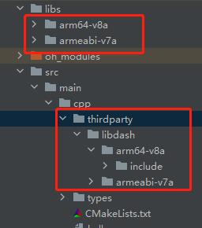
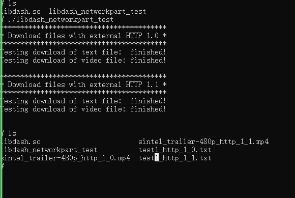

# libdash集成到应用hap
本库是在RK3568开发板上基于OpenHarmony3.2 Release版本的镜像验证的，如果是从未使用过RK3568，可以先查看[润和RK3568开发板标准系统快速上手](https://gitee.com/openharmony-sig/knowledge_demo_temp/tree/master/docs/rk3568_helloworld)。
## 开发环境
- ubuntu20.04
- [OpenHarmony3.2Release镜像](https://gitee.com/link?target=https%3A%2F%2Frepo.huaweicloud.com%2Fopenharmony%2Fos%2F3.2-Release%2Fdayu200_standard_arm32.tar.gz)
- [ohos_sdk_public 4.0.8.1 (API Version 10 Release)](http://download.ci.openharmony.cn/version/Master_Version/OpenHarmony_4.0.8.1/20230608_091016/version-Master_Version-OpenHarmony_4.0.8.1-20230608_091016-ohos-sdk-full.tar.gz)
- [DevEco Studio 3.1 Release](https://contentcenter-vali-drcn.dbankcdn.cn/pvt_2/DeveloperAlliance_package_901_9/81/v3/tgRUB84wR72nTfE8Ir_xMw/devecostudio-windows-3.1.0.501.zip?HW-CC-KV=V1&HW-CC-Date=20230621T074329Z&HW-CC-Expire=315360000&HW-CC-Sign=22F6787DF6093ECB4D4E08F9379B114280E1F65DA710599E48EA38CB24F3DBF2)
- [准备三方库构建环境](../../../lycium/README.md#1编译环境准备)
- [准备三方库测试环境](../../../lycium/README.md#3ci环境准备)
## 编译三方库
- 下载本仓库
  ```
  git clone https://gitee.com/openharmony-sig/tpc_c_cplusplus.git --depth=1
  ```
  
- 三方库目录结构
  ```
  tpc_c_cplusplus/thirdparty/libdash  #三方库libdash的目录结构如下
  ├── docs                              #三方库相关文档的文件夹
  ├── HPKBUILD                          #构建脚本
  ├── SHA512SUM                         #三方库校验文件
  ├── libdash_oh_pkg.patch              #补丁
  ├── README.OpenSource                 #说明三方库源码的下载地址，版本，license等信息
  ├── README_zh.md   
  ```
  
- 在lycium目录下编译三方库
  编译环境的搭建参考[准备三方库构建环境](../../../lycium/README.md#1编译环境准备)
  ```
  cd lycium
  ./build.sh CUnit openssl_quic nghttp3 openssl zstd nghttp2 xz libxml2 curl libdash
  ```
  
- 三方库头文件及生成的库
  在lycium目录下会生成usr目录，该目录下存在已编译完成的32位和64位三方库
  ```
  libdash/arm64-v8a   libdash/armeabi-v7a
  libxml2/arm64-v8a   libxml2/armeabi-v7a
  curl/arm64-v8a      curl/armeabi-v7a
  openssl/arm64-v8a   openssl/armeabi-v7a
  zstd/arm64-v8a      zstd/armeabi-v7a
  nghttp2/arm64-v8a   nghttp2/armeabi-v7a
  CUnit/arm64-v8a     CUnit/armeabi-v7a
  nghttp3/arm64-v8a   nghttp3/armeabi-v7a
  xz/arm64-v8a        xz/armeabi-v7a
  openssl_quic/arm64-v8a  openssl_quic/armeabi-v7a
  ```

- [测试三方库](#测试三方库)

## 应用中使用三方库

- 在IDE的cpp目录下新增thirdparty目录，将编译生成的头文件拷贝到该目录下，将编译生成的三方库以及依赖库全部（动态库名字带版本号和不带版本号的都需要）拷贝到工程的libs目录下，如下图所示：

  &nbsp;

- 在最外层（cpp目录下）CMakeLists.txt中添加如下语句
  ```
  #将三方库加入工程中
  target_link_libraries(entry PRIVATE ${CMAKE_SOURCE_DIR}/../../../libs/${OHOS_ARCH}/libdash.so)
  #将三方库的头文件加入工程中
  target_include_directories(entry PRIVATE ${CMAKE_CURRENT_SOURCE_DIR}/thirdparty/libdash/${OHOS_ARCH}/include)
  ```
## 测试三方库
三方库的测试使用原库自带的测试用例来做测试，[准备三方库测试环境](../../../lycium/README.md#3ci环境准备)

- 将编译生成的libdash_networkpart_test可执行文件准备好(注意：需要联网)

- 将准备好的文件推送到开发板，在windows命令行进行如下操作

  ```
  hdc_std shell mount -o remount,rw /         #修改系统权限为可读写
  hdc_std file send libdash_networkpart_test /data    #将可执行文件推入开发板data目录
  hdc_std file send libc++_shared.so /system/lib64    #将动态库推送开发板
  hdc_std file send libdash.so /system/lib64
  hdc_std file send libcurl.so /system/lib64
  hdc_std file send libcrypto.so.1.1 /system/lib64
  hdc_std file send libnghttp2.so.14 /system/lib64
  hdc_std file send libssl.so.1.1 /system/lib64
  hdc_std file send libxml2.so.2 /system/lib64
  hdc_std file send libzstd.so.1 /system/lib64
  
  hdc_std shell                          #进入开发板
  chmod 777 libdash_networkpart_test     #添加权限
  ./libdash_networkpart_test             #执行测试用例
  ```

&nbsp;

## 参考资料
- [润和RK3568开发板标准系统快速上手](https://gitee.com/openharmony-sig/knowledge_demo_temp/tree/master/docs/rk3568_helloworld)
- [OpenHarmony三方库地址](https://gitee.com/openharmony-tpc)
- [OpenHarmony知识体系](https://gitee.com/openharmony-sig/knowledge)
- [通过DevEco Studio开发一个NAPI工程](https://gitee.com/openharmony-sig/knowledge_demo_temp/blob/master/docs/napi_study/docs/hello_napi.md)
