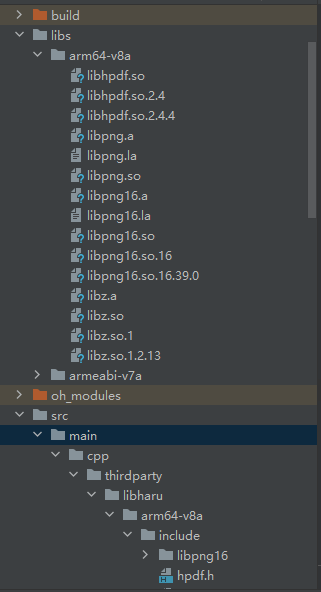

# libharu集成到应用hap
本库是在RK3568开发板上基于OpenHarmony3.2 Release版本的镜像验证的，如果是从未使用过RK3568，可以先查看[润和RK3568开发板标准系统快速上手](https://gitee.com/openharmony-sig/knowledge_demo_temp/tree/master/docs/rk3568_helloworld)。
## 开发环境

- [开发环境准备](../../../docs/hap_integrate_environment.md)

## 编译三方库
- 下载本仓库

  ```shell
  git clone https://gitee.com/openharmony-sig/tpc_c_cplusplus.git --depth=1
  ```
- 三方库目录结构
  ```shell
  tpc_c_cplusplus/thirdparty/libharu    #三方库libharu的目录结构如下
  ├── docs                              #三方库相关文档的文件夹
  ├── HPKBUILD                          #构建脚本
  ├── HPKCHECK                          #自动化测试脚本
  ├── OAT.xml                           #OAT开源审查文本
  ├── README.OpenSource                 #说明三方库源码的下载地址，版本，license等信息
  ├── README_zh.md                      #三方库说明文档
  └── SHA512SUM                         #文档校验值
  ```
  
- 在lycium目录下编译三方库

  编译环境的搭建参考[准备三方库构建环境](../../../lycium/README.md#1编译环境准备)

  ```shell
  cd lycium
  ./build.sh libharu
  ```
- 三方库头文件及生成的库
  在lycium目录下会生成usr目录，该目录下存在已编译完成的32位和64位三方库
  ```shell
  libharu/arm64-v8a   libharu/armeabi-v7a
  libpng/arm64-v8a     libpng/armeabi-v7a
  zlib/arm64-v8a       zlib/armeabi-v7a
  ```

- [测试三方库](#测试三方库)

## 应用中使用三方库

- 拷贝动态库到`\\entry\libs\${OHOS_ARCH}\`目录：
  动态库需要在`\\entry\libs\${OHOS_ARCH}\`目录，才能集成到hap包中，所以需要将对应的so文件拷贝到对应CPU架构的目录
  
- 在IDE的cpp目录下新增thirdparty目录，将编译生成的库拷贝到该目录下，如下图所示

  &nbsp;

- 在最外层（cpp目录下）CMakeLists.txt中添加如下语句
  ```
  
  #将三方库加入工程中
  target_link_libraries(entry PRIVATE ${CMAKE_CURRENT_SOURCE_DIR}/../../../libs/${OHOS_ARCH}/liblibhpdf.so)
  #将三方库的头文件加入工程中
  target_include_directories(entry PRIVATE ${CMAKE_CURRENT_SOURCE_DIR}/thirdparty/libharu/${OHOS_ARCH}/include)
  
  ```
## 测试三方库
三方库的测试使用原库自带的测试用例来做测试，[准备三方库测试环境](../../../lycium/README.md#3ci环境准备)

- 将编译生成的可执行文件及生成的动态库准备好

- 将准备好的文件推送到开发板，进入到构建的目录thirdparty/libharu/libharu-2.4.4/arm64-v8a-build/demo(64位)下执行./arc_demo、./attach、./character_map  KSCms-UHC-HW-H BatangChe、./encoding_list、./encryption、./ext_gstate_demo、./font_demo、./grid_sheet、./image_demo、./jpeg_demo、./jpfont_demo、./link_annotation、./line_demo、./outline_demo、./permission、./png_demo、./raw_image_demo、./slide_show_demo、./text_annotation、./text_demo、./text_demo2、./ttfont_demo ttfont/PenguinAttack.ttf、./ttfont_demo_jp ttfont/PenguinAttack.ttf，另外有两个demo无法测试，make_rawimage需要开启HPDF_USE_PNGLIB，但是在查cmake文件中没有HPDF_USE_PNGLIB开启选项；chfont_demo后需要跟4个参数，说明文档及查询后没有得到具体是什么参数，也无法运行；这两个demo没有加入测试列表。

&nbsp;

&nbsp;
由于OHOS上没有sudo权限导致部分测试用例直接failed。Linux同OHOS修改去掉脚本中的sudo权限后，不使用sudo执行测试结果相同
## 参考资料
- [润和RK3568开发板标准系统快速上手](https://gitee.com/openharmony-sig/knowledge_demo_temp/tree/master/docs/rk3568_helloworld)
- [OpenHarmony三方库地址](https://gitee.com/openharmony-tpc)
- [OpenHarmony知识体系](https://gitee.com/openharmony-sig/knowledge)
- [通过DevEco Studio开发一个NAPI工程](https://gitee.com/openharmony-sig/knowledge_demo_temp/blob/master/docs/napi_study/docs/hello_napi.md)
