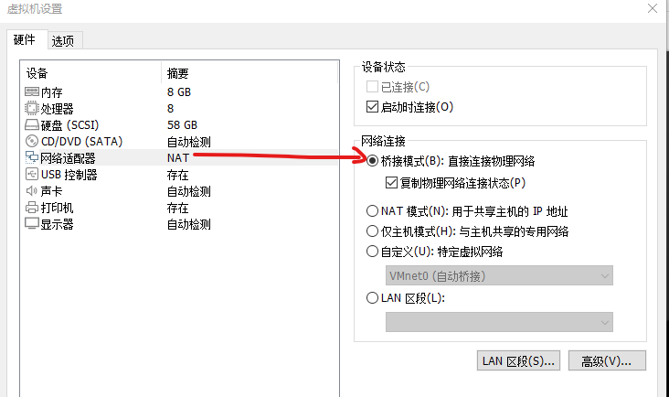
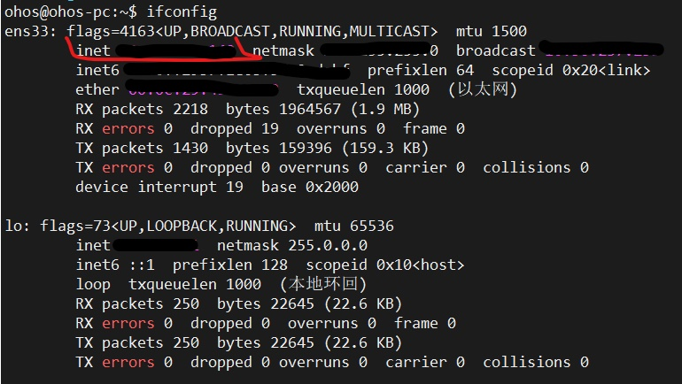
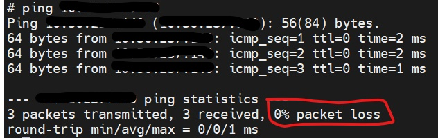
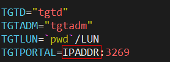

# 一、虚拟机设置

## 1）虚拟机网络配置成桥接模式

## 2）获取Ubuntu虚拟机ip地址

## 3）测试开发板到ubuntu网络是否通畅，开发板需要连接网线

使用ping命令测试，如下图0% packet loss代表网络通畅，如果100% packet loss则无法进行测试。

# 二、编译三方库

## 1）编译上传

三方库libiscsi编译完成后，将tpc_c_cplusplus文件夹上传到开发板。

# 三、ubuntu环境准备

## 1）拷贝服务端测试文件夹

将tpc_c_cplusplus/thirdparty/libiscsi/check/server拷贝到ubuntu环境。

## 2）设置文件夹权限

chmod -R 775 server

## 3) 修改functions.sh文件

vi server/functions.sh

将TGTPORTAL=IPADDR:3269的IPADDR改为当前ubuntu的IP，端口不变。

## 4）安装tgt工具

sudo apt install tgt

# 四、开发板环境准备

## 1）拷贝客户端测试文件夹

将tpc_c_cplusplus/thirdparty/libiscsi/check/client拷贝到开发板/data/local/路径下。

## 2）进入开发板测试路径

cd tpc_c_cplusplus/thirdparty/libiscsi/libiscsi-1.19.0-${ARCH}-build

## 3）删除并替换tests文件夹中的sh文件

rm -f tests/*.sh

复制client文件夹下的sh文件到tests目录

cp /data/local/client/*.sh ./tests/

## 4）设置文件权限

设置权限： chmod -R 775 *

## 5）修改functions.sh文件

xx.xx.xxx.xxx替换成Ubuntu的IP地址

sed -i 's/IPADDR/xx.xx.xxx.xxx/g' tests/functions.sh

使用cat tests/functions.sh命令查看是否修改成功

# 五、执行测试脚本

每个测试需要执行2个脚本，先执行Linux服务端脚本，然后执行开发板客户端脚本，名称相同（服务端脚本带后缀_server），参考下面2个测试案例。

## 1）测试案例1

先执行ubuntu环境的服务端脚本

cd server

sh test_0100_login_server.sh

然后执行开发板环境的客户端脚本

cd tpc_c_cplusplus\thirdparty\libiscsi\libiscsi-1.19.0-${ARCH}-build\tests

sh test_0100_login.sh

查看测试结果是否打印[OK]

## 2）测试案例2

先执行ubuntu环境的服务端脚本

cd server

sh test_0300_nop_reply_server.sh

然后执行开发板环境的客户端脚本

cd tpc_c_cplusplus\thirdparty\libiscsi\libiscsi-1.19.0-${ARCH}-build\tests

sh test_0300_nop_reply.sh

查看测试结果是否打印[OK]

# 六、测试案例明细

一共20个测试，请按照第五章步骤依次执行。

**Linux服务端测试案例**

test_0100_login_server.sh

test_0300_nop_reply_server.sh

test_0410_read_all_pdus_server.sh

test_0500_header_digest_server.sh

test_1000_chap_server.sh

test_2000_reconnect_server.sh

test_9001_extendedcopy_server.sh

test_9004_modesense6_server.sh

test_9005_orwrite_server.sh

test_9006_prefetch10_server.sh

test_9008_prinreadkeys_server.sh

test_9009_read6_server.sh

test_9013_verify10_server.sh

test_9016_write10_server.sh

test_9022_testunitready_server.sh

test_9027_unmap_server.sh

test_9028_readdefectdata10_server.sh

test_9030_prinreportcapabilities_server.sh

test_9031_proutregister_server.sh

test_9034_startstopunit_server.sh

**开发板客户端测试案例**

test_0100_login.sh

test_0300_nop_reply.sh

test_0410_read_all_pdus.sh

test_0500_header_digest.sh

test_1000_chap.sh

test_2000_reconnect.sh

test_9001_extendedcopy.sh

test_9004_modesense6.sh

test_9005_orwrite.sh

test_9006_prefetch10.sh

test_9008_prinreadkeys.sh

test_9009_read6.sh

test_9013_verify10.sh

test_9016_write10.sh

test_9022_testunitready.sh

test_9027_unmap.sh

test_9028_readdefectdata10.sh

test_9030_prinreportcapabilities.sh

test_9031_proutregister.sh

test_9034_startstopunit.sh
