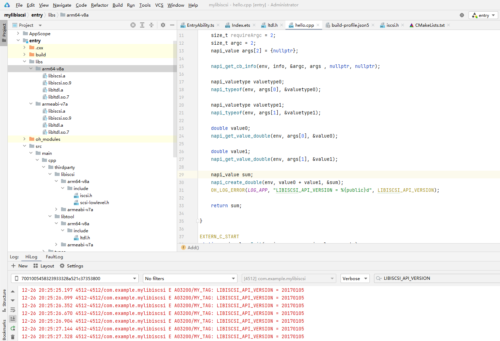
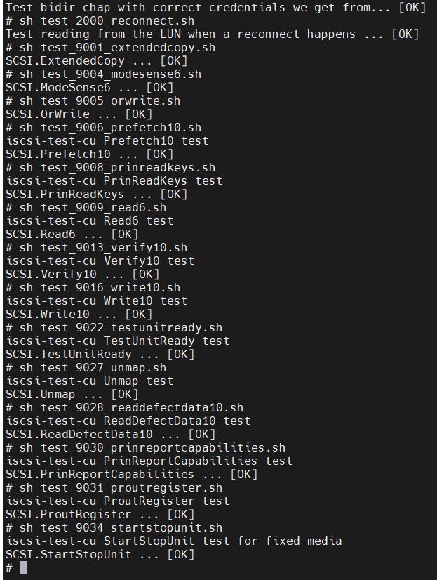

# libiscsi集成到应用hap

本库是在RK3568开发板上基于OpenHarmony3.2 Release版本的镜像验证的，如果是从未使用过RK3568，可以先查看[润和RK3568开发板标准系统快速上手](https://gitee.com/openharmony-sig/knowledge_demo_temp/tree/master/docs/rk3568_helloworld)。

## 开发环境

- [开发环境准备](../../../docs/hap_integrate_environment.md)

## 编译三方库

- 下载本仓库

  ```shell
  git clone https://gitee.com/openharmony-sig/tpc_c_cplusplus.git --depth=1
  ```

- 三方库目录结构

  ```shell
  tpc_c_cplusplus/thirdparty/libiscsi    #三方库libiscsi的目录结构如下
  ├── docs                               #三方库相关文档的文件夹
  ├── HPKBUILD                           #构建脚本
  ├── HPKCHECK                           #自动化测试脚本
  ├── SHA512SUM                          #三方库校验文件
  ├── README.OpenSource                  #说明三方库源码的下载地址，版本，license等信息
  ├── README_zh.md                       #三方库说明文档
  ├── OAT.xml                            #开源扫描相关文件
  ├── check                              #手动测试相关文档文件夹
  ```

- 在tpc_c_cplusplus/lycium目录下编译三方库

  编译环境的搭建参考[准备三方库构建环境](../../../lycium/README.md#1编译环境准备)

  ```shell
  cd tpc_c_cplusplus/lycium
  ./build.sh libiscsi
  ```

- 三方库头文件及生成的库

  在lycium目录下会生成usr目录，该目录下存在已编译完成的32位和64位三方库和头文件

  ```shell
  libiscsi/arm64-v8a   libiscsi/armeabi-v7a
  ```
- [测试三方库](#测试三方库)

## 应用中使用三方库

- 拷贝动态库到`\entry\libs\${OHOS_ARCH}\`目录：
  动态库需要在`\entry\libs\${OHOS_ARCH}\`目录，才能集成到hap包中，所以需要将对应的so文件拷贝到对应CPU架构的目录
- 在IDE的cpp目录下新增thirdparty目录，将编译生成的库拷贝到该目录下，如下图所示
  &nbsp;

- 在最外层（cpp目录下）CMakeLists.txt中添加如下语句
  ```shell
  #将三方库加入工程中
  target_link_libraries(entry PRIVATE ${CMAKE_CURRENT_SOURCE_DIR}/../../../libs/${OHOS_ARCH}/libiscsi.so.9
                                    ${CMAKE_CURRENT_SOURCE_DIR}/../../../libs/${OHOS_ARCH}/libiscsi.a
                                    ${CMAKE_CURRENT_SOURCE_DIR}/../../../libs/${OHOS_ARCH}/libltdl.so.7
                                    ${CMAKE_CURRENT_SOURCE_DIR}/../../../libs/${OHOS_ARCH}/libltdl.a
                                   )
  #将三方库的头文件加入工程中
  target_include_directories(entry PRIVATE ${CMAKE_CURRENT_SOURCE_DIR}/thirdparty/libiscsi/${OHOS_ARCH}/include
                                         ${CMAKE_CURRENT_SOURCE_DIR}/thirdparty/libtool/${OHOS_ARCH}/include
                                         )

  ```

## 测试三方库

三方库的测试使用check目录下提供的测试用例来做测试，[准备三方库测试环境](../../../lycium/README.md#3ci环境准备)

- 配置环境变量
  执行如下命令：

  ```shell
  export LD_LIBRARY_PATH=${LYCIUM_ROOT}/usr/libtool/${ARCH}/lib:${LYCIUM_ROOT}/usr/CUnit/${ARCH}/lib:${LYCIUM_ROOT}/usr/libiscsi/${ARCH}/lib:$LD_LIBRARY_PATH
  ```
  > 注意：LYCIUM_ROOT代表lycium所在目录的绝对路径；ARCH代表构建架构，64位为arm64-v8a，32位为armeabi-v7a。

- 执行测试项：

  参考测试指导文档[开发板测试说明](../check/README.md)

- 测试成功示例：

  &nbsp;


## 参考资料

- [润和RK3568开发板标准系统快速上手](https://gitee.com/openharmony-sig/knowledge_demo_temp/tree/master/docs/rk3568_helloworld)
- [OpenHarmony三方库地址](https://gitee.com/openharmony-tpc)
- [OpenHarmony知识体系](https://gitee.com/openharmony-sig/knowledge)
- [通过DevEco Studio开发一个NAPI工程](https://gitee.com/openharmony-sig/knowledge_demo_temp/blob/master/docs/napi_study/docs/hello_napi.md)

